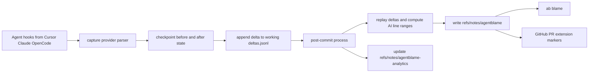
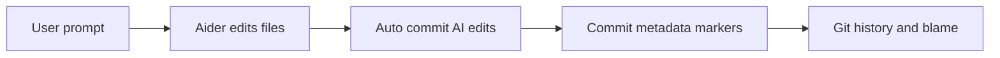
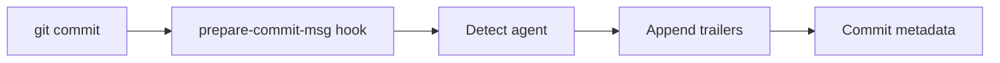
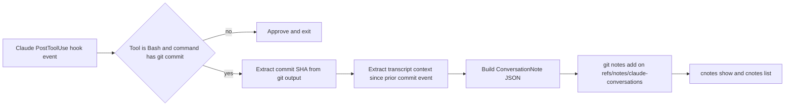
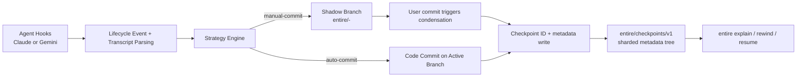
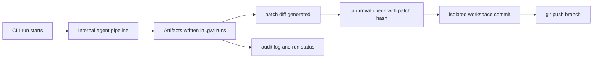
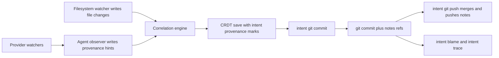
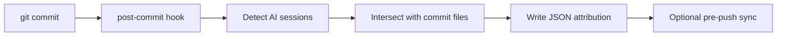
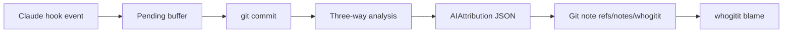

<!-- Generated by SpecStory, Markdown v2.1.0 -->

# 2026-02-20 15:53:44Z

<!-- Codex CLI Session 019c7bbe-080b-7841-a755-9771f4a0e3d6 (2026-02-20 15:53:44Z) -->

_**User (2026-02-20 15:53:44Z)**_

Read docs/git-provenance/RESEARCH-TASK.md and all 10 reports on the 10 systems in docs/git-provenance/systems/

Then we need to do this research and writing task:

"Next, create a summary document as `./docs/git-provenance/SYSTEM-SUMMARY.md` that focuses on summary prose and tables comparing the 10 systems and the 7 challenge areas. Describe the big picture differences in approaches, the most important trade-offs and pros and cons. This should act as a good "executive summary" / tl;dr of the full research output."

---

_**Agent (gpt-5.2 2026-02-20 15:53:53Z)**_

<think><details><summary>Thought Process</summary>
**Planning research task**

I've got a lot to do: reading RESEARCH-TASK.md and ten reports, then writing SYSTEM-SUMMARY.md in docs/git-provenance. I must follow the instructions from the agents without deviation. I’ll use tools like `rg` and `cat` to read efficiently. My goal is to craft an executive summary with tables to compare the systems and challenge areas, ensuring everything is concise yet thorough in markdown. I’ll also need to skim for key details as I go along. Let's get started!
</details></think>

_**Agent (gpt-5.2 2026-02-20 15:53:53Z)**_

I’m going to (1) read `docs/git-provenance/RESEARCH-TASK.md` to understand the 7 challenge areas and expected output, (2) scan all 10 system reports in `docs/git-provenance/systems/`, then (3) write the executive summary as `docs/git-provenance/SYSTEM-SUMMARY.md` with comparison tables and concise trade-off prose.

_**Agent (gpt-5.2 2026-02-20 15:53:53Z)**_

<tool-use data-tool-type="task" data-tool-name="update_plan"><details>
<summary>Tool use: **update_plan**</summary>
**Agent task list:**
- [⚡] Read task brief and rubric
- [ ] Extract key facts per system
- [ ] Write comparison tables and prose
- [ ] Review for accuracy and clarity

```
Plan updated
```
</details></tool-use>

_**Agent (gpt-5.2 2026-02-20 15:53:55Z)**_

<tool-use data-tool-type="shell" data-tool-name="exec_command"><details>
<summary>Tool use: **exec_command** `ls -1 docs/git-provenance && echo '---' && ls -1 docs/git-provenance/systems`</summary>
```
Chunk ID: eed436
Wall time: 0.0522 seconds
Process exited with code 0
Original token count: 43
Output:
RESEARCH-TASK.md
standards
systems
---
agentblame.md
aider.md
aittributor.md
cnotes.md
entire.md
git-ai.md
git-with-intent.md
intent-git-mode.md
tempo-cli.md
whogitit.md
```
</details></tool-use>

_**Agent (gpt-5.2 2026-02-20 15:53:59Z)**_

<tool-use data-tool-type="shell" data-tool-name="exec_command"><details>
<summary>Tool use: **exec_command** `sed -n '1,200p' docs/git-provenance/RESEARCH-TASK.md`</summary>
```
Chunk ID: 30d4e9
Wall time: 0.0528 seconds
Process exited with code 0
Original token count: 3462
Output:
# AI Git Provenance Research Task

## Background

The goal of "AI agent code provenance" is to provide "AI Blame". AI blame means that for a specific line of code, or for all the lines of code in a specific file the origin of that line of code is known, and the following information about the origin is known:

- When the line of code was made/modified
- The line of code came from an AI coding agent or a manual change by a human
- When the line of code came from an AI coding agent, ideally all of the following information is available:
  - The human prompt that led to the AI coding agent making the change
  - The tool use that made the change
  - The agent response/commentary that led up to the tool use
  - The agent response/commentary that followed the tool use

The SpecStory CLI concurrently observes file system changes and AI terminal coding agent exhaust (activity) and correlates them together to provide AI agent code provenance. That provenance is stored in a local only SQLite DB, but to be truly useful it needs to be available to everyone, everywhere. 

One obvious answer to making the provenance available everywhere is to store it in git. In theory this could be in the same repository along with the code, or in a dedicated shadow repository.

- Ubiquitous existing system of record for code
- Ubiquitous tool and ecosystem support
- Distributed system
- Already provides "git blame" to answer the origin of any given line of code

This research task is to explore the various ways git can be used to store and present AI provenance.

## 7 Challenges to Explore

For any system to provide AI agent code provenance using git, the following challenges need a solution. Each AI provenance system may provide entirely or subtly different solutions to these challenges, leading to differences in outcomes. These differences provides trade-offs and pros and cons of each approach.

Understanding the different solutions in use today, and the trade-offs and pros and cons of each solution is the FOCUS of this research task.

### Capturing Agent Activity

The SpecStory CLI captures terminal agent change using an SPI/provider mechanism. There is a small SPI and a provider per agent. Each agent provider is open to do whatever is needed to provide standardized SessionData events each time there is agent activity (user message, agent message, tool use, etc.) in the coding agent. 

Most of the SpecStory CLI providers use fsnotify to observe a location where the coding agent is storing data for the session as JSON or JSONL. Some of them do the same for session data in SQLite DBs.

Agent coverage:

- Claude Code
- Codex CLI
- Gemini CLI
- Cursor CLI
- Factory Droid CLI

In progress:

- OpenCode
- Cursor VSC IDE
- Copilot VSC IDE
- Amp

The focus of this research is to understand what coding agents are supported and how the system knows that the coding agent did anything. When it did it. What the user and agent said.

The SpecStory CLI relies on its SPI/providers architecture and fsnotify. Other solutions may be similar and others will rely on coding agent hooks (callbacks).

### Capturing File Change & Micro-versioning

The 2nd piece of AI provenance is knowing what files changed. In an important sense, an AI provenance system backstopped by git gets this for "free" as the git system always understands files that are unchanged, staged and unstaged and the files that change in a commit and how they changed. So an AI provenance system could simply rely on git completely for understanding changes to files.

A challenge is that an agent may edit a file in response to a user prompt, edit it again later in response to a different user prompt, then edit it yet again in the agent loop in response to its own findings or thinking, and only then is this file finally committed. When committed git flattens this to just a single change from the file's prior state to the changed state. The fact that there were 3 different edits by the agent at different times, made in response to 2 different prompts and 3 different circumstances could be lost if the system is not solving this challenge in some way. 

One solution to this may be some sort of micro-versioning in between commits. Another may be to "punt" on this and leave it to the user to sort out how and why the file changed by reading the agent session. In theory an LLM could be used to read the session and associate the editing tool calls with the specific changed lines, though this solution may be slower and more expensive.

### Correlating Agent Change to File Change

Once a system has a handle on what files are changing and what agent activity is happening, some answer is needed to how the former is correlated to the latter. For example, if there are 2 concurrent agent sessions going on in the same local git repository, tackling unrelated goals, how do the file system changes get correlat
... (truncated)
```
</details></tool-use>

_**Agent (gpt-5.2 2026-02-20 15:53:59Z)**_

<tool-use data-tool-type="shell" data-tool-name="exec_command"><details>
<summary>Tool use: **exec_command** `for f in docs/git-provenance/systems/*.md; do echo '###' $f; sed -n '1,240p' $f; echo; done`</summary>
```
Chunk ID: 523804
Wall time: 0.0516 seconds
Process exited with code 0
Original token count: 22824
Output:
Total output lines: 2224

### docs/git-provenance/systems/agentblame.md
# Agent Blame System Research

_Last updated: 2026-02-18 (UTC)_

## Executive Summary

**Metaphor:** Agent Blame behaves like an **air-traffic recorder for AI edits**:
- Hook events capture before/after file state around AI tool actions.
- A delta ledger tracks AI and human edits between commits.
- Commit processing replays those deltas and writes line-range attribution into git notes.

It is one of the stronger open implementations for practical line-level AI blame across local CLI and GitHub PR UX, with explicit squash/rebase transfer workflows.

## System At A Glance

| Dimension                 | What Agent Blame Does                                                            |
|---------------------------|----------------------------------------------------------------------------------|
| Core model                | Provider hooks + checkpoint capture + delta replay + git-note attribution        |
| Primary provenance store  | `refs/notes/agentblame`                                                          |
| Secondary analytics store | `refs/notes/agentblame-analytics` on root/anchor commit                          |
| In-flight store           | `.git/agentblame/working/<base-sha>/deltas.jsonl` + checkpoint files + git blobs |
| Session metadata store    | Global SQLite `~/.agentblame/agentblame.db`                                      |
| Micro-versioning          | Yes (pre/post edit checkpoints + append-only deltas)                             |
| Line-level attribution    | Yes (`ab blame <file>`)                                                          |
| Rewrite handling          | GitHub Action `post-merge` transfer + `ab sync` local transfer for squash/rebase |
| Agent integrations        | Cursor, Claude Code, OpenCode                                                    |

## Architecture (End-to-End)



---

## Challenge 1: Capturing Agent Activity

### Supported Agents (Current)

| Agent / Provider | Support Status          | Capture Depth                                      | Confidence         | Evidence                                         |
|------------------|-------------------------|----------------------------------------------------|--------------------|--------------------------------------------------|
| Cursor           | Supported               | Prompt boundary + file edit hook capture           | High (docs + code) | README, `lib/hooks.ts`, `capture.ts`             |
| Claude Code      | Supported               | PreToolUse + PostToolUse with transcript parsing   | High (docs + code) | README, `lib/hooks.ts`, `capture.ts`             |
| OpenCode         | Supported               | Plugin hooks for chat prompt and tool before/after | High (docs + code) | README, `lib/hooks.ts`, OpenCode plugin template |
| Other agents     | Not currently supported | N/A                                                | High               | README roadmap lists others as future            |

### Implementation

`ab init` writes repo-local integrations:
- `.cursor/hooks.json`: `beforeSubmitPrompt`, `afterFileEdit`
- `.claude/settings.json`: `PreToolUse` (Edit/Write/MultiEdit), `PostToolUse` (all tools)
- `.opencode/plugin/agentblame.ts`: `chat.message`, `tool.execute.before`, `tool.execute.after`

Captured payloads are normalized by `capture --provider <cursor|claude|opencode>`.

### How It Actually Runs Per Provider

1. Hook payload arrives on stdin.
2. Provider parser resolves repo root, base SHA (`HEAD`), session ID, model, and prompt.
3. Session is upserted into global SQLite with repo namespace.
4. Tool and prompt events are recorded (`tool_calls`, `prompts`).
5. File edit boundaries trigger checkpoint/delta logic.

### Evidence

| Evidence                           | What It Shows                                                  |
|------------------------------------|----------------------------------------------------------------|
| `packages/cli/src/lib/hooks.ts`    | Exact hook installation payloads for Cursor/Claude/OpenCode    |
| `packages/cli/src/capture.ts`      | Provider-specific parsing and session/prompt/tool capture flow |
| `packages/cli/src/lib/database.ts` | Session/prompt/tool schema and persistence                     |

### Strengths / Trade-offs

| Strength                                             | Trade-off                                                    |
|--
... (truncated)
```
</details></tool-use>

_**Agent (gpt-5.2 2026-02-20 15:54:07Z)**_

<think><details><summary>Thought Process</summary>
**Planning file analysis**

I'm thinking about opening each file with around 200 lines to summarize key points, especially focusing on challenges and solutions. To manage this efficiently, I'll run parallel reads for the first 180 lines of each file and use the tools available for this task. It seems like a practical approach to gather the necessary information quickly and effectively! Let's get to it and start digging into those files!
</details></think>

_**Agent (gpt-5.2 2026-02-20 15:54:10Z)**_

Reading each of the 10 system reports for their “executive summary” + how they address the 7 challenge areas, then I’ll distill everything into a single comparison matrix and a short set of key trade-offs.

_**Agent (gpt-5.2 2026-02-20 15:54:10Z)**_

<tool-use data-tool-type="shell" data-tool-name="exec_command"><details>
<summary>Tool use: **exec_command** `sed -n '1,220p' docs/git-provenance/systems/aider.md`</summary>
```
Chunk ID: 20d020
Wall time: 0.0520 seconds
Process exited with code 0
Original token count: 1627
Output:
# Aider System Research

_Last updated: 2026-02-18 (UTC)_

## Executive Summary

**Metaphor:** Aider is a **passport stamp at commit time**.
It stamps that AI helped with a commit, but it does not record a per-line travel log.

Aider is a widely adopted coding agent that uses git commits as its primary provenance artifact. It auto-commits AI edits and marks those commits through author/committer name changes or `Co-authored-by` trailers. This yields strong commit-level attribution, but no first-class line-level provenance representation.

## System At A Glance

| Dimension                | What Aider Actually Does                               |
|--------------------------|--------------------------------------------------------|
| Core model               | AI coding agent that auto-commits edits                |
| Primary provenance store | Git commit metadata (author/committer names, trailers) |
| Micro-versioning         | Commit-level only                                      |
| Line-level attribution   | None built-in                                          |
| Git storage strategy     | Native commits                                         |
| AI blame UX              | Manual (use `git blame` + trailer/author patterns)     |
| Integrations             | Aider runtime only (LLM providers are model backends)  |

## Architecture



---

## Challenge 1: Capturing Agent Activity

### Supported Agents And Providers

| Agent or Provider                        | Support Status          | Confidence         | Evidence                                     |
|------------------------------------------|-------------------------|--------------------|----------------------------------------------|
| Aider CLI runtime                        | Supported               | High (code + docs) | `aider/website/docs/git.md`, `aider/repo.py` |
| Multiple LLM providers as model backends | Supported for inference | Medium (docs)      | `aider/website/docs/llms/*.md`               |

### How It Works

1. Aider runs as the primary coding agent.
2. It tracks the edits it makes during the session.
3. It commits those edits directly to git, providing attribution markers in the commit metadata.

Boundary:
- Aider only captures what happens inside its own runtime. It does not ingest other agent logs or IDE hook events.

---

## Challenge 2: Capturing File Change And Micro-versioning

### How It Works

1. Aider edits files in response to prompts.
2. By default, it auto-commits changes after each edit cycle.
3. It can pre-commit “dirty” user changes to keep user edits separated from AI edits.

Result:
- Micro-versioning exists only at the commit boundary. It does not preserve intra-commit snapshots or line-level edit timelines.

---

## Challenge 3: Correlating Agent Change To File Change

### How It Works

1. Aider knows which files it edited during the session.
2. It commits those changes immediately.
3. The commit is treated as the correlation unit between AI activity and file changes.

Trade-off:
- Strong commit-level attribution, weak intra-commit correlation.

---

## Challenge 4: Representing Agent Provenance

### Representation Used

Aider represents AI provenance by modifying commit metadata:
- `Co-authored-by` trailer with model name
- Author and/or committer name suffixed with `(aider)`
- Optional commit message prefix `aider: `

### Sample Representation (Schema-faithful, synthetic)

```text
commit 1a2b3c4d
Author: Jane Dev
Committer: Jane Dev

feat: add retry budget to payment client

Co-authored-by: aider (claude-sonnet-4) <aider@aider.chat>
```

Alternative representation path:

```text
Author: Jane Dev (aider)
Committer: Jane Dev (aider)
```

Field usage for blame:
- Commit metadata is the only signal; blame must parse trailers or author/committer names.

---

## Challenge 5: Storing Agent Provenance In Git

### How It Works

1. Aider writes attribution into the commit object itself.
2. Git branches and merges carry these commit markers naturally.

Trade-off:
- Simple and durable, but limited to commit-level information.

---

## Challenge 6: AI Blame

Aider provides no dedicated AI blame command. Typical approach:
- Run `git blame` and inspect commits for `Co-authored-by` or `(aider)` markers.

---

## Challenge 7: Developer Experience (DX)

### Current DX Shape

- Very low setup friction: Aider uses git directly during normal editing.
- No extra commands needed for provenance once auto-commit is enabled.
- Limited depth: attribution is commit-level only.

---

## Activity, Support, And Community (as of 2026-02-18 UTC)

### GitHub Signals

- Stars: `40,713`
- Forks: `3,897`
- Open issues: `1,385`
- Last push: `2026-02-16T16:26:13Z`

### Colla
... (truncated)
```
</details></tool-use>

_**Agent (gpt-5.2 2026-02-20 15:54:10Z)**_

<tool-use data-tool-type="shell" data-tool-name="exec_command"><details>
<summary>Tool use: **exec_command** `sed -n '1,240p' docs/git-provenance/systems/aittributor.md`</summary>
```
Chunk ID: 473df7
Wall time: 0.0520 seconds
Process exited with code 0
Original token count: 1554
Output:
# AIttributor System Research

_Last updated: 2026-02-18 (UTC)_

## Executive Summary

**Metaphor:** AIttributor is a **license plate camera at commit time**.
It detects which AI agent is nearby and stamps commit trailers accordingly.

AIttributor is a lightweight git hook that detects active AI tools and appends attribution trailers to the commit message. It does not capture prompts, tool calls, or line-level provenance, but it is a low-friction commit-level marker that survives standard git workflows.

## System At A Glance

| Dimension                | What AIttributor Actually Does                    |
|--------------------------|---------------------------------------------------|
| Core model               | Prepare-commit-msg hook + agent detection         |
| Primary provenance store | Commit trailers (`Co-authored-by`, `Ai-assisted`) |
| Micro-versioning         | None                                              |
| Line-level attribution   | None                                              |
| Git storage strategy     | Commit metadata                                   |
| AI blame UX              | Manual (blame + trailer inspection)               |
| Integrations             | Multiple agent process/env/breadcrumb detectors   |

## Architecture



---

## Challenge 1: Capturing Agent Activity

### Supported Agents And Providers

| Agent or Provider | Support Status                | Confidence  | Evidence       |
|-------------------|-------------------------------|-------------|----------------|
| Claude Code       | Supported                     | High (code) | `src/agent.rs` |
| Goose             | Supported                     | High (code) | `src/agent.rs` |
| Cursor            | Supported                     | High (code) | `src/agent.rs` |
| Aider             | Supported                     | High (code) | `src/agent.rs` |
| Windsurf          | Supported                     | High (code) | `src/agent.rs` |
| Codex             | Supported                     | High (code) | `src/agent.rs` |
| Copilot Agent     | Supported                     | High (code) | `src/agent.rs` |
| Amazon Q          | Supported                     | High (code) | `src/agent.rs` |
| Amp               | Supported                     | High (code) | `src/agent.rs` |
| Cline             | Supported (env var detection) | High (code) | `src/agent.rs` |
| Gemini CLI        | Supported                     | High (code) | `src/agent.rs` |

### How It Works

1. The hook runs during `prepare-commit-msg`.
2. It detects agents using four signals: agent-specific environment variables, process ancestry, sibling process tree matching the repo cwd, and agent breadcrumb files under known paths.
3. If an agent is detected, it appends commit trailers.

Boundary:
- This is commit-time detection only. It does not capture prompts or tool usage.

---

## Challenge 2: Capturing File Change And Micro-versioning

AIttributor does not capture file change history or micro-versioning. It only emits commit-level attribution markers.

---

## Challenge 3: Correlating Agent Change To File Change

### How It Works

- It correlates by repo working directory and active agent presence at commit time.
- No parsing of file edits or tool calls is performed.

Trade-off:
- Very low friction, but correlation is coarse and can be wrong if multiple agents are active.

---

## Challenge 4: Representing Agent Provenance

### Representation Used

AIttributor uses git trailers:
- `Co-authored-by: <agent email>`
- `Ai-assisted: true`

### Sample Representation (from docs)

```text
feat: refactor connection pooling

Co-authored-by: Claude Code <noreply@anthropic.com>
Ai-assisted: true
```

Field usage for blame:
- Commit-level trailers are the only provenance signal.

---

## Challenge 5: Storing Agent Provenance In Git

AIttributor writes directly into the commit message, so provenance survives merges, rebases, and cherry-picks as normal commit metadata.

---

## Challenge 6: AI Blame

No dedicated AI blame command. Teams can parse trailers after `git blame` identifies the commit.

---

## Challenge 7: Developer Experience (DX)

### Current DX Shape

- Extremely low friction: install hook, then commit normally.
- No extra files or databases.
- Limited depth: only commit-level signals.

---

## Activity, Support, And Community (as of 2026-02-18 UTC)

### GitHub Signals

- Stars: `2`
- Forks: `2`
- Open issues: `1`
- Last push: `2026-02-18T02:30:53Z`

### Collaboration Signals

| Metric                          |                                        Value |
|---------------------------------|---------------------------------------------:|
| Open PRs                        |                                   
... (truncated)
```
</details></tool-use>

_**Agent (gpt-5.2 2026-02-20 15:54:10Z)**_

<tool-use data-tool-type="shell" data-tool-name="exec_command"><details>
<summary>Tool use: **exec_command** `sed -n '1,240p' docs/git-provenance/systems/cnotes.md`</summary>
```
Chunk ID: b7e761
Wall time: 0.0520 seconds
Process exited with code 0
Original token count: 2863
Output:
# cnotes System Research

_Last updated: 2026-02-18 (UTC)_

## Executive Summary

**Metaphor:** cnotes is a **commit scrapbook stapled to Git history**:
- It waits for Claude to run `git commit` via Bash.
- It clips recent conversation events from Claude transcripts.
- It attaches that clip as a JSON git note on the commit.

cnotes is intentionally narrow and simple. It is strong for commit-level conversational context, but it does not attempt fine-grained line attribution or robust multi-agent correlation.

## System At A Glance

| Dimension                | What cnotes Does                                                              |
|--------------------------|-------------------------------------------------------------------------------|
| Core model               | Claude PostToolUse hook handler + commit detection + transcript excerpting    |
| Primary provenance store | Git Notes (`refs/notes/claude-conversations` by default)                      |
| In-flight store          | None beyond Claude transcript JSONL + in-memory extraction                    |
| Micro-versioning         | No (commit-triggered capture only)                                            |
| Line-level attribution   | No direct AI blame overlay                                                    |
| Rewrite handling         | Relies on git-notes behavior + manual backup/restore tools                    |
| Agent integrations       | Claude Code only                                                              |
| Privacy controls         | Redaction patterns, excerpt limits, optional disable via `.claude/notes.json` |

## Architecture (End-to-End)



---

## Challenge 1: Capturing Agent Activity

### Supported Agents (Current)

| Agent / Provider                            | Support Status | Confidence         | Evidence                                                              |
|---------------------------------------------|----------------|--------------------|-----------------------------------------------------------------------|
| Claude Code                                 | Supported      | High (docs + code) | README, `internal/config/settings.go`, `internal/commands/root.go`    |
| Cursor / Codex / Gemini / OpenCode / others | Not supported  | High (code scope)  | Hook handler only parses Claude-style payload + PostToolUse Bash gate |

### Implementation

cnotes installs itself as a Claude hook command for `PostToolUse`. At runtime it only processes events where:
- `hook_event_name == PostToolUse`
- `tool_name == Bash`
- Bash command string contains `git commit`

Everything else is explicitly approved and ignored.

### How It Actually Runs

1. Claude hook sends JSON payload to `cnotes` via stdin.
2. cnotes parses hook input (`session_id`, `transcript_path`, tool data).
3. It checks for Bash `git commit` usage.
4. It extracts commit SHA from Bash stdout (commit result line).
5. It loads transcript events and extracts context since prior commit's last processed event timestamp.
6. It writes one ConversationNote git note on that commit SHA.

### Evidence

| Evidence                      | What It Shows                                                                        |
|-------------------------------|--------------------------------------------------------------------------------------|
| `internal/commands/root.go`   | Hook gating logic (`PostToolUse` + `Bash` + commit detection) and note creation flow |
| `internal/config/settings.go` | Install path writes hook under Claude `PostToolUse` only                             |
| README                        | Product positioning as "Git Notes for Claude Conversations"                          |

### Strengths / Trade-offs

| Strength                                          | Trade-off                                |
|---------------------------------------------------|------------------------------------------|
| Very deterministic capture trigger (commit event) | No capture for non-commit agent activity |
| Low integration complexity                        | Single-agent scope (Claude only)         |

---

## Challenge 2: Capturing File Change & Micro-versioning

### Implementation

cnotes does **not** maintain per-edit checkpoints or delta logs. Its capture boundary is commit execution. File changes are inferred only indirectly from transcript/tool excerpts and commit context text.

### How It Actually Behaves

1. Agent performs arbitrary edits during a session.
2. None
... (truncated)
```
</details></tool-use>

_**Agent (gpt-5.2 2026-02-20 15:54:10Z)**_

<tool-use data-tool-type="shell" data-tool-name="exec_command"><details>
<summary>Tool use: **exec_command** `sed -n '1,260p' docs/git-provenance/systems/entire.md`</summary>
```
Chunk ID: bed34e
Wall time: 0.0521 seconds
Process exited with code 0
Original token count: 2991
Output:
# Entire System Research

_Last updated: 2026-02-18 (UTC)_

## Executive Summary

**Metaphor:** Entire behaves like **double-entry bookkeeping for AI coding**:
- one ledger = your code branch
- second ledger = `entire/checkpoints/v1` metadata branch
- temporary shadow ledger = in-progress session checkpoints before condensation

Entire is strongest at **session/checkpoint-level provenance workflows** (rewind/resume/explain), with weaker support for strict line-level AI blame.

## System At A Glance

| Dimension                | What Entire Does                                                                |
|--------------------------|---------------------------------------------------------------------------------|
| Core model               | Agent hooks + strategy engine (`manual-commit` default, `auto-commit` optional) |
| Primary provenance store | Dedicated Git branch: `entire/checkpoints/v1`                                   |
| In-flight store          | Shadow branches: `entire/<base[:7]>-<worktreeHash[:6]>`                         |
| Session state            | `.git/entire-sessions/<session-id>.json` (git common dir)                       |
| Micro-versioning         | Yes (temporary/final checkpoints; task incremental checkpoints)                 |
| Line-level AI blame      | No direct `blame` overlay equivalent                                            |
| Main explainability UX   | `entire explain`, `entire rewind`, `entire resume`                              |
| Agent integrations       | Claude Code (deep integration), Gemini CLI (preview/integration path)           |

## Architecture (End-to-End)



---

## Challenge 1: Capturing Agent Activity

### Implementation

Entire uses explicit agent hook integrations and normalizes hooks into lifecycle events:
- Claude Code: `SessionStart`, `UserPromptSubmit`, `Stop`, `PreToolUse[Task]`, `PostToolUse[Task]`, `PostToolUse[TodoWrite]`
- Gemini CLI: session/turn hooks plus additional before/after model/tool hooks

Session identity and phase are persisted in `.git/entire-sessions/*.json` so event handling is stateful across hook invocations.

### How It Actually Behaves During A Turn

1. On `SessionStart`, Entire creates/loads session state and binds a stable session ID.
2. On `UserPromptSubmit`, Entire captures pre-prompt repo state (for later diffing) and checks for conflicting active sessions.
3. While the agent runs, task hooks can capture subagent boundaries (`tool_use_id`) and incremental progress.
4. On `Stop` (or Gemini equivalent turn-end event), Entire parses transcript deltas, computes touched files, and calls strategy save logic.
5. Session phase transitions are persisted so crash/restart workflows can continue safely.

### Evidence

| Evidence                                        | What It Shows                                  |
|-------------------------------------------------|------------------------------------------------|
| `docs/architecture/claude-hooks-integration.md` | Detailed Claude hook timing/payload/use cases  |
| `cmd/entire/cli/agent/claudecode/hooks.go`      | Hook installation into Claude settings         |
| `cmd/entire/cli/agent/geminicli/hooks.go`       | Gemini hook installation/mapping               |
| `cmd/entire/cli/agent/*/lifecycle.go`           | Hook→normalized lifecycle event parsing        |
| `cmd/entire/cli/session/state.go`               | Persistent session state schema/phase tracking |

### Strengths / Trade-offs

| Strength                                                          | Trade-off                                            |
|-------------------------------------------------------------------|------------------------------------------------------|
| Rich, explicit event model (especially for Claude subagent flows) | Agent coverage is narrower than Git AI today         |
| State-machine backed lifecycle reduces ambiguity                  | Integration depth differs by agent (Claude > Gemini) |

---

## Challenge 2: Capturing File Change & Micro-versioning

### Implementation

Entire supports two micro-versioning strategies:

1. **Manual-commit (default)**
- frequent temporary checkpoints on shadow branches
- user commits code normally
- post-commit condenses checkpoint metadata to `entire/checkpoints/v1`

2. **Auto-commit**
- each step can produce a code commit on active branch
- each commit gets `Entire-Checkpoint: <id>` trailer
- metadat
... (truncated)
```
</details></tool-use>

_**Agent (gpt-5.2 2026-02-20 15:54:18Z)**_

<tool-use data-tool-type="shell" data-tool-name="exec_command"><details>
<summary>Tool use: **exec_command** `sed -n '240,560p' docs/git-provenance/systems/entire.md`</summary>
```
Chunk ID: b65ca1
Wall time: 0.0522 seconds
Process exited with code 0
Original token count: 2879
Output:
      "context": "/a3/b2c4d5e6f7/0/context.md",
      "content_hash": "/a3/b2c4d5e6f7/0/content_hash.txt",
      "prompt": "/a3/b2c4d5e6f7/0/prompt.txt"
    }
  ]
}
```

Representative session `0/metadata.json` (`CommittedMetadata`):

```json
{
  "checkpoint_id": "a3b2c4d5e6f7",
  "session_id": "2026-02-18-9f93d8d0-3b7d-4b56-90be-8b4f5bbd2e10",
  "strategy": "manual-commit",
  "created_at": "2026-02-18T12:01:09Z",
  "checkpoints_count": 3,
  "files_touched": ["cmd/auth/callback.go", "cmd/auth/session.go"],
  "agent": "Claude Code",
  "turn_id": "0e51e44c-4476-4f7e-9d76-7459575f9752",
  "checkpoint_transcript_start": 128,
  "initial_attribution": {
    "agent_lines": 114,
    "human_added": 28,
    "human_modified": 12,
    "human_removed": 6,
    "total_committed": 142,
    "agent_percentage": 80.3
  }
}
```

### Commit-To-Representation Resolution Path

1. Read `Entire-Checkpoint` trailer from code commit.
2. Convert checkpoint ID to sharded path (`<id[:2]>/<id[2:]>`).
3. Read root `metadata.json` for aggregate session pointers.
4. Read one or more session subdirectories for transcript and prompt context.

### Evidence

| Evidence                                  | What It Shows                                    |
|-------------------------------------------|--------------------------------------------------|
| `cmd/entire/cli/trailers/trailers.go`     | Trailer keys and checkpoint parsing              |
| `cmd/entire/cli/checkpoint/checkpoint.go` | `CheckpointSummary` / `CommittedMetadata` schema |
| `cmd/entire/cli/checkpoint/committed.go`  | Path sharding + per-session file map             |
| `docs/architecture/attribution.md`        | Attribution model and intent                     |

### Important Note (doc/code drift)

The architecture doc discusses an `Entire-Attribution` trailer, but current code paths center on:
- `Entire-Checkpoint` trailer on code commits
- attribution snapshot persisted in checkpoint metadata (`initial_attribution`)

### Strengths / Trade-offs

| Strength                                                                 | Trade-off                                                  |
|--------------------------------------------------------------------------|------------------------------------------------------------|
| Rich checkpoint/session context is excellent for “what happened and why” | Representation is commit/session-centric, not line-centric |
| Structured metadata branch is easy to query programmatically             | Needs robust conventions to avoid doc/code schema drift    |

---

## Challenge 5: Storing Agent Provenance In Git

### Implementation

Entire uses three Git-scoped layers:
- **Permanent:** `entire/checkpoints/v1` metadata branch
- **Temporary:** shadow branches (`entire/<base>-<worktree>`) during active work
- **State files:** `.git/entire-sessions/` for live session orchestration

Pre-push hooks can push the metadata branch alongside normal pushes, including merge/sync handling when remote metadata diverges.

### Storage Lifecycle Details

1. Session starts on working branch with in-progress data on shadow branch.
2. User commit triggers condensation from shadow state to metadata branch.
3. Metadata branch writes are append/update operations keyed by checkpoint ID path.
4. Pre-push hook can sync and push metadata branch to remote in the same user push flow.
5. On divergence, Entire attempts fetch+merge of metadata branch before retrying push.

### Evidence

| Evidence                                             | What It Shows                                             |
|------------------------------------------------------|-----------------------------------------------------------|
| `docs/architecture/sessions-and-checkpoints.md`      | Branch/state model and sharded storage                    |
| `cmd/entire/cli/strategy/manual_commit.go`           | Ensures metadata branch + git hooks setup                 |
| `cmd/entire/cli/strategy/push_common.go`             | Pre-push synchronization and conflict handling            |
| `cmd/entire/cli/strategy/manual_commit_migration.go` | Shadow branch migration behavior when base commit changes |

### Strengths / Trade-offs

| Strength                                                    | Trade-off                                                                        |
|-------------------------------------------------------------|----------------------------------------------------------------------------------|
| Keeps code history and provenance history cleanly separated | Requires branch management discipline (`entire/checkpoints/v1`, shadow branches) |
| Explicit metadata branch avoids Git Notes tooling mismatch  | More custom semantics than pure note-based approaches                            |

---

## Challenge 6: AI Blame

### Implementation

Entire does **not** currently provide a nat
... (truncated)
```
</details></tool-use>

_**Agent (gpt-5.2 2026-02-20 15:54:18Z)**_

<tool-use data-tool-type="shell" data-tool-name="exec_command"><details>
<summary>Tool use: **exec_command** `sed -n '1,260p' docs/git-provenance/systems/git-ai.md`</summary>
```
Chunk ID: 0ea07c
Wall time: 0.0512 seconds
Process exited with code 0
Original token count: 3182
Output:
# Git AI System Research

_Last updated: 2026-02-18 (UTC)_

## Executive Summary

**Metaphor:** Git AI behaves like a **flight data recorder bolted onto Git**:
- It records fine-grained agent/human editing events before commit (checkpoint stream).
- At commit time, it compiles those events into a durable attribution artifact (Authorship Log).
- It stores that artifact in Git Notes and keeps it alive across history rewrites.

Git AI is currently one of the most complete end-to-end implementations of AI provenance in Git: it covers capture, micro-versioning, rewrite survival, and line-level AI blame.

## System At A Glance

| Dimension                | What Git AI Does                                                                                   |
|--------------------------|----------------------------------------------------------------------------------------------------|
| Core model               | Git proxy + agent hooks + per-edit checkpoints + commit-time authorship logs                       |
| Primary provenance store | `refs/notes/ai` Git Notes (open `authorship/3.0.0` format)                                         |
| In-flight store          | `.git/ai/working_logs/<base-commit>/` checkpoint stream + blob store                               |
| Micro-versioning         | Yes (checkpoint per edit cycle, not just per commit)                                               |
| Line-level attribution   | Yes (`git-ai blame`)                                                                               |
| Rewrite handling         | Rebase/cherry-pick/merge/reset/stash/amend-aware note rewriting/remapping                          |
| Agent integrations       | Claude Code, Codex, Cursor, Gemini, Copilot, Continue, OpenCode, Droid, JetBrains/Junie/Rovo paths |
| Privacy modes            | `default` (CAS/upload + strip from notes), `notes` (redacted in notes), `local` (local only)       |

## Architecture (End-to-End)

```mermaid
flowchart LR
  A[Agent Hook Event\nPreToolUse and PostToolUse] --> B[git-ai checkpoint preset]
  B --> C[.git/ai/working_logs/(base)/checkpoints.jsonl]
  B --> D[.git/ai/working_logs/(base)/blobs/*]
  C --> E[git commit pre+post hooks]
  D --> E
  E --> F[Authorship Log\nattestations + metadata]
  F --> G[Git Note refs/notes/ai @ commit SHA]
  G --> H[git-ai blame, show, stats]
  G --> I[fetch, push, clone note sync]
```

---

## Challenge 1: Capturing Agent Activity

### Implementation

Git AI installs hooks into agent config files and normalizes incoming hook payloads into a common checkpoint input (`AgentRunResult`) containing:
- agent identity (`tool`, `id`, `model`)
- transcript-derived messages/tool use
- event kind (`Human`, `AiAgent`, `AiTab`)
- edited file hints (`edited_filepaths`, `will_edit_filepaths`)

### Supported Agents (Current)

Publicly listed by Git AI docs/README:
- Claude Code
- Codex
- Cursor
- OpenCode
- Gemini
- GitHub Copilot
- Continue
- Droid
- Junie
- Rovo Dev

Observed in current code paths:
- Hook installers: Claude Code, Codex, Cursor, VS Code integrations, OpenCode, Gemini, Droid, JetBrains integrations
- Checkpoint parsers/presets: `claude`, `codex`, `cursor`, `gemini`, `github-copilot`, `continue-cli`, `droid`, `ai_tab`, `opencode`, `agent-v1` (generic extension path)

Coverage note:
- “Supported” means different depths per agent: some have dedicated hook installers + transcript parsers; others are integrated through VS Code/JetBrains channels or generic preset pathways.

### How It Actually Runs Per Edit Cycle

1. Agent hook fires (`PreToolUse` or `PostToolUse` style event).
2. Hook command executes `git-ai checkpoint <preset> --hook-input ...`.
3. Preset parser normalizes payload/transcript into `AgentRunResult`.
4. Checkpoint logic resolves candidate changed files and computes line attribution deltas.
5. Result is appended to `.git/ai/working_logs/<base>/checkpoints.jsonl` with blob snapshots.

### Evidence

| Evidence                                         | What It Shows                                                                               |
|--------------------------------------------------|---------------------------------------------------------------------------------------------|
| `src/mdm/agents/mod.rs`                          | Central installer registry for Claude/Codex/Cursor/VSCode/OpenCode/Gemini/Droid/JetBrains   |
| `src/mdm/agents/claude_code.rs`                  | Injects PreToolUse/PostToolUse commands invoking `git-ai checkpoint ... --hook-input stdin` |
| `src/commands/checkpoint_agent/agent_presets.rs` | Per-agent parsing logic for hook payloads/transcripts/IDs/models/file paths                 |
| `README.md` + docs supported agents page         | Publicly declared integration coverage                                                      |

### Strengths / Trade-offs

| Strength                  
... (truncated)
```
</details></tool-use>

_**Agent (gpt-5.2 2026-02-20 15:54:18Z)**_

<tool-use data-tool-type="shell" data-tool-name="exec_command"><details>
<summary>Tool use: **exec_command** `sed -n '1,260p' docs/git-provenance/systems/git-with-intent.md`</summary>
```
Chunk ID: d90753
Wall time: 0.0513 seconds
Process exited with code 0
Original token count: 2733
Output:
# Git With Intent System Research

_Last updated: 2026-02-18 (UTC)_

## Executive Summary

**Metaphor:** Git With Intent is an **AI release control tower**, not a line-level black box recorder.

It is strong at:
- workflow automation (`issue -> code -> review -> commit/push`)
- approval gating and policy controls
- auditability of run decisions

It is weak for SpecStory's AI-blame target because it does **not** implement line-level provenance persistence in Git (no `refs/notes/*` provenance scheme, no blame overlay command).

## System At A Glance

| Dimension                  | What Git With Intent Actually Does                                                      |
|----------------------------|-----------------------------------------------------------------------------------------|
| Core model                 | Orchestrated internal agents operating on run bundles                                   |
| In-flight provenance       | `.gwi/runs/<runId>/` artifacts + audit logs                                             |
| Approval model             | Patch-hash-bound approvals (`approval.json`) plus signed approvals in `.gwi/approvals/` |
| Micro-versioning           | No per-line/per-edit provenance ledger                                                  |
| Git storage for provenance | No native line provenance in Git notes                                                  |
| AI blame UX                | No built-in line-level AI blame command                                                 |
| Agent scope                | Internal GWI agents (not external coding assistant transcript capture)                  |

## Architecture



---

## Challenge 1: Capturing Agent Activity

### Supported Agents And Providers

| Agent or Provider                    | Support Status                         | Confidence         | Evidence                                                 |
|--------------------------------------|----------------------------------------|--------------------|----------------------------------------------------------|
| `orchestrator`                       | Supported                              | High (code)        | `packages/agents/src/orchestrator/index.ts`              |
| `foreman`                            | Supported                              | High (code)        | `packages/agents/src/foreman/index.ts`                   |
| `triage`                             | Supported                              | High (code)        | `packages/agents/src/triage/index.ts`                    |
| `resolver`                           | Supported                              | High (code)        | `packages/agents/src/resolver/index.ts`                  |
| `reviewer`                           | Supported                              | High (code)        | `packages/agents/src/reviewer/index.ts`                  |
| `coder`                              | Supported                              | High (code)        | `packages/agents/src/coder/index.ts`                     |
| `infra`                              | Supported                              | High (code)        | `packages/agents/src/infra/index.ts`                     |
| `slop-detector`                      | Supported                              | High (code)        | `packages/agents/src/slop/slop-detector-agent.ts`        |
| Cursor or Claude Code hook ingestion | Not implemented for provenance capture | High (code + docs) | README positioning and no provider hook capture pipeline |

### How It Works

1. A run starts from CLI/webhook/API and creates a run context (`run.json`).
2. Internal GWI agents execute tasks and produce artifacts (`triage.json`, `plan.json`, `patch.diff`, `review.json`).
3. Audit events are appended as JSONL to `audit.log`.
4. This captures **GWI agent workflow activity**, not external coding assistant message/tool streams.

Observed vs inferred:
- **Observed:** run-bundle schema and audit append APIs.
- **Inference:** this is sufficient for governance tracing but not equivalent to external coding-session provenance.

---

## Challenge 2: Capturing File Change And Micro-versioning

### How It Works

1. Coder output is produced as file payloads / patch artifacts.
2. Autopilot applies generated changes in an isolated workspace.
3. A normal Git commit is created once changes are staged.
4. Push occurs after approval coverage checks.

What is missing for micro-versioning:
- no append-only per-edit delta ledger keyed to line ranges
- no intermediate edit lineage inside one commit

Result: Git flattening behavior remai
... (truncated)
```
</details></tool-use>

_**Agent (gpt-5.2 2026-02-20 15:54:18Z)**_

<tool-use data-tool-type="shell" data-tool-name="exec_command"><details>
<summary>Tool use: **exec_command** `sed -n '1,320p' docs/git-provenance/systems/intent-git-mode.md`</summary>
```
Chunk ID: 741692
Wall time: 0.0513 seconds
Process exited with code 0
Original token count: 3282
Output:
# Intent Git Mode System Research

_Last updated: 2026-02-18 (UTC)_

## Executive Summary

**Metaphor:** Intent Git Mode is a **dual-entry provenance ledger**:
- CRDT marks record fine-grained authorship as edits happen.
- Git notes publish commit-linked provenance so teams can share and query it.

Among the systems studied so far, this is one of the most complete end-to-end implementations for line-aware AI blame plus inverse tracing.

## System At A Glance

| Dimension             | What Intent Git Mode Actually Does                                    |
|-----------------------|-----------------------------------------------------------------------|
| Agent capture         | Multi-provider watcher bridge via SpecStory provider registry         |
| File micro-versioning | Every filesystem change saved into CRDT history with provenance marks |
| Correlation           | Scored matcher engine links file-change events to provenance hints    |
| Git provenance store  | `refs/notes/intent/exchanges` and `refs/notes/intent/metadata`        |
| Sync tracking         | SQLite `git_sync` table links journal event IDs to commit SHA         |
| AI blame              | `intent blame` combines Git blame + notes + CRDT for dirty files      |
| Inverse lookup        | `intent trace <exchangeId>` maps exchange to current lines            |

## Architecture



---

## Challenge 1: Capturing Agent Activity

### Supported Agents And Providers

| Agent or Provider           | Support Status | Confidence  | Evidence                                                   |
|-----------------------------|----------------|-------------|------------------------------------------------------------|
| Claude Code (`claude`)      | Supported      | High (code) | `pkg/spi/factory/registry.go`, `pkg/utils/watch_agents.go` |
| Cursor CLI (`cursor`)       | Supported      | High (code) | `pkg/spi/factory/registry.go`, `pkg/utils/watch_agents.go` |
| Codex CLI (`codex`)         | Supported      | High (code) | `pkg/spi/factory/registry.go`, `pkg/utils/watch_agents.go` |
| Gemini CLI (`gemini`)       | Supported      | High (code) | `pkg/spi/factory/registry.go`, `pkg/utils/watch_agents.go` |
| Factory Droid CLI (`droid`) | Supported      | High (code) | `pkg/spi/factory/registry.go`, `pkg/utils/watch_agents.go` |

### How It Works

1. Service manager starts multi-provider watching with `WatchAgents(...)`.
2. Provider session updates flow into `agentobserver.Observer`.
3. Observer extracts file operations and emits `provenance_hint` journal entries carrying session, exchange, prompt, reply, tool context, and optional message ID.
4. Observer also emits outbox events so `intent.db` can be updated for offline lookup.

Observed distinction:
- This capture path is real-time and provider-driven, not post-hoc transcript scraping only at commit time.

---

## Challenge 2: Capturing File Change And Micro-versioning

### How It Works

1. Filesystem watcher writes `file_change` events to the journal as edits happen.
2. Correlation engine feeds matched events into CRDT `SaveFileChange`.
3. Node Automerge bridge updates `doc.content` and applies `intent:provenance` marks on inserted spans.
4. Each save preserves exchange/session/agent metadata and timestamps.

Key consequence:
- Micro-versioning is continuous and pre-commit. Git commit is export/sync, not the first provenance boundary.

---

## Challenge 3: Correlating Agent Change To File Change

### Correlation Mechanism

1. Engine fetches unmatched filesystem events and candidate agent hints in a ±30 second window.
2. Candidate scoring uses five matchers:
   - path exact match
   - content hash match
   - time proximity
   - change type compatibility
   - session ownership affinity
3. Score threshold (default `70`) gates automatic match.
4. If no good match arrives before fallback window, event becomes `manual-change` attribution.
5. Duplicate filesystem events are suppressed by `(filePath, contentHash, changeType)` grouping.

This is a concrete, deterministic strategy with explicit fallback behavior, including in-flight guards to avoid overlapping write attribution races.

---

## Challenge 4: Representing Agent Provenance

### Representation Layers

Intent uses two aligned representations:
- **CRDT mark representation** for in-flight and uncommitted provenance.
- **Git note representation** for commit-linked shared provenance.

### Sample Representation 1: CRDT mark payload (schema-faithful)

```json
{
  "name": "intent:p
... (truncated)
```
</details></tool-use>

_**Agent (gpt-5.2 2026-02-20 15:54:31Z)**_

<tool-use data-tool-type="shell" data-tool-name="exec_command"><details>
<summary>Tool use: **exec_command** `sed -n '1,260p' docs/git-provenance/systems/tempo-cli.md`</summary>
```
Chunk ID: a5bad2
Wall time: 0.0522 seconds
Process exited with code 0
Original token count: 1399
Output:
# Tempo CLI System Research

_Last updated: 2026-02-18 (UTC)_

## Executive Summary

**Metaphor:** Tempo CLI is a **forensics gate at commit time**.
It checks which AI tools touched files that ended up in the commit, then emits an attribution report.

Tempo CLI is a commit-time attribution system that parses local AI session artifacts for multiple tools, intersects them with the commit diff, and writes a structured JSON attribution payload to `.tempo/pending/`. It does not store provenance in git by default, but provides a low-friction, file-level attribution record per commit.

## System At A Glance

| Dimension | What Tempo CLI Actually Does |
|---|---|
| Core model | Post-commit detection + file intersection |
| Primary provenance store | Local JSON files under `.tempo/pending/` |
| Micro-versioning | Commit-level only |
| Line-level attribution | None |
| Git storage strategy | Local files; optional cloud sync |
| AI blame UX | None built-in |
| Integrations | Claude Code, Aider, Cursor, Copilot, Codex |

## Architecture



---

## Challenge 1: Capturing Agent Activity

### Supported Agents And Providers

| Agent or Provider | Support Status | Confidence | Evidence |
|---|---|---|---|
| Claude Code | Supported (session files + process + trailers) | High (code + docs) | `internal/detector/claude_code.go`, `README.md` |
| Aider | Supported | High | `internal/detector/aider.go`, `README.md` |
| Cursor | Supported | High | `internal/detector/cursor.go`, `README.md` |
| GitHub Copilot | Supported | High | `internal/detector/copilot.go`, `README.md` |
| Codex | Supported (session files + process) | High | `internal/detector/codex.go`, `README.md` |

### How It Works

1. Post-commit hook runs `_detect`.
2. Detection strategy order is high confidence file matching from session stores, then medium confidence process detection, then medium confidence commit trailer parsing.
3. The output is a list of detections with tool, confidence, method, and metadata.

---

## Challenge 2: Capturing File Change And Micro-versioning

### How It Works

1. Detector gets committed files using `git diff --name-only HEAD~1 HEAD`.
2. It correlates against files found in session stores.

Result:
- No micro-versioning beyond the commit boundary.

---

## Challenge 3: Correlating Agent Change To File Change

### How It Works

1. Extract files written by the AI tool from local sessions.
2. Extract files in the commit.
3. Intersect the sets to identify AI-influenced files.

This yields file-level attribution, not line-level.

---

## Challenge 4: Representing Agent Provenance

### Representation Used

Tempo CLI writes a JSON attribution file per commit:
- `commit_sha`, `commit_author`, `repo`, `timestamp`
- `detections[]` with `tool`, `confidence`, `method`, `files_matched`, `model`, `token_usage`, and session timing

### Sample Representation (from docs)

```json
{
  "commit_sha": "a1b2c3d",
  "commit_author": "jose@tempo.dev",
  "repo": "tempo-metrics/tempo",
  "timestamp": "2026-02-12T17:08:00Z",
  "detections": [
    {
      "tool": "claude-code",
      "confidence": "high",
      "method": "file-match",
      "files_matched": ["src/auth.ts", "src/auth.test.ts"],
      "files_committed": 5,
      "ai_files": 2,
      "model": "claude-opus-4-6",
      "token_usage": 24500,
      "session_duration_sec": 840
    }
  ]
}
```

Field usage for blame:
- There is no line-level mapping. The record only supports file- and commit-level attribution.

---

## Challenge 5: Storing Agent Provenance In Git

Tempo CLI does not store provenance in git by default.

- It writes JSON to `.tempo/pending/` and adds `.tempo/` to `.gitignore`.
- It can optionally sync JSON payloads to a cloud endpoint.

---

## Challenge 6: AI Blame

No built-in blame UX. Users must manually inspect `.tempo/pending/` data or external dashboards.

---

## Challenge 7: Developer Experience (DX)

### Current DX Shape

- Simple setup: `tempo-cli enable` installs hooks.
- Works offline by default.
- Minimal mental overhead, but no git-native provenance storage unless you build it yourself.

---

## Activity, Support, And Community (as of 2026-02-18 UTC)

### GitHub Signals

- Stars: `0`
- Forks: `0`
- Open issues: `0`
- Last push: `2026-02-16T13:40:42Z`

### Collaboration Signals

| Metric | Value |
|---|---:|
| Open PRs | 0 |
| Closed PRs | 0 |
| Top contributors (API snapshot) | `josepnunes` |

### Delivery Cadence

| Repo | Version | Published (UTC) | Channel |
|---|---|---|---|
| `usetempo/tempo-cli` | `v0.1.1` | `2026-02-16 13:36:29Z` | Git tag |
| `usetempo/tempo-cli` | `v0.1.0` | `2026-02-16 10:16:36Z` | Git tag |

---

## Observed vs Inferred

**Observed in code/docs:*
... (truncated)
```
</details></tool-use>

_**Agent (gpt-5.2 2026-02-20 15:54:31Z)**_

<tool-use data-tool-type="shell" data-tool-name="exec_command"><details>
<summary>Tool use: **exec_command** `sed -n '1,260p' docs/git-provenance/systems/whogitit.md`</summary>
```
Chunk ID: 9d665a
Wall time: 0.0520 seconds
Process exited with code 0
Original token count: 1848
Output:
# whogitit System Research

_Last updated: 2026-02-18 (UTC)_

## Executive Summary

**Metaphor:** whogitit is a **flight recorder with a commit-time black box**.
It captures pre/post edit snapshots and prompts during the session, then emits a structured line-level attribution record into git notes at commit time.

whogitit is one of the most complete wild-card solutions for line-level AI blame: it captures edits via Claude Code hooks, runs three-way analysis to classify each line, stores the result in git notes, and provides a dedicated `whogitit blame` command.

## System At A Glance

| Dimension                | What whogitit Actually Does                               |
|--------------------------|-----------------------------------------------------------|
| Core model               | Claude Code hooks + pending buffer + commit-time analysis |
| Primary provenance store | Git notes `refs/notes/whogitit`                           |
| Micro-versioning         | Yes (pre/post snapshots across multiple edits)            |
| Line-level attribution   | Yes (line classification in `AIAttribution`)              |
| Git storage strategy     | Git notes + hooks for push/rewrite/fetch                  |
| AI blame UX              | `whogitit blame` overlays git blame                       |
| Integrations             | Claude Code only today                                    |

## Architecture



---

## Challenge 1: Capturing Agent Activity

### Supported Agents And Providers

| Agent or Provider                                                          | Support Status      | Confidence         | Evidence                                             |
|----------------------------------------------------------------------------|---------------------|--------------------|------------------------------------------------------|
| Claude Code hooks (`PreToolUse`, `PostToolUse` w/ `Edit`, `Write`, `Bash`) | Supported           | High (code + docs) | `src/cli/setup.rs`, `docs/src/reference/hooks.md`    |
| Other agents                                                               | Not supported today | High (code)        | `src/cli/setup.rs` only writes `.claude` integration |

### How It Works

1. `whogitit setup` writes hook config into `~/.claude/settings.json`.
2. Claude Code sends PreToolUse and PostToolUse hook events to the capture script.
3. The capture script passes structured hook input to the CLI.
4. The CLI stores snapshots and prompt context in a pending buffer.

Boundary:
- Capture is Claude-specific; no alternate agent providers are wired today.

---

## Challenge 2: Capturing File Change And Micro-versioning

### How It Works

1. PreToolUse hook captures the “before” content for target files.
2. PostToolUse hook captures the “after” content and extracts prompt context.
3. Each edit appends a snapshot entry in `.whogitit-pending.json`.

This creates a micro-versioned edit history across an AI session.

---

## Challenge 3: Correlating Agent Change To File Change

### How It Works

1. Pending buffer stores file snapshots keyed by file path.
2. Each edit is linked to a prompt index and tool name.
3. Commit-time three-way analysis maps final file lines back to AI snapshots and prompts.

The correlation uses concrete content snapshots rather than heuristics over shell commands.

---

## Challenge 4: Representing Agent Provenance

### Representation Used

The core representation is `AIAttribution` JSON stored as a git note:
- `session` metadata
- `prompts` array with `affected_files`
- `files[].lines[]` per-line classification and prompt linkage

### Sample Representation (from docs)

```json
{
  "schema_version": 2,
  "session": {
    "session_id": "7f3a4b2c-9d1e-8a7b-c3d4-e5f6a7b8c9d0",
    "model": { "id": "claude-opus-4-5-20251101", "provider": "anthropic" },
    "started_at": "2026-01-30T14:23:17Z"
  },
  "prompts": [
    {
      "index": 0,
      "text": "Add user authentication with bcrypt...",
      "affected_files": ["src/auth.rs"]
    }
  ],
  "files": [
    {
      "path": "src/auth.rs",
      "lines": [
        { "line_number": 1, "source": "AI", "prompt_index": 0 },
        { "line_number": 2, "source": "AIModified", "prompt_index": 0 },
        { "line_number": 3, "source": "Human", "prompt_index": null }
      ]
    }
  ]
}
```

Field usage for blame:
- `files.path` and `lines.line_number` are looked up by file and line from git blame commit.
- `source` differentiates AI, AI-modified, human, and original lines.
- `prompt_index` links to `prompts[]` for provenance context.

---

## Challenge 5: Storing Agent Provenance In Git

### How It Works

1. Post-commit hook ser
... (truncated)
```
</details></tool-use>

_**Agent (gpt-5.2 2026-02-20 15:54:31Z)**_

<tool-use data-tool-type="shell" data-tool-name="exec_command"><details>
<summary>Tool use: **exec_command** `sed -n '1,260p' docs/git-provenance/systems/agentblame.md`</summary>
```
Chunk ID: edc8b2
Wall time: 0.0521 seconds
Process exited with code 0
Original token count: 3113
Output:
# Agent Blame System Research

_Last updated: 2026-02-18 (UTC)_

## Executive Summary

**Metaphor:** Agent Blame behaves like an **air-traffic recorder for AI edits**:
- Hook events capture before/after file state around AI tool actions.
- A delta ledger tracks AI and human edits between commits.
- Commit processing replays those deltas and writes line-range attribution into git notes.

It is one of the stronger open implementations for practical line-level AI blame across local CLI and GitHub PR UX, with explicit squash/rebase transfer workflows.

## System At A Glance

| Dimension                 | What Agent Blame Does                                                            |
|---------------------------|----------------------------------------------------------------------------------|
| Core model                | Provider hooks + checkpoint capture + delta replay + git-note attribution        |
| Primary provenance store  | `refs/notes/agentblame`                                                          |
| Secondary analytics store | `refs/notes/agentblame-analytics` on root/anchor commit                          |
| In-flight store           | `.git/agentblame/working/<base-sha>/deltas.jsonl` + checkpoint files + git blobs |
| Session metadata store    | Global SQLite `~/.agentblame/agentblame.db`                                      |
| Micro-versioning          | Yes (pre/post edit checkpoints + append-only deltas)                             |
| Line-level attribution    | Yes (`ab blame <file>`)                                                          |
| Rewrite handling          | GitHub Action `post-merge` transfer + `ab sync` local transfer for squash/rebase |
| Agent integrations        | Cursor, Claude Code, OpenCode                                                    |

## Architecture (End-to-End)


---

## Challenge 1: Capturing Agent Activity

### Supported Agents (Current)

| Agent / Provider | Support Status          | Capture Depth                                      | Confidence         | Evidence                                         |
|------------------|-------------------------|----------------------------------------------------|--------------------|--------------------------------------------------|
| Cursor           | Supported               | Prompt boundary + file edit hook capture           | High (docs + code) | README, `lib/hooks.ts`, `capture.ts`             |
| Claude Code      | Supported               | PreToolUse + PostToolUse with transcript parsing   | High (docs + code) | README, `lib/hooks.ts`, `capture.ts`             |
| OpenCode         | Supported               | Plugin hooks for chat prompt and tool before/after | High (docs + code) | README, `lib/hooks.ts`, OpenCode plugin template |
| Other agents     | Not currently supported | N/A                                                | High               | README roadmap lists others as future            |

### Implementation

`ab init` writes repo-local integrations:
- `.cursor/hooks.json`: `beforeSubmitPrompt`, `afterFileEdit`
- `.claude/settings.json`: `PreToolUse` (Edit/Write/MultiEdit), `PostToolUse` (all tools)
- `.opencode/plugin/agentblame.ts`: `chat.message`, `tool.execute.before`, `tool.execute.after`

Captured payloads are normalized by `capture --provider <cursor|claude|opencode>`.

### How It Actually Runs Per Provider

1. Hook payload arrives on stdin.
2. Provider parser resolves repo root, base SHA (`HEAD`), session ID, model, and prompt.
3. Session is upserted into global SQLite with repo namespace.
4. Tool and prompt events are recorded (`tool_calls`, `prompts`).
5. File edit boundaries trigger checkpoint/delta logic.

### Evidence

| Evidence                           | What It Shows                                                  |
|------------------------------------|----------------------------------------------------------------|
| `packages/cli/src/lib/hooks.ts`    | Exact hook installation payloads for Cursor/Claude/OpenCode    |
| `packages/cli/src/capture.ts`      | Provider-specific parsing and session/prompt/tool capture flow |
| `packages/cli/src/lib/database.ts` | Session/prompt/tool schema and persistence                     |

### Strengths / Trade-offs

| Strength                                             | Trade-off                                                    |
|------------------------------------------------------|--------------------
... (truncated)
```
</details></tool-use>

_**Agent (gpt-5.2 2026-02-20 15:54:31Z)**_

<tool-use data-tool-type="shell" data-tool-name="exec_command"><details>
<summary>Tool use: **exec_command** `sed -n '260,680p' docs/git-provenance/systems/git-ai.md`</summary>
```
Chunk ID: e8b23d
Wall time: 0.0520 seconds
Process exited with code 0
Original token count: 2160
Output:
### Implementation

Git AI stores final provenance in **Git Notes**:
- primary: `refs/notes/ai`
- stash-specific: `refs/notes/ai-stash`

It also includes lifecycle maintenance for history operations (commit/amend/rebase/cherry-pick/merge/reset/stash/switch/checkout) and note sync logic during fetch/push/clone.

### Storage Lifecycle Details

1. In-flight attribution accumulates in working log under `.git/ai/working_logs/<base>/`.
2. On commit, Git AI converts working log state to Authorship Log.
3. Authorship Log is attached to new commit in `refs/notes/ai`.
4. Rewrite events trigger remap/recompute paths to preserve note semantics across new SHAs.
5. Fetch/push/clone hooks sync notes to keep distributed provenance consistent.

### Evidence

| Evidence                                                         | What It Shows                                        |
|------------------------------------------------------------------|------------------------------------------------------|
| `src/git/refs.rs`                                                | Note add/batch add, note namespace conventions       |
| `src/commands/git_handlers.rs`                                   | Pre/post hook dispatch across git lifecycle commands |
| `src/authorship/rebase_authorship.rs` + `src/git/rewrite_log.rs` | Rewrite event processing and attribution remapping   |
| `src/git/sync_authorship.rs` + fetch/push/clone hooks            | Remote notes fetch/merge/push behavior               |
| `src/commands/hooks/stash_hooks.rs`                              | Dedicated stash provenance preservation              |

### Strengths / Trade-offs

| Strength                                                               | Trade-off                                             |
|------------------------------------------------------------------------|-------------------------------------------------------|
| Provenance survives commit SHA changes through rewrite-aware remapping | Notes are out-of-band; teams must sync notes reliably |
| Keeps commit objects clean (no commit-message bloat)                   | Some tools/workflows ignore notes by default          |

---

## Challenge 6: AI Blame

### Implementation

`git-ai blame` overlays native `git blame` hunks with Git AI authorship records and can expose prompt-linked context (`--show-prompt`, porcelain/json/incremental modes).

### Blame Query Path

1. Run native blame hunk resolution for target file/range.
2. For each commit in blame hunks, load and parse its Git AI note (if present).
3. Match blamed line numbers to attested line ranges.
4. Emit blended output with git author + AI session/agent attribution.

### Evidence

| Evidence                | What It Shows                                           |
|-------------------------|---------------------------------------------------------|
| `src/commands/blame.rs` | Blame hunk parsing + AI overlay pipeline + output modes |
| README + docs reference | UX parity goal with `git blame` flags                   |

### Strengths / Trade-offs

| Strength                                                                  | Trade-off                                                                            |
|---------------------------------------------------------------------------|--------------------------------------------------------------------------------------|
| Real line-level provenance answers “who/which agent/which session/prompt” | If notes are missing/unsynced, output quality degrades to baseline git blame context |
| Multiple output modes enable CLI + machine consumption                    | Prompt visibility depends on configured prompt storage policy                        |

---

## Challenge 7: Developer Experience (DX)

### Implementation

Git AI optimizes for low-friction adoption:
- install script places `git-ai` + `git` shim in `~/.git-ai/bin` and preserves original git as `git-og`
- `install-hooks` configures supported agents globally
- “no per-repo setup” workflow for supported environments
- normal `git commit/push/fetch` habits preserved with wrapper interception

### Operational Burden (What Devs Must Remember)

1. Ensure `git-ai` shim is active in PATH where git commands run.
2. Keep agent hook installation healthy (`git-ai install-hooks` when needed).
3. Ensure notes are fetched/pushed in team workflows (or allow Git AI sync hooks to run).
4. Choose prompt storage mode intentionally (`default`, `notes`, `local`) based on privacy/compliance needs.

### Evidence

| Evidence                           | What It Shows                            |
|------------------------------------|------------------------------------------|
| `install.sh`                       | PATH shim strategy, automatic hook setup |
| README claim                       | No per-repo setup positioning            |
| `src/config.
... (truncated)
```
</details></tool-use>

_**Agent (gpt-5.2 2026-02-20 15:54:37Z)**_

<tool-use data-tool-type="shell" data-tool-name="exec_command"><details>
<summary>Tool use: **exec_command** `rg -n "## Challenge (5|6|7):" docs/git-provenance/systems/agentblame.md && echo '---' && rg -n "## Challenge (5|6|7):" docs/git-provenance/systems/agentblame.md -n`</summary>
```
Chunk ID: b4115f
Wall time: 0.1001 seconds
Process exited with code 0
Original token count: 65
Output:
264:## Challenge 5: Storing Agent Provenance In Git
302:## Challenge 6: AI Blame
342:## Challenge 7: Developer Experience (DX)
---
264:## Challenge 5: Storing Agent Provenance In Git
302:## Challenge 6: AI Blame
342:## Challenge 7: Developer Experience (DX)
```
</details></tool-use>

_**Agent (gpt-5.2 2026-02-20 15:54:39Z)**_

<tool-use data-tool-type="shell" data-tool-name="exec_command"><details>
<summary>Tool use: **exec_command** `sed -n '250,430p' docs/git-provenance/systems/agentblame.md`</summary>
```
Chunk ID: b0214e
Wall time: 0.0520 seconds
Process exited with code 0
Original token count: 2190
Output:
|----------------------------------------|------------------------------------------------------------|
| `packages/cli/src/lib/git/gitNotes.ts` | v3 note builder/parser and refs                            |
| `packages/cli/src/lib/types.ts`        | Canonical Attribution, SessionMetadata, PromptEntry schema |
| `packages/cli/src/lib/analytics.ts`    | Analytics note schema and update flow                      |

### Strengths / Trade-offs

| Strength                                         | Trade-off                                                       |
|--------------------------------------------------|-----------------------------------------------------------------|
| Compact machine-usable line-range representation | Requires parser compatibility across CLI and extension versions |
| Prompt-level linkage is first-class              | Metadata size grows with prompt richness                        |

---

## Challenge 5: Storing Agent Provenance In Git

### Implementation

Agent Blame writes and syncs multiple refs:
- `refs/notes/agentblame` for commit attribution
- `refs/notes/agentblame-analytics` for repo analytics

It installs a post-commit hook that:
1. Runs `agentblame process HEAD`
2. Pushes notes to origin
3. Adds notes fetch refspec if missing

It also installs a GitHub Action (`.github/workflows/agentblame.yml`) to transfer attribution across squash/rebase merges after PR closure.

### Rewrite/Branch Lifecycle Handling

- `post-merge` command (GitHub Action): maps PR commit attributions onto merge/squash/rebase result commits using content matching.
- `ab sync`: local recovery/transfer command for missed squash/rebase notes.

### Evidence

| Evidence                            | What It Shows                                   |
|-------------------------------------|-------------------------------------------------|
| `lib/hooks.ts`                      | Post-commit hook script and notes refspec setup |
| `post-merge.ts`                     | Squash/rebase transfer algorithm                |
| `sync.ts`                           | Local transfer mechanism for merge candidates   |
| Workflow template in `lib/hooks.ts` | Automated CI-side transfer + notes push         |

### Strengths / Trade-offs

| Strength                                             | Trade-off                                                           |
|------------------------------------------------------|---------------------------------------------------------------------|
| Explicit non-merge rewrite handling is built in      | Requires workflow committed and functioning in CI                   |
| Automatic notes push/fetch config improves team sync | Git-hook reliance can conflict with strict custom hook environments |

---

## Challenge 6: AI Blame

### Implementation

`ab blame <file>`:
- runs `git blame --porcelain`
- loads notes for referenced commits
- maps blame lines to AI ranges for that file
- shows prompt index, agent, model, and summary percentages

Beyond CLI:
- Browser extension marks AI-generated added lines on GitHub PR Files Changed view.
- Extension also exposes analytics page in Insights sidebar (from analytics note data).

### Blame Query Path

1. Resolve file and repo.
2. Parse blame lines and unique commit SHAs.
3. Read each commit's note.
4. Match line number against note file ranges.
5. Render enriched output (`formatted`, `summary`, or `json`).

### Evidence

| Evidence                                         | What It Shows                           |
|--------------------------------------------------|-----------------------------------------|
| `packages/cli/src/blame.ts`                      | Blame overlay pipeline and output modes |
| `packages/cli/src/lib/git/gitBlame.ts`           | Porcelain blame parsing                 |
| `packages/extension/src/content/content.ts`      | PR line marker injection from note data |
| `packages/extension/src/content/analyticsTab.ts` | Insights analytics integration          |

### Strengths / Trade-offs

| Strength                                            | Trade-off                                                                       |
|-----------------------------------------------------|---------------------------------------------------------------------------------|
| Practical line-level AI blame in terminal and PR UI | PR extension focuses on added lines visible in diff, not full file history view |
| Prompt/tool context visible per attribution cluster | Requires synced notes and valid token for remote PR UX                          |

---

## Challenge 7: Developer Experience (DX)

### Implementation

DX is split into machine setup and repo setup:
- `setup`: creates global DB/logs and `ab` shell alias.
- `init`: installs hooks/workflow/config in repo.

### Operational Burden

1. Install Bun runtime.
2. Run one-time machine setup (`s
... (truncated)
```
</details></tool-use>

_**Agent (gpt-5.2 2026-02-20 15:54:56Z)**_

<think><details><summary>Thought Process</summary>
**Structuring system summary**

I’m thinking about the structure for SYSTEM-SUMMARY.md. First, I’ll include a title and purpose. Then, I'll add key takeaway bullets about clusters. 

Next, I’ll create a table called "System taxonomy," detailing categories, the main artifact in Git, granularity, and whether it's line-level. There’s the challenge area comparison too — I’m considering a matrix for the 10 systems and 7 challenge areas, with short descriptions to keep it clean.

Additionally, I'm planning tables on Git persistence strategy, AI blame UX, and adoption friction, along with a comparative narrative on micro-versioning approaches.
</details></think>

_**Agent (gpt-5.2 2026-02-20 15:54:56Z)**_

<think><details><summary>Thought Process</summary>
**Discussing trade-offs and design considerations**

I'll need to mention the trade-off between accuracy and storage overhead. It's important to talk about history rewriting and distributed synchronization — commit metadata is the easiest, while git notes require push/fetch. Branch-based metadata feels more integrated, and local JSON demands external sync, which might not be ideal. 

I should also address privacy and compliance, debating the storage of prompts in git notes versus redaction. Additionally, I plan to cover multi-agent concurrency and its implications while ensuring everything aligns with existing documentation and the repository's style. Let’s check if a SUMMARY.md exists too!
</details></think>

_**Agent (gpt-5.2 2026-02-20 15:54:56Z)**_

<tool-use data-tool-type="shell" data-tool-name="exec_command"><details>
<summary>Tool use: **exec_command** `ls -1 docs/git-provenance`</summary>
```
Chunk ID: e097f5
Wall time: 0.0521 seconds
Process exited with code 0
Original token count: 9
Output:
RESEARCH-TASK.md
standards
systems
```
</details></tool-use>

_**Agent (gpt-5.2 2026-02-20 15:55:04Z)**_

<tool-use data-tool-type="task" data-tool-name="update_plan"><details>
<summary>Tool use: **update_plan**</summary>
**Agent task list:**
- [X] Read task brief and rubric
- [⚡] Extract key facts per system
- [ ] Write comparison tables and prose
- [ ] Review for accuracy and clarity

```
Plan updated
```
</details></tool-use>

_**Agent (gpt-5.2 2026-02-20 15:56:17Z)**_

<tool-use data-tool-type="write" data-tool-name="apply_patch"><details>
<summary>Tool use: **apply_patch**</summary>
**Add: `docs/git-provenance/SYSTEM-SUMMARY.md`**

```diff
+# AI Git Provenance Systems Summary (10 Systems)
+
+_Last updated: 2026-02-20 (UTC)_
+
+This document is an executive summary / tl;dr comparing 10 existing approaches to “AI blame” and AI code provenance using (or adjacent to) Git. It focuses on the **big picture differences**, the **most important trade-offs**, and **side-by-side tables** across the **7 challenge areas** from `docs/git-provenance/RESEARCH-TASK.md`.
+
+## Big Picture: Three “Provenance Granularities”
+
+Most systems fall into one of these “where does provenance attach?” buckets:
+
+1. **Commit-level markers (lowest fidelity, lowest friction)**
+   - Provenance is “this commit was AI-assisted” via trailers/author markers.
+   - Examples: **Aider**, **AIttributor**.
+
+2. **Commit-attached context (commit-level, human-readable, not blame-grade)**
+   - Provenance is “what we talked about / tools used around the commit”, attached as a note or local JSON.
+   - Examples: **cnotes** (git notes), **Tempo CLI** (local JSON), **Git With Intent** (run bundles in `.gwi/`).
+
+3. **Line-aware provenance (blame-grade)**
+   - Provenance is a **line-range mapping** (often tied back to prompts / sessions) stored in Git Notes (or equivalent) and queried by an overlay blame tool.
+   - Examples: **Git AI**, **Agent Blame**, **whogitit**, **Intent Git Mode**.
+
+Entire is a distinct, “workflow provenance” approach: it optimizes for **checkpoint / rewind / resume / explain** with a dedicated metadata branch, rather than line-level blame.
+
+## Quick Comparison (What You Actually Get)
+
+| System | “AI Blame” Fidelity | Git-Native Provenance Storage | Micro-versioning Before Commit | Multi-Agent Coverage | Primary UX |
+|---|---|---|---|---|---|
+| Agent Blame | High (line ranges + prompt linkage) | Git Notes (`refs/notes/agentblame`) | Yes (deltas + checkpoints) | Cursor, Claude Code, OpenCode | `ab blame`, GitHub PR extension |
+| Git AI | High (line ranges + prompt linkage) | Git Notes (`refs/notes/ai`) | Yes (checkpoint stream) | Broad (Claude, Codex, Cursor, Gemini, Copilot, …) | `git-ai blame` (+ open format) |
+| whogitit | High (per-line classification) | Git Notes (`refs/notes/whogitit`) | Yes (pre/post snapshots) | Claude Code only | `whogitit blame` |
+| Intent Git Mode | High (line-aware via CRDT marks + notes export) | Git Notes (`refs/notes/intent/*`) | Yes (every FS change) | SpecStory providers (Claude/Cursor/Codex/Gemini/Droid) | `intent blame`, `intent trace` |
+| Entire | Medium (checkpoint/session explainability) | Dedicated branch (`entire/checkpoints/v1`) | Yes (shadow checkpoints) | Claude Code (deep), Gemini (partial) | `entire explain/rewind/resume` |
+| cnotes | Low–Medium (commit-level conversation excerpt) | Git Notes (`refs/notes/claude-conversations`) | No | Claude Code only | `cnotes show/list` |
+| Tempo CLI | Low (commit + file-level attribution) | No (local `.tempo/` by default) | No | Multiple (detects sessions) | JSON records / dashboards |
+| Aider | Low (commit-level “AI helped”) | Commit metadata (trailers/author) | Commit-level only (auto-commit cycles) | Aider runtime only | Standard `git log/blame` inspection |
+| AIttributor | Low (commit-level “AI tool present”) | Commit metadata (trailers) | No | Multiple (detection only) | Standard `git log/blame` inspection |
+| Git With Intent | Medium (run/audit provenance) | No (artifacts in `.gwi/`) | No | Internal GWI agents | Run lifecycle + approvals |
+
+## The 7 Challenge Areas: Side-by-Side Matrix
+
+Legend:
+- “Hooks” means explicit agent hook callbacks (PreToolUse/PostToolUse equivalents).
+- “Detect” means process/env/session-artifact detection without full transcript/tool capture.
+- “Notes” means Git Notes refs; “Branch” means a dedicated metadata branch; “Commit” means commit object metadata.
+
+| System | (1) Capture Agent Activity | (2) Micro-versioning | (3) Correlate Agent→Files | (4) Represent Provenance | (5) Store In Git | (6) AI Blame | (7) DX / Adoption |
+|---|---|---|---|---|---|---|---|
+| Agent Blame | Hooks (Cursor/Claude/OpenCode) + prompt/tool capture | Deltas + before/after checkpoints | Tool-file paths + delta replay + commit added-line filter | JSON: sessions/prompts + per-file line ranges | Notes + analytics notes + rewrite transfer (`ab sync`, CI post-merge) | CLI + GitHub PR UI overlay | Heavier setup (Bun + repo init + hooks + CI) |
+| Git AI | Hooks for many agents + transcript parsing | Continuous checkpoints under `.git/ai/` | Layered: hook hints + transcript + git status | Open Authorship Log (`authorship/3.0.0`) with line ranges + prompt metadata | Notes with rewrite-aware remapping + notes sync hooks | `git-ai blame` overlays `git blame` | Wrapper/shim + hook installers; privacy mode decisions |
+| whogitit | Hooks (Claude only) | Pending buffer snapshots per edit | Snapshot-driven, commit-time three-way analysis | JSON (`AIAttribution`) w/ per-line classification + prompt index | Notes + post-rewrite/push hooks | `whogitit blame` | Moderate: global Claude hooks + per-repo git hooks |
+| Intent Git Mode | SpecStory provider watchers + real-time hints | CRDT history on every FS change | Scored matcher engine (time/path/hash/etc) | CRDT marks + exchange/metadata notes | Notes push/merge semantics via `intent git push` | `intent blame` + dirty-file overlay; `intent trace` inverse lookup | Requires Intent service + wrapper git commands |
+| Entire | Hooks + lifecycle state machine | Shadow-branch checkpoints + optional auto-commit | Phase snapshots + transcript tool extraction | Checkpoint IDs + structured metadata tree | Metadata branch + shadow branches + session state files | No line overlay; “commit→checkpoint→explain” | Strategy-based; more concepts (sessions/checkpoints/condense) |
+| cnotes | Hooks gated to `Bash` “git commit” (Claude only) | None (commit-triggered only) | Time-window transcript excerpt around commit | One JSON “conversation note” per commit | Notes (team sync requires notes discipline) | No (manual reading) | Simple; narrow scope; minimal runtime state |
+| Tempo CLI | Detect sessions post-commit (files/process/trailers) | None (commit boundary only) | Intersect “files in commit” with “files seen in sessions” | JSON per commit under `.tempo/pending/` | Not by default (local; optional cloud sync) | None | Low friction; lower precision; not Git-native |
+| Aider | Aider runtime (agent itself) | Commit-level via auto-commit cycles | “Commit == correlation unit” | Commit trailers / author markers | Commit object metadata | None built-in (blame + marker inspection) | Very low friction if using Aider already |
+| AIttributor | Detect agent presence at commit time | None | Repo cwd + “agent present” heuristic | Commit trailers (`Ai-assisted`, `Co-authored-by`) | Commit object metadata | None (blame + trailer inspection) | Extremely low friction; coarse + can be wrong |
+| Git With Intent | Internal agent pipeline + audit logs | None (patch/run-level artifacts) | RunId anchors patchset, not line origin | Run bundle + approvals in `.gwi/` | Not Git-native line provenance | None | Great governance UX; not blame-first |
+
+## The Core Trade-offs (What Actually Matters)
+
+### 1) Fidelity vs Friction
+
+- **Commit markers** (Aider/AIttributor) are almost free operationally, but cannot answer “which prompt produced this line?”
+- **Line-aware notes** (Git AI / Agent Blame / whogitit / Intent Git Mode) can answer blame-grade questions, but require:
+  - agent hooks or robust capture,
+  - pre-commit state tracking (checkpoints/deltas),
+  - and consistent notes sync + rewrite survival.
+- **Checkpoint workflows** (Entire) optimize for “explain/rewind/resume” and can capture rich session context without forcing per-line mapping, at the cost of extra moving parts (shadow branches, condensation, metadata branch).
+
+### 2) Where You Pay The Complexity: Capture, Correlation, or Replay
+
+Systems “choose their hard problem”:
+
+- **Hook-first** (Git AI, Agent Blame, whogitit): invest in per-agent integrations so the system sees explicit edit boundaries and file paths.
+- **Replay-first** (Agent Blame, whogitit): keep a pending/delta ledger, then compute final attribution at commit time (often with three-way analysis or delta replay).
+- **Always-on micro-versioning** (Intent Git Mode): record every FS change (CRDT history + marks) and correlate later using scoring.
+- **Detect-only** (AIttributor, Tempo CLI): don’t attempt replay or line mapping; accept coarse attribution.
+
+### 3) “Git-Native” Is Not One Thing
+
+Git can carry provenance in very different ways:
+
+| Strategy | Examples | Pros | Cons |
+|---|---|---|---|
+| Commit metadata (trailers/author) | Aider, AIttributor | Survives rewrites naturally; no extra refs | Too shallow for blame-grade provenance |
+| Git Notes refs | Git AI, Agent Blame, whogitit, cnotes, Intent Git Mode | Keeps commits clean; can attach large structured payloads | Notes are out-of-band: must push/fetch; many tools ignore notes |
+| Dedicated metadata branch | Entire | Queryable structured tree; avoids “notes tooling mismatch” | Requires branch discipline and sync; more custom semantics |
+| Local artifacts (not in Git) | Tempo CLI, Git With Intent | No Git plumbing friction; easier privacy controls | Not ubiquitous/distributed unless extra syncing is built |
+
+### 4) Rewrite Survival Is The Hidden Cost Center
+
+If you want blame-grade provenance in Git, you must decide how it survives:
+
+- **Commit metadata**: “free” survival (trailers ride with rewritten commits, assuming the message survives).
+- **Notes without rewrite logic**: can silently degrade when SHAs change.
+- **Notes with rewrite logic**:
+  - Git AI implements explicit remapping across many git lifecycle operations.
+  - Agent Blame uses explicit transfer workflows (`ab sync`) plus a CI “post-merge” mapping step for squash/rebase merges.
+  - whogitit relies on post-rewrite hook copying notes.
+- **Branch-based checkpoint IDs** (Entire): uses commit trailers to link code commits to checkpoint metadata; the link remains as long as that trailer is preserved.
+
+### 5) Privacy / Compliance Is A First-Class Design Constraint
+
+The biggest practical distinction isn’t technical, it’s “what data ends up shared”:
+
+- **Commit markers** (Aider/AIttributor) leak minimal information.
+- **Notes/branches with prompts/transcripts** can leak sensitive content unless redacted.
+- Git AI explicitly offers storage modes (`default` / `notes` / `local`) to control how much prompt content is persisted into Git notes.
+- cnotes includes redaction and excerpt limits but still stores conversation content in notes.
+- Entire’s metadata branch stores structured prompt/context artifacts, which is powerful but requires clear team policy.
+
+## When To Use What (Rules Of Thumb)
+
+- If you only need “AI-assisted commit” labeling: **AIttributor** (detect) or **Aider** (agent-driven commits).
+- If you need “what was the conversation around this commit?” (human audit trail): **cnotes**.
+- If you need blame-grade provenance for real teams: start by studying **Git AI**, **Agent Blame**, and **Intent Git Mode** (they cover the full stack), and treat **whogitit** as a strong Claude-only reference implementation.
+- If you want “checkpoint workflows” (rewind/resume/explain) more than line blame: **Entire**.
+- If you want governance/approval pipelines more than blame: **Git With Intent**.
+
```
</details></tool-use>

_**Agent (gpt-5.2 2026-02-20 15:56:21Z)**_

<tool-use data-tool-type="task" data-tool-name="update_plan"><details>
<summary>Tool use: **update_plan**</summary>
**Agent task list:**
- [X] Read task brief and rubric
- [X] Extract key facts per system
- [⚡] Write comparison tables and prose
- [ ] Review for accuracy and clarity

```
Plan updated
```
</details></tool-use>

_**Agent (gpt-5.2 2026-02-20 15:56:42Z)**_

<tool-use data-tool-type="shell" data-tool-name="exec_command"><details>
<summary>Tool use: **exec_command** `sed -n '1,240p' docs/git-provenance/SYSTEM-SUMMARY.md`</summary>
```
Chunk ID: 917aad
Wall time: 0.0527 seconds
Process exited with code 0
Original token count: 2871
Output:
# AI Git Provenance Systems Summary (10 Systems)

_Last updated: 2026-02-20 (UTC)_

This document is an executive summary / tl;dr comparing 10 existing approaches to “AI blame” and AI code provenance using (or adjacent to) Git. It focuses on the **big picture differences**, the **most important trade-offs**, and **side-by-side tables** across the **7 challenge areas** from `docs/git-provenance/RESEARCH-TASK.md`.

## Big Picture: Three “Provenance Granularities”

Most systems fall into one of these “where does provenance attach?” buckets:

1. **Commit-level markers (lowest fidelity, lowest friction)**
   - Provenance is “this commit was AI-assisted” via trailers/author markers.
   - Examples: **Aider**, **AIttributor**.

2. **Commit-attached context (commit-level, human-readable, not blame-grade)**
   - Provenance is “what we talked about / tools used around the commit”, attached as a note or local JSON.
   - Examples: **cnotes** (git notes), **Tempo CLI** (local JSON), **Git With Intent** (run bundles in `.gwi/`).

3. **Line-aware provenance (blame-grade)**
   - Provenance is a **line-range mapping** (often tied back to prompts / sessions) stored in Git Notes (or equivalent) and queried by an overlay blame tool.
   - Examples: **Git AI**, **Agent Blame**, **whogitit**, **Intent Git Mode**.

Entire is a distinct, “workflow provenance” approach: it optimizes for **checkpoint / rewind / resume / explain** with a dedicated metadata branch, rather than line-level blame.

## Quick Comparison (What You Actually Get)

| System | “AI Blame” Fidelity | Git-Native Provenance Storage | Micro-versioning Before Commit | Multi-Agent Coverage | Primary UX |
|---|---|---|---|---|---|
| Agent Blame | High (line ranges + prompt linkage) | Git Notes (`refs/notes/agentblame`) | Yes (deltas + checkpoints) | Cursor, Claude Code, OpenCode | `ab blame`, GitHub PR extension |
| Git AI | High (line ranges + prompt linkage) | Git Notes (`refs/notes/ai`) | Yes (checkpoint stream) | Broad (Claude, Codex, Cursor, Gemini, Copilot, …) | `git-ai blame` (+ open format) |
| whogitit | High (per-line classification) | Git Notes (`refs/notes/whogitit`) | Yes (pre/post snapshots) | Claude Code only | `whogitit blame` |
| Intent Git Mode | High (line-aware via CRDT marks + notes export) | Git Notes (`refs/notes/intent/*`) | Yes (every FS change) | SpecStory providers (Claude/Cursor/Codex/Gemini/Droid) | `intent blame`, `intent trace` |
| Entire | Medium (checkpoint/session explainability) | Dedicated branch (`entire/checkpoints/v1`) | Yes (shadow checkpoints) | Claude Code (deep), Gemini (partial) | `entire explain/rewind/resume` |
| cnotes | Low–Medium (commit-level conversation excerpt) | Git Notes (`refs/notes/claude-conversations`) | No | Claude Code only | `cnotes show/list` |
| Tempo CLI | Low (commit + file-level attribution) | No (local `.tempo/` by default) | No | Multiple (detects sessions) | JSON records / dashboards |
| Aider | Low (commit-level “AI helped”) | Commit metadata (trailers/author) | Commit-level only (auto-commit cycles) | Aider runtime only | Standard `git log/blame` inspection |
| AIttributor | Low (commit-level “AI tool present”) | Commit metadata (trailers) | No | Multiple (detection only) | Standard `git log/blame` inspection |
| Git With Intent | Medium (run/audit provenance) | No (artifacts in `.gwi/`) | No | Internal GWI agents | Run lifecycle + approvals |

## The 7 Challenge Areas: Side-by-Side Matrix

Legend:
- “Hooks” means explicit agent hook callbacks (PreToolUse/PostToolUse equivalents).
- “Detect” means process/env/session-artifact detection without full transcript/tool capture.
- “Notes” means Git Notes refs; “Branch” means a dedicated metadata branch; “Commit” means commit object metadata.

| System | (1) Capture Agent Activity | (2) Micro-versioning | (3) Correlate Agent→Files | (4) Represent Provenance | (5) Store In Git | (6) AI Blame | (7) DX / Adoption |
|---|---|---|---|---|---|---|---|
| Agent Blame | Hooks (Cursor/Claude/OpenCode) + prompt/tool capture | Deltas + before/after checkpoints | Tool-file paths + delta replay + commit added-line filter | JSON: sessions/prompts + per-file line ranges | Notes + analytics notes + rewrite transfer (`ab sync`, CI post-merge) | CLI + GitHub PR UI overlay | Heavier setup (Bun + repo init + hooks + CI) |
| Git AI | Hooks for many agents + transcript parsing | Continuous checkpoints under `.git/ai/` | Layered: hook hints + transcript + git status | Open Authorship Log (`authorship/3.0.0`) with line ranges + prompt metadata | Notes with rewrite-aware remapping + notes sync hooks | `git-ai blame` overlays `git blame` | Wrapper/shim + hook installers; privacy mode decisions |
| whogitit | Hooks (Claude only) | Pending buffer snapshots per edit | Snapshot-driven, commit-time three-way analysis | JSON 
... (truncated)
```
</details></tool-use>

_**Agent (gpt-5.2 2026-02-20 15:56:46Z)**_

<think><details><summary>Thought Process</summary>
**Updating project plan**

I think everything looks good. I need to make sure that the user requested a summary document that focuses on both prose and tables comparing 10 systems and 7 challenge areas. We’ve delivered on that part, which is great! However, step 3 is still in progress. I should be wrapping that up soon so I can start step 4. I’ll also update the plan accordingly.
</details></think>

_**Agent (gpt-5.2 2026-02-20 15:56:46Z)**_

<tool-use data-tool-type="task" data-tool-name="update_plan"><details>
<summary>Tool use: **update_plan**</summary>
**Agent task list:**
- [X] Read task brief and rubric
- [X] Extract key facts per system
- [X] Write comparison tables and prose
- [⚡] Review for accuracy and clarity

```
Plan updated
```
</details></tool-use>

_**Agent (gpt-5.2 2026-02-20 15:57:05Z)**_

<think><details><summary>Thought Process</summary>
**Converting characters to ASCII**

I need to convert all curly quotes to ASCII quotes and apostrophes, and replace Unicode arrows like "→" with ASCII equivalent "->". For instance, "Agent→Files" should become "Agent->Files". I'll also replace ellipses with "..." and remove any fancy quote characters. To patch the file, I'll use apply_patch to get these changes in place. I'll search for non-ASCII characters using Python, or I could use `LC_ALL=C` with `grep`. Let's get started!
</details></think>

_**Agent (gpt-5.2 2026-02-20 15:57:05Z)**_

<tool-use data-tool-type="shell" data-tool-name="exec_command"><details>
<summary>Tool use: **exec_command** `LC_ALL=C rg -n "[^ -~]" docs/git-provenance/SYSTEM-SUMMARY.md || true`</summary>
```
Chunk ID: 247afb
Wall time: 0.0515 seconds
Process exited with code 0
Original token count: 1314
Output:
5:This document is an executive summary / tl;dr comparing 10 existing approaches to “AI blame” and AI code provenance using (or adjacent to) Git. It focuses on the **big picture differences**, the **most important trade-offs**, and **side-by-side tables** across the **7 challenge areas** from `docs/git-provenance/RESEARCH-TASK.md`.
7:## Big Picture: Three “Provenance Granularities”
9:Most systems fall into one of these “where does provenance attach?” buckets:
12:   - Provenance is “this commit was AI-assisted” via trailers/author markers.
16:   - Provenance is “what we talked about / tools used around the commit”, attached as a note or local JSON.
23:Entire is a distinct, “workflow provenance” approach: it optimizes for **checkpoint / rewind / resume / explain** with a dedicated metadata branch, rather than line-level blame.
27:| System | “AI Blame” Fidelity | Git-Native Provenance Storage | Micro-versioning Before Commit | Multi-Agent Coverage | Primary UX |
30:| Git AI | High (line ranges + prompt linkage) | Git Notes (`refs/notes/ai`) | Yes (checkpoint stream) | Broad (Claude, Codex, Cursor, Gemini, Copilot, …) | `git-ai blame` (+ open format) |
34:| cnotes | Low–Medium (commit-level conversation excerpt) | Git Notes (`refs/notes/claude-conversations`) | No | Claude Code only | `cnotes show/list` |
36:| Aider | Low (commit-level “AI helped”) | Commit metadata (trailers/author) | Commit-level only (auto-commit cycles) | Aider runtime only | Standard `git log/blame` inspection |
37:| AIttributor | Low (commit-level “AI tool present”) | Commit metadata (trailers) | No | Multiple (detection only) | Standard `git log/blame` inspection |
43:- “Hooks” means explicit agent hook callbacks (PreToolUse/PostToolUse equivalents).
44:- “Detect” means process/env/session-artifact detection without full transcript/tool capture.
45:- “Notes” means Git Notes refs; “Branch” means a dedicated metadata branch; “Commit” means commit object metadata.
47:| System | (1) Capture Agent Activity | (2) Micro-versioning | (3) Correlate Agent→Files | (4) Represent Provenance | (5) Store In Git | (6) AI Blame | (7) DX / Adoption |
53:| Entire | Hooks + lifecycle state machine | Shadow-branch checkpoints + optional auto-commit | Phase snapshots + transcript tool extraction | Checkpoint IDs + structured metadata tree | Metadata branch + shadow branches + session state files | No line overlay; “commit→checkpoint→explain” | Strategy-based; more concepts (sessions/checkpoints/condense) |
54:| cnotes | Hooks gated to `Bash` “git commit” (Claude only) | None (commit-triggered only) | Time-window transcript excerpt around commit | One JSON “conversation note” per commit | Notes (team sync requires notes discipline) | No (manual reading) | Simple; narrow scope; minimal runtime state |
55:| Tempo CLI | Detect sessions post-commit (files/process/trailers) | None (commit boundary only) | Intersect “files in commit” with “files seen in sessions” | JSON per commit under `.tempo/pending/` | Not by default (local; optional cloud sync) | None | Low friction; lower precision; not Git-native |
56:| Aider | Aider runtime (agent itself) | Commit-level via auto-commit cycles | “Commit == correlation unit” | Commit trailers / author markers | Commit object metadata | None built-in (blame + marker inspection) | Very low friction if using Aider already |
57:| AIttributor | Detect agent presence at commit time | None | Repo cwd + “agent present” heuristic | Commit trailers (`Ai-assisted`, `Co-authored-by`) | Commit object metadata | None (blame + trailer inspection) | Extremely low friction; coarse + can be wrong |
64:- **Commit markers** (Aider/AIttributor) are almost free operationally, but cannot answer “which prompt produced this line?”
69:- **Checkpoint workflows** (Entire) optimize for “explain/rewind/resume” and can capture rich session context without forcing per-line mapping, at the cost of extra moving parts (shadow branches, condensation, metadata branch).
73:Systems “choose their hard problem”:
78:- **Detect-only** (AIttributor, Tempo CLI): don’t attempt replay or line mapping; accept coarse attribution.
80:### 3) “Git-Native” Is Not One Thing
88:| Dedicated metadata branch | Entire | Queryable structured tree; avoids “notes tooling mismatch” | Requires branch discipline and sync; more custom semantics |
95:- **Commit metadata**: “free” survival (trailers ride with rewritten commits, assuming the message survives).
99:  - Agent Blame uses explicit transfer workflows (`ab sync`) plus a CI “post-merge” mapping step for squash/rebase merges.
105:The biggest practical distinction isn’t technical, it’s “what data ends up shared”:
111:- Entire’s metadata branch stores structured prompt/context artifacts, which is powerfu
... (truncated)
```
</details></tool-use>

_**Agent (gpt-5.2 2026-02-20 15:57:15Z)**_

<think><details><summary>Thought Process</summary>
**Patching text formatting**

I need to patch the text formatting to use ASCII characters. I plan to replace quotes, ellipses, and dashes appropriately: for example, changing all “ and ” to ", and ’ to '. I’ll also handle other items like replacing … with ... and arrows like Agent→Files with Agent->Files. Furthermore, I should also simplify phrases like don’t to don't and it’s to it's. Finally, I’ll make sure to remove any fancy quotes around labels in the file as needed.
</details></think>

_**Agent (gpt-5.2 2026-02-20 15:57:55Z)**_

<tool-use data-tool-type="write" data-tool-name="apply_patch"><details>
<summary>Tool use: **apply_patch**</summary>
**Update: `docs/git-provenance/SYSTEM-SUMMARY.md`**

```diff
@@
-This document is an executive summary / tl;dr comparing 10 existing approaches to “AI blame” and AI code provenance using (or adjacent to) Git. It focuses on the **big picture differences**, the **most important trade-offs**, and **side-by-side tables** across the **7 challenge areas** from `docs/git-provenance/RESEARCH-TASK.md`.
+This document is an executive summary / tl;dr comparing 10 existing approaches to "AI blame" and AI code provenance using (or adjacent to) Git. It focuses on the **big picture differences**, the **most important trade-offs**, and **side-by-side tables** across the **7 challenge areas** from `docs/git-provenance/RESEARCH-TASK.md`.
 
-## Big Picture: Three “Provenance Granularities”
+## Big Picture: Three "Provenance Granularities"
 
-Most systems fall into one of these “where does provenance attach?” buckets:
+Most systems fall into one of these "where does provenance attach?" buckets:
@@
-   - Provenance is “this commit was AI-assisted” via trailers/author markers.
+   - Provenance is "this commit was AI-assisted" via trailers/author markers.
@@
-   - Provenance is “what we talked about / tools used around the commit”, attached as a note or local JSON.
+   - Provenance is "what we talked about / tools used around the commit", attached as a note or local JSON.
@@
 Entire is a distinct, “workflow provenance” approach: it optimizes for **checkpoint / rewind / resume / explain** with a dedicated metadata branch, rather than line-level blame.
+Entire is a distinct, "workflow provenance" approach: it optimizes for **checkpoint / rewind / resume / explain** with a dedicated metadata branch, rather than line-level blame.
@@
-| System | “AI Blame” Fidelity | Git-Native Provenance Storage | Micro-versioning Before Commit | Multi-Agent Coverage | Primary UX |
+| System | "AI Blame" Fidelity | Git-Native Provenance Storage | Micro-versioning Before Commit | Multi-Agent Coverage | Primary UX |
@@
-| Git AI | High (line ranges + prompt linkage) | Git Notes (`refs/notes/ai`) | Yes (checkpoint stream) | Broad (Claude, Codex, Cursor, Gemini, Copilot, …) | `git-ai blame` (+ open format) |
+| Git AI | High (line ranges + prompt linkage) | Git Notes (`refs/notes/ai`) | Yes (checkpoint stream) | Broad (Claude, Codex, Cursor, Gemini, Copilot, ...) | `git-ai blame` (+ open format) |
@@
-| cnotes | Low–Medium (commit-level conversation excerpt) | Git Notes (`refs/notes/claude-conversations`) | No | Claude Code only | `cnotes show/list` |
+| cnotes | Low-Medium (commit-level conversation excerpt) | Git Notes (`refs/notes/claude-conversations`) | No | Claude Code only | `cnotes show/list` |
@@
-| Aider | Low (commit-level “AI helped”) | Commit metadata (trailers/author) | Commit-level only (auto-commit cycles) | Aider runtime only | Standard `git log/blame` inspection |
-| AIttributor | Low (commit-level “AI tool present”) | Commit metadata (trailers) | No | Multiple (detection only) | Standard `git log/blame` inspection |
+| Aider | Low (commit-level "AI helped") | Commit metadata (trailers/author) | Commit-level only (auto-commit cycles) | Aider runtime only | Standard `git log/blame` inspection |
+| AIttributor | Low (commit-level "AI tool present") | Commit metadata (trailers) | No | Multiple (detection only) | Standard `git log/blame` inspection |
@@
-Legend:
-- “Hooks” means explicit agent hook callbacks (PreToolUse/PostToolUse equivalents).
-- “Detect” means process/env/session-artifact detection without full transcript/tool capture.
-- “Notes” means Git Notes refs; “Branch” means a dedicated metadata branch; “Commit” means commit object metadata.
+Legend:
+- "Hooks" means explicit agent hook callbacks (PreToolUse/PostToolUse equivalents).
+- "Detect" means process/env/session-artifact detection without full transcript/tool capture.
+- "Notes" means Git Notes refs; "Branch" means a dedicated metadata branch; "Commit" means commit object metadata.
@@
-| System | (1) Capture Agent Activity | (2) Micro-versioning | (3) Correlate Agent→Files | (4) Represent Provenance | (5) Store In Git | (6) AI Blame | (7) DX / Adoption |
+| System | (1) Capture Agent Activity | (2) Micro-versioning | (3) Correlate Agent->Files | (4) Represent Provenance | (5) Store In Git | (6) AI Blame | (7) DX / Adoption |
@@
-| Entire | Hooks + lifecycle state machine | Shadow-branch checkpoints + optional auto-commit | Phase snapshots + transcript tool extraction | Checkpoint IDs + structured metadata tree | Metadata branch + shadow branches + session state files | No line overlay; “commit→checkpoint→explain” | Strategy-based; more concepts (sessions/checkpoints/condense) |
-| cnotes | Hooks gated to `Bash` “git commit” (Claude only) | None (commit-triggered only) | Time-window transcript excerpt around commit | One JSON “conversation note” per commit | Notes (team sync requires notes discipline) | No (manual reading) | Simple; narrow scope; minimal runtime state |
-| Tempo CLI | Detect sessions post-commit (files/process/trailers) | None (commit boundary only) | Intersect “files in commit” with “files seen in sessions” | JSON per commit under `.tempo/pending/` | Not by default (local; optional cloud sync) | None | Low friction; lower precision; not Git-native |
-| Aider | Aider runtime (agent itself) | Commit-level via auto-commit cycles | “Commit == correlation unit” | Commit trailers / author markers | Commit object metadata | None built-in (blame + marker inspection) | Very low friction if using Aider already |
-| AIttributor | Detect agent presence at commit time | None | Repo cwd + “agent present” heuristic | Commit trailers (`Ai-assisted`, `Co-authored-by`) | Commit object metadata | None (blame + trailer inspection) | Extremely low friction; coarse + can be wrong |
+| Entire | Hooks + lifecycle state machine | Shadow-branch checkpoints + optional auto-commit | Phase snapshots + transcript tool extraction | Checkpoint IDs + structured metadata tree | Metadata branch + shadow branches + session state files | No line overlay; "commit->checkpoint->explain" | Strategy-based; more concepts (sessions/checkpoints/condense) |
+| cnotes | Hooks gated to `Bash` "git commit" (Claude only) | None (commit-triggered only) | Time-window transcript excerpt around commit | One JSON "conversation note" per commit | Notes (team sync requires notes discipline) | No (manual reading) | Simple; narrow scope; minimal runtime state |
+| Tempo CLI | Detect sessions post-commit (files/process/trailers) | None (commit boundary only) | Intersect "files in commit" with "files seen in sessions" | JSON per commit under `.tempo/pending/` | Not by default (local; optional cloud sync) | None | Low friction; lower precision; not Git-native |
+| Aider | Aider runtime (agent itself) | Commit-level via auto-commit cycles | "Commit == correlation unit" | Commit trailers / author markers | Commit object metadata | None built-in (blame + marker inspection) | Very low friction if using Aider already |
+| AIttributor | Detect agent presence at commit time | None | Repo cwd + "agent present" heuristic | Commit trailers (`Ai-assisted`, `Co-authored-by`) | Commit object metadata | None (blame + trailer inspection) | Extremely low friction; coarse + can be wrong |
@@
-- **Commit markers** (Aider/AIttributor) are almost free operationally, but cannot answer “which prompt produced this line?”
+- **Commit markers** (Aider/AIttributor) are almost free operationally, but cannot answer "which prompt produced this line?"
@@
-- **Checkpoint workflows** (Entire) optimize for “explain/rewind/resume” and can capture rich session context without forcing per-line mapping, at the cost of extra moving parts (shadow branches, condensation, metadata branch).
+- **Checkpoint workflows** (Entire) optimize for "explain/rewind/resume" and can capture rich session context without forcing per-line mapping, at the cost of extra moving parts (shadow branches, condensation, metadata branch).
@@
-Systems “choose their hard problem”:
+Systems "choose their hard problem":
@@
-- **Detect-only** (AIttributor, Tempo CLI): don’t attempt replay or line mapping; accept coarse attribution.
+- **Detect-only** (AIttributor, Tempo CLI): don't attempt replay or line mapping; accept coarse attribution.
@@
-### 3) “Git-Native” Is Not One Thing
+### 3) "Git-Native" Is Not One Thing
@@
-| Dedicated metadata branch | Entire | Queryable structured tree; avoids “notes tooling mismatch” | Requires branch discipline and sync; more custom semantics |
+| Dedicated metadata branch | Entire | Queryable structured tree; avoids "notes tooling mismatch" | Requires branch discipline and sync; more custom semantics |
@@
-- **Commit metadata**: “free” survival (trailers ride with rewritten commits, assuming the message survives).
+- **Commit metadata**: "free" survival (trailers ride with rewritten commits, assuming the message survives).
@@
 The biggest practical distinction isn’t technical, it’s “what data ends up shared”:
+The biggest practical distinction isn't technical, it's "what data ends up shared":
@@
-- Entire’s metadata branch stores structured prompt/context artifacts, which is powerful but requires clear team policy.
+- Entire's metadata branch stores structured prompt/context artifacts, which is powerful but requires clear team policy.
@@
-- If you only need “AI-assisted commit” labeling: **AIttributor** (detect) or **Aider** (agent-driven commits).
-- If you need “what was the conversation around this commit?” (human audit trail): **cnotes**.
+- If you only need "AI-assisted commit" labeling: **AIttributor** (detect) or **Aider** (agent-driven commits).
+- If you need "what was the conversation around this commit?" (human audit trail): **cnotes**.
@@
-- If you want “checkpoint workflows” (rewind/resume/explain) more than line blame: **Entire**.
+- If you want "checkpoint workflows" (rewind/resume/explain) more than line blame: **Entire**.
```
</details></tool-use>

_**Agent (gpt-5.2 2026-02-20 15:58:06Z)**_

<think><details><summary>Thought Process</summary>
**Checking for duplication issues**

Oh no, I accidentally inserted a duplicate line for "Entire" because I didn't remove the original line first, and then I added another one! I see the line "Entire is a distinct, 'workflow provenance' approach," which should have remained unchanged, but I also added an ASCII version while the non-ASCII version is still there. I need to remove that non-ASCII line. Plus, I think I missed checking for other unicode from earlier. Let’s double-check for any non-ASCII characters again!
</details></think>

_**Agent (gpt-5.2 2026-02-20 15:58:06Z)**_

<tool-use data-tool-type="shell" data-tool-name="exec_command"><details>
<summary>Tool use: **exec_command** `LC_ALL=C rg -n "[^ -~]" docs/git-provenance/SYSTEM-SUMMARY.md || true`</summary>
```
Chunk ID: a4a671
Wall time: 0.0520 seconds
Process exited with code 0
Original token count: 103
Output:
23:Entire is a distinct, “workflow provenance” approach: it optimizes for **checkpoint / rewind / resume / explain** with a dedicated metadata branch, rather than line-level blame.
100:  - Agent Blame uses explicit transfer workflows (`ab sync`) plus a CI “post-merge” mapping step for squash/rebase merges.
106:The biggest practical distinction isn’t technical, it’s “what data ends up shared”:
```
</details></tool-use>

_**Agent (gpt-5.2 2026-02-20 15:58:11Z)**_

<think><details><summary>Thought Process</summary>
**Patching code updates**

I need to clean up the code by removing unwanted elements. First, I’ll replace line 23 with ASCII characters and ensure there are no duplicates. I'm also noting that lines 100 and 106 should stay, since the patch didn’t update as expected. It seems there might still be an original line 106 hanging around, so I’ll patch those parts as needed. Let’s make sure everything is tidy and functioning correctly!
</details></think>

_**Agent (gpt-5.2 2026-02-20 15:58:13Z)**_

<tool-use data-tool-type="write" data-tool-name="apply_patch"><details>
<summary>Tool use: **apply_patch**</summary>
**Update: `docs/git-provenance/SYSTEM-SUMMARY.md`**

```diff
@@
-Entire is a distinct, “workflow provenance” approach: it optimizes for **checkpoint / rewind / resume / explain** with a dedicated metadata branch, rather than line-level blame.
 Entire is a distinct, "workflow provenance" approach: it optimizes for **checkpoint / rewind / resume / explain** with a dedicated metadata branch, rather than line-level blame.
@@
-  - Agent Blame uses explicit transfer workflows (`ab sync`) plus a CI “post-merge” mapping step for squash/rebase merges.
+  - Agent Blame uses explicit transfer workflows (`ab sync`) plus a CI "post-merge" mapping step for squash/rebase merges.
@@
-The biggest practical distinction isn’t technical, it’s “what data ends up shared”:
+The biggest practical distinction isn't technical, it's "what data ends up shared":
```
</details></tool-use>

_**Agent (gpt-5.2 2026-02-20 15:58:15Z)**_

<tool-use data-tool-type="shell" data-tool-name="exec_command"><details>
<summary>Tool use: **exec_command** `LC_ALL=C rg -n "[^ -~]" docs/git-provenance/SYSTEM-SUMMARY.md || true`</summary>
```
Chunk ID: 70fd46
Wall time: 0.0517 seconds
Process exited with code 0
Original token count: 0
Output:
```
</details></tool-use>

_**Agent (gpt-5.2 2026-02-20 15:58:27Z)**_

<think><details><summary>Thought Process</summary>
**Checking document content**

I see the file is in ASCII format, which is great. Now, I need to check the content in the document, especially around certain lines, to ensure there's no duplication and that it all reads well. I’ll look at snippets in those areas to compare and confirm everything flows smoothly. It's important to have clarity and avoid any repeating parts, so I want to be thorough in this review!
</details></think>

_**Agent (gpt-5.2 2026-02-20 15:58:27Z)**_

<tool-use data-tool-type="shell" data-tool-name="exec_command"><details>
<summary>Tool use: **exec_command** `sed -n '15,40p' docs/git-provenance/SYSTEM-SUMMARY.md && echo '---' && sed -n '90,115p' docs/git-provenance/SYSTEM-SUMMARY.md`</summary>
```
Chunk ID: 9039b8
Wall time: 0.0523 seconds
Process exited with code 0
Original token count: 1072
Output:
2. **Commit-attached context (commit-level, human-readable, not blame-grade)**
   - Provenance is "what we talked about / tools used around the commit", attached as a note or local JSON.
   - Examples: **cnotes** (git notes), **Tempo CLI** (local JSON), **Git With Intent** (run bundles in `.gwi/`).

3. **Line-aware provenance (blame-grade)**
   - Provenance is a **line-range mapping** (often tied back to prompts / sessions) stored in Git Notes (or equivalent) and queried by an overlay blame tool.
   - Examples: **Git AI**, **Agent Blame**, **whogitit**, **Intent Git Mode**.

Entire is a distinct, "workflow provenance" approach: it optimizes for **checkpoint / rewind / resume / explain** with a dedicated metadata branch, rather than line-level blame.

## Quick Comparison (What You Actually Get)

| System | "AI Blame" Fidelity | Git-Native Provenance Storage | Micro-versioning Before Commit | Multi-Agent Coverage | Primary UX |
|---|---|---|---|---|---|
| Agent Blame | High (line ranges + prompt linkage) | Git Notes (`refs/notes/agentblame`) | Yes (deltas + checkpoints) | Cursor, Claude Code, OpenCode | `ab blame`, GitHub PR extension |
| Git AI | High (line ranges + prompt linkage) | Git Notes (`refs/notes/ai`) | Yes (checkpoint stream) | Broad (Claude, Codex, Cursor, Gemini, Copilot, ...) | `git-ai blame` (+ open format) |
| whogitit | High (per-line classification) | Git Notes (`refs/notes/whogitit`) | Yes (pre/post snapshots) | Claude Code only | `whogitit blame` |
| Intent Git Mode | High (line-aware via CRDT marks + notes export) | Git Notes (`refs/notes/intent/*`) | Yes (every FS change) | SpecStory providers (Claude/Cursor/Codex/Gemini/Droid) | `intent blame`, `intent trace` |
| Entire | Medium (checkpoint/session explainability) | Dedicated branch (`entire/checkpoints/v1`) | Yes (shadow checkpoints) | Claude Code (deep), Gemini (partial) | `entire explain/rewind/resume` |
| cnotes | Low-Medium (commit-level conversation excerpt) | Git Notes (`refs/notes/claude-conversations`) | No | Claude Code only | `cnotes show/list` |
| Tempo CLI | Low (commit + file-level attribution) | No (local `.tempo/` by default) | No | Multiple (detects sessions) | JSON records / dashboards |
| Aider | Low (commit-level "AI helped") | Commit metadata (trailers/author) | Commit-level only (auto-commit cycles) | Aider runtime only | Standard `git log/blame` inspection |
| AIttributor | Low (commit-level "AI tool present") | Commit metadata (trailers) | No | Multiple (detection only) | Standard `git log/blame` inspection |
| Git With Intent | Medium (run/audit provenance) | No (artifacts in `.gwi/`) | No | Internal GWI agents | Run lifecycle + approvals |

## The 7 Challenge Areas: Side-by-Side Matrix
---

### 4) Rewrite Survival Is The Hidden Cost Center

If you want blame-grade provenance in Git, you must decide how it survives:

- **Commit metadata**: "free" survival (trailers ride with rewritten commits, assuming the message survives).
- **Notes without rewrite logic**: can silently degrade when SHAs change.
- **Notes with rewrite logic**:
  - Git AI implements explicit remapping across many git lifecycle operations.
  - Agent Blame uses explicit transfer workflows (`ab sync`) plus a CI "post-merge" mapping step for squash/rebase merges.
  - whogitit relies on post-rewrite hook copying notes.
- **Branch-based checkpoint IDs** (Entire): uses commit trailers to link code commits to checkpoint metadata; the link remains as long as that trailer is preserved.

### 5) Privacy / Compliance Is A First-Class Design Constraint

The biggest practical distinction isn't technical, it's "what data ends up shared":
The biggest practical distinction isn't technical, it's "what data ends up shared":

- **Commit markers** (Aider/AIttributor) leak minimal information.
- **Notes/branches with prompts/transcripts** can leak sensitive content unless redacted.
- Git AI explicitly offers storage modes (`default` / `notes` / `local`) to control how much prompt content is persisted into Git notes.
- cnotes includes redaction and excerpt limits but still stores conversation content in notes.
- Entire's metadata branch stores structured prompt/context artifacts, which is powerful but requires clear team policy.

## When To Use What (Rules Of Thumb)
```
</details></tool-use>

_**Agent (gpt-5.2 2026-02-20 15:58:33Z)**_

<think><details><summary>Thought Process</summary>
**Removing duplicate lines**

I’ve noticed that the line "The biggest practical distinction..." is repeated. It's showing up twice, once with a colon and then again exactly the same. This might have happened due to a past patching issue where one instance remained while we added the other. I need to keep only one version with the colon and remove the duplicate. I’ll make sure to patch that section properly.
</details></think>

_**Agent (gpt-5.2 2026-02-20 15:58:34Z)**_

<tool-use data-tool-type="write" data-tool-name="apply_patch"><details>
<summary>Tool use: **apply_patch**</summary>
**Update: `docs/git-provenance/SYSTEM-SUMMARY.md`**

```diff
@@
-The biggest practical distinction isn't technical, it's "what data ends up shared":
 The biggest practical distinction isn't technical, it's "what data ends up shared":
```
</details></tool-use>

_**Agent (gpt-5.2 2026-02-20 15:58:37Z)**_

<tool-use data-tool-type="shell" data-tool-name="exec_command"><details>
<summary>Tool use: **exec_command** `sed -n '100,112p' docs/git-provenance/SYSTEM-SUMMARY.md`</summary>
```
Chunk ID: 833be9
Wall time: 0.0525 seconds
Process exited with code 0
Original token count: 221
Output:
  - whogitit relies on post-rewrite hook copying notes.
- **Branch-based checkpoint IDs** (Entire): uses commit trailers to link code commits to checkpoint metadata; the link remains as long as that trailer is preserved.

### 5) Privacy / Compliance Is A First-Class Design Constraint

The biggest practical distinction isn't technical, it's "what data ends up shared":

- **Commit markers** (Aider/AIttributor) leak minimal information.
- **Notes/branches with prompts/transcripts** can leak sensitive content unless redacted.
- Git AI explicitly offers storage modes (`default` / `notes` / `local`) to control how much prompt content is persisted into Git notes.
- cnotes includes redaction and excerpt limits but still stores conversation content in notes.
- Entire's metadata branch stores structured prompt/context artifacts, which is powerful but requires clear team policy.
```
</details></tool-use>

_**Agent (gpt-5.2 2026-02-20 15:58:41Z)**_

<think><details><summary>Thought Process</summary>
**Marking step completed**

I'm planning to review my work now. It seems we found the issues and fixed them, which is great! So, I’ll go ahead and mark step 4 as completed. I think this is a satisfying moment, and it feels good to make progress in what I'm working on! Let’s keep this momentum going!
</details></think>

_**Agent (gpt-5.2 2026-02-20 15:58:41Z)**_

<tool-use data-tool-type="task" data-tool-name="update_plan"><details>
<summary>Tool use: **update_plan**</summary>
**Agent task list:**
- [X] Read task brief and rubric
- [X] Extract key facts per system
- [X] Write comparison tables and prose
- [X] Review for accuracy and clarity

```
Plan updated
```
</details></tool-use>

_**Agent (gpt-5.2 2026-02-20 15:58:46Z)**_

Created `docs/git-provenance/SYSTEM-SUMMARY.md` as an executive summary comparing the 10 systems across the 7 challenge areas, with:
- A taxonomy of the major approach “families” (commit markers vs commit context vs line-aware provenance vs checkpoint workflows)
- A quick comparison table (fidelity, Git storage, micro-versioning, agent coverage, UX)
- A single 10x7 matrix mapping each system to its concrete solution per challenge area
- A trade-off section covering the biggest real-world decision points (fidelity vs friction, rewrite survival, Git storage strategies, privacy/compliance)

---

_**User (2026-02-20 16:02:36Z)**_

the table on 47 is too wide to be useful

instead make 7 tables, 1 for each challenge area

---

_**Agent (gpt-5.2 2026-02-20 16:02:44Z)**_

<tool-use data-tool-type="shell" data-tool-name="exec_command"><details>
<summary>Tool use: **exec_command** `nl -ba docs/git-provenance/SYSTEM-SUMMARY.md | sed -n '35,90p'`</summary>
```
Chunk ID: cb280f
Wall time: 0.0514 seconds
Process exited with code 0
Original token count: 2540
Output:
    35	| Tempo CLI       | Low (commit + file-level attribution)           | No (local `.tempo/` by default)               | No                                     | Multiple (detects sessions)                            | JSON records / dashboards           |
    36	| Aider           | Low (commit-level "AI helped")                  | Commit metadata (trailers/author)             | Commit-level only (auto-commit cycles) | Aider runtime only                                     | Standard `git log/blame` inspection |
    37	| AIttributor     | Low (commit-level "AI tool present")            | Commit metadata (trailers)                    | No                                     | Multiple (detection only)                              | Standard `git log/blame` inspection |
    38	| Git With Intent | Medium (run/audit provenance)                   | No (artifacts in `.gwi/`)                     | No                                     | Internal GWI agents                                    | Run lifecycle + approvals           |
    39	
    40	## The 7 Challenge Areas: Side-by-Side Matrix
    41	
    42	Legend:
    43	- "Hooks" means explicit agent hook callbacks (PreToolUse/PostToolUse equivalents).
    44	- "Detect" means process/env/session-artifact detection without full transcript/tool capture.
    45	- "Notes" means Git Notes refs; "Branch" means a dedicated metadata branch; "Commit" means commit object metadata.
    46	
    47	| System          | (1) Capture Agent Activity                           | (2) Micro-versioning                             | (3) Correlate Agent->Files                                | (4) Represent Provenance                                                    | (5) Store In Git                                                      | (6) AI Blame                                                       | (7) DX / Adoption                                             |
    48	|-----------------|------------------------------------------------------|--------------------------------------------------|-----------------------------------------------------------|-----------------------------------------------------------------------------|-----------------------------------------------------------------------|--------------------------------------------------------------------|---------------------------------------------------------------|
    49	| Agent Blame     | Hooks (Cursor/Claude/OpenCode) + prompt/tool capture | Deltas + before/after checkpoints                | Tool-file paths + delta replay + commit added-line filter | JSON: sessions/prompts + per-file line ranges                               | Notes + analytics notes + rewrite transfer (`ab sync`, CI post-merge) | CLI + GitHub PR UI overlay                                         | Heavier setup (Bun + repo init + hooks + CI)                  |
    50	| Git AI          | Hooks for many agents + transcript parsing           | Continuous checkpoints under `.git/ai/`          | Layered: hook hints + transcript + git status             | Open Authorship Log (`authorship/3.0.0`) with line ranges + prompt metadata | Notes with rewrite-aware remapping + notes sync hooks                 | `git-ai blame` overlays `git blame`                                | Wrapper/shim + hook installers; privacy mode decisions        |
    51	| whogitit        | Hooks (Claude only)                                  | Pending buffer snapshots per edit                | Snapshot-driven, commit-time three-way analysis           | JSON (`AIAttribution`) w/ per-line classification + prompt index            | Notes + post-rewrite/push hooks                                       | `whogitit blame`                                                   | Moderate: global Claude hooks + per-repo git hooks            |
    52	| Intent Git Mode | SpecStory provider watchers + real-time hints        | CRDT history on every FS change                  | Scored matcher engine (time/path/hash/etc)                | CRDT marks + exchange/metadata notes                                        | Notes push/merge semantics via `intent git push`                      | `intent blame` + dirty-file overlay; `intent trace` inverse lookup | Requires Intent service + wrapper git commands                |
    53	| Entire          | Hooks + lifecycle state machine                      | Shadow-branch checkpoints + optional auto-commit | Phase snapshots + transcript tool extraction              | Checkpoint IDs + structured metadata tree                                   | Metadata branch + shadow branches + session state files               | No line overlay; "commit->checkpoint->explain"                     | Strategy-based; more concepts (sessions/checkpoints/condense) |
    54	| cnotes          | Hooks gated to `Bash` "git commit" (Claude only)     | None (commit-triggered only)   
... (truncated)
```
</details></tool-use>

_**Agent (gpt-5.2 2026-02-20 16:03:47Z)**_

<tool-use data-tool-type="write" data-tool-name="apply_patch"><details>
<summary>Tool use: **apply_patch**</summary>
**Update: `docs/git-provenance/SYSTEM-SUMMARY.md`**

```diff
@@
-## The 7 Challenge Areas: Side-by-Side Matrix
-
-Legend:
-- "Hooks" means explicit agent hook callbacks (PreToolUse/PostToolUse equivalents).
-- "Detect" means process/env/session-artifact detection without full transcript/tool capture.
-- "Notes" means Git Notes refs; "Branch" means a dedicated metadata branch; "Commit" means commit object metadata.
-
-| System          | (1) Capture Agent Activity                           | (2) Micro-versioning                             | (3) Correlate Agent->Files                                | (4) Represent Provenance                                                    | (5) Store In Git                                                      | (6) AI Blame                                                       | (7) DX / Adoption                                             |
-|-----------------|------------------------------------------------------|--------------------------------------------------|-----------------------------------------------------------|-----------------------------------------------------------------------------|-----------------------------------------------------------------------|--------------------------------------------------------------------|---------------------------------------------------------------|
-| Agent Blame     | Hooks (Cursor/Claude/OpenCode) + prompt/tool capture | Deltas + before/after checkpoints                | Tool-file paths + delta replay + commit added-line filter | JSON: sessions/prompts + per-file line ranges                               | Notes + analytics notes + rewrite transfer (`ab sync`, CI post-merge) | CLI + GitHub PR UI overlay                                         | Heavier setup (Bun + repo init + hooks + CI)                  |
-| Git AI          | Hooks for many agents + transcript parsing           | Continuous checkpoints under `.git/ai/`          | Layered: hook hints + transcript + git status             | Open Authorship Log (`authorship/3.0.0`) with line ranges + prompt metadata | Notes with rewrite-aware remapping + notes sync hooks                 | `git-ai blame` overlays `git blame`                                | Wrapper/shim + hook installers; privacy mode decisions        |
-| whogitit        | Hooks (Claude only)                                  | Pending buffer snapshots per edit                | Snapshot-driven, commit-time three-way analysis           | JSON (`AIAttribution`) w/ per-line classification + prompt index            | Notes + post-rewrite/push hooks                                       | `whogitit blame`                                                   | Moderate: global Claude hooks + per-repo git hooks            |
-| Intent Git Mode | SpecStory provider watchers + real-time hints        | CRDT history on every FS change                  | Scored matcher engine (time/path/hash/etc)                | CRDT marks + exchange/metadata notes                                        | Notes push/merge semantics via `intent git push`                      | `intent blame` + dirty-file overlay; `intent trace` inverse lookup | Requires Intent service + wrapper git commands                |
-| Entire          | Hooks + lifecycle state machine                      | Shadow-branch checkpoints + optional auto-commit | Phase snapshots + transcript tool extraction              | Checkpoint IDs + structured metadata tree                                   | Metadata branch + shadow branches + session state files               | No line overlay; "commit->checkpoint->explain"                     | Strategy-based; more concepts (sessions/checkpoints/condense) |
-| cnotes          | Hooks gated to `Bash` "git commit" (Claude only)     | None (commit-triggered only)                     | Time-window transcript excerpt around commit              | One JSON "conversation note" per commit                                     | Notes (team sync requires notes discipline)                           | No (manual reading)                                                | Simple; narrow scope; minimal runtime state                   |
-| Tempo CLI       | Detect sessions post-commit (files/process/trailers) | None (commit boundary only)                      | Intersect "files in commit" with "files seen in sessions" | JSON per commit under `.tempo/pending/`                                     | Not by default (local; optional cloud sync)                           | None                                                               | Low friction; lower precision; not Git-native                 |
-| Aider           | Aider runtime (agent itself)                         | Commit-level via auto-commit cycles              | "Commit == correlation unit"                              | Commit trailers / author markers                                            | Commit object metadata                                                | None built-in (blame + marker inspection)                          | Very low friction if using Aider already                      |
-| AIttributor     | Detect agent presence at commit time                 | None                                             | Repo cwd + "agent present" heuristic                      | Commit trailers (`Ai-assisted`, `Co-authored-by`)                           | Commit object metadata                                                | None (blame + trailer inspection)                                  | Extremely low friction; coarse + can be wrong                 |
-| Git With Intent | Internal agent pipeline + audit logs                 | None (patch/run-level artifacts)                 | RunId anchors patchset, not line origin                   | Run bundle + approvals in `.gwi/`                                           | Not Git-native line provenance                                        | None                                                               | Great governance UX; not blame-first                          |
+## The 7 Challenge Areas: Comparisons
+
+Legend:
+- "Hooks" = explicit agent hook callbacks (PreToolUse/PostToolUse equivalents)
+- "Detect" = process/env/session-artifact detection without full transcript/tool capture
+
+### Challenge 1: Capturing Agent Activity
+
+| System | Capture mechanism | Agent coverage today |
+|---|---|---|
+| Agent Blame | Hooks + prompt/tool capture | Cursor, Claude Code, OpenCode |
+| Git AI | Hooks + transcript parsing | Broad (Claude, Codex, Cursor, Gemini, Copilot, ...) |
+| whogitit | Hooks | Claude Code only |
+| Intent Git Mode | Provider watchers (SpecStory) | Claude/Cursor/Codex/Gemini/Droid |
+| Entire | Hooks + lifecycle state machine | Claude Code (deep), Gemini (partial) |
+| cnotes | Hooks gated to commit command | Claude Code only |
+| Tempo CLI | Detect (files/process/trailers) | Multiple tools (detection only) |
+| Aider | Aider runtime | Aider only |
+| AIttributor | Detect at commit time | Multiple tools (detection only) |
+| Git With Intent | Internal agent pipeline | GWI internal agents |
+
+### Challenge 2: Capturing File Change and Micro-versioning
+
+| System | Micro-versioning approach |
+|---|---|
+| Agent Blame | Delta ledger + before/after checkpoints between commits |
+| Git AI | Per-edit checkpoints under `.git/ai/working_logs/<base>/` |
+| whogitit | Pre/post snapshots per edit into a pending buffer |
+| Intent Git Mode | CRDT history with provenance marks on every filesystem change |
+| Entire | Shadow-branch checkpoints; optional auto-commit strategy |
+| cnotes | None (commit-triggered transcript excerpt only) |
+| Tempo CLI | None (commit boundary only) |
+| Aider | Commit-level only (auto-commit cycles) |
+| AIttributor | None |
+| Git With Intent | None (run artifacts only) |
+
+### Challenge 3: Correlating Agent Change to File Change
+
+| System | Correlation strategy |
+|---|---|
+| Agent Blame | Tool file paths + diff/delta replay + commit added-line filtering |
+| Git AI | Layered: hook file hints + transcript extraction + git status/diff |
+| whogitit | Snapshot-driven commit-time three-way analysis over captured edits |
+| Intent Git Mode | Scored matcher over time/path/hash/session affinity |
+| Entire | Hook phase boundaries + transcript tool extraction + repo snapshots |
+| cnotes | Time-window transcript excerpt anchored at commit SHA |
+| Tempo CLI | Intersect commit file list with files observed in detected sessions |
+| Aider | "Commit == correlation unit" (agent commits its own edits) |
+| AIttributor | Repo cwd + "agent present" heuristic at commit time |
+| Git With Intent | RunId anchors patchset; not designed for per-line correlation |
+
+### Challenge 4: Representing Agent Provenance
+
+| System | Representation (what gets queried later) |
+|---|---|
+| Agent Blame | Git note JSON with sessions/prompts + per-file line ranges |
+| Git AI | Authorship Log (`authorship/3.0.0`): file + line-range attestations + prompt metadata |
+| whogitit | Git note JSON (`AIAttribution`) with per-line classification + prompt index |
+| Intent Git Mode | CRDT marks (dirty/uncommitted) + git notes with exchanges/metadata and file line ranges |
+| Entire | Checkpoint IDs (trailers) + structured checkpoint metadata tree (transcripts, prompts, files) |
+| cnotes | Git note JSON "conversation excerpt" per commit |
+| Tempo CLI | JSON report per commit (file-level attribution), stored locally |
+| Aider | Commit trailers / author markers |
+| AIttributor | Commit trailers (e.g. `Ai-assisted`) |
+| Git With Intent | Run bundles + audit logs + approvals under `.gwi/` |
+
+### Challenge 5: Storing Agent Provenance in Git
+
+| System | Git persistence strategy |
+|---|---|
+| Agent Blame | Git notes (`refs/notes/agentblame`) + analytics notes; explicit transfer for squash/rebase |
+| Git AI | Git notes (`refs/notes/ai`) with rewrite-aware remapping + fetch/push sync |
+| whogitit | Git notes (`refs/notes/whogitit`) + hooks for push/rewrite |
+| Intent Git Mode | Git notes (`refs/notes/intent/exchanges`, `refs/notes/intent/metadata`) + wrapper push/merge semantics |
+| Entire | Dedicated metadata branch (`entire/checkpoints/v1`) + shadow branches + commit trailers |
+| cnotes | Git notes (`refs/notes/claude-conversations`) |
+| Tempo CLI | Not stored in git by default (local `.tempo/` + optional cloud sync) |
+| Aider | Stored directly in commit object metadata |
+| AIttributor | Stored directly in commit object metadata |
+| Git With Intent | Not stored as git-native provenance (artifacts in `.gwi/`) |
+
+### Challenge 6: AI Blame
+
+| System | AI blame UX |
+|---|---|
+| Agent Blame | `ab blame` overlay + GitHub PR line markers |
+| Git AI | `git-ai blame` overlay with multiple output modes |
+| whogitit | `whogitit blame` overlay |
+| Intent Git Mode | `intent blame` (includes dirty overlay) + `intent trace` inverse lookup |
+| Entire | No line overlay; commit/checkpoint explainability (`entire explain`) |
+| cnotes | No (manual inspection of note content) |
+| Tempo CLI | No (consume JSON reports) |
+| Aider | No (manual patterns in `git blame` / commit trailers) |
+| AIttributor | No (manual patterns in `git blame` / commit trailers) |
+| Git With Intent | No line overlay (run-level audit/explain) |
+
+### Challenge 7: Developer Experience (DX)
+
+| System | DX shape (what devs must do / learn) |
+|---|---|
+| Agent Blame | Repo init + hooks + CI workflow + notes sync; heavier but rich UX |
+| Git AI | Wrapper/shim + global hook installers; keep notes sync and privacy mode consistent |
+| whogitit | Claude hook setup + repo hooks; moderate complexity |
+| Intent Git Mode | Run background service + use `intent git commit/push` wrappers; higher complexity |
+| Entire | Learn sessions/checkpoints/strategies; manage metadata/shadow branches |
+| cnotes | Simple Claude hook; notes sharing requires team git-notes discipline |
+| Tempo CLI | Post-commit hook; no git-notes complexity (but not Git-native) |
+| Aider | Use Aider; rely on commit markers; minimal extra learning |
+| AIttributor | Install hook; keep committing as usual; lowest friction, coarsest signal |
+| Git With Intent | Adopt run/approval workflow; great governance, not blame-first |
```
</details></tool-use>

_**Agent (gpt-5.2 2026-02-20 16:03:49Z)**_

<tool-use data-tool-type="shell" data-tool-name="exec_command"><details>
<summary>Tool use: **exec_command** `nl -ba docs/git-provenance/SYSTEM-SUMMARY.md | sed -n '35,170p'`</summary>
```
Chunk ID: ecd76f
Wall time: 0.0515 seconds
Process exited with code 0
Original token count: 2358
Output:
    35	| Tempo CLI       | Low (commit + file-level attribution)           | No (local `.tempo/` by default)               | No                                     | Multiple (detects sessions)                            | JSON records / dashboards           |
    36	| Aider           | Low (commit-level "AI helped")                  | Commit metadata (trailers/author)             | Commit-level only (auto-commit cycles) | Aider runtime only                                     | Standard `git log/blame` inspection |
    37	| AIttributor     | Low (commit-level "AI tool present")            | Commit metadata (trailers)                    | No                                     | Multiple (detection only)                              | Standard `git log/blame` inspection |
    38	| Git With Intent | Medium (run/audit provenance)                   | No (artifacts in `.gwi/`)                     | No                                     | Internal GWI agents                                    | Run lifecycle + approvals           |
    39	
    40	## The 7 Challenge Areas: Comparisons
    41	
    42	Legend:
    43	- "Hooks" = explicit agent hook callbacks (PreToolUse/PostToolUse equivalents)
    44	- "Detect" = process/env/session-artifact detection without full transcript/tool capture
    45	
    46	### Challenge 1: Capturing Agent Activity
    47	
    48	| System | Capture mechanism | Agent coverage today |
    49	|---|---|---|
    50	| Agent Blame | Hooks + prompt/tool capture | Cursor, Claude Code, OpenCode |
    51	| Git AI | Hooks + transcript parsing | Broad (Claude, Codex, Cursor, Gemini, Copilot, ...) |
    52	| whogitit | Hooks | Claude Code only |
    53	| Intent Git Mode | Provider watchers (SpecStory) | Claude/Cursor/Codex/Gemini/Droid |
    54	| Entire | Hooks + lifecycle state machine | Claude Code (deep), Gemini (partial) |
    55	| cnotes | Hooks gated to commit command | Claude Code only |
    56	| Tempo CLI | Detect (files/process/trailers) | Multiple tools (detection only) |
    57	| Aider | Aider runtime | Aider only |
    58	| AIttributor | Detect at commit time | Multiple tools (detection only) |
    59	| Git With Intent | Internal agent pipeline | GWI internal agents |
    60	
    61	### Challenge 2: Capturing File Change and Micro-versioning
    62	
    63	| System | Micro-versioning approach |
    64	|---|---|
    65	| Agent Blame | Delta ledger + before/after checkpoints between commits |
    66	| Git AI | Per-edit checkpoints under `.git/ai/working_logs/<base>/` |
    67	| whogitit | Pre/post snapshots per edit into a pending buffer |
    68	| Intent Git Mode | CRDT history with provenance marks on every filesystem change |
    69	| Entire | Shadow-branch checkpoints; optional auto-commit strategy |
    70	| cnotes | None (commit-triggered transcript excerpt only) |
    71	| Tempo CLI | None (commit boundary only) |
    72	| Aider | Commit-level only (auto-commit cycles) |
    73	| AIttributor | None |
    74	| Git With Intent | None (run artifacts only) |
    75	
    76	### Challenge 3: Correlating Agent Change to File Change
    77	
    78	| System | Correlation strategy |
    79	|---|---|
    80	| Agent Blame | Tool file paths + diff/delta replay + commit added-line filtering |
    81	| Git AI | Layered: hook file hints + transcript extraction + git status/diff |
    82	| whogitit | Snapshot-driven commit-time three-way analysis over captured edits |
    83	| Intent Git Mode | Scored matcher over time/path/hash/session affinity |
    84	| Entire | Hook phase boundaries + transcript tool extraction + repo snapshots |
    85	| cnotes | Time-window transcript excerpt anchored at commit SHA |
    86	| Tempo CLI | Intersect commit file list with files observed in detected sessions |
    87	| Aider | "Commit == correlation unit" (agent commits its own edits) |
    88	| AIttributor | Repo cwd + "agent present" heuristic at commit time |
    89	| Git With Intent | RunId anchors patchset; not designed for per-line correlation |
    90	
    91	### Challenge 4: Representing Agent Provenance
    92	
    93	| System | Representation (what gets queried later) |
    94	|---|---|
    95	| Agent Blame | Git note JSON with sessions/prompts + per-file line ranges |
    96	| Git AI | Authorship Log (`authorship/3.0.0`): file + line-range attestations + prompt metadata |
    97	| whogitit | Git note JSON (`AIAttribution`) with per-line classification + prompt index |
    98	| Intent Git Mode | CRDT marks (dirty/uncommitted) + git notes with exchanges/metadata and file line ranges |
    99	| Entire | Checkpoint IDs (trailers) + structured checkpoint metadata tree (transcripts, prompts, files) |
   100	| cnotes | Git note JSON "conversation excerpt" per commit |
   101	| Tempo CLI | JSON report per commit (file-level attribution), stored locally |
   102	| Aider | Commit trailers / author markers |
  
... (truncated)
```
</details></tool-use>

_**Agent (gpt-5.2 2026-02-20 16:03:58Z)**_

<think><details><summary>Thought Process</summary>
**Reviewing table adjustments**

I need to ensure that there aren't any duplicate lines or overly wide columns in the tables. The first table has three columns but should still fit since the user pointed out a width issue at line 47. Now, the tables are narrower, but Challenge 1 might still be a bit wide. I’ll check for any non-ASCII characters, especially since we previously had curly quotes. I also need to mention the file path and the line change in our response.
</details></think>

_**Agent (gpt-5.2 2026-02-20 16:03:58Z)**_

<tool-use data-tool-type="shell" data-tool-name="exec_command"><details>
<summary>Tool use: **exec_command** `LC_ALL=C rg -n "[^ -~]" docs/git-provenance/SYSTEM-SUMMARY.md || true`</summary>
```
Chunk ID: 09de9a
Wall time: 0.0508 seconds
Process exited with code 0
Original token count: 0
Output:
```
</details></tool-use>

_**Agent (gpt-5.2 2026-02-20 16:04:05Z)**_

<think><details><summary>Thought Process</summary>
**Finalizing update plan**

I don't think an update plan is necessary right now, but I want to make sure earlier sections are intact. The previous section titled "Big Picture: Three ..." has correct numbering and indentation, which is good. My final response should be clear, mentioning the updated document with seven tables and that the matrix has been removed. Also, I'll confirm we've taken out the arrow `Agent->Files` from the table header. Let's go ahead and respond!
</details></think>

_**Agent (gpt-5.2 2026-02-20 16:04:06Z)**_

Updated `docs/git-provenance/SYSTEM-SUMMARY.md:40` to replace the single wide 10x7 matrix with **7 separate tables**, one per challenge area (`### Challenge 1` through `### Challenge 7`).

---

_**User (2026-02-20 16:07:49Z)**_

OK... the new 7 tables for each area is great... but need more than tables. Each one should have prose too, describing what the major options are that appear in the table. Pros/cons of the options.

---

_**Agent (gpt-5.2 2026-02-20 16:08:08Z)**_

<think><details><summary>Thought Process</summary>
**Updating summary document**

I need to update the summary doc by adding prose around major options for each challenge area. There's already a generic trade-off section, but I want to make sure each challenge section has its own brief, executive-style prose that highlights patterns. 

I’ll format it with no nested bullets, using standard paragraphs and bullet lists. Each challenge will have a short intro followed by a "**Major Options**" subheading with a bullet list. I’ll include inline bold labels for clarity and ensure the entire document remains consistent.
</details></think>

_**Agent (gpt-5.2 2026-02-20 16:08:08Z)**_

<think><details><summary>Thought Process</summary>
**Updating challenge sections**

I need to add relevant prose to challenges 4 and 5 that addresses trade-offs. This includes aspects like fidelity, coverage, portability, privacy, concurrency, and storage overhead. I plan to implement these updates by applying a patch. 

I'll locate each challenge section and insert crisp prose, aiming for about 5-10 lines per section. I might also consider mentioning "SpecStory implications," although the user didn't specifically request it—just the major options and pros/cons. Time to get started!
</details></think>

_**Agent (gpt-5.2 2026-02-20 16:08:08Z)**_

Adding short per-challenge prose sections to `docs/git-provenance/SYSTEM-SUMMARY.md`, summarizing the main approaches that show up in each table and the key pros/cons.

_**Agent (gpt-5.2 2026-02-20 16:08:55Z)**_

<tool-use data-tool-type="write" data-tool-name="apply_patch"><details>
<summary>Tool use: **apply_patch**</summary>
**Update: `docs/git-provenance/SYSTEM-SUMMARY.md`**

```diff
@@
 ### Challenge 1: Capturing Agent Activity
 
+This is the foundation: if capture is weak or ambiguous, everything downstream (micro-versioning, correlation, blame) becomes either lossy or heavily heuristic.
+
+Major options that show up across the systems:
+- **Hooks + normalization (high fidelity)**: install explicit callbacks in the agent/editor so you get prompt boundaries, tool calls, and (often) file paths. Pros: precise boundaries, best path to blame-grade attribution. Cons: per-agent integration work, brittle to upstream hook changes, and requires config permissions on developer machines.
+- **Transcript scraping (medium to high, depends on agent)**: parse the agent's persisted transcripts and reconstruct events. Pros: can work even when hook payloads are thin; can recover richer context. Cons: format drift, partial visibility (not all tools/logs are available), and extra parsing complexity.
+- **Detection at commit time (low fidelity, low friction)**: infer "AI was involved" from processes/env vars/breadcrumb files. Pros: extremely easy to adopt; no agent cooperation required. Cons: coarse and can be wrong (multiple agents running, unrelated sessions, shared shells).
+- **Internal orchestrator logs (good governance, different target)**: provenance is the pipeline's own run/audit record. Pros: strong for approvals and compliance. Cons: not the same thing as external coding-session capture, and typically not line-level.
+
 | System | Capture mechanism | Agent coverage today |
 |---|---|---|
 | Agent Blame | Hooks + prompt/tool capture | Cursor, Claude Code, OpenCode |
 | Git AI | Hooks + transcript parsing | Broad (Claude, Codex, Cursor, Gemini, Copilot, ...) |
@@
 ### Challenge 2: Capturing File Change and Micro-versioning
 
+The core problem: Git flattens many intermediate edits into one commit diff. If you want "which prompt/tool produced this line" you need **pre-commit history** that survives until attribution is written.
+
+Major options:
+- **Per-edit checkpoints/deltas (blame-oriented)**: append a stream of checkpoints or deltas as edits happen, then compile into commit attribution. Pros: preserves iterative agent loops; supports line-level mapping. Cons: local state under `.git/` (storage, cleanup, performance), and more complex failure modes.
+- **Always-on micro-versioning (CRDT/journal first)**: record every filesystem change continuously, then export/attach provenance at commit/push time. Pros: strongest at not losing intermediate causality; can support dirty/uncommitted attribution. Cons: biggest system complexity and operational footprint.
+- **Commit-boundary only (simple)**: accept flattening and treat commit as the provenance unit. Pros: minimal overhead, stable. Cons: cannot disambiguate multiple prompts/iterations inside a commit without expensive post-hoc reasoning.
+
 | System | Micro-versioning approach |
 |---|---|
 | Agent Blame | Delta ledger + before/after checkpoints between commits |
 | Git AI | Per-edit checkpoints under `.git/ai/working_logs/<base>/` |
@@
 ### Challenge 3: Correlating Agent Change to File Change
 
+Correlation decides whether provenance is precise (attached to the right files/lines) or merely suggestive. The hardest cases are shell-based generators, multi-file refactors, and concurrent sessions touching the same repo.
+
+Major options:
+- **Explicit file paths from tool events (best case)**: when the agent reports `file_path` in a structured event, correlation is deterministic. Pros: high precision. Cons: depends on hooks and agent tool surfaces.
+- **Multi-signal heuristics (pragmatic)**: combine hook hints, transcript parsing, git status/diff, and prior context. Pros: works even when some signals are missing. Cons: can still misattribute when multiple sessions overlap or when generators don't reference paths directly.
+- **Snapshot/three-way analysis at commit time (robust, heavier)**: store snapshots pre/post tool edits and compute attribution via analysis later. Pros: avoids brittle shell parsing; can map final lines back to captured states. Cons: more storage and more complex pipeline.
+- **Commit-time presence detection (coarse)**: "agent was around" at commit time, not "agent wrote these lines." Pros: simplest DX. Cons: lowest precision.
+
 | System | Correlation strategy |
 |---|---|
 | Agent Blame | Tool file paths + diff/delta replay + commit added-line filtering |
 | Git AI | Layered: hook file hints + transcript extraction + git status/diff |
@@
 ### Challenge 4: Representing Agent Provenance
 
+Representation is the "API surface" for future humans and tools. The key design question is whether the representation is blame-grade (line ranges) and whether it carries enough context to answer "why" without leaking sensitive prompts.
+
+Major options:
+- **Line-range maps keyed to prompt/session IDs (blame-grade)**: compact ranges plus a metadata section that resolves ranges to prompts/models/tool calls. Pros: fast blame lookup; scalable. Cons: schema/versioning discipline required; payloads can grow.
+- **Per-line classification arrays (blame-grade, larger)**: store a classification for each line number. Pros: conceptually simple and explicit. Cons: heavier payloads and more sensitive to line churn.
+- **Checkpoint/session-centric metadata (explainability-grade)**: represent provenance as checkpoints with transcripts and "files touched". Pros: great for rewind/resume and narrative explain. Cons: does not directly answer "which prompt produced this line" without additional mapping.
+- **Commit-level markers only**: encode provenance in trailers/authors. Pros: durable, tiny. Cons: not queryable at line granularity.
+
 | System | Representation (what gets queried later) |
 |---|---|
 | Agent Blame | Git note JSON with sessions/prompts + per-file line ranges |
 | Git AI | Authorship Log (`authorship/3.0.0`): file + line-range attestations + prompt metadata |
@@
 ### Challenge 5: Storing Agent Provenance in Git
 
+Once you decide what to represent, you need a Git persistence strategy that actually works for teams. The biggest practical difference is whether provenance is **in-band** (commit object) or **out-of-band** (notes/branches), and whether the system actively manages synchronization and rewrites.
+
+Major options:
+- **Commit object metadata (trailers/authors)**: simplest to distribute and survives history edits naturally. Pros: "just Git". Cons: can't carry rich provenance without bloating commit messages, and still isn't line-level.
+- **Git Notes refs**: attach arbitrarily rich blobs without touching commits. Pros: blame-grade payloads fit well; commits stay clean. Cons: notes sync is non-default in many workflows; rewrite survival requires explicit handling.
+- **Dedicated metadata branch**: treat provenance as a first-class tree of objects. Pros: queryable and structured; avoids some notes tooling mismatches. Cons: branch sync/merge semantics become part of the product.
+- **Not in Git (local/cloud artifacts)**: store provenance elsewhere and link by commit SHA. Pros: easier privacy controls and deployment. Cons: loses Git's "ubiquitous, distributed" benefit unless you build equivalent syncing.
+
 | System | Git persistence strategy |
 |---|---|
 | Agent Blame | Git notes (`refs/notes/agentblame`) + analytics notes; explicit transfer for squash/rebase |
 | Git AI | Git notes (`refs/notes/ai`) with rewrite-aware remapping + fetch/push sync |
@@
 ### Challenge 6: AI Blame
 
+Blame UX is where the system either becomes "daily useful" or stays an audit artifact. In practice, blame-grade UX means: start from a file/line, jump to the responsible prompt/session, and do it fast.
+
+Major options:
+- **Blame overlay tools (line ranges + note lookup)**: run `git blame`, then enrich each blamed commit with provenance records. Pros: fits developer mental model; works in terminal. Cons: depends on notes being present and synced; needs careful performance work.
+- **Web/PR augmentation (diff-focused)**: show AI markings directly in review UIs. Pros: immediate value during PR review; good adoption lever. Cons: often focuses on "added lines in the PR diff", not full historical blame.
+- **Explainability without line mapping**: jump from commit to checkpoint/transcript and explain changes. Pros: strong narrative understanding. Cons: doesn't answer per-line origin without extra reasoning.
+
 | System | AI blame UX |
 |---|---|
 | Agent Blame | `ab blame` overlay + GitHub PR line markers |
 | Git AI | `git-ai blame` overlay with multiple output modes |
@@
 ### Challenge 7: Developer Experience (DX)
 
+DX is the constraint that decides whether a high-fidelity system actually gets used. The dominant tension is "invisible automation" vs "explicit commands and services" vs "minimal adoption cost".
+
+Major options:
+- **Wrapper/shim UX**: preserve `git commit/push` muscle memory by intercepting Git operations. Pros: low behavior change. Cons: path/environment coupling and extra failure surface when shims aren't active.
+- **Managed hooks + per-repo init**: install repo-local hooks and/or CI workflows. Pros: explicit and visible; can enforce notes sync. Cons: conflicts with existing hook frameworks and enterprise Git policies.
+- **Background service + custom commands**: keep watchers running and require wrapper commands for commit/push. Pros: enables always-on micro-versioning and dirty attribution. Cons: highest operational burden.
+- **Minimal hook (commit marker/detect)**: install one small hook and stop. Pros: easiest adoption. Cons: lowest provenance depth.
+
 | System | DX shape (what devs must do / learn) |
 |---|---|
 | Agent Blame | Repo init + hooks + CI workflow + notes sync; heavier but rich UX |
 | Git AI | Wrapper/shim + global hook installers; keep notes sync and privacy mode consistent |
```


```
apply_patch verification failed: Failed to find expected lines in /Users/sean/Source/SpecStory/getspecstory/specstory-cli/docs/git-provenance/SYSTEM-SUMMARY.md:
### Challenge 1: Capturing Agent Activity

| System | Capture mechanism | Agent coverage today |
|---|---|---|
| Agent Blame | Hooks + prompt/tool capture | Cursor, Claude Code, OpenCode |
| Git AI | Hooks + transcript parsing | Broad (Claude, Codex, Cursor, Gemini, Copilot, ...) |
```
</details></tool-use>

_**Agent (gpt-5.2 2026-02-20 16:09:03Z)**_

<think><details><summary>Thought Process</summary>
**Troubleshooting patch issues**

It seems the patch failed, possibly due to whitespace or changes in the text. I need to reopen the file around the challenge headings to get the patch just right. I think I should use exec_command to display the relevant sections along with line numbers. After that, I can craft the patch by looking at the exact context. So, let's take a look at the snippet around Challenge 1.
</details></think>

_**Agent (gpt-5.2 2026-02-20 16:09:03Z)**_

<tool-use data-tool-type="shell" data-tool-name="exec_command"><details>
<summary>Tool use: **exec_command** `nl -ba docs/git-provenance/SYSTEM-SUMMARY.md | sed -n '38,120p'`</summary>
```
Chunk ID: a91cd8
Wall time: 0.0521 seconds
Process exited with code 0
Original token count: 1899
Output:
    38	| Git With Intent | Medium (run/audit provenance)                   | No (artifacts in `.gwi/`)                     | No                                     | Internal GWI agents                                    | Run lifecycle + approvals           |
    39	
    40	## The 7 Challenge Areas: Comparisons
    41	
    42	Legend:
    43	- "Hooks" = explicit agent hook callbacks (PreToolUse/PostToolUse equivalents)
    44	- "Detect" = process/env/session-artifact detection without full transcript/tool capture
    45	
    46	### Challenge 1: Capturing Agent Activity
    47	
    48	| System          | Capture mechanism               | Agent coverage today                                |
    49	|-----------------|---------------------------------|-----------------------------------------------------|
    50	| Agent Blame     | Hooks + prompt/tool capture     | Cursor, Claude Code, OpenCode                       |
    51	| Git AI          | Hooks + transcript parsing      | Broad (Claude, Codex, Cursor, Gemini, Copilot, ...) |
    52	| whogitit        | Hooks                           | Claude Code only                                    |
    53	| Intent Git Mode | Provider watchers (SpecStory)   | Claude/Cursor/Codex/Gemini/Droid                    |
    54	| Entire          | Hooks + lifecycle state machine | Claude Code (deep), Gemini (partial)                |
    55	| cnotes          | Hooks gated to commit command   | Claude Code only                                    |
    56	| Tempo CLI       | Detect (files/process/trailers) | Multiple tools (detection only)                     |
    57	| Aider           | Aider runtime                   | Aider only                                          |
    58	| AIttributor     | Detect at commit time           | Multiple tools (detection only)                     |
    59	| Git With Intent | Internal agent pipeline         | GWI internal agents                                 |
    60	
    61	### Challenge 2: Capturing File Change and Micro-versioning
    62	
    63	| System          | Micro-versioning approach                                     |
    64	|-----------------|---------------------------------------------------------------|
    65	| Agent Blame     | Delta ledger + before/after checkpoints between commits       |
    66	| Git AI          | Per-edit checkpoints under `.git/ai/working_logs/<base>/`     |
    67	| whogitit        | Pre/post snapshots per edit into a pending buffer             |
    68	| Intent Git Mode | CRDT history with provenance marks on every filesystem change |
    69	| Entire          | Shadow-branch checkpoints; optional auto-commit strategy      |
    70	| cnotes          | None (commit-triggered transcript excerpt only)               |
    71	| Tempo CLI       | None (commit boundary only)                                   |
    72	| Aider           | Commit-level only (auto-commit cycles)                        |
    73	| AIttributor     | None                                                          |
    74	| Git With Intent | None (run artifacts only)                                     |
    75	
    76	### Challenge 3: Correlating Agent Change to File Change
    77	
    78	| System          | Correlation strategy                                                |
    79	|-----------------|---------------------------------------------------------------------|
    80	| Agent Blame     | Tool file paths + diff/delta replay + commit added-line filtering   |
    81	| Git AI          | Layered: hook file hints + transcript extraction + git status/diff  |
    82	| whogitit        | Snapshot-driven commit-time three-way analysis over captured edits  |
    83	| Intent Git Mode | Scored matcher over time/path/hash/session affinity                 |
    84	| Entire          | Hook phase boundaries + transcript tool extraction + repo snapshots |
    85	| cnotes          | Time-window transcript excerpt anchored at commit SHA               |
    86	| Tempo CLI       | Intersect commit file list with files observed in detected sessions |
    87	| Aider           | "Commit == correlation unit" (agent commits its own edits)          |
    88	| AIttributor     | Repo cwd + "agent present" heuristic at commit time                 |
    89	| Git With Intent | RunId anchors patchset; not designed for per-line correlation       |
    90	
    91	### Challenge 4: Representing Agent Provenance
    92	
    93	| System          | Representation (what gets queried later)                                                      |
    94	|-----------------|-----------------------------------------------------------------------------------------------|
    95	| Agent Blame     | Git note JSON with sessions/prompts + per-file line ranges                                    |
    96	| Git AI          | Authorship Log (`authorship/3.0.0`): file + li
... (truncated)
```
</details></tool-use>

_**Agent (gpt-5.2 2026-02-20 16:09:09Z)**_

<tool-use data-tool-type="shell" data-tool-name="exec_command"><details>
<summary>Tool use: **exec_command** `nl -ba docs/git-provenance/SYSTEM-SUMMARY.md | sed -n '120,190p'`</summary>
```
Chunk ID: de0982
Wall time: 0.0516 seconds
Process exited with code 0
Original token count: 1570
Output:
   120	
   121	### Challenge 6: AI Blame
   122	
   123	| System          | AI blame UX                                                             |
   124	|-----------------|-------------------------------------------------------------------------|
   125	| Agent Blame     | `ab blame` overlay + GitHub PR line markers                             |
   126	| Git AI          | `git-ai blame` overlay with multiple output modes                       |
   127	| whogitit        | `whogitit blame` overlay                                                |
   128	| Intent Git Mode | `intent blame` (includes dirty overlay) + `intent trace` inverse lookup |
   129	| Entire          | No line overlay; commit/checkpoint explainability (`entire explain`)    |
   130	| cnotes          | No (manual inspection of note content)                                  |
   131	| Tempo CLI       | No (consume JSON reports)                                               |
   132	| Aider           | No (manual patterns in `git blame` / commit trailers)                   |
   133	| AIttributor     | No (manual patterns in `git blame` / commit trailers)                   |
   134	| Git With Intent | No line overlay (run-level audit/explain)                               |
   135	
   136	### Challenge 7: Developer Experience (DX)
   137	
   138	| System          | DX shape (what devs must do / learn)                                               |
   139	|-----------------|------------------------------------------------------------------------------------|
   140	| Agent Blame     | Repo init + hooks + CI workflow + notes sync; heavier but rich UX                  |
   141	| Git AI          | Wrapper/shim + global hook installers; keep notes sync and privacy mode consistent |
   142	| whogitit        | Claude hook setup + repo hooks; moderate complexity                                |
   143	| Intent Git Mode | Run background service + use `intent git commit/push` wrappers; higher complexity  |
   144	| Entire          | Learn sessions/checkpoints/strategies; manage metadata/shadow branches             |
   145	| cnotes          | Simple Claude hook; notes sharing requires team git-notes discipline               |
   146	| Tempo CLI       | Post-commit hook; no git-notes complexity (but not Git-native)                     |
   147	| Aider           | Use Aider; rely on commit markers; minimal extra learning                          |
   148	| AIttributor     | Install hook; keep committing as usual; lowest friction, coarsest signal           |
   149	| Git With Intent | Adopt run/approval workflow; great governance, not blame-first                     |
   150	
   151	## The Core Trade-offs (What Actually Matters)
   152	
   153	### 1) Fidelity vs Friction
   154	
   155	- **Commit markers** (Aider/AIttributor) are almost free operationally, but cannot answer "which prompt produced this line?"
   156	- **Line-aware notes** (Git AI / Agent Blame / whogitit / Intent Git Mode) can answer blame-grade questions, but require:
   157	  - agent hooks or robust capture,
   158	  - pre-commit state tracking (checkpoints/deltas),
   159	  - and consistent notes sync + rewrite survival.
   160	- **Checkpoint workflows** (Entire) optimize for "explain/rewind/resume" and can capture rich session context without forcing per-line mapping, at the cost of extra moving parts (shadow branches, condensation, metadata branch).
   161	
   162	### 2) Where You Pay The Complexity: Capture, Correlation, or Replay
   163	
   164	Systems "choose their hard problem":
   165	
   166	- **Hook-first** (Git AI, Agent Blame, whogitit): invest in per-agent integrations so the system sees explicit edit boundaries and file paths.
   167	- **Replay-first** (Agent Blame, whogitit): keep a pending/delta ledger, then compute final attribution at commit time (often with three-way analysis or delta replay).
   168	- **Always-on micro-versioning** (Intent Git Mode): record every FS change (CRDT history + marks) and correlate later using scoring.
   169	- **Detect-only** (AIttributor, Tempo CLI): don't attempt replay or line mapping; accept coarse attribution.
   170	
   171	### 3) "Git-Native" Is Not One Thing
   172	
   173	Git can carry provenance in very different ways:
   174	
   175	| Strategy                          | Examples                                               | Pros                                                       | Cons                                                            |
   176	|-----------------------------------|--------------------------------------------------------|------------------------------------------------------------|-----------------------------------------------------------------|
   177	| Commit metadata (trailers/author) | Aider, AIttributor                                     | Survives rewrites naturally; no extra refs      
... (truncated)
```
</details></tool-use>

_**Agent (gpt-5.2 2026-02-20 16:09:51Z)**_

<tool-use data-tool-type="write" data-tool-name="apply_patch"><details>
<summary>Tool use: **apply_patch**</summary>
**Update: `docs/git-provenance/SYSTEM-SUMMARY.md`**

```diff
@@
 ### Challenge 1: Capturing Agent Activity
 
+This is the foundation: if capture is weak or ambiguous, everything downstream (micro-versioning, correlation, blame) becomes either lossy or heavily heuristic.
+
+Major options that show up across the systems:
+- **Hooks + normalization**: precise prompt/tool boundaries and often explicit file paths. Pros: highest fidelity; best path to blame-grade attribution. Cons: per-agent integration work; brittle to upstream hook/schema changes; requires config permissions.
+- **Transcript parsing/scraping**: reconstruct events from agent transcripts/session artifacts. Pros: can recover richer context when hook payloads are thin. Cons: format drift and partial visibility; more parsing complexity.
+- **Commit-time detection**: infer "AI was involved" from processes/env vars/breadcrumbs. Pros: extremely low friction. Cons: coarse and can be wrong (multiple sessions/tools around the commit).
+- **Internal pipeline logs**: record the system's own agent workflow and audit events. Pros: strong governance trail. Cons: not a drop-in substitute for external coding-session provenance.
+
 | System          | Capture mechanism               | Agent coverage today                                |
 |-----------------|---------------------------------|-----------------------------------------------------|
 | Agent Blame     | Hooks + prompt/tool capture     | Cursor, Claude Code, OpenCode                       |
 | Git AI          | Hooks + transcript parsing      | Broad (Claude, Codex, Cursor, Gemini, Copilot, ...) |
@@
 ### Challenge 2: Capturing File Change and Micro-versioning
 
+The core issue: Git collapses many intermediate edits into one commit diff. If you want "which prompt/tool produced this line" you need **pre-commit history** that survives until attribution is written.
+
+Major options:
+- **Per-edit checkpoints/deltas**: append a stream of checkpoints/deltas as edits happen, then compile at commit time. Pros: preserves iterative agent loops; supports line-level mapping. Cons: local state management (storage, cleanup, perf) and more complex failure modes.
+- **Always-on micro-versioning (journal/CRDT first)**: record every filesystem change continuously, then export/attach provenance at commit/push time. Pros: strongest at preserving causality; can attribute dirty/uncommitted lines. Cons: highest system complexity and operational footprint.
+- **Commit-boundary only**: accept flattening and treat commit as the provenance unit. Pros: minimal overhead and easy distribution. Cons: cannot disambiguate multiple prompts/iterations inside a commit without expensive post-hoc inference.
+
 | System          | Micro-versioning approach                                     |
 |-----------------|---------------------------------------------------------------|
 | Agent Blame     | Delta ledger + before/after checkpoints between commits       |
 | Git AI          | Per-edit checkpoints under `.git/ai/working_logs/<base>/`     |
@@
 ### Challenge 3: Correlating Agent Change to File Change
 
+Correlation decides whether provenance is precise (attached to the right files/lines) or merely suggestive. The hardest cases are shell-based generators, multi-file refactors, and concurrent sessions touching the same repo.
+
+Major options:
+- **Tool/file-path-driven correlation**: use explicit `file_path` fields from tool events, then diff/replay. Pros: deterministic and accurate when available. Cons: depends on hook/tool surfaces; shell generators can be opaque.
+- **Multi-signal heuristics**: fuse hook hints, transcript parsing, git status/diff, and prior context. Pros: practical coverage in real repos. Cons: can misattribute under concurrency or under-specified events.
+- **Snapshot/three-way analysis**: store snapshots around edits and compute mapping at commit time. Pros: avoids brittle shell parsing; can be robust for edit/overwrite cases. Cons: more storage and algorithmic complexity.
+- **Commit-time presence detection**: correlate by "agent was active" at commit time. Pros: simplest DX. Cons: lowest precision.
+
 | System          | Correlation strategy                                                |
 |-----------------|---------------------------------------------------------------------|
 | Agent Blame     | Tool file paths + diff/delta replay + commit added-line filtering   |
 | Git AI          | Layered: hook file hints + transcript extraction + git status/diff  |
@@
 ### Challenge 4: Representing Agent Provenance
 
+Representation is the "API surface" for future humans and tools. The key question is whether it is blame-grade (line ranges) and whether it carries enough context to answer "why" without leaking sensitive prompts.
+
+Major options:
+- **Line-range maps + prompt/session metadata**: compact ranges plus a metadata section that resolves ranges to prompts/models/tool calls. Pros: fast blame lookup and scalable. Cons: schema/versioning discipline required; payloads can grow.
+- **Per-line classification arrays**: a classification per line number. Pros: conceptually simple and explicit. Cons: heavier payloads and sensitive to line churn.
+- **Checkpoint-centric metadata**: represent provenance as checkpoints with transcripts and "files touched". Pros: great for narrative explain/rewind/resume. Cons: does not directly answer per-line origin without additional mapping.
+- **Commit markers**: encode provenance in trailers/authors. Pros: tiny and durable. Cons: not queryable at line granularity.
+
 | System          | Representation (what gets queried later)                                                      |
 |-----------------|-----------------------------------------------------------------------------------------------|
 | Agent Blame     | Git note JSON with sessions/prompts + per-file line ranges                                    |
 | Git AI          | Authorship Log (`authorship/3.0.0`): file + line-range attestations + prompt metadata         |
@@
 ### Challenge 5: Storing Agent Provenance in Git
 
+This is where "Git-native" becomes operational: you need a persistence strategy that survives distributed collaboration, plus a story for rewrite operations (rebase/squash/amend).
+
+Major options:
+- **Commit object metadata (trailers/authors)**: in-band, distributes naturally. Pros: rewrite survival is mostly free. Cons: shallow; hard to carry rich provenance.
+- **Git Notes refs**: out-of-band blobs attached to commits. Pros: fits rich blame-grade payloads while keeping commits clean. Cons: notes sync is non-default; rewrite survival requires explicit remapping/transfer.
+- **Dedicated metadata branch**: provenance is a queryable tree of objects. Pros: structured and scalable. Cons: branch discipline and merge/conflict semantics become part of the system.
+- **Not in Git (local/cloud artifacts)**: store elsewhere and link by commit SHA. Pros: easiest privacy controls and deployment knobs. Cons: loses Git's ubiquity unless you build equivalent syncing.
+
 | System          | Git persistence strategy                                                                               |
 |-----------------|--------------------------------------------------------------------------------------------------------|
 | Agent Blame     | Git notes (`refs/notes/agentblame`) + analytics notes; explicit transfer for squash/rebase             |
 | Git AI          | Git notes (`refs/notes/ai`) with rewrite-aware remapping + fetch/push sync                             |
@@
 ### Challenge 6: AI Blame
 
+Blame UX is where the system either becomes "daily useful" or stays an audit artifact. In practice, blame-grade UX means: start from a file/line, jump to the responsible prompt/session, and do it fast.
+
+Major options:
+- **Blame overlay tools**: run `git blame`, then enrich each blamed commit with provenance records. Pros: matches developer mental models; CLI-friendly. Cons: depends on notes being present and synced; needs careful performance work.
+- **PR/review augmentation**: annotate diffs in code review UIs. Pros: high value during review; good adoption lever. Cons: often focuses on "added lines in a diff", not full historical blame.
+- **Explainability without line mapping**: jump from commit to checkpoint/transcript and explain changes. Pros: strong narrative understanding. Cons: not a direct per-line origin answer.
+
 | System          | AI blame UX                                                             |
 |-----------------|-------------------------------------------------------------------------|
 | Agent Blame     | `ab blame` overlay + GitHub PR line markers                             |
 | Git AI          | `git-ai blame` overlay with multiple output modes                       |
@@
 ### Challenge 7: Developer Experience (DX)
 
+DX determines whether high-fidelity provenance actually ships in real teams. The dominant tension is "invisible automation" vs "explicit commands/services" vs "minimal adoption cost".
+
+Major options:
+- **Wrapper/shim UX**: preserve `git commit/push` muscle memory by intercepting Git operations. Pros: low behavior change. Cons: path/environment coupling and extra failure surface.
+- **Repo init + managed hooks/CI**: install repo-local hooks and workflows for notes sync and rewrite handling. Pros: explicit, enforceable. Cons: can conflict with existing hook managers and enterprise policies.
+- **Background service + custom commands**: keep watchers running and require wrapper commands for commit/push. Pros: enables always-on micro-versioning and dirty attribution. Cons: highest operational burden.
+- **Minimal hook/detect**: install one small hook and stop. Pros: easiest adoption. Cons: shallowest provenance.
+
 | System          | DX shape (what devs must do / learn)                                               |
 |-----------------|------------------------------------------------------------------------------------|
 | Agent Blame     | Repo init + hooks + CI workflow + notes sync; heavier but rich UX                  |
 | Git AI          | Wrapper/shim + global hook installers; keep notes sync and privacy mode consistent |
```
</details></tool-use>

_**Agent (gpt-5.2 2026-02-20 16:09:55Z)**_

<tool-use data-tool-type="shell" data-tool-name="exec_command"><details>
<summary>Tool use: **exec_command** `sed -n '40,120p' docs/git-provenance/SYSTEM-SUMMARY.md`</summary>
```
Chunk ID: dda04e
Wall time: 0.0525 seconds
Process exited with code 0
Original token count: 1896
Output:
## The 7 Challenge Areas: Comparisons

Legend:
- "Hooks" = explicit agent hook callbacks (PreToolUse/PostToolUse equivalents)
- "Detect" = process/env/session-artifact detection without full transcript/tool capture

### Challenge 1: Capturing Agent Activity

This is the foundation: if capture is weak or ambiguous, everything downstream (micro-versioning, correlation, blame) becomes either lossy or heavily heuristic.

Major options that show up across the systems:
- **Hooks + normalization**: precise prompt/tool boundaries and often explicit file paths. Pros: highest fidelity; best path to blame-grade attribution. Cons: per-agent integration work; brittle to upstream hook/schema changes; requires config permissions.
- **Transcript parsing/scraping**: reconstruct events from agent transcripts/session artifacts. Pros: can recover richer context when hook payloads are thin. Cons: format drift and partial visibility; more parsing complexity.
- **Commit-time detection**: infer "AI was involved" from processes/env vars/breadcrumbs. Pros: extremely low friction. Cons: coarse and can be wrong (multiple sessions/tools around the commit).
- **Internal pipeline logs**: record the system's own agent workflow and audit events. Pros: strong governance trail. Cons: not a drop-in substitute for external coding-session provenance.

| System          | Capture mechanism               | Agent coverage today                                |
|-----------------|---------------------------------|-----------------------------------------------------|
| Agent Blame     | Hooks + prompt/tool capture     | Cursor, Claude Code, OpenCode                       |
| Git AI          | Hooks + transcript parsing      | Broad (Claude, Codex, Cursor, Gemini, Copilot, ...) |
| whogitit        | Hooks                           | Claude Code only                                    |
| Intent Git Mode | Provider watchers (SpecStory)   | Claude/Cursor/Codex/Gemini/Droid                    |
| Entire          | Hooks + lifecycle state machine | Claude Code (deep), Gemini (partial)                |
| cnotes          | Hooks gated to commit command   | Claude Code only                                    |
| Tempo CLI       | Detect (files/process/trailers) | Multiple tools (detection only)                     |
| Aider           | Aider runtime                   | Aider only                                          |
| AIttributor     | Detect at commit time           | Multiple tools (detection only)                     |
| Git With Intent | Internal agent pipeline         | GWI internal agents                                 |

### Challenge 2: Capturing File Change and Micro-versioning

The core issue: Git collapses many intermediate edits into one commit diff. If you want "which prompt/tool produced this line" you need **pre-commit history** that survives until attribution is written.

Major options:
- **Per-edit checkpoints/deltas**: append a stream of checkpoints/deltas as edits happen, then compile at commit time. Pros: preserves iterative agent loops; supports line-level mapping. Cons: local state management (storage, cleanup, perf) and more complex failure modes.
- **Always-on micro-versioning (journal/CRDT first)**: record every filesystem change continuously, then export/attach provenance at commit/push time. Pros: strongest at preserving causality; can attribute dirty/uncommitted lines. Cons: highest system complexity and operational footprint.
- **Commit-boundary only**: accept flattening and treat commit as the provenance unit. Pros: minimal overhead and easy distribution. Cons: cannot disambiguate multiple prompts/iterations inside a commit without expensive post-hoc inference.

| System          | Micro-versioning approach                                     |
|-----------------|---------------------------------------------------------------|
| Agent Blame     | Delta ledger + before/after checkpoints between commits       |
| Git AI          | Per-edit checkpoints under `.git/ai/working_logs/<base>/`     |
| whogitit        | Pre/post snapshots per edit into a pending buffer             |
| Intent Git Mode | CRDT history with provenance marks on every filesystem change |
| Entire          | Shadow-branch checkpoints; optional auto-commit strategy      |
| cnotes          | None (commit-triggered transcript excerpt only)               |
| Tempo CLI       | None (commit boundary only)                                   |
| Aider           | Commit-level only (auto-commit cycles)                        |
| AIttributor     | None                                                          |
| Git With Intent | None (run artifacts only)                                     |

### Challenge 3: Correlating Agent Change to File Change

Correlation decides whether provenance is precise (attached to the right files/lines) or merely suggestive. Th
... (truncated)
```
</details></tool-use>

_**Agent (gpt-5.2 2026-02-20 16:09:57Z)**_

<tool-use data-tool-type="shell" data-tool-name="exec_command"><details>
<summary>Tool use: **exec_command** `sed -n '120,210p' docs/git-provenance/SYSTEM-SUMMARY.md`</summary>
```
Chunk ID: 246ee2
Wall time: 0.0525 seconds
Process exited with code 0
Original token count: 2243
Output:
- **Per-line classification arrays**: a classification per line number. Pros: conceptually simple and explicit. Cons: heavier payloads and sensitive to line churn.
- **Checkpoint-centric metadata**: represent provenance as checkpoints with transcripts and "files touched". Pros: great for narrative explain/rewind/resume. Cons: does not directly answer per-line origin without additional mapping.
- **Commit markers**: encode provenance in trailers/authors. Pros: tiny and durable. Cons: not queryable at line granularity.

| System          | Representation (what gets queried later)                                                      |
|-----------------|-----------------------------------------------------------------------------------------------|
| Agent Blame     | Git note JSON with sessions/prompts + per-file line ranges                                    |
| Git AI          | Authorship Log (`authorship/3.0.0`): file + line-range attestations + prompt metadata         |
| whogitit        | Git note JSON (`AIAttribution`) with per-line classification + prompt index                   |
| Intent Git Mode | CRDT marks (dirty/uncommitted) + git notes with exchanges/metadata and file line ranges       |
| Entire          | Checkpoint IDs (trailers) + structured checkpoint metadata tree (transcripts, prompts, files) |
| cnotes          | Git note JSON "conversation excerpt" per commit                                               |
| Tempo CLI       | JSON report per commit (file-level attribution), stored locally                               |
| Aider           | Commit trailers / author markers                                                              |
| AIttributor     | Commit trailers (e.g. `Ai-assisted`)                                                          |
| Git With Intent | Run bundles + audit logs + approvals under `.gwi/`                                            |

### Challenge 5: Storing Agent Provenance in Git

This is where "Git-native" becomes operational: you need a persistence strategy that survives distributed collaboration, plus a story for rewrite operations (rebase/squash/amend).

Major options:
- **Commit object metadata (trailers/authors)**: in-band, distributes naturally. Pros: rewrite survival is mostly free. Cons: shallow; hard to carry rich provenance.
- **Git Notes refs**: out-of-band blobs attached to commits. Pros: fits rich blame-grade payloads while keeping commits clean. Cons: notes sync is non-default; rewrite survival requires explicit remapping/transfer.
- **Dedicated metadata branch**: provenance is a queryable tree of objects. Pros: structured and scalable. Cons: branch discipline and merge/conflict semantics become part of the system.
- **Not in Git (local/cloud artifacts)**: store elsewhere and link by commit SHA. Pros: easiest privacy controls and deployment knobs. Cons: loses Git's ubiquity unless you build equivalent syncing.

| System          | Git persistence strategy                                                                               |
|-----------------|--------------------------------------------------------------------------------------------------------|
| Agent Blame     | Git notes (`refs/notes/agentblame`) + analytics notes; explicit transfer for squash/rebase             |
| Git AI          | Git notes (`refs/notes/ai`) with rewrite-aware remapping + fetch/push sync                             |
| whogitit        | Git notes (`refs/notes/whogitit`) + hooks for push/rewrite                                             |
| Intent Git Mode | Git notes (`refs/notes/intent/exchanges`, `refs/notes/intent/metadata`) + wrapper push/merge semantics |
| Entire          | Dedicated metadata branch (`entire/checkpoints/v1`) + shadow branches + commit trailers                |
| cnotes          | Git notes (`refs/notes/claude-conversations`)                                                          |
| Tempo CLI       | Not stored in git by default (local `.tempo/` + optional cloud sync)                                   |
| Aider           | Stored directly in commit object metadata                                                              |
| AIttributor     | Stored directly in commit object metadata                                                              |
| Git With Intent | Not stored as git-native provenance (artifacts in `.gwi/`)                                             |

### Challenge 6: AI Blame

Blame UX is where the system either becomes "daily useful" or stays an audit artifact. In practice, blame-grade UX means: start from a file/line, jump to the responsible prompt/session, and do it fast.

Major options:
- **Blame overlay tools**: run `git blame`, then enrich each blamed commit with provenance records. Pros: matches developer mental models; CLI-friendly. Cons: depends on notes being present and synced; needs careful pe
... (truncated)
```
</details></tool-use>

_**Agent (gpt-5.2 2026-02-20 16:10:00Z)**_

<tool-use data-tool-type="shell" data-tool-name="exec_command"><details>
<summary>Tool use: **exec_command** `LC_ALL=C rg -n "[^ -~]" docs/git-provenance/SYSTEM-SUMMARY.md || true`</summary>
```
Chunk ID: 0fa6f4
Wall time: 0.0516 seconds
Process exited with code 0
Original token count: 0
Output:
```
</details></tool-use>

_**Agent (gpt-5.2 2026-02-20 16:10:03Z)**_

Updated `docs/git-provenance/SYSTEM-SUMMARY.md` to add **prose for each of the 7 challenge areas**, immediately above each challenge table:

- Summarizes the **major options** that appear across systems for that challenge.
- Calls out the **key pros/cons** and typical failure modes (fidelity vs friction, heuristics vs deterministic signals, notes sync/rewrite costs, DX trade-offs).

---

_**User (2026-02-20 16:12:47Z)**_

Change the label on "Intent Git Mode" to be "Intent Git Mode (us)" and make it the first row in each table.

---

_**Agent (gpt-5.2 2026-02-20 16:12:58Z)**_

<think><details><summary>Thought Process</summary>
**Updating sections with patches**

I'm planning to use apply_patch to update the necessary sections. It's important to ensure that everything is in ASCII format. I also need to make adjustments to the Intent row lines. As part of this, I’ll inspect the relevant portion around the Quick Comparison to ensure everything looks good and functions properly. Let's make sure these changes are effective and avoid any issues moving forward!
</details></think>

_**Agent (gpt-5.2 2026-02-20 16:12:58Z)**_

<tool-use data-tool-type="shell" data-tool-name="exec_command"><details>
<summary>Tool use: **exec_command** `nl -ba docs/git-provenance/SYSTEM-SUMMARY.md | sed -n '20,60p'`</summary>
```
Chunk ID: 7d65b0
Wall time: 0.0518 seconds
Process exited with code 0
Original token count: 1419
Output:
    20	   - Provenance is a **line-range mapping** (often tied back to prompts / sessions) stored in Git Notes (or equivalent) and queried by an overlay blame tool.
    21	   - Examples: **Git AI**, **Agent Blame**, **whogitit**, **Intent Git Mode**.
    22	
    23	Entire is a distinct, "workflow provenance" approach: it optimizes for **checkpoint / rewind / resume / explain** with a dedicated metadata branch, rather than line-level blame.
    24	
    25	## Quick Comparison (What You Actually Get)
    26	
    27	| System          | "AI Blame" Fidelity                             | Git-Native Provenance Storage                 | Micro-versioning Before Commit         | Multi-Agent Coverage                                   | Primary UX                          |
    28	|-----------------|-------------------------------------------------|-----------------------------------------------|----------------------------------------|--------------------------------------------------------|-------------------------------------|
    29	| Agent Blame     | High (line ranges + prompt linkage)             | Git Notes (`refs/notes/agentblame`)           | Yes (deltas + checkpoints)             | Cursor, Claude Code, OpenCode                          | `ab blame`, GitHub PR extension     |
    30	| Git AI          | High (line ranges + prompt linkage)             | Git Notes (`refs/notes/ai`)                   | Yes (checkpoint stream)                | Broad (Claude, Codex, Cursor, Gemini, Copilot, ...)    | `git-ai blame` (+ open format)      |
    31	| whogitit        | High (per-line classification)                  | Git Notes (`refs/notes/whogitit`)             | Yes (pre/post snapshots)               | Claude Code only                                       | `whogitit blame`                    |
    32	| Intent Git Mode | High (line-aware via CRDT marks + notes export) | Git Notes (`refs/notes/intent/*`)             | Yes (every FS change)                  | SpecStory providers (Claude/Cursor/Codex/Gemini/Droid) | `intent blame`, `intent trace`      |
    33	| Entire          | Medium (checkpoint/session explainability)      | Dedicated branch (`entire/checkpoints/v1`)    | Yes (shadow checkpoints)               | Claude Code (deep), Gemini (partial)                   | `entire explain/rewind/resume`      |
    34	| cnotes          | Low-Medium (commit-level conversation excerpt)  | Git Notes (`refs/notes/claude-conversations`) | No                                     | Claude Code only                                       | `cnotes show/list`                  |
    35	| Tempo CLI       | Low (commit + file-level attribution)           | No (local `.tempo/` by default)               | No                                     | Multiple (detects sessions)                            | JSON records / dashboards           |
    36	| Aider           | Low (commit-level "AI helped")                  | Commit metadata (trailers/author)             | Commit-level only (auto-commit cycles) | Aider runtime only                                     | Standard `git log/blame` inspection |
    37	| AIttributor     | Low (commit-level "AI tool present")            | Commit metadata (trailers)                    | No                                     | Multiple (detection only)                              | Standard `git log/blame` inspection |
    38	| Git With Intent | Medium (run/audit provenance)                   | No (artifacts in `.gwi/`)                     | No                                     | Internal GWI agents                                    | Run lifecycle + approvals           |
    39	
    40	## The 7 Challenge Areas: Comparisons
    41	
    42	Legend:
    43	- "Hooks" = explicit agent hook callbacks (PreToolUse/PostToolUse equivalents)
    44	- "Detect" = process/env/session-artifact detection without full transcript/tool capture
    45	
    46	### Challenge 1: Capturing Agent Activity
    47	
    48	This is the foundation: if capture is weak or ambiguous, everything downstream (micro-versioning, correlation, blame) becomes either lossy or heavily heuristic.
    49	
    50	Major options that show up across the systems:
    51	- **Hooks + normalization**: precise prompt/tool boundaries and often explicit file paths. Pros: highest fidelity; best path to blame-grade attribution. Cons: per-agent integration work; brittle to upstream hook/schema changes; requires config permissions.
    52	- **Transcript parsing/scraping**: reconstruct events from agent transcripts/session artifacts. Pros: can recover richer context when hook payloads are thin. Cons: format drift and partial visibility; more parsing complexity.
    53	- **Commit-time detection**: infer "AI was involved" from processes/env vars/breadcrumbs. Pros: extremely low friction. Cons: coarse and can be wrong (multiple sessions/tools around the commit).

... (truncated)
```
</details></tool-use>

_**Agent (gpt-5.2 2026-02-20 16:13:04Z)**_

<think><details><summary>Thought Process</summary>
**Updating examples list**

I need to update the examples list, specifically to change "Intent Git Mode" to "Intent Git Mode (us)." The user asked about labeling in tables and mentioned the first row in each table, so it makes sense to ensure consistency. It's a small change, but I think it's worth making. I'll focus on adjusting this in the line-aware examples, then tackle the rest of Challenge 1's table.
</details></think>

_**Agent (gpt-5.2 2026-02-20 16:13:05Z)**_

<tool-use data-tool-type="shell" data-tool-name="exec_command"><details>
<summary>Tool use: **exec_command** `nl -ba docs/git-provenance/SYSTEM-SUMMARY.md | sed -n '56,120p'`</summary>
```
Chunk ID: b06161
Wall time: 0.0510 seconds
Process exited with code 0
Original token count: 1675
Output:
    56	| System          | Capture mechanism               | Agent coverage today                                |
    57	|-----------------|---------------------------------|-----------------------------------------------------|
    58	| Agent Blame     | Hooks + prompt/tool capture     | Cursor, Claude Code, OpenCode                       |
    59	| Git AI          | Hooks + transcript parsing      | Broad (Claude, Codex, Cursor, Gemini, Copilot, ...) |
    60	| whogitit        | Hooks                           | Claude Code only                                    |
    61	| Intent Git Mode | Provider watchers (SpecStory)   | Claude/Cursor/Codex/Gemini/Droid                    |
    62	| Entire          | Hooks + lifecycle state machine | Claude Code (deep), Gemini (partial)                |
    63	| cnotes          | Hooks gated to commit command   | Claude Code only                                    |
    64	| Tempo CLI       | Detect (files/process/trailers) | Multiple tools (detection only)                     |
    65	| Aider           | Aider runtime                   | Aider only                                          |
    66	| AIttributor     | Detect at commit time           | Multiple tools (detection only)                     |
    67	| Git With Intent | Internal agent pipeline         | GWI internal agents                                 |
    68	
    69	### Challenge 2: Capturing File Change and Micro-versioning
    70	
    71	The core issue: Git collapses many intermediate edits into one commit diff. If you want "which prompt/tool produced this line" you need **pre-commit history** that survives until attribution is written.
    72	
    73	Major options:
    74	- **Per-edit checkpoints/deltas**: append a stream of checkpoints/deltas as edits happen, then compile at commit time. Pros: preserves iterative agent loops; supports line-level mapping. Cons: local state management (storage, cleanup, perf) and more complex failure modes.
    75	- **Always-on micro-versioning (journal/CRDT first)**: record every filesystem change continuously, then export/attach provenance at commit/push time. Pros: strongest at preserving causality; can attribute dirty/uncommitted lines. Cons: highest system complexity and operational footprint.
    76	- **Commit-boundary only**: accept flattening and treat commit as the provenance unit. Pros: minimal overhead and easy distribution. Cons: cannot disambiguate multiple prompts/iterations inside a commit without expensive post-hoc inference.
    77	
    78	| System          | Micro-versioning approach                                     |
    79	|-----------------|---------------------------------------------------------------|
    80	| Agent Blame     | Delta ledger + before/after checkpoints between commits       |
    81	| Git AI          | Per-edit checkpoints under `.git/ai/working_logs/<base>/`     |
    82	| whogitit        | Pre/post snapshots per edit into a pending buffer             |
    83	| Intent Git Mode | CRDT history with provenance marks on every filesystem change |
    84	| Entire          | Shadow-branch checkpoints; optional auto-commit strategy      |
    85	| cnotes          | None (commit-triggered transcript excerpt only)               |
    86	| Tempo CLI       | None (commit boundary only)                                   |
    87	| Aider           | Commit-level only (auto-commit cycles)                        |
    88	| AIttributor     | None                                                          |
    89	| Git With Intent | None (run artifacts only)                                     |
    90	
    91	### Challenge 3: Correlating Agent Change to File Change
    92	
    93	Correlation decides whether provenance is precise (attached to the right files/lines) or merely suggestive. The hardest cases are shell-based generators, multi-file refactors, and concurrent sessions touching the same repo.
    94	
    95	Major options:
    96	- **Tool/file-path-driven correlation**: use explicit `file_path` fields from tool events, then diff/replay. Pros: deterministic and accurate when available. Cons: depends on hook/tool surfaces; shell generators can be opaque.
    97	- **Multi-signal heuristics**: fuse hook hints, transcript parsing, git status/diff, and prior context. Pros: practical coverage in real repos. Cons: can misattribute under concurrency or under-specified events.
    98	- **Snapshot/three-way analysis**: store snapshots around edits and compute mapping at commit time. Pros: avoids brittle shell parsing; can be robust for edit/overwrite cases. Cons: more storage and algorithmic complexity.
    99	- **Commit-time presence detection**: correlate by "agent was active" at commit time. Pros: simplest DX. Cons: lowest precision.
   100	
   101	| System          | Correlation strategy                                                |
  
... (truncated)
```
</details></tool-use>

_**Agent (gpt-5.2 2026-02-20 16:13:08Z)**_

<tool-use data-tool-type="shell" data-tool-name="exec_command"><details>
<summary>Tool use: **exec_command** `nl -ba docs/git-provenance/SYSTEM-SUMMARY.md | sed -n '114,190p'`</summary>
```
Chunk ID: 86fa4d
Wall time: 0.0516 seconds
Process exited with code 0
Original token count: 2111
Output:
   114	### Challenge 4: Representing Agent Provenance
   115	
   116	Representation is the "API surface" for future humans and tools. The key question is whether it is blame-grade (line ranges) and whether it carries enough context to answer "why" without leaking sensitive prompts.
   117	
   118	Major options:
   119	- **Line-range maps + prompt/session metadata**: compact ranges plus a metadata section that resolves ranges to prompts/models/tool calls. Pros: fast blame lookup and scalable. Cons: schema/versioning discipline required; payloads can grow.
   120	- **Per-line classification arrays**: a classification per line number. Pros: conceptually simple and explicit. Cons: heavier payloads and sensitive to line churn.
   121	- **Checkpoint-centric metadata**: represent provenance as checkpoints with transcripts and "files touched". Pros: great for narrative explain/rewind/resume. Cons: does not directly answer per-line origin without additional mapping.
   122	- **Commit markers**: encode provenance in trailers/authors. Pros: tiny and durable. Cons: not queryable at line granularity.
   123	
   124	| System          | Representation (what gets queried later)                                                      |
   125	|-----------------|-----------------------------------------------------------------------------------------------|
   126	| Agent Blame     | Git note JSON with sessions/prompts + per-file line ranges                                    |
   127	| Git AI          | Authorship Log (`authorship/3.0.0`): file + line-range attestations + prompt metadata         |
   128	| whogitit        | Git note JSON (`AIAttribution`) with per-line classification + prompt index                   |
   129	| Intent Git Mode | CRDT marks (dirty/uncommitted) + git notes with exchanges/metadata and file line ranges       |
   130	| Entire          | Checkpoint IDs (trailers) + structured checkpoint metadata tree (transcripts, prompts, files) |
   131	| cnotes          | Git note JSON "conversation excerpt" per commit                                               |
   132	| Tempo CLI       | JSON report per commit (file-level attribution), stored locally                               |
   133	| Aider           | Commit trailers / author markers                                                              |
   134	| AIttributor     | Commit trailers (e.g. `Ai-assisted`)                                                          |
   135	| Git With Intent | Run bundles + audit logs + approvals under `.gwi/`                                            |
   136	
   137	### Challenge 5: Storing Agent Provenance in Git
   138	
   139	This is where "Git-native" becomes operational: you need a persistence strategy that survives distributed collaboration, plus a story for rewrite operations (rebase/squash/amend).
   140	
   141	Major options:
   142	- **Commit object metadata (trailers/authors)**: in-band, distributes naturally. Pros: rewrite survival is mostly free. Cons: shallow; hard to carry rich provenance.
   143	- **Git Notes refs**: out-of-band blobs attached to commits. Pros: fits rich blame-grade payloads while keeping commits clean. Cons: notes sync is non-default; rewrite survival requires explicit remapping/transfer.
   144	- **Dedicated metadata branch**: provenance is a queryable tree of objects. Pros: structured and scalable. Cons: branch discipline and merge/conflict semantics become part of the system.
   145	- **Not in Git (local/cloud artifacts)**: store elsewhere and link by commit SHA. Pros: easiest privacy controls and deployment knobs. Cons: loses Git's ubiquity unless you build equivalent syncing.
   146	
   147	| System          | Git persistence strategy                                                                               |
   148	|-----------------|--------------------------------------------------------------------------------------------------------|
   149	| Agent Blame     | Git notes (`refs/notes/agentblame`) + analytics notes; explicit transfer for squash/rebase             |
   150	| Git AI          | Git notes (`refs/notes/ai`) with rewrite-aware remapping + fetch/push sync                             |
   151	| whogitit        | Git notes (`refs/notes/whogitit`) + hooks for push/rewrite                                             |
   152	| Intent Git Mode | Git notes (`refs/notes/intent/exchanges`, `refs/notes/intent/metadata`) + wrapper push/merge semantics |
   153	| Entire          | Dedicated metadata branch (`entire/checkpoints/v1`) + shadow branches + commit trailers                |
   154	| cnotes          | Git notes (`refs/notes/claude-conversations`)                                                          |
   155	| Tempo CLI       | Not stored in git by default (local `.tempo/` + optional cloud sync)                                   |
   156	| Aider           |
... (truncated)
```
</details></tool-use>

_**Agent (gpt-5.2 2026-02-20 16:13:10Z)**_

<tool-use data-tool-type="shell" data-tool-name="exec_command"><details>
<summary>Tool use: **exec_command** `nl -ba docs/git-provenance/SYSTEM-SUMMARY.md | sed -n '190,235p'`</summary>
```
Chunk ID: 18a31e
Wall time: 0.0516 seconds
Process exited with code 0
Original token count: 1118
Output:
   190	- **Minimal hook/detect**: install one small hook and stop. Pros: easiest adoption. Cons: shallowest provenance.
   191	
   192	| System          | DX shape (what devs must do / learn)                                               |
   193	|-----------------|------------------------------------------------------------------------------------|
   194	| Agent Blame     | Repo init + hooks + CI workflow + notes sync; heavier but rich UX                  |
   195	| Git AI          | Wrapper/shim + global hook installers; keep notes sync and privacy mode consistent |
   196	| whogitit        | Claude hook setup + repo hooks; moderate complexity                                |
   197	| Intent Git Mode | Run background service + use `intent git commit/push` wrappers; higher complexity  |
   198	| Entire          | Learn sessions/checkpoints/strategies; manage metadata/shadow branches             |
   199	| cnotes          | Simple Claude hook; notes sharing requires team git-notes discipline               |
   200	| Tempo CLI       | Post-commit hook; no git-notes complexity (but not Git-native)                     |
   201	| Aider           | Use Aider; rely on commit markers; minimal extra learning                          |
   202	| AIttributor     | Install hook; keep committing as usual; lowest friction, coarsest signal           |
   203	| Git With Intent | Adopt run/approval workflow; great governance, not blame-first                     |
   204	
   205	## The Core Trade-offs (What Actually Matters)
   206	
   207	### 1) Fidelity vs Friction
   208	
   209	- **Commit markers** (Aider/AIttributor) are almost free operationally, but cannot answer "which prompt produced this line?"
   210	- **Line-aware notes** (Git AI / Agent Blame / whogitit / Intent Git Mode) can answer blame-grade questions, but require:
   211	  - agent hooks or robust capture,
   212	  - pre-commit state tracking (checkpoints/deltas),
   213	  - and consistent notes sync + rewrite survival.
   214	- **Checkpoint workflows** (Entire) optimize for "explain/rewind/resume" and can capture rich session context without forcing per-line mapping, at the cost of extra moving parts (shadow branches, condensation, metadata branch).
   215	
   216	### 2) Where You Pay The Complexity: Capture, Correlation, or Replay
   217	
   218	Systems "choose their hard problem":
   219	
   220	- **Hook-first** (Git AI, Agent Blame, whogitit): invest in per-agent integrations so the system sees explicit edit boundaries and file paths.
   221	- **Replay-first** (Agent Blame, whogitit): keep a pending/delta ledger, then compute final attribution at commit time (often with three-way analysis or delta replay).
   222	- **Always-on micro-versioning** (Intent Git Mode): record every FS change (CRDT history + marks) and correlate later using scoring.
   223	- **Detect-only** (AIttributor, Tempo CLI): don't attempt replay or line mapping; accept coarse attribution.
   224	
   225	### 3) "Git-Native" Is Not One Thing
   226	
   227	Git can carry provenance in very different ways:
   228	
   229	| Strategy                          | Examples                                               | Pros                                                       | Cons                                                            |
   230	|-----------------------------------|--------------------------------------------------------|------------------------------------------------------------|-----------------------------------------------------------------|
   231	| Commit metadata (trailers/author) | Aider, AIttributor                                     | Survives rewrites naturally; no extra refs                 | Too shallow for blame-grade provenance                          |
   232	| Git Notes refs                    | Git AI, Agent Blame, whogitit, cnotes, Intent Git Mode | Keeps commits clean; can attach large structured payloads  | Notes are out-of-band: must push/fetch; many tools ignore notes |
   233	| Dedicated metadata branch         | Entire                                                 | Queryable structured tree; avoids "notes tooling mismatch" | Requires branch discipline and sync; more custom semantics      |
   234	| Local artifacts (not in Git)      | Tempo CLI, Git With Intent                             | No Git plumbing friction; easier privacy controls          | Not ubiquitous/distributed unless extra syncing is built        |
   235
```
</details></tool-use>

_**Agent (gpt-5.2 2026-02-20 16:13:26Z)**_

<think><details><summary>Thought Process</summary>
**Updating document mentions**

I need to update the references to "Intent Git Mode" in various parts of the document. Specifically, I should adjust it in the examples list at line 21, and then in the core tradeoffs list at lines 210 and 222. I also want to modify the strategy table examples row. It’d be best to reorder each table so that the Intent row is at the top, right after the header row, which includes the Quick Comparison and all seven challenge tables. 

Then, I'll implement these updates across the file using apply_patch.
</details></think>

_**Agent (gpt-5.2 2026-02-20 16:13:26Z)**_

<think><details><summary>Thought Process</summary>
**Updating term occurrences**

I need to replace every instance of "Intent Git Mode" with "Intent Git Mode (us)" throughout the text and tables. However, I should be cautious if it appears in specific contexts, like the tradeoff bullet point mentioning "Line-aware notes." I’m considering if they only want the label updated.

I plan on thoroughly checking each occurrence to ensure other references stay intact. Additionally, the code ticks like `refs/notes/intent/*` need to be reviewed too. After creating the patch, I'll run a check to confirm that there are no unqualified instances left. Let's proceed carefully!
</details></think>

_**Agent (gpt-5.2 2026-02-20 16:14:01Z)**_

<tool-use data-tool-type="write" data-tool-name="apply_patch"><details>
<summary>Tool use: **apply_patch**</summary>
**Update: `docs/git-provenance/SYSTEM-SUMMARY.md`**

```diff
@@
-   - Examples: **Git AI**, **Agent Blame**, **whogitit**, **Intent Git Mode**.
+   - Examples: **Git AI**, **Agent Blame**, **whogitit**, **Intent Git Mode (us)**.
@@
 | System          | "AI Blame" Fidelity                             | Git-Native Provenance Storage                 | Micro-versioning Before Commit         | Multi-Agent Coverage                                   | Primary UX                          |
 |-----------------|-------------------------------------------------|-----------------------------------------------|----------------------------------------|--------------------------------------------------------|-------------------------------------|
+| Intent Git Mode (us) | High (line-aware via CRDT marks + notes export) | Git Notes (`refs/notes/intent/*`)             | Yes (every FS change)                  | SpecStory providers (Claude/Cursor/Codex/Gemini/Droid) | `intent blame`, `intent trace`      |
 | Agent Blame     | High (line ranges + prompt linkage)             | Git Notes (`refs/notes/agentblame`)           | Yes (deltas + checkpoints)             | Cursor, Claude Code, OpenCode                          | `ab blame`, GitHub PR extension     |
 | Git AI          | High (line ranges + prompt linkage)             | Git Notes (`refs/notes/ai`)                   | Yes (checkpoint stream)                | Broad (Claude, Codex, Cursor, Gemini, Copilot, ...)    | `git-ai blame` (+ open format)      |
 | whogitit        | High (per-line classification)                  | Git Notes (`refs/notes/whogitit`)             | Yes (pre/post snapshots)               | Claude Code only                                       | `whogitit blame`                    |
-| Intent Git Mode | High (line-aware via CRDT marks + notes export) | Git Notes (`refs/notes/intent/*`)             | Yes (every FS change)                  | SpecStory providers (Claude/Cursor/Codex/Gemini/Droid) | `intent blame`, `intent trace`      |
 | Entire          | Medium (checkpoint/session explainability)      | Dedicated branch (`entire/checkpoints/v1`)    | Yes (shadow checkpoints)               | Claude Code (deep), Gemini (partial)                   | `entire explain/rewind/resume`      |
 | cnotes          | Low-Medium (commit-level conversation excerpt)  | Git Notes (`refs/notes/claude-conversations`) | No                                     | Claude Code only                                       | `cnotes show/list`                  |
 | Tempo CLI       | Low (commit + file-level attribution)           | No (local `.tempo/` by default)               | No                                     | Multiple (detects sessions)                            | JSON records / dashboards           |
 | Aider           | Low (commit-level "AI helped")                  | Commit metadata (trailers/author)             | Commit-level only (auto-commit cycles) | Aider runtime only                                     | Standard `git log/blame` inspection |
@@
 | System          | Capture mechanism               | Agent coverage today                                |
 |-----------------|---------------------------------|-----------------------------------------------------|
+| Intent Git Mode (us) | Provider watchers (SpecStory)   | Claude/Cursor/Codex/Gemini/Droid                    |
 | Agent Blame     | Hooks + prompt/tool capture     | Cursor, Claude Code, OpenCode                       |
 | Git AI          | Hooks + transcript parsing      | Broad (Claude, Codex, Cursor, Gemini, Copilot, ...) |
 | whogitit        | Hooks                           | Claude Code only                                    |
-| Intent Git Mode | Provider watchers (SpecStory)   | Claude/Cursor/Codex/Gemini/Droid                    |
 | Entire          | Hooks + lifecycle state machine | Claude Code (deep), Gemini (partial)                |
 | cnotes          | Hooks gated to commit command   | Claude Code only                                    |
 | Tempo CLI       | Detect (files/process/trailers) | Multiple tools (detection only)                     |
 | Aider           | Aider runtime                   | Aider only                                          |
@@
 | System          | Micro-versioning approach                                     |
 |-----------------|---------------------------------------------------------------|
+| Intent Git Mode (us) | CRDT history with provenance marks on every filesystem change |
 | Agent Blame     | Delta ledger + before/after checkpoints between commits       |
 | Git AI          | Per-edit checkpoints under `.git/ai/working_logs/<base>/`     |
 | whogitit        | Pre/post snapshots per edit into a pending buffer             |
-| Intent Git Mode | CRDT history with provenance marks on every filesystem change |
 | Entire          | Shadow-branch checkpoints; optional auto-commit strategy      |
 | cnotes          | None (commit-triggered transcript excerpt only)               |
 | Tempo CLI       | None (commit boundary only)                                   |
 | Aider           | Commit-level only (auto-commit cycles)                        |
@@
 | System          | Correlation strategy                                                |
 |-----------------|---------------------------------------------------------------------|
+| Intent Git Mode (us) | Scored matcher over time/path/hash/session affinity                 |
 | Agent Blame     | Tool file paths + diff/delta replay + commit added-line filtering   |
 | Git AI          | Layered: hook file hints + transcript extraction + git status/diff  |
 | whogitit        | Snapshot-driven commit-time three-way analysis over captured edits  |
-| Intent Git Mode | Scored matcher over time/path/hash/session affinity                 |
 | Entire          | Hook phase boundaries + transcript tool extraction + repo snapshots |
 | cnotes          | Time-window transcript excerpt anchored at commit SHA               |
 | Tempo CLI       | Intersect commit file list with files observed in detected sessions |
 | Aider           | "Commit == correlation unit" (agent commits its own edits)          |
@@
 | System          | Representation (what gets queried later)                                                      |
 |-----------------|-----------------------------------------------------------------------------------------------|
+| Intent Git Mode (us) | CRDT marks (dirty/uncommitted) + git notes with exchanges/metadata and file line ranges       |
 | Agent Blame     | Git note JSON with sessions/prompts + per-file line ranges                                    |
 | Git AI          | Authorship Log (`authorship/3.0.0`): file + line-range attestations + prompt metadata         |
 | whogitit        | Git note JSON (`AIAttribution`) with per-line classification + prompt index                   |
-| Intent Git Mode | CRDT marks (dirty/uncommitted) + git notes with exchanges/metadata and file line ranges       |
 | Entire          | Checkpoint IDs (trailers) + structured checkpoint metadata tree (transcripts, prompts, files) |
 | cnotes          | Git note JSON "conversation excerpt" per commit                                               |
 | Tempo CLI       | JSON report per commit (file-level attribution), stored locally                               |
 | Aider           | Commit trailers / author markers                                                              |
@@
 | System          | Git persistence strategy                                                                               |
 |-----------------|--------------------------------------------------------------------------------------------------------|
+| Intent Git Mode (us) | Git notes (`refs/notes/intent/exchanges`, `refs/notes/intent/metadata`) + wrapper push/merge semantics |
 | Agent Blame     | Git notes (`refs/notes/agentblame`) + analytics notes; explicit transfer for squash/rebase             |
 | Git AI          | Git notes (`refs/notes/ai`) with rewrite-aware remapping + fetch/push sync                             |
 | whogitit        | Git notes (`refs/notes/whogitit`) + hooks for push/rewrite                                             |
-| Intent Git Mode | Git notes (`refs/notes/intent/exchanges`, `refs/notes/intent/metadata`) + wrapper push/merge semantics |
 | Entire          | Dedicated metadata branch (`entire/checkpoints/v1`) + shadow branches + commit trailers                |
 | cnotes          | Git notes (`refs/notes/claude-conversations`)                                                          |
 | Tempo CLI       | Not stored in git by default (local `.tempo/` + optional cloud sync)                                   |
 | Aider           | Stored directly in commit object metadata                                                              |
@@
 | System          | AI blame UX                                                             |
 |-----------------|-------------------------------------------------------------------------|
+| Intent Git Mode (us) | `intent blame` (includes dirty overlay) + `intent trace` inverse lookup |
 | Agent Blame     | `ab blame` overlay + GitHub PR line markers                             |
 | Git AI          | `git-ai blame` overlay with multiple output modes                       |
 | whogitit        | `whogitit blame` overlay                                                |
-| Intent Git Mode | `intent blame` (includes dirty overlay) + `intent trace` inverse lookup |
 | Entire          | No line overlay; commit/checkpoint explainability (`entire explain`)    |
 | cnotes          | No (manual inspection of note content)                                  |
 | Tempo CLI       | No (consume JSON reports)                                               |
 | Aider           | No (manual patterns in `git blame` / commit trailers)                   |
@@
 | System          | DX shape (what devs must do / learn)                                               |
 |-----------------|------------------------------------------------------------------------------------|
+| Intent Git Mode (us) | Run background service + use `intent git commit/push` wrappers; higher complexity  |
 | Agent Blame     | Repo init + hooks + CI workflow + notes sync; heavier but rich UX                  |
 | Git AI          | Wrapper/shim + global hook installers; keep notes sync and privacy mode consistent |
 | whogitit        | Claude hook setup + repo hooks; moderate complexity                                |
-| Intent Git Mode | Run background service + use `intent git commit/push` wrappers; higher complexity  |
 | Entire          | Learn sessions/checkpoints/strategies; manage metadata/shadow branches             |
 | cnotes          | Simple Claude hook; notes sharing requires team git-notes discipline               |
 | Tempo CLI       | Post-commit hook; no git-notes complexity (but not Git-native)                     |
 | Aider           | Use Aider; rely on commit markers; minimal extra learning                          |
@@
-- **Line-aware notes** (Git AI / Agent Blame / whogitit / Intent Git Mode) can answer blame-grade questions, but require:
+- **Line-aware notes** (Git AI / Agent Blame / whogitit / Intent Git Mode (us)) can answer blame-grade questions, but require:
@@
-- **Always-on micro-versioning** (Intent Git Mode): record every FS change (CRDT history + marks) and correlate later using scoring.
+- **Always-on micro-versioning** (Intent Git Mode (us)): record every FS change (CRDT history + marks) and correlate later using scoring.
@@
-| Git Notes refs                    | Git AI, Agent Blame, whogitit, cnotes, Intent Git Mode | Keeps commits clean; can attach large structured payloads  | Notes are out-of-band: must push/fetch; many tools ignore notes |
+| Git Notes refs                    | Git AI, Agent Blame, whogitit, cnotes, Intent Git Mode (us) | Keeps commits clean; can attach large structured payloads  | Notes are out-of-band: must push/fetch; many tools ignore notes |
```
</details></tool-use>

_**Agent (gpt-5.2 2026-02-20 16:14:04Z)**_

<tool-use data-tool-type="shell" data-tool-name="exec_command"><details>
<summary>Tool use: **exec_command** `rg -n "Intent Git Mode\b" docs/git-provenance/SYSTEM-SUMMARY.md || true`</summary>
```
Chunk ID: 5b5ee8
Wall time: 0.0512 seconds
Process exited with code 0
Original token count: 467
Output:
21:   - Examples: **Git AI**, **Agent Blame**, **whogitit**, **Intent Git Mode (us)**.
29:| Intent Git Mode (us) | High (line-aware via CRDT marks + notes export) | Git Notes (`refs/notes/intent/*`)             | Yes (every FS change)                  | SpecStory providers (Claude/Cursor/Codex/Gemini/Droid) | `intent blame`, `intent trace`      |
58:| Intent Git Mode (us) | Provider watchers (SpecStory)   | Claude/Cursor/Codex/Gemini/Droid                    |
80:| Intent Git Mode (us) | CRDT history with provenance marks on every filesystem change |
103:| Intent Git Mode (us) | Scored matcher over time/path/hash/session affinity                 |
126:| Intent Git Mode (us) | CRDT marks (dirty/uncommitted) + git notes with exchanges/metadata and file line ranges       |
149:| Intent Git Mode (us) | Git notes (`refs/notes/intent/exchanges`, `refs/notes/intent/metadata`) + wrapper push/merge semantics |
171:| Intent Git Mode (us) | `intent blame` (includes dirty overlay) + `intent trace` inverse lookup |
194:| Intent Git Mode (us) | Run background service + use `intent git commit/push` wrappers; higher complexity  |
210:- **Line-aware notes** (Git AI / Agent Blame / whogitit / Intent Git Mode (us)) can answer blame-grade questions, but require:
222:- **Always-on micro-versioning** (Intent Git Mode (us)): record every FS change (CRDT history + marks) and correlate later using scoring.
232:| Git Notes refs                    | Git AI, Agent Blame, whogitit, cnotes, Intent Git Mode (us) | Keeps commits clean; can attach large structured payloads  | Notes are out-of-band: must push/fetch; many tools ignore notes |
262:- If you need blame-grade provenance for real teams: start by studying **Git AI**, **Agent Blame**, and **Intent Git Mode** (they cover the full stack), and treat **whogitit** as a strong Claude-only reference implementation.
```
</details></tool-use>

_**Agent (gpt-5.2 2026-02-20 16:14:13Z)**_

<think><details><summary>Thought Process</summary>
**Updating documentation sections**

I notice that line 262 mentions "Intent Git Mode" in the "When to use" section, and I need to change it to (us). It doesn’t cover tables but does mention labels, so I’ll update that too. I should ensure that Intent rows are first in each table. We’ve moved through Quick and challenges, but I need to verify the others. The "Strategy" table still lacks a row, so adjustments to the "When To Use What" section are necessary.
</details></think>

_**Agent (gpt-5.2 2026-02-20 16:14:13Z)**_

<tool-use data-tool-type="shell" data-tool-name="exec_command"><details>
<summary>Tool use: **exec_command** `nl -ba docs/git-provenance/SYSTEM-SUMMARY.md | sed -n '250,270p'`</summary>
```
Chunk ID: 9fc1cc
Wall time: 0.0521 seconds
Process exited with code 0
Original token count: 338
Output:
   250	The biggest practical distinction isn't technical, it's "what data ends up shared":
   251	
   252	- **Commit markers** (Aider/AIttributor) leak minimal information.
   253	- **Notes/branches with prompts/transcripts** can leak sensitive content unless redacted.
   254	- Git AI explicitly offers storage modes (`default` / `notes` / `local`) to control how much prompt content is persisted into Git notes.
   255	- cnotes includes redaction and excerpt limits but still stores conversation content in notes.
   256	- Entire's metadata branch stores structured prompt/context artifacts, which is powerful but requires clear team policy.
   257	
   258	## When To Use What (Rules Of Thumb)
   259	
   260	- If you only need "AI-assisted commit" labeling: **AIttributor** (detect) or **Aider** (agent-driven commits).
   261	- If you need "what was the conversation around this commit?" (human audit trail): **cnotes**.
   262	- If you need blame-grade provenance for real teams: start by studying **Git AI**, **Agent Blame**, and **Intent Git Mode** (they cover the full stack), and treat **whogitit** as a strong Claude-only reference implementation.
   263	- If you want "checkpoint workflows" (rewind/resume/explain) more than line blame: **Entire**.
   264	- If you want governance/approval pipelines more than blame: **Git With Intent**.
```
</details></tool-use>

_**Agent (gpt-5.2 2026-02-20 16:14:18Z)**_

<tool-use data-tool-type="write" data-tool-name="apply_patch"><details>
<summary>Tool use: **apply_patch**</summary>
**Update: `docs/git-provenance/SYSTEM-SUMMARY.md`**

```diff
@@
-- If you need blame-grade provenance for real teams: start by studying **Git AI**, **Agent Blame**, and **Intent Git Mode** (they cover the full stack), and treat **whogitit** as a strong Claude-only reference implementation.
+- If you need blame-grade provenance for real teams: start by studying **Git AI**, **Agent Blame**, and **Intent Git Mode (us)** (they cover the full stack), and treat **whogitit** as a strong Claude-only reference implementation.
```
</details></tool-use>

_**Agent (gpt-5.2 2026-02-20 16:14:24Z)**_

<tool-use data-tool-type="shell" data-tool-name="exec_command"><details>
<summary>Tool use: **exec_command** `rg -n "\| Intent Git Mode" -n docs/git-provenance/SYSTEM-SUMMARY.md && echo '---' && rg -n "Intent Git Mode\b" docs/git-provenance/SYSTEM-SUMMARY.md`</summary>
```
Chunk ID: 73c96b
Wall time: 0.0520 seconds
Process exited with code 0
Original token count: 730
Output:
29:| Intent Git Mode (us) | High (line-aware via CRDT marks + notes export) | Git Notes (`refs/notes/intent/*`)             | Yes (every FS change)                  | SpecStory providers (Claude/Cursor/Codex/Gemini/Droid) | `intent blame`, `intent trace`      |
58:| Intent Git Mode (us) | Provider watchers (SpecStory)   | Claude/Cursor/Codex/Gemini/Droid                    |
80:| Intent Git Mode (us) | CRDT history with provenance marks on every filesystem change |
103:| Intent Git Mode (us) | Scored matcher over time/path/hash/session affinity                 |
126:| Intent Git Mode (us) | CRDT marks (dirty/uncommitted) + git notes with exchanges/metadata and file line ranges       |
149:| Intent Git Mode (us) | Git notes (`refs/notes/intent/exchanges`, `refs/notes/intent/metadata`) + wrapper push/merge semantics |
171:| Intent Git Mode (us) | `intent blame` (includes dirty overlay) + `intent trace` inverse lookup |
194:| Intent Git Mode (us) | Run background service + use `intent git commit/push` wrappers; higher complexity  |
---
21:   - Examples: **Git AI**, **Agent Blame**, **whogitit**, **Intent Git Mode (us)**.
29:| Intent Git Mode (us) | High (line-aware via CRDT marks + notes export) | Git Notes (`refs/notes/intent/*`)             | Yes (every FS change)                  | SpecStory providers (Claude/Cursor/Codex/Gemini/Droid) | `intent blame`, `intent trace`      |
58:| Intent Git Mode (us) | Provider watchers (SpecStory)   | Claude/Cursor/Codex/Gemini/Droid                    |
80:| Intent Git Mode (us) | CRDT history with provenance marks on every filesystem change |
103:| Intent Git Mode (us) | Scored matcher over time/path/hash/session affinity                 |
126:| Intent Git Mode (us) | CRDT marks (dirty/uncommitted) + git notes with exchanges/metadata and file line ranges       |
149:| Intent Git Mode (us) | Git notes (`refs/notes/intent/exchanges`, `refs/notes/intent/metadata`) + wrapper push/merge semantics |
171:| Intent Git Mode (us) | `intent blame` (includes dirty overlay) + `intent trace` inverse lookup |
194:| Intent Git Mode (us) | Run background service + use `intent git commit/push` wrappers; higher complexity  |
210:- **Line-aware notes** (Git AI / Agent Blame / whogitit / Intent Git Mode (us)) can answer blame-grade questions, but require:
222:- **Always-on micro-versioning** (Intent Git Mode (us)): record every FS change (CRDT history + marks) and correlate later using scoring.
232:| Git Notes refs                    | Git AI, Agent Blame, whogitit, cnotes, Intent Git Mode (us) | Keeps commits clean; can attach large structured payloads  | Notes are out-of-band: must push/fetch; many tools ignore notes |
262:- If you need blame-grade provenance for real teams: start by studying **Git AI**, **Agent Blame**, and **Intent Git Mode (us)** (they cover the full stack), and treat **whogitit** as a strong Claude-only reference implementation.
```
</details></tool-use>

_**Agent (gpt-5.2 2026-02-20 16:14:29Z)**_

<think><details><summary>Thought Process</summary>
**Checking table rows**

I need to make sure the first row in each table is correct. I should start by looking at the Quick Comparison, especially the first intent. Challenge 1 is particularly important—table line 58 should come right after the separator. However, it seems we inserted something at the top. I’ll need to check that with `sed` to see what's going on and ensure everything aligns properly.
</details></think>

_**Agent (gpt-5.2 2026-02-20 16:14:29Z)**_

<tool-use data-tool-type="shell" data-tool-name="exec_command"><details>
<summary>Tool use: **exec_command** `sed -n '24,40p' docs/git-provenance/SYSTEM-SUMMARY.md && echo '---' && sed -n '52,70p' docs/git-provenance/SYSTEM-SUMMARY.md`</summary>
```
Chunk ID: cc1c84
Wall time: 0.0516 seconds
Process exited with code 0
Original token count: 1279
Output:

## Quick Comparison (What You Actually Get)

| System          | "AI Blame" Fidelity                             | Git-Native Provenance Storage                 | Micro-versioning Before Commit         | Multi-Agent Coverage                                   | Primary UX                          |
|-----------------|-------------------------------------------------|-----------------------------------------------|----------------------------------------|--------------------------------------------------------|-------------------------------------|
| Intent Git Mode (us) | High (line-aware via CRDT marks + notes export) | Git Notes (`refs/notes/intent/*`)             | Yes (every FS change)                  | SpecStory providers (Claude/Cursor/Codex/Gemini/Droid) | `intent blame`, `intent trace`      |
| Agent Blame     | High (line ranges + prompt linkage)             | Git Notes (`refs/notes/agentblame`)           | Yes (deltas + checkpoints)             | Cursor, Claude Code, OpenCode                          | `ab blame`, GitHub PR extension     |
| Git AI          | High (line ranges + prompt linkage)             | Git Notes (`refs/notes/ai`)                   | Yes (checkpoint stream)                | Broad (Claude, Codex, Cursor, Gemini, Copilot, ...)    | `git-ai blame` (+ open format)      |
| whogitit        | High (per-line classification)                  | Git Notes (`refs/notes/whogitit`)             | Yes (pre/post snapshots)               | Claude Code only                                       | `whogitit blame`                    |
| Entire          | Medium (checkpoint/session explainability)      | Dedicated branch (`entire/checkpoints/v1`)    | Yes (shadow checkpoints)               | Claude Code (deep), Gemini (partial)                   | `entire explain/rewind/resume`      |
| cnotes          | Low-Medium (commit-level conversation excerpt)  | Git Notes (`refs/notes/claude-conversations`) | No                                     | Claude Code only                                       | `cnotes show/list`                  |
| Tempo CLI       | Low (commit + file-level attribution)           | No (local `.tempo/` by default)               | No                                     | Multiple (detects sessions)                            | JSON records / dashboards           |
| Aider           | Low (commit-level "AI helped")                  | Commit metadata (trailers/author)             | Commit-level only (auto-commit cycles) | Aider runtime only                                     | Standard `git log/blame` inspection |
| AIttributor     | Low (commit-level "AI tool present")            | Commit metadata (trailers)                    | No                                     | Multiple (detection only)                              | Standard `git log/blame` inspection |
| Git With Intent | Medium (run/audit provenance)                   | No (artifacts in `.gwi/`)                     | No                                     | Internal GWI agents                                    | Run lifecycle + approvals           |

## The 7 Challenge Areas: Comparisons
---
- **Transcript parsing/scraping**: reconstruct events from agent transcripts/session artifacts. Pros: can recover richer context when hook payloads are thin. Cons: format drift and partial visibility; more parsing complexity.
- **Commit-time detection**: infer "AI was involved" from processes/env vars/breadcrumbs. Pros: extremely low friction. Cons: coarse and can be wrong (multiple sessions/tools around the commit).
- **Internal pipeline logs**: record the system's own agent workflow and audit events. Pros: strong governance trail. Cons: not a drop-in substitute for external coding-session provenance.

| System          | Capture mechanism               | Agent coverage today                                |
|-----------------|---------------------------------|-----------------------------------------------------|
| Intent Git Mode (us) | Provider watchers (SpecStory)   | Claude/Cursor/Codex/Gemini/Droid                    |
| Agent Blame     | Hooks + prompt/tool capture     | Cursor, Claude Code, OpenCode                       |
| Git AI          | Hooks + transcript parsing      | Broad (Claude, Codex, Cursor, Gemini, Copilot, ...) |
| whogitit        | Hooks                           | Claude Code only                                    |
| Entire          | Hooks + lifecycle state machine | Claude Code (deep), Gemini (partial)                |
| cnotes          | Hooks gated to commit command   | Claude Code only                                    |
| Tempo CLI       | Detect (files/process/trailers) | Multiple tools (detection only)                     |
| Aider           | Aider runtime                   | Aider only                                          |
| AIttributor     | Detect at commit time           | Mul
... (truncated)
```
</details></tool-use>

_**Agent (gpt-5.2 2026-02-20 16:14:34Z)**_

<think><details><summary>Thought Process</summary>
**Reviewing tables**

I need to check the micro-versioning table and start inspecting it around the Intent row. It seems like that's the best point to begin to understand what's there. I wonder if there's anything specifically I should be looking for, or if it's just a general review. I'll keep my eyes open for any details that jump out at me as I go through the snippet related to that section. It's always good to be thorough!
</details></think>

_**Agent (gpt-5.2 2026-02-20 16:14:34Z)**_

<tool-use data-tool-type="shell" data-tool-name="exec_command"><details>
<summary>Tool use: **exec_command** `sed -n '74,110p' docs/git-provenance/SYSTEM-SUMMARY.md`</summary>
```
Chunk ID: f271f2
Wall time: 0.0516 seconds
Process exited with code 0
Original token count: 954
Output:
- **Per-edit checkpoints/deltas**: append a stream of checkpoints/deltas as edits happen, then compile at commit time. Pros: preserves iterative agent loops; supports line-level mapping. Cons: local state management (storage, cleanup, perf) and more complex failure modes.
- **Always-on micro-versioning (journal/CRDT first)**: record every filesystem change continuously, then export/attach provenance at commit/push time. Pros: strongest at preserving causality; can attribute dirty/uncommitted lines. Cons: highest system complexity and operational footprint.
- **Commit-boundary only**: accept flattening and treat commit as the provenance unit. Pros: minimal overhead and easy distribution. Cons: cannot disambiguate multiple prompts/iterations inside a commit without expensive post-hoc inference.

| System          | Micro-versioning approach                                     |
|-----------------|---------------------------------------------------------------|
| Intent Git Mode (us) | CRDT history with provenance marks on every filesystem change |
| Agent Blame     | Delta ledger + before/after checkpoints between commits       |
| Git AI          | Per-edit checkpoints under `.git/ai/working_logs/<base>/`     |
| whogitit        | Pre/post snapshots per edit into a pending buffer             |
| Entire          | Shadow-branch checkpoints; optional auto-commit strategy      |
| cnotes          | None (commit-triggered transcript excerpt only)               |
| Tempo CLI       | None (commit boundary only)                                   |
| Aider           | Commit-level only (auto-commit cycles)                        |
| AIttributor     | None                                                          |
| Git With Intent | None (run artifacts only)                                     |

### Challenge 3: Correlating Agent Change to File Change

Correlation decides whether provenance is precise (attached to the right files/lines) or merely suggestive. The hardest cases are shell-based generators, multi-file refactors, and concurrent sessions touching the same repo.

Major options:
- **Tool/file-path-driven correlation**: use explicit `file_path` fields from tool events, then diff/replay. Pros: deterministic and accurate when available. Cons: depends on hook/tool surfaces; shell generators can be opaque.
- **Multi-signal heuristics**: fuse hook hints, transcript parsing, git status/diff, and prior context. Pros: practical coverage in real repos. Cons: can misattribute under concurrency or under-specified events.
- **Snapshot/three-way analysis**: store snapshots around edits and compute mapping at commit time. Pros: avoids brittle shell parsing; can be robust for edit/overwrite cases. Cons: more storage and algorithmic complexity.
- **Commit-time presence detection**: correlate by "agent was active" at commit time. Pros: simplest DX. Cons: lowest precision.

| System          | Correlation strategy                                                |
|-----------------|---------------------------------------------------------------------|
| Intent Git Mode (us) | Scored matcher over time/path/hash/session affinity                 |
| Agent Blame     | Tool file paths + diff/delta replay + commit added-line filtering   |
| Git AI          | Layered: hook file hints + transcript extraction + git status/diff  |
| whogitit        | Snapshot-driven commit-time three-way analysis over captured edits  |
| Entire          | Hook phase boundaries + transcript tool extraction + repo snapshots |
| cnotes          | Time-window transcript excerpt anchored at commit SHA               |
| Tempo CLI       | Intersect commit file list with files observed in detected sessions |
| Aider           | "Commit == correlation unit" (agent commits its own edits)          |
```
</details></tool-use>

_**Agent (gpt-5.2 2026-02-20 16:14:42Z)**_

Updated `docs/git-provenance/SYSTEM-SUMMARY.md`:

- Renamed `Intent Git Mode` to `Intent Git Mode (us)` everywhere it appears.
- Moved `Intent Git Mode (us)` to be the **first row** in the `## Quick Comparison` table and in each of the 7 per-challenge tables.
