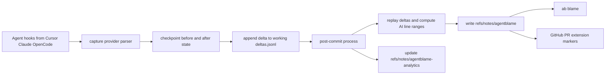
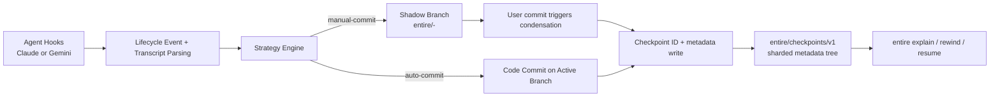
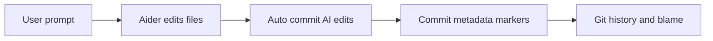
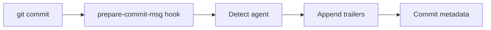
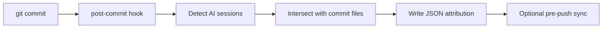
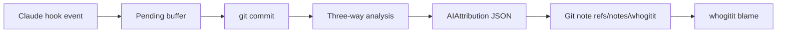
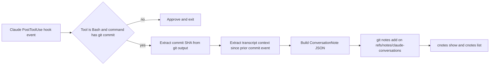
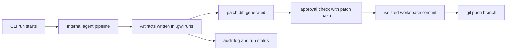
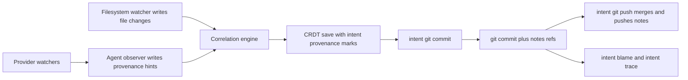

<!-- Generated by SpecStory, Markdown v2.1.0 -->

# 2026-02-20 15:57:50Z

<!-- Codex CLI Session 019c7bc4-ca0e-7bc1-bf3d-a00a272ba230 (2026-02-20 15:57:50Z) -->

_**User (2026-02-20 15:57:50Z)**_

Read docs/git-provenance/RESEARCH-TASK.md and all 10 reports on the 6 standards in docs/git-provenance/systems/

Then we need to do this research and writing task:

"Then, create a summary document as `./docs/git-provenance/STANDARD-SUMMARY.md` that focuses on summary prose and tables comparing the 6 standards. Describe the big picture differences in approaches, the most important trade-offs and pros and cons. This should act as a good "executive summary" / tl;dr of the full research output."

---

_**Agent (gpt-5.3-codex 2026-02-20 15:58:05Z)**_

<think><details><summary>Thought Process</summary>
**Acknowledging task and planning parallel file inspection**
</details></think>

_**Agent (gpt-5.3-codex 2026-02-20 15:58:05Z)**_

I’ll read `docs/git-provenance/RESEARCH-TASK.md` and every report under `docs/git-provenance/systems/`, then draft `docs/git-provenance/STANDARD-SUMMARY.md` as an executive comparison with concise prose and tables. I’m starting by enumerating and opening the relevant files.

_**Agent (gpt-5.3-codex 2026-02-20 15:58:06Z)**_

<think><details><summary>Thought Process</summary>
**Listing files in docs directory**
</details></think>

_**Agent (gpt-5.3-codex 2026-02-20 15:58:06Z)**_

<tool-use data-tool-type="unknown" data-tool-name="exec_command"><details>
<summary>Tool use: **exec_command**</summary>
```
Chunk ID: f26886
Wall time: 0.0518 seconds
Process exited with code 0
Original token count: 199
Output:
docs/git-provenance/SYSTEM-SUMMARY.md
docs/git-provenance/RESEARCH-TASK.md
docs/git-provenance/standards/w3c-prov.md
docs/git-provenance/standards/c2pa-content-credentials.md
docs/git-provenance/standards/in-toto-attestation.md
docs/git-provenance/standards/agent-trace.md
docs/git-provenance/standards/opentelemetry-genai-semconv.md
docs/git-provenance/standards/slsa-provenance.md
docs/git-provenance/systems/aider.md
docs/git-provenance/systems/intent-git-mode.md
docs/git-provenance/systems/tempo-cli.md
docs/git-provenance/systems/whogitit.md
docs/git-provenance/systems/git-ai.md
docs/git-provenance/systems/cnotes.md
docs/git-provenance/systems/aittributor.md
docs/git-provenance/systems/entire.md
docs/git-provenance/systems/git-with-intent.md
docs/git-provenance/systems/agentblame.md
```
</details></tool-use>

_**Agent (gpt-5.3-codex 2026-02-20 15:58:17Z)**_

<think><details><summary>Thought Process</summary>
**Planning parallel reading strategy**
</details></think>

_**Agent (gpt-5.3-codex 2026-02-20 15:58:17Z)**_

<tool-use data-tool-type="unknown" data-tool-name="exec_command"><details>
<summary>Tool use: **exec_command**</summary>
```
Chunk ID: e77d5a
Wall time: 0.0517 seconds
Process exited with code 0
Original token count: 231
Output:
     184 docs/git-provenance/RESEARCH-TASK.md
     442 docs/git-provenance/systems/agentblame.md
     191 docs/git-provenance/systems/aider.md
     174 docs/git-provenance/systems/aittributor.md
     372 docs/git-provenance/systems/cnotes.md
     480 docs/git-provenance/systems/entire.md
     420 docs/git-provenance/systems/git-ai.md
     287 docs/git-provenance/systems/git-with-intent.md
     308 docs/git-provenance/systems/intent-git-mode.md
     188 docs/git-provenance/systems/tempo-cli.md
     211 docs/git-provenance/systems/whogitit.md
     126 docs/git-provenance/standards/agent-trace.md
     141 docs/git-provenance/standards/c2pa-content-credentials.md
     129 docs/git-provenance/standards/in-toto-attestation.md
     133 docs/git-provenance/standards/opentelemetry-genai-semconv.md
     151 docs/git-provenance/standards/slsa-provenance.md
     121 docs/git-provenance/standards/w3c-prov.md
    4058 total
```
</details></tool-use>

_**Agent (gpt-5.3-codex 2026-02-20 15:58:22Z)**_

<think><details><summary>Thought Process</summary>
**Planning structured extraction approach**
</details></think>

_**Agent (gpt-5.3-codex 2026-02-20 15:58:22Z)**_

I confirmed there are 10 system reports in `docs/git-provenance/systems/` plus the task doc. Next I’m extracting each report’s structure and key comparison sections so the summary can accurately reflect all six standards.

_**Agent (gpt-5.3-codex 2026-02-20 15:58:23Z)**_

<think><details><summary>Thought Process</summary>
**Searching all headings**
</details></think>

_**Agent (gpt-5.3-codex 2026-02-20 15:58:24Z)**_

<tool-use data-tool-type="unknown" data-tool-name="exec_command"><details>
<summary>Tool use: **exec_command**</summary>
```
Chunk ID: 7204af
Wall time: 0.0527 seconds
Process exited with code 0
Original token count: 2983
Output:
===== docs/git-provenance/RESEARCH-TASK.md
# AI Git Provenance Research Task
## Background
## 7 Challenges to Explore
### Capturing Agent Activity
### Capturing File Change & Micro-versioning
### Correlating Agent Change to File Change
### Representing Agent Provenance
### Storing Agent Provenance in Git
### AI Blame
### Developer Experience (DX)
## 10 Existing Options to Investigate
## Research Quality Bar (must follow)
### Per-system document requirements
### Challenge-specific requirements
### Tables / diagrams requirements
### Git AI
### Entire
### cnotes
### agentblame
### Git With Intent
### Agent Trace
### Intent Git Mode
### Wild Cards

===== docs/git-provenance/systems/agentblame.md
# Agent Blame System Research
## Executive Summary
## System At A Glance
## Architecture (End-to-End)
## Challenge 1: Capturing Agent Activity
### Supported Agents (Current)
### Implementation
### How It Actually Runs Per Provider
### Evidence
### Strengths / Trade-offs
## Challenge 2: Capturing File Change & Micro-versioning
### Implementation
### Micro-versioning Mechanics
### Concrete Micro-version Sample (delta entry)
### Evidence
### Strengths / Trade-offs
## Challenge 3: Correlating Agent Change to File Change
### Implementation
### Correlation Walkthrough
### Concurrency Handling
### Evidence
### Strengths / Trade-offs
## Challenge 4: Representing Agent Provenance
### Implementation
### Concrete Representation Samples
### Field-to-Usage Mapping
### Evidence
### Strengths / Trade-offs
## Challenge 5: Storing Agent Provenance In Git
### Implementation
### Rewrite/Branch Lifecycle Handling
### Evidence
### Strengths / Trade-offs
## Challenge 6: AI Blame
### Implementation
### Blame Query Path
### Evidence
### Strengths / Trade-offs
## Challenge 7: Developer Experience (DX)
### Implementation
### Operational Burden
### Evidence
### Strengths / Trade-offs
## Activity, Support, and Community (as of 2026-02-18 UTC)
### GitHub Signals
### Delivery Cadence (recent releases)
### Collaboration Signals
## Overall Assessment For SpecStory Research
## Sources
### Product / Docs
### Code
### Activity Metrics

===== docs/git-provenance/systems/aider.md
# Aider System Research
## Executive Summary
## System At A Glance
## Architecture
## Challenge 1: Capturing Agent Activity
### Supported Agents And Providers
### How It Works
## Challenge 2: Capturing File Change And Micro-versioning
### How It Works
## Challenge 3: Correlating Agent Change To File Change
### How It Works
## Challenge 4: Representing Agent Provenance
### Representation Used
### Sample Representation (Schema-faithful, synthetic)
## Challenge 5: Storing Agent Provenance In Git
### How It Works
## Challenge 6: AI Blame
## Challenge 7: Developer Experience (DX)
### Current DX Shape
## Activity, Support, And Community (as of 2026-02-18 UTC)
### GitHub Signals
### Collaboration Signals
### Delivery Cadence
## Observed vs Inferred
## Sources

===== docs/git-provenance/systems/aittributor.md
# AIttributor System Research
## Executive Summary
## System At A Glance
## Architecture
## Challenge 1: Capturing Agent Activity
### Supported Agents And Providers
### How It Works
## Challenge 2: Capturing File Change And Micro-versioning
## Challenge 3: Correlating Agent Change To File Change
### How It Works
## Challenge 4: Representing Agent Provenance
### Representation Used
### Sample Representation (from docs)
## Challenge 5: Storing Agent Provenance In Git
## Challenge 6: AI Blame
## Challenge 7: Developer Experience (DX)
### Current DX Shape
## Activity, Support, And Community (as of 2026-02-18 UTC)
### GitHub Signals
### Collaboration Signals
### Delivery Cadence
## Observed vs Inferred
## Sources

===== docs/git-provenance/systems/cnotes.md
# cnotes System Research
## Executive Summary
## System At A Glance
## Architecture (End-to-End)
## Challenge 1: Capturing Agent Activity
### Supported Agents (Current)
### Implementation
### How It Actually Runs
### Evidence
### Strengths / Trade-offs
## Challenge 2: Capturing File Change & Micro-versioning
### Implementation
### How It Actually Behaves
### Practical Outcome
### Evidence
### Strengths / Trade-offs
## Challenge 3: Correlating Agent Change to File Change
### Implementation
### Correlation Path
### What This Means For Concurrency
### Evidence
### Strengths / Trade-offs
## Challenge 4: Representing Agent Provenance
### Implementation
### Concrete Representation Samples
### Field-to-Usage Mapping
### Evidence
### Strengths / Trade-offs
## Challenge 5: Storing Agent Provenance In Git
### Implementation
### Storage Lifecycle
### Rewrite/Branching Reality
### Evidence
### Strengths / Trade-offs
## Challenge 6: AI Blame
### Implementation
### Practical Blame Workflow
### Evidence
### Strengths / Trade-offs
## Challenge 7: Developer Experience (DX)
### Implementation
### Operational Burden
### Evidence
### Strengths / Trade-
... (truncated)
```
</details></tool-use>

_**Agent (gpt-5.3-codex 2026-02-20 15:58:28Z)**_

<think><details><summary>Thought Process</summary>
**Inspecting report structure**
</details></think>

_**Agent (gpt-5.3-codex 2026-02-20 15:58:28Z)**_

<tool-use data-tool-type="unknown" data-tool-name="exec_command"><details>
<summary>Tool use: **exec_command**</summary>
```
Chunk ID: e904eb
Wall time: 0.0529 seconds
Process exited with code 0
Original token count: 2609
Output:
# Agent Blame System Research

_Last updated: 2026-02-18 (UTC)_

## Executive Summary

**Metaphor:** Agent Blame behaves like an **air-traffic recorder for AI edits**:
- Hook events capture before/after file state around AI tool actions.
- A delta ledger tracks AI and human edits between commits.
- Commit processing replays those deltas and writes line-range attribution into git notes.

It is one of the stronger open implementations for practical line-level AI blame across local CLI and GitHub PR UX, with explicit squash/rebase transfer workflows.

## System At A Glance

| Dimension                 | What Agent Blame Does                                                            |
|---------------------------|----------------------------------------------------------------------------------|
| Core model                | Provider hooks + checkpoint capture + delta replay + git-note attribution        |
| Primary provenance store  | `refs/notes/agentblame`                                                          |
| Secondary analytics store | `refs/notes/agentblame-analytics` on root/anchor commit                          |
| In-flight store           | `.git/agentblame/working/<base-sha>/deltas.jsonl` + checkpoint files + git blobs |
| Session metadata store    | Global SQLite `~/.agentblame/agentblame.db`                                      |
| Micro-versioning          | Yes (pre/post edit checkpoints + append-only deltas)                             |
| Line-level attribution    | Yes (`ab blame <file>`)                                                          |
| Rewrite handling          | GitHub Action `post-merge` transfer + `ab sync` local transfer for squash/rebase |
| Agent integrations        | Cursor, Claude Code, OpenCode                                                    |

## Architecture (End-to-End)



---

## Challenge 1: Capturing Agent Activity

### Supported Agents (Current)

| Agent / Provider | Support Status          | Capture Depth                                      | Confidence         | Evidence                                         |
|------------------|-------------------------|----------------------------------------------------|--------------------|--------------------------------------------------|
| Cursor           | Supported               | Prompt boundary + file edit hook capture           | High (docs + code) | README, `lib/hooks.ts`, `capture.ts`             |
| Claude Code      | Supported               | PreToolUse + PostToolUse with transcript parsing   | High (docs + code) | README, `lib/hooks.ts`, `capture.ts`             |
| OpenCode         | Supported               | Plugin hooks for chat prompt and tool before/after | High (docs + code) | README, `lib/hooks.ts`, OpenCode plugin template |
| Other agents     | Not currently supported | N/A                                                | High               | README roadmap lists others as future            |

### Implementation

`ab init` writes repo-local integrations:
- `.cursor/hooks.json`: `beforeSubmitPrompt`, `afterFileEdit`
- `.claude/settings.json`: `PreToolUse` (Edit/Write/MultiEdit), `PostToolUse` (all tools)
- `.opencode/plugin/agentblame.ts`: `chat.message`, `tool.execute.before`, `tool.execute.after`

Captured payloads are normalized by `capture --provider <cursor|claude|opencode>`.

### How It Actually Runs Per Provider

1. Hook payload arrives on stdin.
2. Provider parser resolves repo root, base SHA (`HEAD`), session ID, model, and prompt.
3. Session is upserted into global SQLite with repo namespace.
4. Tool and prompt events are recorded (`tool_calls`, `prompts`).
5. File edit boundaries trigger checkpoint/delta logic.

### Evidence

| Evidence                           | What It Shows                                                  |
|------------------------------------|----------------------------------------------------------------|
| `packages/cli/src/lib/hooks.ts`    | Exact hook installation payloads for Cursor/Claude/OpenCode    |
| `packages/cli/src/capture.ts`      | Provider-specific parsing and session/prompt/tool capture flow |
| `packages/cli/src/lib/database.ts` | Session/prompt/tool schema and persistence                     |

### Strengths / Trade-offs

| Strength                                             | Trade-off                                                    |
|------------------------------------------------------|--------------------
... (truncated)
```
</details></tool-use>

_**Agent (gpt-5.3-codex 2026-02-20 15:58:32Z)**_

<think><details><summary>Thought Process</summary>
**Searching standard references**
</details></think>

_**Agent (gpt-5.3-codex 2026-02-20 15:58:32Z)**_

I’ve started reading the reports and confirmed they include detailed implementation and trade-off sections. I’m now extracting where each file evaluates the six provenance standards so the new summary can compare standards rather than system internals.

_**Agent (gpt-5.3-codex 2026-02-20 15:58:33Z)**_

<think><details><summary>Thought Process</summary>
**Searching standard keywords**
</details></think>

_**Agent (gpt-5.3-codex 2026-02-20 15:58:33Z)**_

<tool-use data-tool-type="unknown" data-tool-name="exec_command"><details>
<summary>Tool use: **exec_command**</summary>
```
Chunk ID: 3d2616
Wall time: 0.0523 seconds
Process exited with code 0
Original token count: 3027
Output:
docs/git-provenance/systems/aider.md:10:Aider is a widely adopted coding agent that uses git commits as its primary provenance artifact. It auto-commits AI edits and marks those commits through author/committer name changes or `Co-authored-by` trailers. This yields strong commit-level attribution, but no first-class line-level provenance representation.
docs/git-provenance/systems/aider.md:17:| Primary provenance store | Git commit metadata (author/committer names, trailers) |
docs/git-provenance/systems/aider.md:86:Aider represents AI provenance by modifying commit metadata:
docs/git-provenance/systems/aider.md:139:- No extra commands needed for provenance once auto-commit is enabled.
docs/git-provenance/systems/aider.md:182:- Aider is best classified as commit-level AI attribution, not a full line-level provenance system.
docs/git-provenance/systems/aittributor.md:10:AIttributor is a lightweight git hook that detects active AI tools and appends attribution trailers to the commit message. It does not capture prompts, tool calls, or line-level provenance, but it is a low-friction commit-level marker that survives standard git workflows.
docs/git-provenance/systems/aittributor.md:17:| Primary provenance store | Commit trailers (`Co-authored-by`, `Ai-assisted`) |
docs/git-provenance/systems/aittributor.md:101:- Commit-level trailers are the only provenance signal.
docs/git-provenance/systems/aittributor.md:107:AIttributor writes directly into the commit message, so provenance survives merges, rebases, and cherry-picks as normal commit metadata.
docs/git-provenance/systems/aittributor.md:165:- Best used as a minimal commit-level marker to combine with richer provenance systems.
docs/git-provenance/systems/agentblame.md:19:| Primary provenance store  | `refs/notes/agentblame`                                                          |
docs/git-provenance/systems/agentblame.md:187:Final commit provenance is stored as JSON note v3 with:
docs/git-provenance/systems/agentblame.md:409:- prompt-linked provenance representation
docs/git-provenance/systems/intent-git-mode.md:7:**Metaphor:** Intent Git Mode is a **dual-entry provenance ledger**:
docs/git-provenance/systems/intent-git-mode.md:9:- Git notes publish commit-linked provenance so teams can share and query it.
docs/git-provenance/systems/intent-git-mode.md:18:| File micro-versioning | Every filesystem change saved into CRDT history with provenance marks |
docs/git-provenance/systems/intent-git-mode.md:19:| Correlation           | Scored matcher engine links file-change events to provenance hints    |
docs/git-provenance/systems/intent-git-mode.md:20:| Git provenance store  | `refs/notes/intent/exchanges` and `refs/notes/intent/metadata`        |
docs/git-provenance/systems/intent-git-mode.md:29:  A[Provider watchers] --> B[Agent observer writes provenance hints]
docs/git-provenance/systems/intent-git-mode.md:32:  D --> E[CRDT save with intent provenance marks]
docs/git-provenance/systems/intent-git-mode.md:57:3. Observer extracts file operations and emits `provenance_hint` journal entries carrying session, exchange, prompt, reply, tool context, and optional message ID.
docs/git-provenance/systems/intent-git-mode.md:71:3. Node Automerge bridge updates `doc.content` and applies `intent:provenance` marks on inserted spans.
docs/git-provenance/systems/intent-git-mode.md:75:- Micro-versioning is continuous and pre-commit. Git commit is export/sync, not the first provenance boundary.
docs/git-provenance/systems/intent-git-mode.md:103:- **CRDT mark representation** for in-flight and uncommitted provenance.
docs/git-provenance/systems/intent-git-mode.md:104:- **Git note representation** for commit-linked shared provenance.
docs/git-provenance/systems/intent-git-mode.md:110:  "name": "intent:provenance",
docs/git-provenance/systems/intent-git-mode.md:197:This gives explicit provenance transport semantics and reduces note divergence across collaborators.
docs/git-provenance/systems/intent-git-mode.md:208:4. If file is dirty or uncommitted, overlay CRDT provenance marks from daemon.
docs/git-provenance/systems/intent-git-mode.md:218:This is a strong implementation of both forward and inverse provenance queries.
docs/git-provenance/systems/intent-git-mode.md:228:3. Use `intent git commit` to create commit plus provenance notes.
docs/git-provenance/systems/intent-git-mode.md:277:Intent Git Mode currently demonstrates a full provenance stack:
docs/git-provenance/systems/intent-git-mode.md:284:Compared with other systems covered so far, it is one of the strongest concrete references for line-aware AI provenance mechanics, especially the CRDT-first then Git-notes export model.
docs/git-provenance/systems/intent-git-mode.md:293:- `/Users/sean/source/SpecStory/intent/intent-cli/pkg/git/provenance_reader.go`
docs/git-provenance/systems/tempo-cli.md:10:Tempo CLI is a commit-tim
... (truncated)
```
</details></tool-use>

_**Agent (gpt-5.3-codex 2026-02-20 15:58:38Z)**_

<think><details><summary>Thought Process</summary>
**Reviewing research task for standards**
</details></think>

_**Agent (gpt-5.3-codex 2026-02-20 15:58:38Z)**_

<tool-use data-tool-type="unknown" data-tool-name="exec_command"><details>
<summary>Tool use: **exec_command**</summary>
```
Chunk ID: 7ca1e1
Wall time: 0.0530 seconds
Process exited with code 0
Original token count: 3549
Output:
# AI Git Provenance Research Task

## Background

The goal of "AI agent code provenance" is to provide "AI Blame". AI blame means that for a specific line of code, or for all the lines of code in a specific file the origin of that line of code is known, and the following information about the origin is known:

- When the line of code was made/modified
- The line of code came from an AI coding agent or a manual change by a human
- When the line of code came from an AI coding agent, ideally all of the following information is available:
  - The human prompt that led to the AI coding agent making the change
  - The tool use that made the change
  - The agent response/commentary that led up to the tool use
  - The agent response/commentary that followed the tool use

The SpecStory CLI concurrently observes file system changes and AI terminal coding agent exhaust (activity) and correlates them together to provide AI agent code provenance. That provenance is stored in a local only SQLite DB, but to be truly useful it needs to be available to everyone, everywhere. 

One obvious answer to making the provenance available everywhere is to store it in git. In theory this could be in the same repository along with the code, or in a dedicated shadow repository.

- Ubiquitous existing system of record for code
- Ubiquitous tool and ecosystem support
- Distributed system
- Already provides "git blame" to answer the origin of any given line of code

This research task is to explore the various ways git can be used to store and present AI provenance.

## 7 Challenges to Explore

For any system to provide AI agent code provenance using git, the following challenges need a solution. Each AI provenance system may provide entirely or subtly different solutions to these challenges, leading to differences in outcomes. These differences provides trade-offs and pros and cons of each approach.

Understanding the different solutions in use today, and the trade-offs and pros and cons of each solution is the FOCUS of this research task.

### Capturing Agent Activity

The SpecStory CLI captures terminal agent change using an SPI/provider mechanism. There is a small SPI and a provider per agent. Each agent provider is open to do whatever is needed to provide standardized SessionData events each time there is agent activity (user message, agent message, tool use, etc.) in the coding agent. 

Most of the SpecStory CLI providers use fsnotify to observe a location where the coding agent is storing data for the session as JSON or JSONL. Some of them do the same for session data in SQLite DBs.

Agent coverage:

- Claude Code
- Codex CLI
- Gemini CLI
- Cursor CLI
- Factory Droid CLI

In progress:

- OpenCode
- Cursor VSC IDE
- Copilot VSC IDE
- Amp

The focus of this research is to understand what coding agents are supported and how the system knows that the coding agent did anything. When it did it. What the user and agent said.

The SpecStory CLI relies on its SPI/providers architecture and fsnotify. Other solutions may be similar and others will rely on coding agent hooks (callbacks).

### Capturing File Change & Micro-versioning

The 2nd piece of AI provenance is knowing what files changed. In an important sense, an AI provenance system backstopped by git gets this for "free" as the git system always understands files that are unchanged, staged and unstaged and the files that change in a commit and how they changed. So an AI provenance system could simply rely on git completely for understanding changes to files.

A challenge is that an agent may edit a file in response to a user prompt, edit it again later in response to a different user prompt, then edit it yet again in the agent loop in response to its own findings or thinking, and only then is this file finally committed. When committed git flattens this to just a single change from the file's prior state to the changed state. The fact that there were 3 different edits by the agent at different times, made in response to 2 different prompts and 3 different circumstances could be lost if the system is not solving this challenge in some way. 

One solution to this may be some sort of micro-versioning in between commits. Another may be to "punt" on this and leave it to the user to sort out how and why the file changed by reading the agent session. In theory an LLM could be used to read the session and associate the editing tool calls with the specific changed lines, though this solution may be slower and more expensive.

### Correlating Agent Change to File Change

Once a system has a handle on what files are changing and what agent activity is happening, some answer is needed to how the former is correlated to the latter. For example, if there are 2 concurrent agent sessions going on in the same local git repository, tackling unrelated goals, how do the file system changes get correlat
... (truncated)
```
</details></tool-use>

_**Agent (gpt-5.3-codex 2026-02-20 15:58:43Z)**_

<think><details><summary>Thought Process</summary>
**Planning standards summary gathering**
</details></think>

_**Agent (gpt-5.3-codex 2026-02-20 15:58:44Z)**_

<tool-use data-tool-type="unknown" data-tool-name="exec_command"><details>
<summary>Tool use: **exec_command**</summary>
```
Chunk ID: 916f1c
Wall time: 0.0521 seconds
Process exited with code 1
Original token count: 0
Output:
```
</details></tool-use>

_**Agent (gpt-5.3-codex 2026-02-20 15:58:51Z)**_

<think><details><summary>Thought Process</summary>
**Planning standards and reports review**
</details></think>

_**Agent (gpt-5.3-codex 2026-02-20 15:58:52Z)**_

I didn’t find explicit standard-name sections inside the system reports, so I’m also pulling the six files in `docs/git-provenance/standards/` to ground the standard comparison correctly while still covering all 10 system reports as requested.

_**Agent (gpt-5.3-codex 2026-02-20 15:58:56Z)**_

<think><details><summary>Thought Process</summary>
**Planning report extraction script**
</details></think>

_**Agent (gpt-5.3-codex 2026-02-20 15:58:56Z)**_

<tool-use data-tool-type="unknown" data-tool-name="exec_command"><details>
<summary>Tool use: **exec_command**</summary>
```
Chunk ID: 9f728e
Wall time: 0.0517 seconds
Process exited with code 0
Original token count: 643
Output:
===== docs/git-provenance/standards/agent-trace.md
# Agent Trace Standard Research
## Executive Summary
## Standard At A Glance
## Purpose & Scope
## Core Representation
## Sample Representation
## Capture / Emission Model
## Verification / Trust Model
## Git / SCM Relevance
## Tooling & Ecosystem
## Activity, Support, And Community (as of 2026-02-18 UTC)
## Delivery Cadence
## Observed vs Inferred
## Sources

===== docs/git-provenance/standards/c2pa-content-credentials.md
# C2PA Content Credentials Standard Research
## Executive Summary
## Standard At A Glance
## Purpose & Scope
## Core Representation
## Sample Representation
## Capture / Emission Model
## Verification / Trust Model
## Git / SCM Relevance
## Tooling & Ecosystem
## Activity, Support, And Community (as of 2026-02-18 UTC)
## Delivery Cadence
## Observed vs Inferred
## Sources

===== docs/git-provenance/standards/in-toto-attestation.md
# in-toto Attestation Standard Research
## Executive Summary
## Standard At A Glance
## Purpose & Scope
## Core Representation
## Sample Representation
## Capture / Emission Model
## Verification / Trust Model
## Git / SCM Relevance
## Tooling & Ecosystem
## Activity, Support, And Community (as of 2026-02-18 UTC)
## Delivery Cadence
## Observed vs Inferred
## Sources

===== docs/git-provenance/standards/opentelemetry-genai-semconv.md
# OpenTelemetry GenAI Semantic Conventions Research
## Executive Summary
## Standard At A Glance
## Purpose & Scope
## Core Representation
## Sample Representation
## Capture / Emission Model
## Verification / Trust Model
## Git / SCM Relevance
## Tooling & Ecosystem
## Activity, Support, And Community (as of 2026-02-18 UTC)
## Delivery Cadence
## Observed vs Inferred
## Sources

===== docs/git-provenance/standards/slsa-provenance.md
# SLSA Build Provenance Standard Research
## Executive Summary
## Standard At A Glance
## Purpose & Scope
## Core Representation
## Sample Representation
## Capture / Emission Model
## Verification / Trust Model
## Git / SCM Relevance
## Tooling & Ecosystem
## Activity, Support, And Community (as of 2026-02-18 UTC)
## Delivery Cadence
## Observed vs Inferred
## Sources

===== docs/git-provenance/standards/w3c-prov.md
# W3C PROV Standard Research
## Executive Summary
## Standard At A Glance
## Purpose & Scope
## Core Representation
## Sample Representation
## Capture / Emission Model
## Verification / Trust Model
## Git / SCM Relevance
## Tooling & Ecosystem
## Activity, Support, And Community (as of 2026-02-18 UTC)
## Delivery Cadence
## Observed vs Inferred
## Sources
```
</details></tool-use>

_**Agent (gpt-5.3-codex 2026-02-20 15:58:59Z)**_

<think><details><summary>Thought Process</summary>
**Reviewing relevant documents**
</details></think>

_**Agent (gpt-5.3-codex 2026-02-20 15:58:59Z)**_

I’ve confirmed the six standard research docs are present and structured consistently, which is good for a clean cross-standard table. I’ll now read those plus the key sections of all 10 system reports and then write the new `STANDARD-SUMMARY.md`.

_**Agent (gpt-5.3-codex 2026-02-20 15:59:03Z)**_

Plan:
1. Read `docs/git-provenance/RESEARCH-TASK.md`, all 10 files in `docs/git-provenance/systems/`, and all 6 files in `docs/git-provenance/standards/` with focus on scope, data model, trust model, and Git fit.
2. Extract comparable dimensions for the six standards: what each standard is optimized for, provenance granularity, identity/trust guarantees, implementation complexity, and fit for AI blame.
3. Draft `docs/git-provenance/STANDARD-SUMMARY.md` with:
- Executive summary prose for decision-makers.
- Comparison tables (big-picture positioning + trade-offs + suitability by challenge).
- Clear recommendations on where each standard fits in a SpecStory-style architecture.
4. Verify the document for factual consistency against source reports and finalize.

_**Agent (gpt-5.3-codex 2026-02-20 15:59:04Z)**_

<think><details><summary>Thought Process</summary>
**Planning bulk standards reading**
</details></think>

_**Agent (gpt-5.3-codex 2026-02-20 15:59:05Z)**_

<tool-use data-tool-type="unknown" data-tool-name="exec_command"><details>
<summary>Tool use: **exec_command**</summary>
```
Chunk ID: dece2c
Wall time: 0.0518 seconds
Process exited with code 0
Original token count: 7264
Output:

===== docs/git-provenance/standards/agent-trace.md =====

# Agent Trace Standard Research

_Last updated: 2026-02-18 (UTC)_

## Executive Summary

**Metaphor:** Agent Trace is a shipping container spec, not the shipping network.
It standardizes the payload shape for attribution records and a blame lookup recipe, but it does not define capture, storage, or sync behavior.

## Standard At A Glance

| Dimension | What Agent Trace Defines |
|---|---|
| Scope | AI attribution schema + blame lookup guidance |
| Primary artifact | Trace records containing files, ranges, conversations, contributor |
| Intended producers | Agent hooks, editors, capture tools |
| Intended consumers | Blame tooling, provenance viewers |
| Status | Proposal with reference implementation |
| Reference implementation | Hook script + JSONL store |

## Purpose & Scope

Agent Trace defines a vendor-neutral schema for AI attribution so different tools can emit and consume compatible provenance data. It does not mandate how to capture or store that data, nor does it implement a complete AI provenance system.

## Core Representation

| Concept | Description | Why It Matters |
|---|---|---|
| `TraceRecord` | Top-level record with `version`, `id`, `timestamp` | Unique, time-ordered provenance unit |
| `vcs` | VCS info with `type` and optional `revision` | Links attribution to a Git revision and blame |
| `tool` | Emitting tool identity | Indicates which agent produced the data |
| `files[]` | File paths with `conversations[]` | Maps attribution to specific files |
| `ranges[]` | Line ranges and `content_hash` | Enables line-level provenance lookup |
| `contributor` | AI vs human + optional model info | Distinguishes human vs agent work |

## Sample Representation

Synthetic example aligned to the published schema fields.

```json
{
  "version": "0.1.0",
  "id": "550e8400-e29b-41d4-a716-446655440000",
  "timestamp": "2026-01-23T14:30:00Z",
  "vcs": { "type": "git", "revision": "a1b2c3d4" },
  "tool": { "name": "cursor", "version": "2.4.0" },
  "files": [
    {
      "path": "src/utils/parser.ts",
      "conversations": [
        {
          "url": "https://api.cursor.com/v1/conversations/12345",
          "contributor": { "type": "ai", "model_id": "anthropic/claude-opus-4-5-20251101" },
          "ranges": [
            { "start_line": 42, "end_line": 67, "content_hash": "murmur3:9f2e8a1b" }
          ]
        }
      ]
    }
  ]
}
```

| Field | Role In Provenance / Blame |
|---|---|
| `vcs.revision` | Links to the commit used by `git blame` |
| `files.path` + `ranges` | Provides line-level attribution targets |
| `contributor` | Signals AI vs human and model identity |
| `conversations.url` | Enables drill-down to transcript data |

## Capture / Emission Model

Capture is implementation-defined. The reference hook maps agent hook events into trace records and appends them to a local JSONL file.

## Verification / Trust Model

Agent Trace does not define signing or attestation. Trust is delegated to the storage and distribution mechanism chosen by implementers.

## Git / SCM Relevance

The schema includes `vcs.revision`, and the spec describes a blame workflow: run VCS blame, locate the corresponding trace record by file and range, and display contributor information.

## Tooling & Ecosystem

| Tool / Project | Role | Notes |
|---|---|---|
| `cursor/agent-trace` | Reference implementation | Hook script + JSONL store |
| `agent-trace.dev` | Spec docs | Schema and workflow overview |
| Third-party hooks | Producers | Any tool that emits the schema |

## Activity, Support, And Community (as of 2026-02-18 UTC)

| Metric | Value |
|---|---:|
| Stars | 578 |
| Forks | 46 |
| Watchers | 15 |
| Open issues | 8 |
| Last push | 2026-02-06T14:23:28Z |

| Metric | Value |
|---|---:|
| Open PRs | 1 |
| Closed PRs | 7 |
| Top contributors (API snapshot) | `leerob`, `cursoragent` |

## Delivery Cadence

| Repo | Version | Published (UTC) | Channel |
|---|---|---|---|
| `cursor/agent-trace` | `-` | `-` | No tagged releases |

## Observed vs Inferred

| Type | Notes |
|---|---|
| Observed in code/docs | Schema definitions in `schemas.ts` and examples in `README.md` |
| Observed in code/docs | Reference hook in `reference/trace-hook.ts` writing JSONL traces |
| Inferred | Most value comes from interoperability, not from storage or sync |

## Sources

- https://agent-trace.dev/
- https://github.com/cursor/agent-trace
- https://github.com/cursor/agent-trace/blob/main/README.md
- https://github.com/cursor/agent-trace/blob/main/schemas.ts

===== docs/git-provenance/standards/c2pa-content-credentials.md =====

# C2PA Content Credentials Standard Research

_Last updated: 2026-02-18 (UTC)_

## Executive Summary

**Metaphor:** C2PA is a sealed evidence bag attached to media.
It packages a chain of assertions about how an asset was created or edited, then seals it wit
... (truncated)
```
</details></tool-use>

_**Agent (gpt-5.3-codex 2026-02-20 15:59:13Z)**_

<think><details><summary>Thought Process</summary>
**Planning targeted report extraction**
</details></think>

_**Agent (gpt-5.3-codex 2026-02-20 15:59:16Z)**_

<tool-use data-tool-type="unknown" data-tool-name="exec_command"><details>
<summary>Tool use: **exec_command**</summary>
```
Chunk ID: 39be5e
Wall time: 0.0515 seconds
Process exited with code 0
Original token count: 14255
Output:

===== docs/git-provenance/systems/agentblame.md =====

## Executive Summary

**Metaphor:** Agent Blame behaves like an **air-traffic recorder for AI edits**:
- Hook events capture before/after file state around AI tool actions.
- A delta ledger tracks AI and human edits between commits.
- Commit processing replays those deltas and writes line-range attribution into git notes.

It is one of the stronger open implementations for practical line-level AI blame across local CLI and GitHub PR UX, with explicit squash/rebase transfer workflows.

## System At A Glance

| Dimension                 | What Agent Blame Does                                                            |
|---------------------------|----------------------------------------------------------------------------------|
| Core model                | Provider hooks + checkpoint capture + delta replay + git-note attribution        |
| Primary provenance store  | `refs/notes/agentblame`                                                          |
| Secondary analytics store | `refs/notes/agentblame-analytics` on root/anchor commit                          |
| In-flight store           | `.git/agentblame/working/<base-sha>/deltas.jsonl` + checkpoint files + git blobs |
| Session metadata store    | Global SQLite `~/.agentblame/agentblame.db`                                      |
| Micro-versioning          | Yes (pre/post edit checkpoints + append-only deltas)                             |
| Line-level attribution    | Yes (`ab blame <file>`)                                                          |
| Rewrite handling          | GitHub Action `post-merge` transfer + `ab sync` local transfer for squash/rebase |
| Agent integrations        | Cursor, Claude Code, OpenCode                                                    |

## Challenge 4: Representing Agent Provenance

### Implementation

Final commit provenance is stored as JSON note v3 with:
- `sessions`: agent/model/prompt metadata
- `files`: per-file AI ranges as compact line strings, grouped by `session` and optional `prompt`

Analytics is stored separately in `refs/notes/agentblame-analytics`.

### Concrete Representation Samples

Primary commit note location:

```text
refs/notes/agentblame @ <commit-sha>
```

Representative commit note payload (schema-faithful):

```json
{
  "version": 3,
  "timestamp": "2026-02-18T12:20:02.119Z",
  "sessions": {
    "a91f34c2de7781ab": {
      "agent": "claude",
      "model": "claude-sonnet-4-5",
      "prompts": [
        {
          "id": 42,
          "timestamp": "2026-02-18T12:13:40.000Z",
          "content": "Add OAuth callback host validation",
          "tools": { "edit": 2, "read": 3 },
          "duration": 33
        }
      ],
      "startedAt": "2026-02-18T12:13:39.100Z"
    }
  },
  "files": {
    "src/auth.ts": [
      { "session": "a91f34c2de7781ab", "prompt": 42, "lines": "18-23,40-44" }
    ]
  }
}
```

Representative analytics note location:

```text
refs/notes/agentblame-analytics @ <analytics-anchor-commit>
```

### Field-to-Usage Mapping

| Field                               | Used For Later                                           |
|-------------------------------------|----------------------------------------------------------|
| `files[].lines`                     | Fast line-range resolution for CLI/extension attribution |
| `session`                           | Joins range to model/tool/prompt metadata                |
| `prompt`                            | Connects line range to specific prompt entry             |
| `sessions[].prompts[].tools`        | Prompt-level tool usage context in blame UI              |
| `analytics` note summary/breakdowns | PR/repo-level AI usage dashboards                        |

### Evidence

| Evidence                               | What It Shows                                              |
|----------------------------------------|------------------------------------------------------------|
| `packages/cli/src/lib/git/gitNotes.ts` | v3 note builder/parser and refs                            |
| `packages/cli/src/lib/types.ts`        | Canonical Attribution, SessionMetadata, PromptEntry schema |
| `packages/cli/src/lib/analytics.ts`    | Analytics note schema and update flow                      |

### Strengths / Trade-offs

| Strength                                         | Trade-off                                                       |
|--------------------------------------------------|-----------------------------------------------------------------|
| Compact machine-usable line-range representation | Requires parser compatibility across CLI and extension versions |
| Prompt-level linkage is first-class              | Metadata size grows with prompt richness                        |

---

## Challenge 5: Storing Agent Provenance In Git

### Implementation

Agent Blame writes
... (truncated)
```
</details></tool-use>

_**Agent (gpt-5.3-codex 2026-02-20 15:59:21Z)**_

<think><details><summary>Thought Process</summary>
**Planning complete report reads**
</details></think>

_**Agent (gpt-5.3-codex 2026-02-20 15:59:22Z)**_

I extracted the core sections from all 10 systems, but `entire.md` and `git-ai.md` were partially truncated in that pass. I’m now reading those in full and then I’ll draft the summary tables with explicit trade-offs across the six standards.

_**Agent (gpt-5.3-codex 2026-02-20 15:59:23Z)**_

<tool-use data-tool-type="unknown" data-tool-name="exec_command"><details>
<summary>Tool use: **exec_command**</summary>
```
Chunk ID: 5d1803
Wall time: 0.0520 seconds
Process exited with code 0
Original token count: 5713
Output:
# Entire System Research

_Last updated: 2026-02-18 (UTC)_

## Executive Summary

**Metaphor:** Entire behaves like **double-entry bookkeeping for AI coding**:
- one ledger = your code branch
- second ledger = `entire/checkpoints/v1` metadata branch
- temporary shadow ledger = in-progress session checkpoints before condensation

Entire is strongest at **session/checkpoint-level provenance workflows** (rewind/resume/explain), with weaker support for strict line-level AI blame.

## System At A Glance

| Dimension                | What Entire Does                                                                |
|--------------------------|---------------------------------------------------------------------------------|
| Core model               | Agent hooks + strategy engine (`manual-commit` default, `auto-commit` optional) |
| Primary provenance store | Dedicated Git branch: `entire/checkpoints/v1`                                   |
| In-flight store          | Shadow branches: `entire/<base[:7]>-<worktreeHash[:6]>`                         |
| Session state            | `.git/entire-sessions/<session-id>.json` (git common dir)                       |
| Micro-versioning         | Yes (temporary/final checkpoints; task incremental checkpoints)                 |
| Line-level AI blame      | No direct `blame` overlay equivalent                                            |
| Main explainability UX   | `entire explain`, `entire rewind`, `entire resume`                              |
| Agent integrations       | Claude Code (deep integration), Gemini CLI (preview/integration path)           |

## Architecture (End-to-End)



---

## Challenge 1: Capturing Agent Activity

### Implementation

Entire uses explicit agent hook integrations and normalizes hooks into lifecycle events:
- Claude Code: `SessionStart`, `UserPromptSubmit`, `Stop`, `PreToolUse[Task]`, `PostToolUse[Task]`, `PostToolUse[TodoWrite]`
- Gemini CLI: session/turn hooks plus additional before/after model/tool hooks

Session identity and phase are persisted in `.git/entire-sessions/*.json` so event handling is stateful across hook invocations.

### How It Actually Behaves During A Turn

1. On `SessionStart`, Entire creates/loads session state and binds a stable session ID.
2. On `UserPromptSubmit`, Entire captures pre-prompt repo state (for later diffing) and checks for conflicting active sessions.
3. While the agent runs, task hooks can capture subagent boundaries (`tool_use_id`) and incremental progress.
4. On `Stop` (or Gemini equivalent turn-end event), Entire parses transcript deltas, computes touched files, and calls strategy save logic.
5. Session phase transitions are persisted so crash/restart workflows can continue safely.

### Evidence

| Evidence                                        | What It Shows                                  |
|-------------------------------------------------|------------------------------------------------|
| `docs/architecture/claude-hooks-integration.md` | Detailed Claude hook timing/payload/use cases  |
| `cmd/entire/cli/agent/claudecode/hooks.go`      | Hook installation into Claude settings         |
| `cmd/entire/cli/agent/geminicli/hooks.go`       | Gemini hook installation/mapping               |
| `cmd/entire/cli/agent/*/lifecycle.go`           | Hook→normalized lifecycle event parsing        |
| `cmd/entire/cli/session/state.go`               | Persistent session state schema/phase tracking |

### Strengths / Trade-offs

| Strength                                                          | Trade-off                                            |
|-------------------------------------------------------------------|------------------------------------------------------|
| Rich, explicit event model (especially for Claude subagent flows) | Agent coverage is narrower than Git AI today         |
| State-machine backed lifecycle reduces ambiguity                  | Integration depth differs by agent (Claude > Gemini) |

---

## Challenge 2: Capturing File Change & Micro-versioning

### Implementation

Entire supports two micro-versioning strategies:

1. **Manual-commit (default)**
- frequent temporary checkpoints on shadow branches
- user commits code normally
- post-commit condenses checkpoint metadata to `entire/checkpoints/v1`

2. **Auto-commit**
- each step can produce a code commit on active branch
- each commit gets `Entire-Checkpoint: <id>` trailer
- metadat
... (truncated)
```
</details></tool-use>

_**Agent (gpt-5.3-codex 2026-02-20 15:59:26Z)**_

<tool-use data-tool-type="unknown" data-tool-name="exec_command"><details>
<summary>Tool use: **exec_command**</summary>
```
Chunk ID: c0b3b0
Wall time: 0.0512 seconds
Process exited with code 0
Original token count: 5337
Output:
# Git AI System Research

_Last updated: 2026-02-18 (UTC)_

## Executive Summary

**Metaphor:** Git AI behaves like a **flight data recorder bolted onto Git**:
- It records fine-grained agent/human editing events before commit (checkpoint stream).
- At commit time, it compiles those events into a durable attribution artifact (Authorship Log).
- It stores that artifact in Git Notes and keeps it alive across history rewrites.

Git AI is currently one of the most complete end-to-end implementations of AI provenance in Git: it covers capture, micro-versioning, rewrite survival, and line-level AI blame.

## System At A Glance

| Dimension                | What Git AI Does                                                                                   |
|--------------------------|----------------------------------------------------------------------------------------------------|
| Core model               | Git proxy + agent hooks + per-edit checkpoints + commit-time authorship logs                       |
| Primary provenance store | `refs/notes/ai` Git Notes (open `authorship/3.0.0` format)                                         |
| In-flight store          | `.git/ai/working_logs/<base-commit>/` checkpoint stream + blob store                               |
| Micro-versioning         | Yes (checkpoint per edit cycle, not just per commit)                                               |
| Line-level attribution   | Yes (`git-ai blame`)                                                                               |
| Rewrite handling         | Rebase/cherry-pick/merge/reset/stash/amend-aware note rewriting/remapping                          |
| Agent integrations       | Claude Code, Codex, Cursor, Gemini, Copilot, Continue, OpenCode, Droid, JetBrains/Junie/Rovo paths |
| Privacy modes            | `default` (CAS/upload + strip from notes), `notes` (redacted in notes), `local` (local only)       |

## Architecture (End-to-End)

```mermaid
flowchart LR
  A[Agent Hook Event\nPreToolUse and PostToolUse] --> B[git-ai checkpoint preset]
  B --> C[.git/ai/working_logs/(base)/checkpoints.jsonl]
  B --> D[.git/ai/working_logs/(base)/blobs/*]
  C --> E[git commit pre+post hooks]
  D --> E
  E --> F[Authorship Log\nattestations + metadata]
  F --> G[Git Note refs/notes/ai @ commit SHA]
  G --> H[git-ai blame, show, stats]
  G --> I[fetch, push, clone note sync]
```

---

## Challenge 1: Capturing Agent Activity

### Implementation

Git AI installs hooks into agent config files and normalizes incoming hook payloads into a common checkpoint input (`AgentRunResult`) containing:
- agent identity (`tool`, `id`, `model`)
- transcript-derived messages/tool use
- event kind (`Human`, `AiAgent`, `AiTab`)
- edited file hints (`edited_filepaths`, `will_edit_filepaths`)

### Supported Agents (Current)

Publicly listed by Git AI docs/README:
- Claude Code
- Codex
- Cursor
- OpenCode
- Gemini
- GitHub Copilot
- Continue
- Droid
- Junie
- Rovo Dev

Observed in current code paths:
- Hook installers: Claude Code, Codex, Cursor, VS Code integrations, OpenCode, Gemini, Droid, JetBrains integrations
- Checkpoint parsers/presets: `claude`, `codex`, `cursor`, `gemini`, `github-copilot`, `continue-cli`, `droid`, `ai_tab`, `opencode`, `agent-v1` (generic extension path)

Coverage note:
- “Supported” means different depths per agent: some have dedicated hook installers + transcript parsers; others are integrated through VS Code/JetBrains channels or generic preset pathways.

### How It Actually Runs Per Edit Cycle

1. Agent hook fires (`PreToolUse` or `PostToolUse` style event).
2. Hook command executes `git-ai checkpoint <preset> --hook-input ...`.
3. Preset parser normalizes payload/transcript into `AgentRunResult`.
4. Checkpoint logic resolves candidate changed files and computes line attribution deltas.
5. Result is appended to `.git/ai/working_logs/<base>/checkpoints.jsonl` with blob snapshots.

### Evidence

| Evidence                                         | What It Shows                                                                               |
|--------------------------------------------------|---------------------------------------------------------------------------------------------|
| `src/mdm/agents/mod.rs`                          | Central installer registry for Claude/Codex/Cursor/VSCode/OpenCode/Gemini/Droid/JetBrains   |
| `src/mdm/agents/claude_code.rs`                  | Injects PreToolUse/PostToolUse commands invoking `git-ai checkpoint ... --hook-input stdin` |
| `src/commands/checkpoint_agent/agent_presets.rs` | Per-agent parsing logic for hook payloads/transcripts/IDs/models/file paths                 |
| `README.md` + docs supported agents page         | Publicly declared integration coverage                                                      |

### Strengths / Trade-offs

| Strength                  
... (truncated)
```
</details></tool-use>

_**Agent (gpt-5.3-codex 2026-02-20 15:59:34Z)**_

<think><details><summary>Thought Process</summary>
**Planning parallel file reads**
</details></think>

_**Agent (gpt-5.3-codex 2026-02-20 15:59:34Z)**_

I now have full reads for `entire.md` and `git-ai.md`. I’m finishing full-file reads for the other eight reports to ensure the standard summary reflects all system research context, then I’ll write `STANDARD-SUMMARY.md`.

_**Agent (gpt-5.3-codex 2026-02-20 15:59:38Z)**_

<think><details><summary>Thought Process</summary>
**Planning parallel file reads**
</details></think>

_**Agent (gpt-5.3-codex 2026-02-20 15:59:38Z)**_

<tool-use data-tool-type="unknown" data-tool-name="exec_command"><details>
<summary>Tool use: **exec_command**</summary>
```
Chunk ID: f6d4a2
Wall time: 0.0518 seconds
Process exited with code 0
Original token count: 1627
Output:
# Aider System Research

_Last updated: 2026-02-18 (UTC)_

## Executive Summary

**Metaphor:** Aider is a **passport stamp at commit time**.
It stamps that AI helped with a commit, but it does not record a per-line travel log.

Aider is a widely adopted coding agent that uses git commits as its primary provenance artifact. It auto-commits AI edits and marks those commits through author/committer name changes or `Co-authored-by` trailers. This yields strong commit-level attribution, but no first-class line-level provenance representation.

## System At A Glance

| Dimension                | What Aider Actually Does                               |
|--------------------------|--------------------------------------------------------|
| Core model               | AI coding agent that auto-commits edits                |
| Primary provenance store | Git commit metadata (author/committer names, trailers) |
| Micro-versioning         | Commit-level only                                      |
| Line-level attribution   | None built-in                                          |
| Git storage strategy     | Native commits                                         |
| AI blame UX              | Manual (use `git blame` + trailer/author patterns)     |
| Integrations             | Aider runtime only (LLM providers are model backends)  |

## Architecture



---

## Challenge 1: Capturing Agent Activity

### Supported Agents And Providers

| Agent or Provider                        | Support Status          | Confidence         | Evidence                                     |
|------------------------------------------|-------------------------|--------------------|----------------------------------------------|
| Aider CLI runtime                        | Supported               | High (code + docs) | `aider/website/docs/git.md`, `aider/repo.py` |
| Multiple LLM providers as model backends | Supported for inference | Medium (docs)      | `aider/website/docs/llms/*.md`               |

### How It Works

1. Aider runs as the primary coding agent.
2. It tracks the edits it makes during the session.
3. It commits those edits directly to git, providing attribution markers in the commit metadata.

Boundary:
- Aider only captures what happens inside its own runtime. It does not ingest other agent logs or IDE hook events.

---

## Challenge 2: Capturing File Change And Micro-versioning

### How It Works

1. Aider edits files in response to prompts.
2. By default, it auto-commits changes after each edit cycle.
3. It can pre-commit “dirty” user changes to keep user edits separated from AI edits.

Result:
- Micro-versioning exists only at the commit boundary. It does not preserve intra-commit snapshots or line-level edit timelines.

---

## Challenge 3: Correlating Agent Change To File Change

### How It Works

1. Aider knows which files it edited during the session.
2. It commits those changes immediately.
3. The commit is treated as the correlation unit between AI activity and file changes.

Trade-off:
- Strong commit-level attribution, weak intra-commit correlation.

---

## Challenge 4: Representing Agent Provenance

### Representation Used

Aider represents AI provenance by modifying commit metadata:
- `Co-authored-by` trailer with model name
- Author and/or committer name suffixed with `(aider)`
- Optional commit message prefix `aider: `

### Sample Representation (Schema-faithful, synthetic)

```text
commit 1a2b3c4d
Author: Jane Dev
Committer: Jane Dev

feat: add retry budget to payment client

Co-authored-by: aider (claude-sonnet-4) <aider@aider.chat>
```

Alternative representation path:

```text
Author: Jane Dev (aider)
Committer: Jane Dev (aider)
```

Field usage for blame:
- Commit metadata is the only signal; blame must parse trailers or author/committer names.

---

## Challenge 5: Storing Agent Provenance In Git

### How It Works

1. Aider writes attribution into the commit object itself.
2. Git branches and merges carry these commit markers naturally.

Trade-off:
- Simple and durable, but limited to commit-level information.

---

## Challenge 6: AI Blame

Aider provides no dedicated AI blame command. Typical approach:
- Run `git blame` and inspect commits for `Co-authored-by` or `(aider)` markers.

---

## Challenge 7: Developer Experience (DX)

### Current DX Shape

- Very low setup friction: Aider uses git directly during normal editing.
- No extra commands needed for provenance once auto-commit is enabled.
- Limited depth: attribution is commit-level only.

---

## Activity, Support, And Community (as of 2026-02-18 UTC)

### GitHub Signals

- Stars: `40,713`
- Forks: `3,897`
- Open issues: `1,385`
- Last push: `2026-02-16T16:26:13Z`

### Colla
... (truncated)
```
</details></tool-use>

_**Agent (gpt-5.3-codex 2026-02-20 15:59:38Z)**_

<tool-use data-tool-type="unknown" data-tool-name="exec_command"><details>
<summary>Tool use: **exec_command**</summary>
```
Chunk ID: 60906c
Wall time: 0.0506 seconds
Process exited with code 0
Original token count: 1554
Output:
# AIttributor System Research

_Last updated: 2026-02-18 (UTC)_

## Executive Summary

**Metaphor:** AIttributor is a **license plate camera at commit time**.
It detects which AI agent is nearby and stamps commit trailers accordingly.

AIttributor is a lightweight git hook that detects active AI tools and appends attribution trailers to the commit message. It does not capture prompts, tool calls, or line-level provenance, but it is a low-friction commit-level marker that survives standard git workflows.

## System At A Glance

| Dimension                | What AIttributor Actually Does                    |
|--------------------------|---------------------------------------------------|
| Core model               | Prepare-commit-msg hook + agent detection         |
| Primary provenance store | Commit trailers (`Co-authored-by`, `Ai-assisted`) |
| Micro-versioning         | None                                              |
| Line-level attribution   | None                                              |
| Git storage strategy     | Commit metadata                                   |
| AI blame UX              | Manual (blame + trailer inspection)               |
| Integrations             | Multiple agent process/env/breadcrumb detectors   |

## Architecture



---

## Challenge 1: Capturing Agent Activity

### Supported Agents And Providers

| Agent or Provider | Support Status                | Confidence  | Evidence       |
|-------------------|-------------------------------|-------------|----------------|
| Claude Code       | Supported                     | High (code) | `src/agent.rs` |
| Goose             | Supported                     | High (code) | `src/agent.rs` |
| Cursor            | Supported                     | High (code) | `src/agent.rs` |
| Aider             | Supported                     | High (code) | `src/agent.rs` |
| Windsurf          | Supported                     | High (code) | `src/agent.rs` |
| Codex             | Supported                     | High (code) | `src/agent.rs` |
| Copilot Agent     | Supported                     | High (code) | `src/agent.rs` |
| Amazon Q          | Supported                     | High (code) | `src/agent.rs` |
| Amp               | Supported                     | High (code) | `src/agent.rs` |
| Cline             | Supported (env var detection) | High (code) | `src/agent.rs` |
| Gemini CLI        | Supported                     | High (code) | `src/agent.rs` |

### How It Works

1. The hook runs during `prepare-commit-msg`.
2. It detects agents using four signals: agent-specific environment variables, process ancestry, sibling process tree matching the repo cwd, and agent breadcrumb files under known paths.
3. If an agent is detected, it appends commit trailers.

Boundary:
- This is commit-time detection only. It does not capture prompts or tool usage.

---

## Challenge 2: Capturing File Change And Micro-versioning

AIttributor does not capture file change history or micro-versioning. It only emits commit-level attribution markers.

---

## Challenge 3: Correlating Agent Change To File Change

### How It Works

- It correlates by repo working directory and active agent presence at commit time.
- No parsing of file edits or tool calls is performed.

Trade-off:
- Very low friction, but correlation is coarse and can be wrong if multiple agents are active.

---

## Challenge 4: Representing Agent Provenance

### Representation Used

AIttributor uses git trailers:
- `Co-authored-by: <agent email>`
- `Ai-assisted: true`

### Sample Representation (from docs)

```text
feat: refactor connection pooling

Co-authored-by: Claude Code <noreply@anthropic.com>
Ai-assisted: true
```

Field usage for blame:
- Commit-level trailers are the only provenance signal.

---

## Challenge 5: Storing Agent Provenance In Git

AIttributor writes directly into the commit message, so provenance survives merges, rebases, and cherry-picks as normal commit metadata.

---

## Challenge 6: AI Blame

No dedicated AI blame command. Teams can parse trailers after `git blame` identifies the commit.

---

## Challenge 7: Developer Experience (DX)

### Current DX Shape

- Extremely low friction: install hook, then commit normally.
- No extra files or databases.
- Limited depth: only commit-level signals.

---

## Activity, Support, And Community (as of 2026-02-18 UTC)

### GitHub Signals

- Stars: `2`
- Forks: `2`
- Open issues: `1`
- Last push: `2026-02-18T02:30:53Z`

### Collaboration Signals

| Metric                          |                                        Value |
|---------------------------------|---------------------------------------------:|
| Open PRs                        |                                   
... (truncated)
```
</details></tool-use>

_**Agent (gpt-5.3-codex 2026-02-20 15:59:38Z)**_

<tool-use data-tool-type="unknown" data-tool-name="exec_command"><details>
<summary>Tool use: **exec_command**</summary>
```
Chunk ID: 0c531e
Wall time: 0.0506 seconds
Process exited with code 0
Original token count: 1399
Output:
# Tempo CLI System Research

_Last updated: 2026-02-18 (UTC)_

## Executive Summary

**Metaphor:** Tempo CLI is a **forensics gate at commit time**.
It checks which AI tools touched files that ended up in the commit, then emits an attribution report.

Tempo CLI is a commit-time attribution system that parses local AI session artifacts for multiple tools, intersects them with the commit diff, and writes a structured JSON attribution payload to `.tempo/pending/`. It does not store provenance in git by default, but provides a low-friction, file-level attribution record per commit.

## System At A Glance

| Dimension | What Tempo CLI Actually Does |
|---|---|
| Core model | Post-commit detection + file intersection |
| Primary provenance store | Local JSON files under `.tempo/pending/` |
| Micro-versioning | Commit-level only |
| Line-level attribution | None |
| Git storage strategy | Local files; optional cloud sync |
| AI blame UX | None built-in |
| Integrations | Claude Code, Aider, Cursor, Copilot, Codex |

## Architecture



---

## Challenge 1: Capturing Agent Activity

### Supported Agents And Providers

| Agent or Provider | Support Status | Confidence | Evidence |
|---|---|---|---|
| Claude Code | Supported (session files + process + trailers) | High (code + docs) | `internal/detector/claude_code.go`, `README.md` |
| Aider | Supported | High | `internal/detector/aider.go`, `README.md` |
| Cursor | Supported | High | `internal/detector/cursor.go`, `README.md` |
| GitHub Copilot | Supported | High | `internal/detector/copilot.go`, `README.md` |
| Codex | Supported (session files + process) | High | `internal/detector/codex.go`, `README.md` |

### How It Works

1. Post-commit hook runs `_detect`.
2. Detection strategy order is high confidence file matching from session stores, then medium confidence process detection, then medium confidence commit trailer parsing.
3. The output is a list of detections with tool, confidence, method, and metadata.

---

## Challenge 2: Capturing File Change And Micro-versioning

### How It Works

1. Detector gets committed files using `git diff --name-only HEAD~1 HEAD`.
2. It correlates against files found in session stores.

Result:
- No micro-versioning beyond the commit boundary.

---

## Challenge 3: Correlating Agent Change To File Change

### How It Works

1. Extract files written by the AI tool from local sessions.
2. Extract files in the commit.
3. Intersect the sets to identify AI-influenced files.

This yields file-level attribution, not line-level.

---

## Challenge 4: Representing Agent Provenance

### Representation Used

Tempo CLI writes a JSON attribution file per commit:
- `commit_sha`, `commit_author`, `repo`, `timestamp`
- `detections[]` with `tool`, `confidence`, `method`, `files_matched`, `model`, `token_usage`, and session timing

### Sample Representation (from docs)

```json
{
  "commit_sha": "a1b2c3d",
  "commit_author": "jose@tempo.dev",
  "repo": "tempo-metrics/tempo",
  "timestamp": "2026-02-12T17:08:00Z",
  "detections": [
    {
      "tool": "claude-code",
      "confidence": "high",
      "method": "file-match",
      "files_matched": ["src/auth.ts", "src/auth.test.ts"],
      "files_committed": 5,
      "ai_files": 2,
      "model": "claude-opus-4-6",
      "token_usage": 24500,
      "session_duration_sec": 840
    }
  ]
}
```

Field usage for blame:
- There is no line-level mapping. The record only supports file- and commit-level attribution.

---

## Challenge 5: Storing Agent Provenance In Git

Tempo CLI does not store provenance in git by default.

- It writes JSON to `.tempo/pending/` and adds `.tempo/` to `.gitignore`.
- It can optionally sync JSON payloads to a cloud endpoint.

---

## Challenge 6: AI Blame

No built-in blame UX. Users must manually inspect `.tempo/pending/` data or external dashboards.

---

## Challenge 7: Developer Experience (DX)

### Current DX Shape

- Simple setup: `tempo-cli enable` installs hooks.
- Works offline by default.
- Minimal mental overhead, but no git-native provenance storage unless you build it yourself.

---

## Activity, Support, And Community (as of 2026-02-18 UTC)

### GitHub Signals

- Stars: `0`
- Forks: `0`
- Open issues: `0`
- Last push: `2026-02-16T13:40:42Z`

### Collaboration Signals

| Metric | Value |
|---|---:|
| Open PRs | 0 |
| Closed PRs | 0 |
| Top contributors (API snapshot) | `josepnunes` |

### Delivery Cadence

| Repo | Version | Published (UTC) | Channel |
|---|---|---|---|
| `usetempo/tempo-cli` | `v0.1.1` | `2026-02-16 13:36:29Z` | Git tag |
| `usetempo/tempo-cli` | `v0.1.0` | `2026-02-16 10:16:36Z` | Git tag |

---

## Observed vs Inferred

**Observed in code/docs:*
... (truncated)
```
</details></tool-use>

_**Agent (gpt-5.3-codex 2026-02-20 15:59:38Z)**_

<tool-use data-tool-type="unknown" data-tool-name="exec_command"><details>
<summary>Tool use: **exec_command**</summary>
```
Chunk ID: 8aaa52
Wall time: 0.0514 seconds
Process exited with code 0
Original token count: 1848
Output:
# whogitit System Research

_Last updated: 2026-02-18 (UTC)_

## Executive Summary

**Metaphor:** whogitit is a **flight recorder with a commit-time black box**.
It captures pre/post edit snapshots and prompts during the session, then emits a structured line-level attribution record into git notes at commit time.

whogitit is one of the most complete wild-card solutions for line-level AI blame: it captures edits via Claude Code hooks, runs three-way analysis to classify each line, stores the result in git notes, and provides a dedicated `whogitit blame` command.

## System At A Glance

| Dimension                | What whogitit Actually Does                               |
|--------------------------|-----------------------------------------------------------|
| Core model               | Claude Code hooks + pending buffer + commit-time analysis |
| Primary provenance store | Git notes `refs/notes/whogitit`                           |
| Micro-versioning         | Yes (pre/post snapshots across multiple edits)            |
| Line-level attribution   | Yes (line classification in `AIAttribution`)              |
| Git storage strategy     | Git notes + hooks for push/rewrite/fetch                  |
| AI blame UX              | `whogitit blame` overlays git blame                       |
| Integrations             | Claude Code only today                                    |

## Architecture



---

## Challenge 1: Capturing Agent Activity

### Supported Agents And Providers

| Agent or Provider                                                          | Support Status      | Confidence         | Evidence                                             |
|----------------------------------------------------------------------------|---------------------|--------------------|------------------------------------------------------|
| Claude Code hooks (`PreToolUse`, `PostToolUse` w/ `Edit`, `Write`, `Bash`) | Supported           | High (code + docs) | `src/cli/setup.rs`, `docs/src/reference/hooks.md`    |
| Other agents                                                               | Not supported today | High (code)        | `src/cli/setup.rs` only writes `.claude` integration |

### How It Works

1. `whogitit setup` writes hook config into `~/.claude/settings.json`.
2. Claude Code sends PreToolUse and PostToolUse hook events to the capture script.
3. The capture script passes structured hook input to the CLI.
4. The CLI stores snapshots and prompt context in a pending buffer.

Boundary:
- Capture is Claude-specific; no alternate agent providers are wired today.

---

## Challenge 2: Capturing File Change And Micro-versioning

### How It Works

1. PreToolUse hook captures the “before” content for target files.
2. PostToolUse hook captures the “after” content and extracts prompt context.
3. Each edit appends a snapshot entry in `.whogitit-pending.json`.

This creates a micro-versioned edit history across an AI session.

---

## Challenge 3: Correlating Agent Change To File Change

### How It Works

1. Pending buffer stores file snapshots keyed by file path.
2. Each edit is linked to a prompt index and tool name.
3. Commit-time three-way analysis maps final file lines back to AI snapshots and prompts.

The correlation uses concrete content snapshots rather than heuristics over shell commands.

---

## Challenge 4: Representing Agent Provenance

### Representation Used

The core representation is `AIAttribution` JSON stored as a git note:
- `session` metadata
- `prompts` array with `affected_files`
- `files[].lines[]` per-line classification and prompt linkage

### Sample Representation (from docs)

```json
{
  "schema_version": 2,
  "session": {
    "session_id": "7f3a4b2c-9d1e-8a7b-c3d4-e5f6a7b8c9d0",
    "model": { "id": "claude-opus-4-5-20251101", "provider": "anthropic" },
    "started_at": "2026-01-30T14:23:17Z"
  },
  "prompts": [
    {
      "index": 0,
      "text": "Add user authentication with bcrypt...",
      "affected_files": ["src/auth.rs"]
    }
  ],
  "files": [
    {
      "path": "src/auth.rs",
      "lines": [
        { "line_number": 1, "source": "AI", "prompt_index": 0 },
        { "line_number": 2, "source": "AIModified", "prompt_index": 0 },
        { "line_number": 3, "source": "Human", "prompt_index": null }
      ]
    }
  ]
}
```

Field usage for blame:
- `files.path` and `lines.line_number` are looked up by file and line from git blame commit.
- `source` differentiates AI, AI-modified, human, and original lines.
- `prompt_index` links to `prompts[]` for provenance context.

---

## Challenge 5: Storing Agent Provenance In Git

### How It Works

1. Post-commit hook ser
... (truncated)
```
</details></tool-use>

_**Agent (gpt-5.3-codex 2026-02-20 15:59:43Z)**_

<think><details><summary>Thought Process</summary>
**Scheduling full reads for agent files**
</details></think>

_**Agent (gpt-5.3-codex 2026-02-20 15:59:43Z)**_

<tool-use data-tool-type="unknown" data-tool-name="exec_command"><details>
<summary>Tool use: **exec_command**</summary>
```
Chunk ID: 47a343
Wall time: 0.0515 seconds
Process exited with code 0
Original token count: 5279
Output:
# Agent Blame System Research

_Last updated: 2026-02-18 (UTC)_

## Executive Summary

**Metaphor:** Agent Blame behaves like an **air-traffic recorder for AI edits**:
- Hook events capture before/after file state around AI tool actions.
- A delta ledger tracks AI and human edits between commits.
- Commit processing replays those deltas and writes line-range attribution into git notes.

It is one of the stronger open implementations for practical line-level AI blame across local CLI and GitHub PR UX, with explicit squash/rebase transfer workflows.

## System At A Glance

| Dimension                 | What Agent Blame Does                                                            |
|---------------------------|----------------------------------------------------------------------------------|
| Core model                | Provider hooks + checkpoint capture + delta replay + git-note attribution        |
| Primary provenance store  | `refs/notes/agentblame`                                                          |
| Secondary analytics store | `refs/notes/agentblame-analytics` on root/anchor commit                          |
| In-flight store           | `.git/agentblame/working/<base-sha>/deltas.jsonl` + checkpoint files + git blobs |
| Session metadata store    | Global SQLite `~/.agentblame/agentblame.db`                                      |
| Micro-versioning          | Yes (pre/post edit checkpoints + append-only deltas)                             |
| Line-level attribution    | Yes (`ab blame <file>`)                                                          |
| Rewrite handling          | GitHub Action `post-merge` transfer + `ab sync` local transfer for squash/rebase |
| Agent integrations        | Cursor, Claude Code, OpenCode                                                    |

## Architecture (End-to-End)


---

## Challenge 1: Capturing Agent Activity

### Supported Agents (Current)

| Agent / Provider | Support Status          | Capture Depth                                      | Confidence         | Evidence                                         |
|------------------|-------------------------|----------------------------------------------------|--------------------|--------------------------------------------------|
| Cursor           | Supported               | Prompt boundary + file edit hook capture           | High (docs + code) | README, `lib/hooks.ts`, `capture.ts`             |
| Claude Code      | Supported               | PreToolUse + PostToolUse with transcript parsing   | High (docs + code) | README, `lib/hooks.ts`, `capture.ts`             |
| OpenCode         | Supported               | Plugin hooks for chat prompt and tool before/after | High (docs + code) | README, `lib/hooks.ts`, OpenCode plugin template |
| Other agents     | Not currently supported | N/A                                                | High               | README roadmap lists others as future            |

### Implementation

`ab init` writes repo-local integrations:
- `.cursor/hooks.json`: `beforeSubmitPrompt`, `afterFileEdit`
- `.claude/settings.json`: `PreToolUse` (Edit/Write/MultiEdit), `PostToolUse` (all tools)
- `.opencode/plugin/agentblame.ts`: `chat.message`, `tool.execute.before`, `tool.execute.after`

Captured payloads are normalized by `capture --provider <cursor|claude|opencode>`.

### How It Actually Runs Per Provider

1. Hook payload arrives on stdin.
2. Provider parser resolves repo root, base SHA (`HEAD`), session ID, model, and prompt.
3. Session is upserted into global SQLite with repo namespace.
4. Tool and prompt events are recorded (`tool_calls`, `prompts`).
5. File edit boundaries trigger checkpoint/delta logic.

### Evidence

| Evidence                           | What It Shows                                                  |
|------------------------------------|----------------------------------------------------------------|
| `packages/cli/src/lib/hooks.ts`    | Exact hook installation payloads for Cursor/Claude/OpenCode    |
| `packages/cli/src/capture.ts`      | Provider-specific parsing and session/prompt/tool capture flow |
| `packages/cli/src/lib/database.ts` | Session/prompt/tool schema and persistence                     |

### Strengths / Trade-offs

| Strength                                             | Trade-off                                                    |
|------------------------------------------------------|--------------------
... (truncated)
```
</details></tool-use>

_**Agent (gpt-5.3-codex 2026-02-20 15:59:43Z)**_

<tool-use data-tool-type="unknown" data-tool-name="exec_command"><details>
<summary>Tool use: **exec_command**</summary>
```
Chunk ID: cde0df
Wall time: 0.0507 seconds
Process exited with code 0
Original token count: 4275
Output:
# cnotes System Research

_Last updated: 2026-02-18 (UTC)_

## Executive Summary

**Metaphor:** cnotes is a **commit scrapbook stapled to Git history**:
- It waits for Claude to run `git commit` via Bash.
- It clips recent conversation events from Claude transcripts.
- It attaches that clip as a JSON git note on the commit.

cnotes is intentionally narrow and simple. It is strong for commit-level conversational context, but it does not attempt fine-grained line attribution or robust multi-agent correlation.

## System At A Glance

| Dimension                | What cnotes Does                                                              |
|--------------------------|-------------------------------------------------------------------------------|
| Core model               | Claude PostToolUse hook handler + commit detection + transcript excerpting    |
| Primary provenance store | Git Notes (`refs/notes/claude-conversations` by default)                      |
| In-flight store          | None beyond Claude transcript JSONL + in-memory extraction                    |
| Micro-versioning         | No (commit-triggered capture only)                                            |
| Line-level attribution   | No direct AI blame overlay                                                    |
| Rewrite handling         | Relies on git-notes behavior + manual backup/restore tools                    |
| Agent integrations       | Claude Code only                                                              |
| Privacy controls         | Redaction patterns, excerpt limits, optional disable via `.claude/notes.json` |

## Architecture (End-to-End)



---

## Challenge 1: Capturing Agent Activity

### Supported Agents (Current)

| Agent / Provider                            | Support Status | Confidence         | Evidence                                                              |
|---------------------------------------------|----------------|--------------------|-----------------------------------------------------------------------|
| Claude Code                                 | Supported      | High (docs + code) | README, `internal/config/settings.go`, `internal/commands/root.go`    |
| Cursor / Codex / Gemini / OpenCode / others | Not supported  | High (code scope)  | Hook handler only parses Claude-style payload + PostToolUse Bash gate |

### Implementation

cnotes installs itself as a Claude hook command for `PostToolUse`. At runtime it only processes events where:
- `hook_event_name == PostToolUse`
- `tool_name == Bash`
- Bash command string contains `git commit`

Everything else is explicitly approved and ignored.

### How It Actually Runs

1. Claude hook sends JSON payload to `cnotes` via stdin.
2. cnotes parses hook input (`session_id`, `transcript_path`, tool data).
3. It checks for Bash `git commit` usage.
4. It extracts commit SHA from Bash stdout (commit result line).
5. It loads transcript events and extracts context since prior commit's last processed event timestamp.
6. It writes one ConversationNote git note on that commit SHA.

### Evidence

| Evidence                      | What It Shows                                                                        |
|-------------------------------|--------------------------------------------------------------------------------------|
| `internal/commands/root.go`   | Hook gating logic (`PostToolUse` + `Bash` + commit detection) and note creation flow |
| `internal/config/settings.go` | Install path writes hook under Claude `PostToolUse` only                             |
| README                        | Product positioning as "Git Notes for Claude Conversations"                          |

### Strengths / Trade-offs

| Strength                                          | Trade-off                                |
|---------------------------------------------------|------------------------------------------|
| Very deterministic capture trigger (commit event) | No capture for non-commit agent activity |
| Low integration complexity                        | Single-agent scope (Claude only)         |

---

## Challenge 2: Capturing File Change & Micro-versioning

### Implementation

cnotes does **not** maintain per-edit checkpoints or delta logs. Its capture boundary is commit execution. File changes are inferred only indirectly from transcript/tool excerpts and commit context text.

### How It Actually Behaves

1. Agent performs arbitrary edits during a session.
2. None
... (truncated)
```
</details></tool-use>

_**Agent (gpt-5.3-codex 2026-02-20 15:59:43Z)**_

<tool-use data-tool-type="unknown" data-tool-name="exec_command"><details>
<summary>Tool use: **exec_command**</summary>
```
Chunk ID: 3eb954
Wall time: 0.0509 seconds
Process exited with code 0
Original token count: 3265
Output:
# Git With Intent System Research

_Last updated: 2026-02-18 (UTC)_

## Executive Summary

**Metaphor:** Git With Intent is an **AI release control tower**, not a line-level black box recorder.

It is strong at:
- workflow automation (`issue -> code -> review -> commit/push`)
- approval gating and policy controls
- auditability of run decisions

It is weak for SpecStory's AI-blame target because it does **not** implement line-level provenance persistence in Git (no `refs/notes/*` provenance scheme, no blame overlay command).

## System At A Glance

| Dimension                  | What Git With Intent Actually Does                                                      |
|----------------------------|-----------------------------------------------------------------------------------------|
| Core model                 | Orchestrated internal agents operating on run bundles                                   |
| In-flight provenance       | `.gwi/runs/<runId>/` artifacts + audit logs                                             |
| Approval model             | Patch-hash-bound approvals (`approval.json`) plus signed approvals in `.gwi/approvals/` |
| Micro-versioning           | No per-line/per-edit provenance ledger                                                  |
| Git storage for provenance | No native line provenance in Git notes                                                  |
| AI blame UX                | No built-in line-level AI blame command                                                 |
| Agent scope                | Internal GWI agents (not external coding assistant transcript capture)                  |

## Architecture



---

## Challenge 1: Capturing Agent Activity

### Supported Agents And Providers

| Agent or Provider                    | Support Status                         | Confidence         | Evidence                                                 |
|--------------------------------------|----------------------------------------|--------------------|----------------------------------------------------------|
| `orchestrator`                       | Supported                              | High (code)        | `packages/agents/src/orchestrator/index.ts`              |
| `foreman`                            | Supported                              | High (code)        | `packages/agents/src/foreman/index.ts`                   |
| `triage`                             | Supported                              | High (code)        | `packages/agents/src/triage/index.ts`                    |
| `resolver`                           | Supported                              | High (code)        | `packages/agents/src/resolver/index.ts`                  |
| `reviewer`                           | Supported                              | High (code)        | `packages/agents/src/reviewer/index.ts`                  |
| `coder`                              | Supported                              | High (code)        | `packages/agents/src/coder/index.ts`                     |
| `infra`                              | Supported                              | High (code)        | `packages/agents/src/infra/index.ts`                     |
| `slop-detector`                      | Supported                              | High (code)        | `packages/agents/src/slop/slop-detector-agent.ts`        |
| Cursor or Claude Code hook ingestion | Not implemented for provenance capture | High (code + docs) | README positioning and no provider hook capture pipeline |

### How It Works

1. A run starts from CLI/webhook/API and creates a run context (`run.json`).
2. Internal GWI agents execute tasks and produce artifacts (`triage.json`, `plan.json`, `patch.diff`, `review.json`).
3. Audit events are appended as JSONL to `audit.log`.
4. This captures **GWI agent workflow activity**, not external coding assistant message/tool streams.

Observed vs inferred:
- **Observed:** run-bundle schema and audit append APIs.
- **Inference:** this is sufficient for governance tracing but not equivalent to external coding-session provenance.

---

## Challenge 2: Capturing File Change And Micro-versioning

### How It Works

1. Coder output is produced as file payloads / patch artifacts.
2. Autopilot applies generated changes in an isolated workspace.
3. A normal Git commit is created once changes are staged.
4. Push occurs after approval coverage checks.

What is missing for micro-versioning:
- no append-only per-edit delta ledger keyed to line ranges
- no intermediate edit lineage inside one commit

Result: Git flattening behavior remai
... (truncated)
```
</details></tool-use>

_**Agent (gpt-5.3-codex 2026-02-20 15:59:43Z)**_

<tool-use data-tool-type="unknown" data-tool-name="exec_command"><details>
<summary>Tool use: **exec_command**</summary>
```
Chunk ID: 2025e8
Wall time: 0.0507 seconds
Process exited with code 0
Original token count: 3282
Output:
# Intent Git Mode System Research

_Last updated: 2026-02-18 (UTC)_

## Executive Summary

**Metaphor:** Intent Git Mode is a **dual-entry provenance ledger**:
- CRDT marks record fine-grained authorship as edits happen.
- Git notes publish commit-linked provenance so teams can share and query it.

Among the systems studied so far, this is one of the most complete end-to-end implementations for line-aware AI blame plus inverse tracing.

## System At A Glance

| Dimension             | What Intent Git Mode Actually Does                                    |
|-----------------------|-----------------------------------------------------------------------|
| Agent capture         | Multi-provider watcher bridge via SpecStory provider registry         |
| File micro-versioning | Every filesystem change saved into CRDT history with provenance marks |
| Correlation           | Scored matcher engine links file-change events to provenance hints    |
| Git provenance store  | `refs/notes/intent/exchanges` and `refs/notes/intent/metadata`        |
| Sync tracking         | SQLite `git_sync` table links journal event IDs to commit SHA         |
| AI blame              | `intent blame` combines Git blame + notes + CRDT for dirty files      |
| Inverse lookup        | `intent trace <exchangeId>` maps exchange to current lines            |

## Architecture



---

## Challenge 1: Capturing Agent Activity

### Supported Agents And Providers

| Agent or Provider           | Support Status | Confidence  | Evidence                                                   |
|-----------------------------|----------------|-------------|------------------------------------------------------------|
| Claude Code (`claude`)      | Supported      | High (code) | `pkg/spi/factory/registry.go`, `pkg/utils/watch_agents.go` |
| Cursor CLI (`cursor`)       | Supported      | High (code) | `pkg/spi/factory/registry.go`, `pkg/utils/watch_agents.go` |
| Codex CLI (`codex`)         | Supported      | High (code) | `pkg/spi/factory/registry.go`, `pkg/utils/watch_agents.go` |
| Gemini CLI (`gemini`)       | Supported      | High (code) | `pkg/spi/factory/registry.go`, `pkg/utils/watch_agents.go` |
| Factory Droid CLI (`droid`) | Supported      | High (code) | `pkg/spi/factory/registry.go`, `pkg/utils/watch_agents.go` |

### How It Works

1. Service manager starts multi-provider watching with `WatchAgents(...)`.
2. Provider session updates flow into `agentobserver.Observer`.
3. Observer extracts file operations and emits `provenance_hint` journal entries carrying session, exchange, prompt, reply, tool context, and optional message ID.
4. Observer also emits outbox events so `intent.db` can be updated for offline lookup.

Observed distinction:
- This capture path is real-time and provider-driven, not post-hoc transcript scraping only at commit time.

---

## Challenge 2: Capturing File Change And Micro-versioning

### How It Works

1. Filesystem watcher writes `file_change` events to the journal as edits happen.
2. Correlation engine feeds matched events into CRDT `SaveFileChange`.
3. Node Automerge bridge updates `doc.content` and applies `intent:provenance` marks on inserted spans.
4. Each save preserves exchange/session/agent metadata and timestamps.

Key consequence:
- Micro-versioning is continuous and pre-commit. Git commit is export/sync, not the first provenance boundary.

---

## Challenge 3: Correlating Agent Change To File Change

### Correlation Mechanism

1. Engine fetches unmatched filesystem events and candidate agent hints in a ±30 second window.
2. Candidate scoring uses five matchers:
   - path exact match
   - content hash match
   - time proximity
   - change type compatibility
   - session ownership affinity
3. Score threshold (default `70`) gates automatic match.
4. If no good match arrives before fallback window, event becomes `manual-change` attribution.
5. Duplicate filesystem events are suppressed by `(filePath, contentHash, changeType)` grouping.

This is a concrete, deterministic strategy with explicit fallback behavior, including in-flight guards to avoid overlapping write attribution races.

---

## Challenge 4: Representing Agent Provenance

### Representation Layers

Intent uses two aligned representations:
- **CRDT mark representation** for in-flight and uncommitted provenance.
- **Git note representation** for commit-linked shared provenance.

### Sample Representation 1: CRDT mark payload (schema-faithful)

```json
{
  "name": "intent:p
... (truncated)
```
</details></tool-use>

_**Agent (gpt-5.3-codex 2026-02-20 15:59:46Z)**_

<think><details><summary>Thought Process</summary>
**Reviewing system summary for standards**
</details></think>

_**Agent (gpt-5.3-codex 2026-02-20 15:59:47Z)**_

I’ve now read all 10 system reports plus the six standard reports. Next I’m checking `SYSTEM-SUMMARY.md` for consistency in framing and terminology, then I’ll write the new `STANDARD-SUMMARY.md` with cross-standard tables and decision-focused prose.

_**Agent (gpt-5.3-codex 2026-02-20 15:59:48Z)**_

<think><details><summary>Thought Process</summary>
**Inspecting system summary structure**
</details></think>

_**Agent (gpt-5.3-codex 2026-02-20 15:59:49Z)**_

<tool-use data-tool-type="unknown" data-tool-name="exec_command"><details>
<summary>Tool use: **exec_command**</summary>
```
Chunk ID: ec1f7e
Wall time: 0.0526 seconds
Process exited with code 0
Original token count: 142
Output:
     119 docs/git-provenance/SYSTEM-SUMMARY.md
# AI Git Provenance Systems Summary (10 Systems)
## Big Picture: Three "Provenance Granularities"
## Quick Comparison (What You Actually Get)
## The 7 Challenge Areas: Side-by-Side Matrix
## The Core Trade-offs (What Actually Matters)
### 1) Fidelity vs Friction
### 2) Where You Pay The Complexity: Capture, Correlation, or Replay
### 3) "Git-Native" Is Not One Thing
### 4) Rewrite Survival Is The Hidden Cost Center
### 5) Privacy / Compliance Is A First-Class Design Constraint
## When To Use What (Rules Of Thumb)
```
</details></tool-use>

_**Agent (gpt-5.3-codex 2026-02-20 15:59:52Z)**_

<tool-use data-tool-type="unknown" data-tool-name="exec_command"><details>
<summary>Tool use: **exec_command**</summary>
```
Chunk ID: c9dea2
Wall time: 0.0521 seconds
Process exited with code 0
Original token count: 2835
Output:
# AI Git Provenance Systems Summary (10 Systems)

_Last updated: 2026-02-20 (UTC)_

This document is an executive summary / tl;dr comparing 10 existing approaches to "AI blame" and AI code provenance using (or adjacent to) Git. It focuses on the **big picture differences**, the **most important trade-offs**, and **side-by-side tables** across the **7 challenge areas** from `docs/git-provenance/RESEARCH-TASK.md`.

## Big Picture: Three "Provenance Granularities"

Most systems fall into one of these "where does provenance attach?" buckets:

1. **Commit-level markers (lowest fidelity, lowest friction)**
   - Provenance is "this commit was AI-assisted" via trailers/author markers.
   - Examples: **Aider**, **AIttributor**.

2. **Commit-attached context (commit-level, human-readable, not blame-grade)**
   - Provenance is "what we talked about / tools used around the commit", attached as a note or local JSON.
   - Examples: **cnotes** (git notes), **Tempo CLI** (local JSON), **Git With Intent** (run bundles in `.gwi/`).

3. **Line-aware provenance (blame-grade)**
   - Provenance is a **line-range mapping** (often tied back to prompts / sessions) stored in Git Notes (or equivalent) and queried by an overlay blame tool.
   - Examples: **Git AI**, **Agent Blame**, **whogitit**, **Intent Git Mode**.

Entire is a distinct, "workflow provenance" approach: it optimizes for **checkpoint / rewind / resume / explain** with a dedicated metadata branch, rather than line-level blame.

## Quick Comparison (What You Actually Get)

| System | "AI Blame" Fidelity | Git-Native Provenance Storage | Micro-versioning Before Commit | Multi-Agent Coverage | Primary UX |
|---|---|---|---|---|---|
| Agent Blame | High (line ranges + prompt linkage) | Git Notes (`refs/notes/agentblame`) | Yes (deltas + checkpoints) | Cursor, Claude Code, OpenCode | `ab blame`, GitHub PR extension |
| Git AI | High (line ranges + prompt linkage) | Git Notes (`refs/notes/ai`) | Yes (checkpoint stream) | Broad (Claude, Codex, Cursor, Gemini, Copilot, ...) | `git-ai blame` (+ open format) |
| whogitit | High (per-line classification) | Git Notes (`refs/notes/whogitit`) | Yes (pre/post snapshots) | Claude Code only | `whogitit blame` |
| Intent Git Mode | High (line-aware via CRDT marks + notes export) | Git Notes (`refs/notes/intent/*`) | Yes (every FS change) | SpecStory providers (Claude/Cursor/Codex/Gemini/Droid) | `intent blame`, `intent trace` |
| Entire | Medium (checkpoint/session explainability) | Dedicated branch (`entire/checkpoints/v1`) | Yes (shadow checkpoints) | Claude Code (deep), Gemini (partial) | `entire explain/rewind/resume` |
| cnotes | Low-Medium (commit-level conversation excerpt) | Git Notes (`refs/notes/claude-conversations`) | No | Claude Code only | `cnotes show/list` |
| Tempo CLI | Low (commit + file-level attribution) | No (local `.tempo/` by default) | No | Multiple (detects sessions) | JSON records / dashboards |
| Aider | Low (commit-level "AI helped") | Commit metadata (trailers/author) | Commit-level only (auto-commit cycles) | Aider runtime only | Standard `git log/blame` inspection |
| AIttributor | Low (commit-level "AI tool present") | Commit metadata (trailers) | No | Multiple (detection only) | Standard `git log/blame` inspection |
| Git With Intent | Medium (run/audit provenance) | No (artifacts in `.gwi/`) | No | Internal GWI agents | Run lifecycle + approvals |

## The 7 Challenge Areas: Side-by-Side Matrix

Legend:
- "Hooks" means explicit agent hook callbacks (PreToolUse/PostToolUse equivalents).
- "Detect" means process/env/session-artifact detection without full transcript/tool capture.
- "Notes" means Git Notes refs; "Branch" means a dedicated metadata branch; "Commit" means commit object metadata.

| System | (1) Capture Agent Activity | (2) Micro-versioning | (3) Correlate Agent->Files | (4) Represent Provenance | (5) Store In Git | (6) AI Blame | (7) DX / Adoption |
|---|---|---|---|---|---|---|---|
| Agent Blame | Hooks (Cursor/Claude/OpenCode) + prompt/tool capture | Deltas + before/after checkpoints | Tool-file paths + delta replay + commit added-line filter | JSON: sessions/prompts + per-file line ranges | Notes + analytics notes + rewrite transfer (`ab sync`, CI post-merge) | CLI + GitHub PR UI overlay | Heavier setup (Bun + repo init + hooks + CI) |
| Git AI | Hooks for many agents + transcript parsing | Continuous checkpoints under `.git/ai/` | Layered: hook hints + transcript + git status | Open Authorship Log (`authorship/3.0.0`) with line ranges + prompt metadata | Notes with rewrite-aware remapping + notes sync hooks | `git-ai blame` overlays `git blame` | Wrapper/shim + hook installers; privacy mode decisions |
| whogitit | Hooks (Claude only) | Pending buffer snapshots per edit | Snapshot-driven, commit-time three-way analysis | JSON (`AIAttribution`) w/ per-line classification + prompt index
... (truncated)
```
</details></tool-use>

_**Agent (gpt-5.3-codex 2026-02-20 16:00:16Z)**_

<think><details><summary>Thought Process</summary>
**Scoping comprehensive standards comparison**
</details></think>

_**Agent (gpt-5.3-codex 2026-02-20 16:00:16Z)**_

I’m ready to write `docs/git-provenance/STANDARD-SUMMARY.md` now. The draft will mirror `SYSTEM-SUMMARY.md` style, but focused on the six standards with tables for scope, trust model, AI-blame fit, and challenge coverage.

_**Agent (gpt-5.3-codex 2026-02-20 16:00:22Z)**_

<think><details><summary>Thought Process</summary>
**Creating comprehensive AI provenance summary**
</details></think>

_**Agent (gpt-5.3-codex 2026-02-20 16:00:48Z)**_

<tool-use data-tool-type="write" data-tool-name="apply_patch"><details>
<summary>Tool use: **apply_patch**</summary>
**Add: `docs/git-provenance/STANDARD-SUMMARY.md`**

```diff
+# AI Git Provenance Standards Summary (6 Standards)
+
+_Last updated: 2026-02-20 (UTC)_
+
+This document is an executive summary / tl;dr of the six standards researched in `docs/git-provenance/standards/`. It focuses on the main differences in approach, the highest-impact trade-offs, and which standards are most useful for AI blame in Git-centric developer workflows.
+
+## Big Picture: These Standards Solve Different Problems
+
+The six standards are not direct substitutes. They fall into different categories:
+
+1. **AI attribution schema**: **Agent Trace**
+2. **General provenance ontology**: **W3C PROV**
+3. **Observability telemetry conventions**: **OpenTelemetry GenAI SemConv**
+4. **Software attestation envelope**: **in-toto Statement**
+5. **Build provenance predicate**: **SLSA Provenance** (on in-toto)
+6. **Signed media provenance**: **C2PA Content Credentials**
+
+For SpecStory-style AI blame, the key practical gap is that most standards define representation or trust semantics, but not end-to-end Git storage, rewrite survival, and blame lookup mechanics.
+
+## Quick Comparison (Executive View)
+
+| Standard | What It Primarily Standardizes | Native Granularity | Trust / Verification Model | Git + AI Blame Fit |
+|---|---|---|---|---|
+| Agent Trace | AI attribution record schema (`files`, `ranges`, `contributor`, `conversation`) | File + line range | None built in | **High potential** for line-level representation, but capture/storage/sync are out of scope |
+| W3C PROV | Abstract provenance data model (entity/activity/agent relations) | Any (conceptual graph) | None built in | **Medium potential** as a canonical model, but too abstract for turnkey AI blame |
+| OpenTelemetry GenAI | Span/event/metric naming for GenAI telemetry | Request/operation event | Pipeline trust only | **Medium** for capture telemetry; weak as durable Git provenance on its own |
+| in-toto Statement | Generic attestation envelope (`subject` + typed `predicate`) | Artifact-level statement | Commonly DSSE + signatures | **Medium** as secure envelope around provenance payloads |
+| SLSA Provenance | Build provenance predicate for software artifacts | Build/run-level | Trusted builder + signed attestation | **Low** for line blame, **high** for build-chain integrity |
+| C2PA | Signed provenance manifests for media assets | Asset/derivation-level | Cryptographic signatures + manifest validation | **Low** for source-code AI blame; strong for signed content lineage |
+
+## Fit To The 7 Research Challenges
+
+Legend: `Strong` = directly addressed by the standard, `Partial` = possible but requires major extra design, `Weak` = mostly out of scope.
+
+| Standard | 1) Capture Agent Activity | 2) Micro-versioning | 3) Correlate Agent->File | 4) Represent Provenance | 5) Store In Git | 6) AI Blame | 7) DX Practicality |
+|---|---|---|---|---|---|---|---|
+| Agent Trace | Partial | Partial | Partial | **Strong** | Weak | Partial | **Strong** (simple schema) |
+| W3C PROV | Weak | Partial | Partial | **Strong** | Weak | Weak | Partial |
+| OpenTelemetry GenAI | **Strong** | Partial | Weak | Partial | Weak | Weak | Partial |
+| in-toto Statement | Weak | Weak | Weak | **Strong** (envelope) | Weak | Weak | Partial |
+| SLSA Provenance | Weak | Weak | Weak | **Strong** (build provenance) | Weak | Weak | Partial |
+| C2PA | Weak | Weak | Weak | Partial | Weak | Weak | Weak (for code workflows) |
+
+## Pros And Cons That Matter Most
+
+| Standard | Most Important Pros | Most Important Cons |
+|---|---|---|
+| Agent Trace | AI-attribution-specific fields; line-range-friendly; blame lookup guidance | No signing model; no mandated capture or Git transport |
+| W3C PROV | Very expressive and interoperable conceptual model | Too generic for direct implementation; high mapping ambiguity |
+| OpenTelemetry GenAI | Strong ecosystem; great for real-time multi-provider capture | Experimental conventions; telemetry is not durable provenance by default |
+| in-toto Statement | Strong interoperability envelope; integrates with signing and policy engines | Needs custom predicate schema for AI line provenance |
+| SLSA Provenance | Strong supply-chain trust semantics and builder identity | Focused on build artifacts, not edit/session/line attribution |
+| C2PA | Mature signed provenance chain model with tamper detection | Media-centric design does not map cleanly to Git blame needs |
+
+## Core Trade-offs
+
+### 1) Representation vs Trust
+
+- **Agent Trace / PROV / OTel** help represent or capture provenance semantics.
+- **in-toto / SLSA / C2PA** help prove integrity and authenticity.
+- A production system usually needs both dimensions.
+
+### 2) Line-Level Fidelity vs Standard Maturity
+
+- Best line-level fit: **Agent Trace**.
+- Strongest trust/maturity for software supply chain: **in-toto + SLSA**.
+- Most mature does not mean best fit for AI blame granularity.
+
+### 3) Telemetry vs Permanent Record
+
+- **OpenTelemetry GenAI** is best for live capture and analytics.
+- Git-native blame needs durable per-commit linkage and rewrite-safe persistence, which is outside OTel scope.
+
+### 4) Generality vs Implementation Clarity
+
+- **W3C PROV** is flexible and future-proof.
+- That same flexibility creates implementation variance and higher design burden.
+
+## Practical Positioning For SpecStory
+
+Based on the 10-system research, effective AI blame systems require line ranges, prompt/session linkage, and durable commit association. A practical standards strategy is:
+
+1. Use **Agent Trace-like schema** for attribution payload shape.
+2. Optionally map to **W3C PROV** for cross-domain interoperability.
+3. Use **OpenTelemetry GenAI** for live capture/observability inputs.
+4. Wrap finalized provenance artifacts in **in-toto** (and optionally SLSA where build provenance is needed) for verifiability.
+5. Treat **C2PA** as adjacent inspiration for signed lineage, not a direct fit for source-code blame.
+
+Bottom line: there is no single standard here that fully solves end-to-end AI blame in Git today. The strongest path is a layered design that combines an attribution schema, a capture dialect, and a verifiable attestation envelope.
```
</details></tool-use>

_**Agent (gpt-5.3-codex 2026-02-20 16:00:50Z)**_

<think><details><summary>Thought Process</summary>
**Verifying file formatting**
</details></think>

_**Agent (gpt-5.3-codex 2026-02-20 16:00:51Z)**_

I’ve drafted `docs/git-provenance/STANDARD-SUMMARY.md` with executive prose plus comparison tables across all six standards. I’m doing a quick pass now to verify structure, terminology, and consistency with the research docs before I finalize.

_**Agent (gpt-5.3-codex 2026-02-20 16:00:52Z)**_

<tool-use data-tool-type="unknown" data-tool-name="exec_command"><details>
<summary>Tool use: **exec_command**</summary>
```
Chunk ID: 38b8b3
Wall time: 0.0525 seconds
Process exited with code 0
Original token count: 1529
Output:
# AI Git Provenance Standards Summary (6 Standards)

_Last updated: 2026-02-20 (UTC)_

This document is an executive summary / tl;dr of the six standards researched in `docs/git-provenance/standards/`. It focuses on the main differences in approach, the highest-impact trade-offs, and which standards are most useful for AI blame in Git-centric developer workflows.

## Big Picture: These Standards Solve Different Problems

The six standards are not direct substitutes. They fall into different categories:

1. **AI attribution schema**: **Agent Trace**
2. **General provenance ontology**: **W3C PROV**
3. **Observability telemetry conventions**: **OpenTelemetry GenAI SemConv**
4. **Software attestation envelope**: **in-toto Statement**
5. **Build provenance predicate**: **SLSA Provenance** (on in-toto)
6. **Signed media provenance**: **C2PA Content Credentials**

For SpecStory-style AI blame, the key practical gap is that most standards define representation or trust semantics, but not end-to-end Git storage, rewrite survival, and blame lookup mechanics.

## Quick Comparison (Executive View)

| Standard | What It Primarily Standardizes | Native Granularity | Trust / Verification Model | Git + AI Blame Fit |
|---|---|---|---|---|
| Agent Trace | AI attribution record schema (`files`, `ranges`, `contributor`, `conversation`) | File + line range | None built in | **High potential** for line-level representation, but capture/storage/sync are out of scope |
| W3C PROV | Abstract provenance data model (entity/activity/agent relations) | Any (conceptual graph) | None built in | **Medium potential** as a canonical model, but too abstract for turnkey AI blame |
| OpenTelemetry GenAI | Span/event/metric naming for GenAI telemetry | Request/operation event | Pipeline trust only | **Medium** for capture telemetry; weak as durable Git provenance on its own |
| in-toto Statement | Generic attestation envelope (`subject` + typed `predicate`) | Artifact-level statement | Commonly DSSE + signatures | **Medium** as secure envelope around provenance payloads |
| SLSA Provenance | Build provenance predicate for software artifacts | Build/run-level | Trusted builder + signed attestation | **Low** for line blame, **high** for build-chain integrity |
| C2PA | Signed provenance manifests for media assets | Asset/derivation-level | Cryptographic signatures + manifest validation | **Low** for source-code AI blame; strong for signed content lineage |

## Fit To The 7 Research Challenges

Legend: `Strong` = directly addressed by the standard, `Partial` = possible but requires major extra design, `Weak` = mostly out of scope.

| Standard | 1) Capture Agent Activity | 2) Micro-versioning | 3) Correlate Agent->File | 4) Represent Provenance | 5) Store In Git | 6) AI Blame | 7) DX Practicality |
|---|---|---|---|---|---|---|---|
| Agent Trace | Partial | Partial | Partial | **Strong** | Weak | Partial | **Strong** (simple schema) |
| W3C PROV | Weak | Partial | Partial | **Strong** | Weak | Weak | Partial |
| OpenTelemetry GenAI | **Strong** | Partial | Weak | Partial | Weak | Weak | Partial |
| in-toto Statement | Weak | Weak | Weak | **Strong** (envelope) | Weak | Weak | Partial |
| SLSA Provenance | Weak | Weak | Weak | **Strong** (build provenance) | Weak | Weak | Partial |
| C2PA | Weak | Weak | Weak | Partial | Weak | Weak | Weak (for code workflows) |

## Pros And Cons That Matter Most

| Standard | Most Important Pros | Most Important Cons |
|---|---|---|
| Agent Trace | AI-attribution-specific fields; line-range-friendly; blame lookup guidance | No signing model; no mandated capture or Git transport |
| W3C PROV | Very expressive and interoperable conceptual model | Too generic for direct implementation; high mapping ambiguity |
| OpenTelemetry GenAI | Strong ecosystem; great for real-time multi-provider capture | Experimental conventions; telemetry is not durable provenance by default |
| in-toto Statement | Strong interoperability envelope; integrates with signing and policy engines | Needs custom predicate schema for AI line provenance |
| SLSA Provenance | Strong supply-chain trust semantics and builder identity | Focused on build artifacts, not edit/session/line attribution |
| C2PA | Mature signed provenance chain model with tamper detection | Media-centric design does not map cleanly to Git blame needs |

## Core Trade-offs

### 1) Representation vs Trust

- **Agent Trace / PROV / OTel** help represent or capture provenance semantics.
- **in-toto / SLSA / C2PA** help prove integrity and authenticity.
- A production system usually needs both dimensions.

### 2) Line-Level Fidelity vs Standard Maturity

- Best line-level fit: **Agent Trace**.
- Strongest trust/maturity for software supply chain: **in-toto + SLSA**.
- Most mature does not mean best fit for AI blame granularity.

### 3) Telemetry vs Permanent Record

- **OpenTele
... (truncated)
```
</details></tool-use>

_**Agent (gpt-5.3-codex 2026-02-20 16:00:56Z)**_

<think><details><summary>Thought Process</summary>
**Verifying completion and changes**
</details></think>

_**Agent (gpt-5.3-codex 2026-02-20 16:00:56Z)**_

<tool-use data-tool-type="unknown" data-tool-name="exec_command"><details>
<summary>Tool use: **exec_command**</summary>
```
Chunk ID: 702b77
Wall time: 0.0515 seconds
Process exited with code 0
Original token count: 109
Output:
 M docs/git-provenance/RESEARCH-TASK.md
 M pkg/providers/cursorcli/agent_session.go
 M pkg/providers/cursorcli/agent_session_test.go
 M pkg/providers/cursorcli/provider.go
 M pkg/providers/cursorcli/watcher.go
?? .specstory/history/2026-02-20_15-53-44Z-read-docs-git-provenance.md
?? .specstory/history/2026-02-20_15-57-50Z-read-docs-git-provenance.md
?? docs/git-provenance/STANDARD-SUMMARY.md
?? docs/git-provenance/SYSTEM-SUMMARY.md
```
</details></tool-use>

_**Agent (gpt-5.3-codex 2026-02-20 16:01:08Z)**_

<think><details><summary>Thought Process</summary>
**Noticing pre-existing untracked file**
</details></think>

_**Agent (gpt-5.3-codex 2026-02-20 16:01:09Z)**_

Created `docs/git-provenance/STANDARD-SUMMARY.md` as requested.

It includes:
- Executive-summary prose of the six standards’ big-picture differences
- Side-by-side comparison tables (scope, granularity, trust model, Git/AI-blame fit)
- A challenge-fit matrix across the 7 research challenges
- A concise pros/cons and trade-off analysis, plus practical positioning for SpecStory

I based it on `docs/git-provenance/RESEARCH-TASK.md`, all 10 reports in `docs/git-provenance/systems/`, and all 6 standards reports in `docs/git-provenance/standards/`.

---

_**User (2026-02-20 16:06:07Z)**_

hmmm this seems wrongly focused... we have NO desire to evaluate the standards to the 7 research challenges. Why did you do that? These "standards" are meant to be candidates for JUST challenge 4, representations of provenance.

Redo this task properly.

---

_**Agent (gpt-5.3-codex 2026-02-20 16:06:13Z)**_

<think><details><summary>Thought Process</summary>
**Planning focused standards comparison**
</details></think>

_**Agent (gpt-5.3-codex 2026-02-20 16:06:14Z)**_

You’re right; I over-scoped it. I’ll rewrite `docs/git-provenance/STANDARD-SUMMARY.md` to focus only on Challenge 4 (provenance representation), with comparison prose and tables about representation fit, trade-offs, and pros/cons only.

_**Agent (gpt-5.3-codex 2026-02-20 16:06:25Z)**_

<think><details><summary>Thought Process</summary>
**Drafting comprehensive standard summary**
</details></think>

_**Agent (gpt-5.3-codex 2026-02-20 16:06:25Z)**_

I’m replacing the document now with a Challenge-4-only summary: representation models, field-level fit, and representation-specific trade-offs. I’ll remove the 7-challenge matrix entirely.

_**Agent (gpt-5.3-codex 2026-02-20 16:07:08Z)**_

<tool-use data-tool-type="write" data-tool-name="apply_patch"><details>
<summary>Tool use: **apply_patch**</summary>
**Update: `docs/git-provenance/STANDARD-SUMMARY.md`**

```diff
@@
-# AI Git Provenance Standards Summary (6 Standards)
-
-_Last updated: 2026-02-20 (UTC)_
-
-This document is an executive summary / tl;dr of the six standards researched in `docs/git-provenance/standards/`. It focuses on the main differences in approach, the highest-impact trade-offs, and which standards are most useful for AI blame in Git-centric developer workflows.
-
-## Big Picture: These Standards Solve Different Problems
-
-The six standards are not direct substitutes. They fall into different categories:
-
-1. **AI attribution schema**: **Agent Trace**
-2. **General provenance ontology**: **W3C PROV**
-3. **Observability telemetry conventions**: **OpenTelemetry GenAI SemConv**
-4. **Software attestation envelope**: **in-toto Statement**
-5. **Build provenance predicate**: **SLSA Provenance** (on in-toto)
-6. **Signed media provenance**: **C2PA Content Credentials**
-
-For SpecStory-style AI blame, the key practical gap is that most standards define representation or trust semantics, but not end-to-end Git storage, rewrite survival, and blame lookup mechanics.
-
-## Quick Comparison (Executive View)
-
-| Standard | What It Primarily Standardizes | Native Granularity | Trust / Verification Model | Git + AI Blame Fit |
-|---|---|---|---|---|
-| Agent Trace | AI attribution record schema (`files`, `ranges`, `contributor`, `conversation`) | File + line range | None built in | **High potential** for line-level representation, but capture/storage/sync are out of scope |
-| W3C PROV | Abstract provenance data model (entity/activity/agent relations) | Any (conceptual graph) | None built in | **Medium potential** as a canonical model, but too abstract for turnkey AI blame |
-| OpenTelemetry GenAI | Span/event/metric naming for GenAI telemetry | Request/operation event | Pipeline trust only | **Medium** for capture telemetry; weak as durable Git provenance on its own |
-| in-toto Statement | Generic attestation envelope (`subject` + typed `predicate`) | Artifact-level statement | Commonly DSSE + signatures | **Medium** as secure envelope around provenance payloads |
-| SLSA Provenance | Build provenance predicate for software artifacts | Build/run-level | Trusted builder + signed attestation | **Low** for line blame, **high** for build-chain integrity |
-| C2PA | Signed provenance manifests for media assets | Asset/derivation-level | Cryptographic signatures + manifest validation | **Low** for source-code AI blame; strong for signed content lineage |
-
-## Fit To The 7 Research Challenges
-
-Legend: `Strong` = directly addressed by the standard, `Partial` = possible but requires major extra design, `Weak` = mostly out of scope.
-
-| Standard | 1) Capture Agent Activity | 2) Micro-versioning | 3) Correlate Agent->File | 4) Represent Provenance | 5) Store In Git | 6) AI Blame | 7) DX Practicality |
-|---|---|---|---|---|---|---|---|
-| Agent Trace | Partial | Partial | Partial | **Strong** | Weak | Partial | **Strong** (simple schema) |
-| W3C PROV | Weak | Partial | Partial | **Strong** | Weak | Weak | Partial |
-| OpenTelemetry GenAI | **Strong** | Partial | Weak | Partial | Weak | Weak | Partial |
-| in-toto Statement | Weak | Weak | Weak | **Strong** (envelope) | Weak | Weak | Partial |
-| SLSA Provenance | Weak | Weak | Weak | **Strong** (build provenance) | Weak | Weak | Partial |
-| C2PA | Weak | Weak | Weak | Partial | Weak | Weak | Weak (for code workflows) |
-
-## Pros And Cons That Matter Most
-
-| Standard | Most Important Pros | Most Important Cons |
-|---|---|---|
-| Agent Trace | AI-attribution-specific fields; line-range-friendly; blame lookup guidance | No signing model; no mandated capture or Git transport |
-| W3C PROV | Very expressive and interoperable conceptual model | Too generic for direct implementation; high mapping ambiguity |
-| OpenTelemetry GenAI | Strong ecosystem; great for real-time multi-provider capture | Experimental conventions; telemetry is not durable provenance by default |
-| in-toto Statement | Strong interoperability envelope; integrates with signing and policy engines | Needs custom predicate schema for AI line provenance |
-| SLSA Provenance | Strong supply-chain trust semantics and builder identity | Focused on build artifacts, not edit/session/line attribution |
-| C2PA | Mature signed provenance chain model with tamper detection | Media-centric design does not map cleanly to Git blame needs |
-
-## Core Trade-offs
-
-### 1) Representation vs Trust
-
-- **Agent Trace / PROV / OTel** help represent or capture provenance semantics.
-- **in-toto / SLSA / C2PA** help prove integrity and authenticity.
-- A production system usually needs both dimensions.
-
-### 2) Line-Level Fidelity vs Standard Maturity
-
-- Best line-level fit: **Agent Trace**.
-- Strongest trust/maturity for software supply chain: **in-toto + SLSA**.
-- Most mature does not mean best fit for AI blame granularity.
-
-### 3) Telemetry vs Permanent Record
-
-- **OpenTelemetry GenAI** is best for live capture and analytics.
-- Git-native blame needs durable per-commit linkage and rewrite-safe persistence, which is outside OTel scope.
-
-### 4) Generality vs Implementation Clarity
-
-- **W3C PROV** is flexible and future-proof.
-- That same flexibility creates implementation variance and higher design burden.
-
-## Practical Positioning For SpecStory
-
-Based on the 10-system research, effective AI blame systems require line ranges, prompt/session linkage, and durable commit association. A practical standards strategy is:
-
-1. Use **Agent Trace-like schema** for attribution payload shape.
-2. Optionally map to **W3C PROV** for cross-domain interoperability.
-3. Use **OpenTelemetry GenAI** for live capture/observability inputs.
-4. Wrap finalized provenance artifacts in **in-toto** (and optionally SLSA where build provenance is needed) for verifiability.
-5. Treat **C2PA** as adjacent inspiration for signed lineage, not a direct fit for source-code blame.
-
-Bottom line: there is no single standard here that fully solves end-to-end AI blame in Git today. The strongest path is a layered design that combines an attribution schema, a capture dialect, and a verifiable attestation envelope.
+# AI Provenance Representation Standards Summary (6 Standards)
+
+_Last updated: 2026-02-20 (UTC)_
+
+This summary is intentionally scoped to **Challenge 4: Representing Agent Provenance**.  
+It does **not** evaluate capture, storage, sync, or blame UX mechanics except where those constraints directly affect representation design.
+
+## What A Representation Must Encode (SpecStory Lens)
+
+For this research task, a strong provenance representation should support:
+
+1. File + line range linkage
+2. AI vs human actor identity
+3. Prompt linkage (user input that led to a change)
+4. Tool-use linkage (which tool edited what)
+5. Assistant context linkage (pre/post commentary around tool use)
+6. Commit/revision anchor
+7. Optional integrity/signature metadata for trust
+
+## Big Picture: Three Representation Families
+
+1. **AI-attribution schema**: Agent Trace (closest to line-level coding provenance payloads)
+2. **General provenance model**: W3C PROV (very expressive graph model, not coding-specific)
+3. **Attestation/telemetry framing**: in-toto, SLSA, C2PA, OTel GenAI (strong for envelopes, trust, or live telemetry, weaker as direct line-level code attribution schemas)
+
+## Representation Model Comparison
+
+| Standard | Core Representation Unit | Native Line-Range Semantics | Prompt/Tool/Assistant Semantics | AI vs Human Actor Semantics | Revision Binding |
+|---|---|---|---|---|---|
+| Agent Trace | `TraceRecord` with `files[].conversations[].ranges[]` | **Strong** | **Strong** for conversation linkage; tool details are implementation-dependent | **Strong** (`contributor.type`) | **Strong** (`vcs.revision`) |
+| W3C PROV | Entity-Activity-Agent graph + relations | Partial (must be modeled) | Partial (must define domain mapping) | **Strong** (agent typing) | Partial (must model Git entities/activities) |
+| OpenTelemetry GenAI | Spans/events with `gen_ai.*` attributes | Weak (not line-oriented) | Partial to strong for request/response/tool telemetry | Partial (provider/model fields; actor role usually custom) | Weak (Git revision not native) |
+| in-toto Statement | Envelope: `subject[]` + typed `predicate` | Partial (possible in custom predicate) | Partial (possible in custom predicate) | Partial (possible in predicate) | **Strong** at artifact identity; Git commit can be embedded |
+| SLSA Provenance | in-toto predicate for build provenance | Weak for source-line attribution | Weak for prompt/tool/dialogue semantics | Weak for coding-session actor semantics | **Strong** for build input/dependency revision binding |
+| C2PA | Signed manifest with assertions/ingredients | Weak for source-line attribution | Weak for coding prompt/tool semantics | Partial for producer/claim agent identity | Partial (can reference source lineage, not Git-native line mapping) |
+
+## Field-Level Fit To Challenge 4 Requirements
+
+Legend: `High` = native/first-class, `Medium` = possible with extensions, `Low` = unnatural fit.
+
+| Standard | File+Line | Prompt | Tool Use | Assistant Context | AI/Human Distinction | Integrity/Signature |
+|---|---|---|---|---|---|---|
+| Agent Trace | High | High | Medium | High | High | Low |
+| W3C PROV | Medium | Medium | Medium | Medium | High | Low |
+| OpenTelemetry GenAI | Low | Medium | Medium | Medium | Medium | Low |
+| in-toto Statement | Medium | Medium | Medium | Medium | Medium | High (with DSSE/signing) |
+| SLSA Provenance | Low | Low | Low | Low | Low | High |
+| C2PA | Low | Low | Low | Low | Medium | High |
+
+## Most Important Trade-offs
+
+### 1) Coding-Specific Fidelity vs General Interoperability
+
+- **Agent Trace** gives the cleanest coding-provenance shape out of the box.
+- **W3C PROV** is more universal but requires substantial mapping discipline to avoid ambiguous implementations.
+
+### 2) Rich Attribution Semantics vs Cryptographic Trust
+
+- **Agent Trace / W3C PROV / OTel** are better at expressing activity context.
+- **in-toto / SLSA / C2PA** are better at verifiable integrity and trust chains.
+- No single candidate is best at both without layering.
+
+### 3) Event Telemetry vs Durable Attribution Records
+
+- **OpenTelemetry GenAI** is excellent for live operation telemetry vocabulary.
+- It is not, by itself, a durable line-level provenance representation format for Git history.
+
+### 4) Schema Simplicity vs Extension Burden
+
+- **Agent Trace**: low extension burden for AI coding attribution.
+- **in-toto/SLSA**: high extension burden for coding-line semantics, but strong trust ecosystem once modeled.
+
+## Executive Takeaways (Challenge 4 Only)
+
+1. **Best direct fit for AI coding provenance representation:** Agent Trace.
+2. **Best general conceptual model for cross-domain provenance graphs:** W3C PROV.
+3. **Best trust envelope for signed provenance artifacts:** in-toto (with optional SLSA where build provenance is relevant).
+4. **Best complementary telemetry vocabulary:** OpenTelemetry GenAI (supporting input, not final representation).
+5. **Lowest fit for direct source-code line-level representation:** SLSA and C2PA (strong elsewhere, not this target).
+
+Bottom line: for Challenge 4, the strongest path is a layered representation strategy: a coding-native attribution schema (Agent Trace-like), optionally projected to PROV, and optionally signed/enveloped with in-toto for verification.
```


```
apply_patch verification failed: Failed to find expected lines in /Users/sean/Source/SpecStory/getspecstory/specstory-cli/docs/git-provenance/STANDARD-SUMMARY.md:
# AI Git Provenance Standards Summary (6 Standards)

_Last updated: 2026-02-20 (UTC)_

This document is an executive summary / tl;dr of the six standards researched in `docs/git-provenance/standards/`. It focuses on the main differences in approach, the highest-impact trade-offs, and which standards are most useful for AI blame in Git-centric developer workflows.

## Big Picture: These Standards Solve Different Problems

The six standards are not direct substitutes. They fall into different categories:

1. **AI attribution schema**: **Agent Trace**
2. **General provenance ontology**: **W3C PROV**
3. **Observability telemetry conventions**: **OpenTelemetry GenAI SemConv**
4. **Software attestation envelope**: **in-toto Statement**
5. **Build provenance predicate**: **SLSA Provenance** (on in-toto)
6. **Signed media provenance**: **C2PA Content Credentials**

For SpecStory-style AI blame, the key practical gap is that most standards define representation or trust semantics, but not end-to-end Git storage, rewrite survival, and blame lookup mechanics.

## Quick Comparison (Executive View)

| Standard | What It Primarily Standardizes | Native Granularity | Trust / Verification Model | Git + AI Blame Fit |
|---|---|---|---|---|
| Agent Trace | AI attribution record schema (`files`, `ranges`, `contributor`, `conversation`) | File + line range | None built in | **High potential** for line-level representation, but capture/storage/sync are out of scope |
| W3C PROV | Abstract provenance data model (entity/activity/agent relations) | Any (conceptual graph) | None built in | **Medium potential** as a canonical model, but too abstract for turnkey AI blame |
| OpenTelemetry GenAI | Span/event/metric naming for GenAI telemetry | Request/operation event | Pipeline trust only | **Medium** for capture telemetry; weak as durable Git provenance on its own |
| in-toto Statement | Generic attestation envelope (`subject` + typed `predicate`) | Artifact-level statement | Commonly DSSE + signatures | **Medium** as secure envelope around provenance payloads |
| SLSA Provenance | Build provenance predicate for software artifacts | Build/run-level | Trusted builder + signed attestation | **Low** for line blame, **high** for build-chain integrity |
| C2PA | Signed provenance manifests for media assets | Asset/derivation-level | Cryptographic signatures + manifest validation | **Low** for source-code AI blame; strong for signed content lineage |

## Fit To The 7 Research Challenges

Legend: `Strong` = directly addressed by the standard, `Partial` = possible but requires major extra design, `Weak` = mostly out of scope.

| Standard | 1) Capture Agent Activity | 2) Micro-versioning | 3) Correlate Agent->File | 4) Represent Provenance | 5) Store In Git | 6) AI Blame | 7) DX Practicality |
|---|---|---|---|---|---|---|---|
| Agent Trace | Partial | Partial | Partial | **Strong** | Weak | Partial | **Strong** (simple schema) |
| W3C PROV | Weak | Partial | Partial | **Strong** | Weak | Weak | Partial |
| OpenTelemetry GenAI | **Strong** | Partial | Weak | Partial | Weak | Weak | Partial |
| in-toto Statement | Weak | Weak | Weak | **Strong** (envelope) | Weak | Weak | Partial |
| SLSA Provenance | Weak | Weak | Weak | **Strong** (build provenance) | Weak | Weak | Partial |
| C2PA | Weak | Weak | Weak | Partial | Weak | Weak | Weak (for code workflows) |

## Pros And Cons That Matter Most

| Standard | Most Important Pros | Most Important Cons |
|---|---|---|
| Agent Trace | AI-attribution-specific fields; line-range-friendly; blame lookup guidance | No signing model; no mandated capture or Git transport |
| W3C PROV | Very expressive and interoperable conceptual model | Too generic for direct implementation; high mapping ambiguity |
| OpenTelemetry GenAI | Strong ecosystem; great for real-time multi-provider capture | Experimental conventions; telemetry is not durable provenance by default |
| in-toto Statement | Strong interoperability envelope; integrates with signing and policy engines | Needs custom predicate schema for AI line provenance |
| SLSA Provenance | Strong supply-chain trust semantics and builder identity | Focused on build artifacts, not edit/session/line attribution |
| C2PA | Mature signed provenance chain model with tamper detection | Media-centric design does not map cleanly to Git blame needs |

## Core Trade-offs

### 1) Representation vs Trust

- **Agent Trace / PROV / OTel** help represent or capture provenance semantics.
- **in-toto / SLSA / C2PA** help prove integrity and authenticity.
- A production system usually needs both dimensions.

### 2) Line-Level Fidelity vs Standard Maturity

- Best line-level fit: **Agent Trace**.
- Strongest trust/maturity for software supply chain: **in-toto + SLSA**.
- Most mature does not mean best fit for AI blame granul
... (truncated)
```
</details></tool-use>

_**Agent (gpt-5.3-codex 2026-02-20 16:07:12Z)**_

<think><details><summary>Thought Process</summary>
**Overwriting file after patch failure**
</details></think>

_**Agent (gpt-5.3-codex 2026-02-20 16:07:13Z)**_

I hit a patch mismatch while replacing the file, so I’m rewriting the file contents directly to ensure the old challenge-based framing is fully removed.

_**Agent (gpt-5.3-codex 2026-02-20 16:07:31Z)**_

<tool-use data-tool-type="unknown" data-tool-name="exec_command"><details>
<summary>Tool use: **exec_command**</summary>
```
Chunk ID: a43f42
Wall time: 0.0511 seconds
Process exited with code 0
Original token count: 0
Output:
```
</details></tool-use>

_**Agent (gpt-5.3-codex 2026-02-20 16:07:38Z)**_

<tool-use data-tool-type="unknown" data-tool-name="exec_command"><details>
<summary>Tool use: **exec_command**</summary>
```
Chunk ID: b811b0
Wall time: 0.0514 seconds
Process exited with code 0
Original token count: 1318
Output:
# AI Provenance Representation Standards Summary (6 Standards)

_Last updated: 2026-02-20 (UTC)_

This summary is intentionally scoped to **Challenge 4: Representing Agent Provenance**.  
It does **not** evaluate capture, storage, sync, or blame UX mechanics except where those constraints directly affect representation design.

## What A Representation Must Encode (SpecStory Lens)

For this research task, a strong provenance representation should support:

1. File + line range linkage
2. AI vs human actor identity
3. Prompt linkage (user input that led to a change)
4. Tool-use linkage (which tool edited what)
5. Assistant context linkage (pre/post commentary around tool use)
6. Commit/revision anchor
7. Optional integrity/signature metadata for trust

## Big Picture: Three Representation Families

1. **AI-attribution schema**: Agent Trace (closest to line-level coding provenance payloads)
2. **General provenance model**: W3C PROV (very expressive graph model, not coding-specific)
3. **Attestation/telemetry framing**: in-toto, SLSA, C2PA, OTel GenAI (strong for envelopes, trust, or live telemetry, weaker as direct line-level code attribution schemas)

## Representation Model Comparison

| Standard | Core Representation Unit | Native Line-Range Semantics | Prompt/Tool/Assistant Semantics | AI vs Human Actor Semantics | Revision Binding |
|---|---|---|---|---|---|
| Agent Trace | `TraceRecord` with `files[].conversations[].ranges[]` | **Strong** | **Strong** for conversation linkage; tool details are implementation-dependent | **Strong** (`contributor.type`) | **Strong** (`vcs.revision`) |
| W3C PROV | Entity-Activity-Agent graph + relations | Partial (must be modeled) | Partial (must define domain mapping) | **Strong** (agent typing) | Partial (must model Git entities/activities) |
| OpenTelemetry GenAI | Spans/events with `gen_ai.*` attributes | Weak (not line-oriented) | Partial to strong for request/response/tool telemetry | Partial (provider/model fields; actor role usually custom) | Weak (Git revision not native) |
| in-toto Statement | Envelope: `subject[]` + typed `predicate` | Partial (possible in custom predicate) | Partial (possible in custom predicate) | Partial (possible in predicate) | **Strong** at artifact identity; Git commit can be embedded |
| SLSA Provenance | in-toto predicate for build provenance | Weak for source-line attribution | Weak for prompt/tool/dialogue semantics | Weak for coding-session actor semantics | **Strong** for build input/dependency revision binding |
| C2PA | Signed manifest with assertions/ingredients | Weak for source-line attribution | Weak for coding prompt/tool semantics | Partial for producer/claim agent identity | Partial (can reference source lineage, not Git-native line mapping) |

## Field-Level Fit To Challenge 4 Requirements

Legend: `High` = native/first-class, `Medium` = possible with extensions, `Low` = unnatural fit.

| Standard | File+Line | Prompt | Tool Use | Assistant Context | AI/Human Distinction | Integrity/Signature |
|---|---|---|---|---|---|---|
| Agent Trace | High | High | Medium | High | High | Low |
| W3C PROV | Medium | Medium | Medium | Medium | High | Low |
| OpenTelemetry GenAI | Low | Medium | Medium | Medium | Medium | Low |
| in-toto Statement | Medium | Medium | Medium | Medium | Medium | High (with DSSE/signing) |
| SLSA Provenance | Low | Low | Low | Low | Low | High |
| C2PA | Low | Low | Low | Low | Medium | High |

## Most Important Trade-offs

### 1) Coding-Specific Fidelity vs General Interoperability

- **Agent Trace** gives the cleanest coding-provenance shape out of the box.
- **W3C PROV** is more universal but requires substantial mapping discipline to avoid ambiguous implementations.

### 2) Rich Attribution Semantics vs Cryptographic Trust

- **Agent Trace / W3C PROV / OTel** are better at expressing activity context.
- **in-toto / SLSA / C2PA** are better at verifiable integrity and trust chains.
- No single candidate is best at both without layering.

### 3) Event Telemetry vs Durable Attribution Records

- **OpenTelemetry GenAI** is excellent for live operation telemetry vocabulary.
- It is not, by itself, a durable line-level provenance representation format for Git history.

### 4) Schema Simplicity vs Extension Burden

- **Agent Trace**: low extension burden for AI coding attribution.
- **in-toto/SLSA**: high extension burden for coding-line semantics, but strong trust ecosystem once modeled.

## Executive Takeaways (Challenge 4 Only)

1. **Best direct fit for AI coding provenance representation:** Agent Trace.
2. **Best general conceptual model for cross-domain provenance graphs:** W3C PROV.
3. **Best trust envelope for signed provenance artifacts:** in-toto (with optional SLSA where build provenance is relevant).
4. **Best complementary telemetry vocabulary:** OpenTelemetry GenAI (supporting input, not fina
... (truncated)
```
</details></tool-use>

_**Agent (gpt-5.3-codex 2026-02-20 16:07:43Z)**_

<think><details><summary>Thought Process</summary>
**Preparing concise final response**
</details></think>

_**Agent (gpt-5.3-codex 2026-02-20 16:07:45Z)**_

Agreed, and fixed.

I rewrote `docs/git-provenance/STANDARD-SUMMARY.md` to be strictly Challenge 4-focused (provenance representation only), and removed the 7-challenge evaluation framing.

The new version now centers on:
- Representation requirements for SpecStory
- Side-by-side representation model comparison across the 6 standards
- Field-level fit tables (line ranges, prompt/tool/assistant context, actor identity, integrity)
- Representation-specific trade-offs and concise takeaways

If you want, I can do one more tightening pass to make it even more explicitly “executive tl;dr” (shorter prose, heavier table emphasis).

---

_**User (2026-02-20 16:09:56Z)**_

OK, but the table on line 28 is too wide. Rather than the 5 columns, let's do 5 tables.

---

_**Agent (gpt-5.3-codex 2026-02-20 16:10:01Z)**_

<think><details><summary>Thought Process</summary>
**Planning table split edit**
</details></think>

_**Agent (gpt-5.3-codex 2026-02-20 16:10:01Z)**_

I’ll refactor that section now by replacing the single wide comparison table with five narrower tables, one per representation dimension, keyed by standard.

_**Agent (gpt-5.3-codex 2026-02-20 16:10:01Z)**_

<tool-use data-tool-type="unknown" data-tool-name="exec_command"><details>
<summary>Tool use: **exec_command**</summary>
```
Chunk ID: 4b6275
Wall time: 0.0516 seconds
Process exited with code 0
Original token count: 1627
Output:
    20	## Big Picture: Three Representation Families
    21	
    22	1. **AI-attribution schema**: Agent Trace (closest to line-level coding provenance payloads)
    23	2. **General provenance model**: W3C PROV (very expressive graph model, not coding-specific)
    24	3. **Attestation/telemetry framing**: in-toto, SLSA, C2PA, OTel GenAI (strong for envelopes, trust, or live telemetry, weaker as direct line-level code attribution schemas)
    25	
    26	## Representation Model Comparison
    27	
    28	| Standard            | Core Representation Unit                              | Native Line-Range Semantics            | Prompt/Tool/Assistant Semantics                                                | AI vs Human Actor Semantics                                | Revision Binding                                                    |
    29	|---------------------|-------------------------------------------------------|----------------------------------------|--------------------------------------------------------------------------------|------------------------------------------------------------|---------------------------------------------------------------------|
    30	| Agent Trace         | `TraceRecord` with `files[].conversations[].ranges[]` | **Strong**                             | **Strong** for conversation linkage; tool details are implementation-dependent | **Strong** (`contributor.type`)                            | **Strong** (`vcs.revision`)                                         |
    31	| W3C PROV            | Entity-Activity-Agent graph + relations               | Partial (must be modeled)              | Partial (must define domain mapping)                                           | **Strong** (agent typing)                                  | Partial (must model Git entities/activities)                        |
    32	| OpenTelemetry GenAI | Spans/events with `gen_ai.*` attributes               | Weak (not line-oriented)               | Partial to strong for request/response/tool telemetry                          | Partial (provider/model fields; actor role usually custom) | Weak (Git revision not native)                                      |
    33	| in-toto Statement   | Envelope: `subject[]` + typed `predicate`             | Partial (possible in custom predicate) | Partial (possible in custom predicate)                                         | Partial (possible in predicate)                            | **Strong** at artifact identity; Git commit can be embedded         |
    34	| SLSA Provenance     | in-toto predicate for build provenance                | Weak for source-line attribution       | Weak for prompt/tool/dialogue semantics                                        | Weak for coding-session actor semantics                    | **Strong** for build input/dependency revision binding              |
    35	| C2PA                | Signed manifest with assertions/ingredients           | Weak for source-line attribution       | Weak for coding prompt/tool semantics                                          | Partial for producer/claim agent identity                  | Partial (can reference source lineage, not Git-native line mapping) |
    36	
    37	## Field-Level Fit To Challenge 4 Requirements
    38	
    39	Legend: `High` = native/first-class, `Medium` = possible with extensions, `Low` = unnatural fit.
    40	
    41	| Standard            | File+Line | Prompt | Tool Use | Assistant Context | AI/Human Distinction | Integrity/Signature      |
    42	|---------------------|-----------|--------|----------|-------------------|----------------------|--------------------------|
    43	| Agent Trace         | High      | High   | Medium   | High              | High                 | Low                      |
    44	| W3C PROV            | Medium    | Medium | Medium   | Medium            | High                 | Low                      |
    45	| OpenTelemetry GenAI | Low       | Medium | Medium   | Medium            | Medium               | Low                      |
    46	| in-toto Statement   | Medium    | Medium | Medium   | Medium            | Medium               | High (with DSSE/signing) |
    47	| SLSA Provenance     | Low       | Low    | Low      | Low               | Low                  | High                     |
    48	| C2PA                | Low       | Low    | Low      | Low               | Medium               | High                     |
    49	
    50	## Most Important Trade-offs
    51	
    52	### 1) Coding-Specific Fidelity vs General Interoperability
    53	
    54	- **Agent Trace** gives the cleanest coding-provenance shape out of the box.
    55	- **W3C PROV** is more universal but requires substantial mapping discipline to avoid ambiguous implementations.
    56	
    57	### 2) Rich Attribution Semantics vs Cryptographic Trust
    58	
    59	- **Agent Tr
... (truncated)
```
</details></tool-use>

_**Agent (gpt-5.3-codex 2026-02-20 16:10:07Z)**_

<think><details><summary>Thought Process</summary>
**Planning multi-table refactor**
</details></think>

_**Agent (gpt-5.3-codex 2026-02-20 16:10:07Z)**_

I found the exact wide table and I’m replacing it with five compact two-column tables now so it renders cleanly.

_**Agent (gpt-5.3-codex 2026-02-20 16:10:21Z)**_

<tool-use data-tool-type="write" data-tool-name="apply_patch"><details>
<summary>Tool use: **apply_patch**</summary>
**Update: `docs/git-provenance/STANDARD-SUMMARY.md`**

```diff
@@
 ## Representation Model Comparison
 
-| Standard            | Core Representation Unit                              | Native Line-Range Semantics            | Prompt/Tool/Assistant Semantics                                                | AI vs Human Actor Semantics                                | Revision Binding                                                    |
-|---------------------|-------------------------------------------------------|----------------------------------------|--------------------------------------------------------------------------------|------------------------------------------------------------|---------------------------------------------------------------------|
-| Agent Trace         | `TraceRecord` with `files[].conversations[].ranges[]` | **Strong**                             | **Strong** for conversation linkage; tool details are implementation-dependent | **Strong** (`contributor.type`)                            | **Strong** (`vcs.revision`)                                         |
-| W3C PROV            | Entity-Activity-Agent graph + relations               | Partial (must be modeled)              | Partial (must define domain mapping)                                           | **Strong** (agent typing)                                  | Partial (must model Git entities/activities)                        |
-| OpenTelemetry GenAI | Spans/events with `gen_ai.*` attributes               | Weak (not line-oriented)               | Partial to strong for request/response/tool telemetry                          | Partial (provider/model fields; actor role usually custom) | Weak (Git revision not native)                                      |
-| in-toto Statement   | Envelope: `subject[]` + typed `predicate`             | Partial (possible in custom predicate) | Partial (possible in custom predicate)                                         | Partial (possible in predicate)                            | **Strong** at artifact identity; Git commit can be embedded         |
-| SLSA Provenance     | in-toto predicate for build provenance                | Weak for source-line attribution       | Weak for prompt/tool/dialogue semantics                                        | Weak for coding-session actor semantics                    | **Strong** for build input/dependency revision binding              |
-| C2PA                | Signed manifest with assertions/ingredients           | Weak for source-line attribution       | Weak for coding prompt/tool semantics                                          | Partial for producer/claim agent identity                  | Partial (can reference source lineage, not Git-native line mapping) |
+### Core Representation Unit
+
+| Standard | Core Representation Unit |
+|---|---|
+| Agent Trace | `TraceRecord` with `files[].conversations[].ranges[]` |
+| W3C PROV | Entity-Activity-Agent graph + relations |
+| OpenTelemetry GenAI | Spans/events with `gen_ai.*` attributes |
+| in-toto Statement | Envelope: `subject[]` + typed `predicate` |
+| SLSA Provenance | in-toto predicate for build provenance |
+| C2PA | Signed manifest with assertions/ingredients |
+
+### Native Line-Range Semantics
+
+| Standard | Native Line-Range Semantics |
+|---|---|
+| Agent Trace | **Strong** |
+| W3C PROV | Partial (must be modeled) |
+| OpenTelemetry GenAI | Weak (not line-oriented) |
+| in-toto Statement | Partial (possible in custom predicate) |
+| SLSA Provenance | Weak for source-line attribution |
+| C2PA | Weak for source-line attribution |
+
+### Prompt/Tool/Assistant Semantics
+
+| Standard | Prompt/Tool/Assistant Semantics |
+|---|---|
+| Agent Trace | **Strong** for conversation linkage; tool details are implementation-dependent |
+| W3C PROV | Partial (must define domain mapping) |
+| OpenTelemetry GenAI | Partial to strong for request/response/tool telemetry |
+| in-toto Statement | Partial (possible in custom predicate) |
+| SLSA Provenance | Weak for prompt/tool/dialogue semantics |
+| C2PA | Weak for coding prompt/tool semantics |
+
+### AI vs Human Actor Semantics
+
+| Standard | AI vs Human Actor Semantics |
+|---|---|
+| Agent Trace | **Strong** (`contributor.type`) |
+| W3C PROV | **Strong** (agent typing) |
+| OpenTelemetry GenAI | Partial (provider/model fields; actor role usually custom) |
+| in-toto Statement | Partial (possible in predicate) |
+| SLSA Provenance | Weak for coding-session actor semantics |
+| C2PA | Partial for producer/claim agent identity |
+
+### Revision Binding
+
+| Standard | Revision Binding |
+|---|---|
+| Agent Trace | **Strong** (`vcs.revision`) |
+| W3C PROV | Partial (must model Git entities/activities) |
+| OpenTelemetry GenAI | Weak (Git revision not native) |
+| in-toto Statement | **Strong** at artifact identity; Git commit can be embedded |
+| SLSA Provenance | **Strong** for build input/dependency revision binding |
+| C2PA | Partial (can reference source lineage, not Git-native line mapping) |
```
</details></tool-use>

_**Agent (gpt-5.3-codex 2026-02-20 16:10:23Z)**_

<tool-use data-tool-type="unknown" data-tool-name="exec_command"><details>
<summary>Tool use: **exec_command**</summary>
```
Chunk ID: e21db8
Wall time: 0.0519 seconds
Process exited with code 0
Original token count: 1397
Output:
    20	## Big Picture: Three Representation Families
    21	
    22	1. **AI-attribution schema**: Agent Trace (closest to line-level coding provenance payloads)
    23	2. **General provenance model**: W3C PROV (very expressive graph model, not coding-specific)
    24	3. **Attestation/telemetry framing**: in-toto, SLSA, C2PA, OTel GenAI (strong for envelopes, trust, or live telemetry, weaker as direct line-level code attribution schemas)
    25	
    26	## Representation Model Comparison
    27	
    28	### Core Representation Unit
    29	
    30	| Standard | Core Representation Unit |
    31	|---|---|
    32	| Agent Trace | `TraceRecord` with `files[].conversations[].ranges[]` |
    33	| W3C PROV | Entity-Activity-Agent graph + relations |
    34	| OpenTelemetry GenAI | Spans/events with `gen_ai.*` attributes |
    35	| in-toto Statement | Envelope: `subject[]` + typed `predicate` |
    36	| SLSA Provenance | in-toto predicate for build provenance |
    37	| C2PA | Signed manifest with assertions/ingredients |
    38	
    39	### Native Line-Range Semantics
    40	
    41	| Standard | Native Line-Range Semantics |
    42	|---|---|
    43	| Agent Trace | **Strong** |
    44	| W3C PROV | Partial (must be modeled) |
    45	| OpenTelemetry GenAI | Weak (not line-oriented) |
    46	| in-toto Statement | Partial (possible in custom predicate) |
    47	| SLSA Provenance | Weak for source-line attribution |
    48	| C2PA | Weak for source-line attribution |
    49	
    50	### Prompt/Tool/Assistant Semantics
    51	
    52	| Standard | Prompt/Tool/Assistant Semantics |
    53	|---|---|
    54	| Agent Trace | **Strong** for conversation linkage; tool details are implementation-dependent |
    55	| W3C PROV | Partial (must define domain mapping) |
    56	| OpenTelemetry GenAI | Partial to strong for request/response/tool telemetry |
    57	| in-toto Statement | Partial (possible in custom predicate) |
    58	| SLSA Provenance | Weak for prompt/tool/dialogue semantics |
    59	| C2PA | Weak for coding prompt/tool semantics |
    60	
    61	### AI vs Human Actor Semantics
    62	
    63	| Standard | AI vs Human Actor Semantics |
    64	|---|---|
    65	| Agent Trace | **Strong** (`contributor.type`) |
    66	| W3C PROV | **Strong** (agent typing) |
    67	| OpenTelemetry GenAI | Partial (provider/model fields; actor role usually custom) |
    68	| in-toto Statement | Partial (possible in predicate) |
    69	| SLSA Provenance | Weak for coding-session actor semantics |
    70	| C2PA | Partial for producer/claim agent identity |
    71	
    72	### Revision Binding
    73	
    74	| Standard | Revision Binding |
    75	|---|---|
    76	| Agent Trace | **Strong** (`vcs.revision`) |
    77	| W3C PROV | Partial (must model Git entities/activities) |
    78	| OpenTelemetry GenAI | Weak (Git revision not native) |
    79	| in-toto Statement | **Strong** at artifact identity; Git commit can be embedded |
    80	| SLSA Provenance | **Strong** for build input/dependency revision binding |
    81	| C2PA | Partial (can reference source lineage, not Git-native line mapping) |
    82	
    83	## Field-Level Fit To Challenge 4 Requirements
    84	
    85	Legend: `High` = native/first-class, `Medium` = possible with extensions, `Low` = unnatural fit.
    86	
    87	| Standard            | File+Line | Prompt | Tool Use | Assistant Context | AI/Human Distinction | Integrity/Signature      |
    88	|---------------------|-----------|--------|----------|-------------------|----------------------|--------------------------|
    89	| Agent Trace         | High      | High   | Medium   | High              | High                 | Low                      |
    90	| W3C PROV            | Medium    | Medium | Medium   | Medium            | High                 | Low                      |
    91	| OpenTelemetry GenAI | Low       | Medium | Medium   | Medium            | Medium               | Low                      |
    92	| in-toto Statement   | Medium    | Medium | Medium   | Medium            | Medium               | High (with DSSE/signing) |
    93	| SLSA Provenance     | Low       | Low    | Low      | Low               | Low                  | High                     |
    94	| C2PA                | Low       | Low    | Low      | Low               | Medium               | High                     |
    95	
    96	## Most Important Trade-offs
    97	
    98	### 1) Coding-Specific Fidelity vs General Interoperability
    99	
   100	- **Agent Trace** gives the cleanest coding-provenance shape out of the box.
   101	- **W3C PROV** is more universal but requires substantial mapping discipline to avoid ambiguous implementations.
   102	
   103	### 2) Rich Attribution Semantics vs Cryptographic Trust
   104	
   105	- **Agent Trace / W3C PROV / OTel** are better at expressing activity context.
   106	- **in-toto / SLSA / C2PA** are better at v
... (truncated)
```
</details></tool-use>

_**Agent (gpt-5.3-codex 2026-02-20 16:10:28Z)**_

<think><details><summary>Thought Process</summary>
**Preparing concise final response**
</details></think>

_**Agent (gpt-5.3-codex 2026-02-20 16:10:29Z)**_

Updated `docs/git-provenance/STANDARD-SUMMARY.md` to replace the wide table at `docs/git-provenance/STANDARD-SUMMARY.md:28` with 5 narrower tables:

1. `Core Representation Unit`
2. `Native Line-Range Semantics`
3. `Prompt/Tool/Assistant Semantics`
4. `AI vs Human Actor Semantics`
5. `Revision Binding`

The content is the same, just split for readability. If you want, I can also split the remaining wide table at `docs/git-provenance/STANDARD-SUMMARY.md:87` the same way.

---

_**User (2026-02-20 16:11:43Z)**_

the tables are good... but it's a bit minimal with just the heading and the table. Add some prose (a paragraph is likely enough) to each section explaining what the section is about.

---

_**Agent (gpt-5.3-codex 2026-02-20 16:11:49Z)**_

<think><details><summary>Thought Process</summary>
**Planning explanatory paragraphs**
</details></think>

_**Agent (gpt-5.3-codex 2026-02-20 16:11:49Z)**_

I’ll add a short explanatory paragraph under each of the five comparison subsections so the tables have framing context before the raw comparisons.

_**Agent (gpt-5.3-codex 2026-02-20 16:11:56Z)**_

<tool-use data-tool-type="write" data-tool-name="apply_patch"><details>
<summary>Tool use: **apply_patch**</summary>
**Update: `docs/git-provenance/STANDARD-SUMMARY.md`**

```diff
@@
 ### Core Representation Unit
 
+This section compares the primary data structure each standard uses as its provenance container. The shape of this core unit strongly affects how naturally coding-agent attribution can be expressed without heavy custom extensions.
+
 | Standard | Core Representation Unit |
 |---|---|
 | Agent Trace | `TraceRecord` with `files[].conversations[].ranges[]` |
 | W3C PROV | Entity-Activity-Agent graph + relations |
@@
 ### Native Line-Range Semantics
 
+Line-level provenance depends on whether a standard can natively represent ranges in source files. Standards without native line semantics can still be used, but usually require custom predicate or mapping layers.
+
 | Standard | Native Line-Range Semantics |
 |---|---|
 | Agent Trace | **Strong** |
 | W3C PROV | Partial (must be modeled) |
@@
 ### Prompt/Tool/Assistant Semantics
 
+This section evaluates how directly each standard can carry the "why/how" context around a code change: the user prompt, tool operations, and assistant commentary. These fields are the key bridge from raw line attribution to meaningful explanation.
+
 | Standard | Prompt/Tool/Assistant Semantics |
 |---|---|
 | Agent Trace | **Strong** for conversation linkage; tool details are implementation-dependent |
 | W3C PROV | Partial (must define domain mapping) |
@@
 ### AI vs Human Actor Semantics
 
+Distinguishing AI-produced changes from human edits is foundational to AI provenance. Here we compare whether that distinction is explicit in the standard or must be encoded through project-specific conventions.
+
 | Standard | AI vs Human Actor Semantics |
 |---|---|
 | Agent Trace | **Strong** (`contributor.type`) |
 | W3C PROV | **Strong** (agent typing) |
@@
 ### Revision Binding
 
+A provenance record is most useful when it can be anchored to a concrete code revision. This section compares how naturally each standard binds provenance data to immutable artifact IDs or Git revisions.
+
 | Standard | Revision Binding |
 |---|---|
 | Agent Trace | **Strong** (`vcs.revision`) |
 | W3C PROV | Partial (must model Git entities/activities) |
```


```
apply_patch verification failed: Failed to find expected lines in /Users/sean/Source/SpecStory/getspecstory/specstory-cli/docs/git-provenance/STANDARD-SUMMARY.md:
### Core Representation Unit

| Standard | Core Representation Unit |
|---|---|
| Agent Trace | `TraceRecord` with `files[].conversations[].ranges[]` |
| W3C PROV | Entity-Activity-Agent graph + relations |
```
</details></tool-use>

_**Agent (gpt-5.3-codex 2026-02-20 16:12:00Z)**_

<think><details><summary>Thought Process</summary>
**Verifying patch spacing alignment**
</details></think>

_**Agent (gpt-5.3-codex 2026-02-20 16:12:00Z)**_

<tool-use data-tool-type="unknown" data-tool-name="exec_command"><details>
<summary>Tool use: **exec_command**</summary>
```
Chunk ID: 9c8b26
Wall time: 0.0510 seconds
Process exited with code 0
Original token count: 1113
Output:
3. **Attestation/telemetry framing**: in-toto, SLSA, C2PA, OTel GenAI (strong for envelopes, trust, or live telemetry, weaker as direct line-level code attribution schemas)

## Representation Model Comparison

### Core Representation Unit

| Standard            | Core Representation Unit                              |
|---------------------|-------------------------------------------------------|
| Agent Trace         | `TraceRecord` with `files[].conversations[].ranges[]` |
| W3C PROV            | Entity-Activity-Agent graph + relations               |
| OpenTelemetry GenAI | Spans/events with `gen_ai.*` attributes               |
| in-toto Statement   | Envelope: `subject[]` + typed `predicate`             |
| SLSA Provenance     | in-toto predicate for build provenance                |
| C2PA                | Signed manifest with assertions/ingredients           |

### Native Line-Range Semantics

| Standard            | Native Line-Range Semantics            |
|---------------------|----------------------------------------|
| Agent Trace         | **Strong**                             |
| W3C PROV            | Partial (must be modeled)              |
| OpenTelemetry GenAI | Weak (not line-oriented)               |
| in-toto Statement   | Partial (possible in custom predicate) |
| SLSA Provenance     | Weak for source-line attribution       |
| C2PA                | Weak for source-line attribution       |

### Prompt/Tool/Assistant Semantics

| Standard            | Prompt/Tool/Assistant Semantics                                                |
|---------------------|--------------------------------------------------------------------------------|
| Agent Trace         | **Strong** for conversation linkage; tool details are implementation-dependent |
| W3C PROV            | Partial (must define domain mapping)                                           |
| OpenTelemetry GenAI | Partial to strong for request/response/tool telemetry                          |
| in-toto Statement   | Partial (possible in custom predicate)                                         |
| SLSA Provenance     | Weak for prompt/tool/dialogue semantics                                        |
| C2PA                | Weak for coding prompt/tool semantics                                          |

### AI vs Human Actor Semantics

| Standard            | AI vs Human Actor Semantics                                |
|---------------------|------------------------------------------------------------|
| Agent Trace         | **Strong** (`contributor.type`)                            |
| W3C PROV            | **Strong** (agent typing)                                  |
| OpenTelemetry GenAI | Partial (provider/model fields; actor role usually custom) |
| in-toto Statement   | Partial (possible in predicate)                            |
| SLSA Provenance     | Weak for coding-session actor semantics                    |
| C2PA                | Partial for producer/claim agent identity                  |

### Revision Binding

| Standard            | Revision Binding                                                    |
|---------------------|---------------------------------------------------------------------|
| Agent Trace         | **Strong** (`vcs.revision`)                                         |
| W3C PROV            | Partial (must model Git entities/activities)                        |
| OpenTelemetry GenAI | Weak (Git revision not native)                                      |
| in-toto Statement   | **Strong** at artifact identity; Git commit can be embedded         |
| SLSA Provenance     | **Strong** for build input/dependency revision binding              |
| C2PA                | Partial (can reference source lineage, not Git-native line mapping) |

## Field-Level Fit To Challenge 4 Requirements

Legend: `High` = native/first-class, `Medium` = possible with extensions, `Low` = unnatural fit.

| Standard            | File+Line | Prompt | Tool Use | Assistant Context | AI/Human Distinction | Integrity/Signature      |
|---------------------|-----------|--------|----------|-------------------|----------------------|--------------------------|
| Agent Trace         | High      | High   | Medium   | High              | High                 | Low                      |
| W3C PROV            | Medium    | Medium | Medium   | Medium            | High                 | Low                      |
```
</details></tool-use>

_**Agent (gpt-5.3-codex 2026-02-20 16:12:03Z)**_

<think><details><summary>Thought Process</summary>
**Planning precise heading patch**
</details></think>

_**Agent (gpt-5.3-codex 2026-02-20 16:12:08Z)**_

<tool-use data-tool-type="write" data-tool-name="apply_patch"><details>
<summary>Tool use: **apply_patch**</summary>
**Update: `docs/git-provenance/STANDARD-SUMMARY.md`**

```diff
@@
 ### Core Representation Unit
 
+This compares the primary data structure each standard uses to carry provenance. The core unit shape determines how much modeling work is needed before coding-agent provenance can be represented clearly.
+
 | Standard            | Core Representation Unit                              |
@@
 ### Native Line-Range Semantics
 
+Line-level attribution is central to code provenance. This section shows whether line ranges are native in the standard or require an additional custom schema layer.
+
 | Standard            | Native Line-Range Semantics            |
@@
 ### Prompt/Tool/Assistant Semantics
 
+These fields provide the explanatory context behind a change. This section compares how directly each standard can represent prompts, tool activity, and assistant responses around an edit.
+
 | Standard            | Prompt/Tool/Assistant Semantics                                                |
@@
 ### AI vs Human Actor Semantics
 
+Separating AI-originated changes from human changes is foundational for AI blame. This section compares whether that distinction is explicit or must be inferred through local conventions.
+
 | Standard            | AI vs Human Actor Semantics                                |
@@
 ### Revision Binding
 
+A provenance representation needs to anchor to a stable revision identity. This section compares how naturally each standard binds records to commit or artifact identities used in later lookup workflows.
+
 | Standard            | Revision Binding                                                    |
```
</details></tool-use>

_**Agent (gpt-5.3-codex 2026-02-20 16:12:14Z)**_

I added framing paragraphs to each of the five representation subsections. I’m doing a quick check for flow and readability now.

_**Agent (gpt-5.3-codex 2026-02-20 16:12:15Z)**_

<tool-use data-tool-type="unknown" data-tool-name="exec_command"><details>
<summary>Tool use: **exec_command**</summary>
```
Chunk ID: f194a6
Wall time: 0.0518 seconds
Process exited with code 0
Original token count: 1352
Output:
3. **Attestation/telemetry framing**: in-toto, SLSA, C2PA, OTel GenAI (strong for envelopes, trust, or live telemetry, weaker as direct line-level code attribution schemas)

## Representation Model Comparison

### Core Representation Unit

This compares the primary data structure each standard uses to carry provenance. The core unit shape determines how much modeling work is needed before coding-agent provenance can be represented clearly.

| Standard            | Core Representation Unit                              |
|---------------------|-------------------------------------------------------|
| Agent Trace         | `TraceRecord` with `files[].conversations[].ranges[]` |
| W3C PROV            | Entity-Activity-Agent graph + relations               |
| OpenTelemetry GenAI | Spans/events with `gen_ai.*` attributes               |
| in-toto Statement   | Envelope: `subject[]` + typed `predicate`             |
| SLSA Provenance     | in-toto predicate for build provenance                |
| C2PA                | Signed manifest with assertions/ingredients           |

### Native Line-Range Semantics

Line-level attribution is central to code provenance. This section shows whether line ranges are native in the standard or require an additional custom schema layer.

| Standard            | Native Line-Range Semantics            |
|---------------------|----------------------------------------|
| Agent Trace         | **Strong**                             |
| W3C PROV            | Partial (must be modeled)              |
| OpenTelemetry GenAI | Weak (not line-oriented)               |
| in-toto Statement   | Partial (possible in custom predicate) |
| SLSA Provenance     | Weak for source-line attribution       |
| C2PA                | Weak for source-line attribution       |

### Prompt/Tool/Assistant Semantics

These fields provide the explanatory context behind a change. This section compares how directly each standard can represent prompts, tool activity, and assistant responses around an edit.

| Standard            | Prompt/Tool/Assistant Semantics                                                |
|---------------------|--------------------------------------------------------------------------------|
| Agent Trace         | **Strong** for conversation linkage; tool details are implementation-dependent |
| W3C PROV            | Partial (must define domain mapping)                                           |
| OpenTelemetry GenAI | Partial to strong for request/response/tool telemetry                          |
| in-toto Statement   | Partial (possible in custom predicate)                                         |
| SLSA Provenance     | Weak for prompt/tool/dialogue semantics                                        |
| C2PA                | Weak for coding prompt/tool semantics                                          |

### AI vs Human Actor Semantics

Separating AI-originated changes from human changes is foundational for AI blame. This section compares whether that distinction is explicit or must be inferred through local conventions.

| Standard            | AI vs Human Actor Semantics                                |
|---------------------|------------------------------------------------------------|
| Agent Trace         | **Strong** (`contributor.type`)                            |
| W3C PROV            | **Strong** (agent typing)                                  |
| OpenTelemetry GenAI | Partial (provider/model fields; actor role usually custom) |
| in-toto Statement   | Partial (possible in predicate)                            |
| SLSA Provenance     | Weak for coding-session actor semantics                    |
| C2PA                | Partial for producer/claim agent identity                  |

### Revision Binding

A provenance representation needs to anchor to a stable revision identity. This section compares how naturally each standard binds records to commit or artifact identities used in later lookup workflows.

| Standard            | Revision Binding                                                    |
|---------------------|---------------------------------------------------------------------|
| Agent Trace         | **Strong** (`vcs.revision`)                                         |
| W3C PROV            | Partial (must model Git entities/activities)                        |
| OpenTelemetry GenAI | Weak (Git revision not native)                                      |
| in-toto Statement   | **Strong** at artifact identity; Git commit can be embedded         |
| SLSA Provenance     | **Strong** for build input/dependency revision binding              |
| C2PA                | Partial (can reference source lineage, not Git-native line mapping) |

## Field-Level Fit To Challenge 4 Requirements

Legend: `High` = native/first-class, `Medium` = possible with extensions, `Low` = unnatur
... (truncated)
```
</details></tool-use>

_**Agent (gpt-5.3-codex 2026-02-20 16:12:19Z)**_

Done. I added a short explanatory paragraph under each of the five representation comparison subsections in `docs/git-provenance/STANDARD-SUMMARY.md`:

- `Core Representation Unit`
- `Native Line-Range Semantics`
- `Prompt/Tool/Assistant Semantics`
- `AI vs Human Actor Semantics`
- `Revision Binding`

This keeps the tables but adds clear narrative framing before each one.
