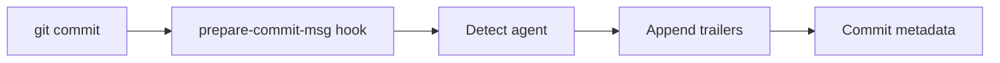
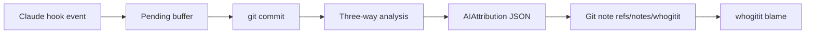
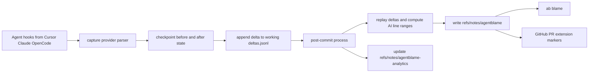
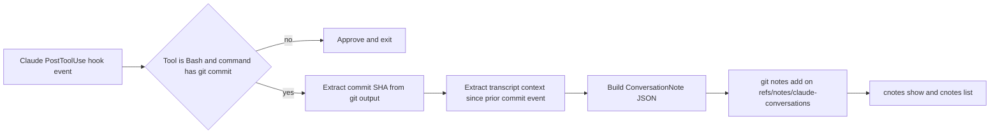
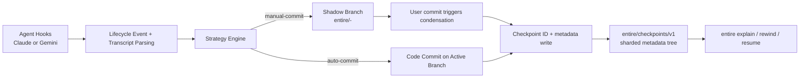

<!-- Generated by SpecStory, Markdown v2.1.0 -->

# 2026-02-20 16:33:05Z

<!-- Codex CLI Session 019c7be4-e46e-7930-a7cb-7c6dfc4882c2 (2026-02-20 16:33:05Z) -->

_**User (2026-02-20 16:33:05Z)**_

Start with docs/git-provenance/RESEARCH-TASK.md and ALSO read EVERY markdown document in docs/git-provenance/ recursively.

Then I'll tell you what the task is.

---

_**Agent (gpt-5.3-codex 2026-02-20 16:33:13Z)**_

<think><details><summary>Thought Process</summary>
**Providing initial process commentary**
</details></think>

_**Agent (gpt-5.3-codex 2026-02-20 16:33:13Z)**_

I’ll read `docs/git-provenance/RESEARCH-TASK.md` first, then enumerate and read every `*.md` under `docs/git-provenance/` recursively so I have full context before your next instruction.

_**Agent (gpt-5.3-codex 2026-02-20 16:33:14Z)**_

<think><details><summary>Thought Process</summary>
**Listing files in directory**
</details></think>

_**Agent (gpt-5.3-codex 2026-02-20 16:33:14Z)**_

<tool-use data-tool-type="unknown" data-tool-name="exec_command"><details>
<summary>Tool use: **exec_command**</summary>
```
Chunk ID: 452364
Wall time: 0.0516 seconds
Process exited with code 0
Original token count: 209
Output:
docs/git-provenance/RESEARCH-TASK.md
docs/git-provenance/STANDARD-SUMMARY.md
docs/git-provenance/SYSTEM-SUMMARY.md
docs/git-provenance/standards/agent-trace.md
docs/git-provenance/standards/c2pa-content-credentials.md
docs/git-provenance/standards/in-toto-attestation.md
docs/git-provenance/standards/opentelemetry-genai-semconv.md
docs/git-provenance/standards/slsa-provenance.md
docs/git-provenance/standards/w3c-prov.md
docs/git-provenance/systems/agentblame.md
docs/git-provenance/systems/aider.md
docs/git-provenance/systems/aittributor.md
docs/git-provenance/systems/cnotes.md
docs/git-provenance/systems/entire.md
docs/git-provenance/systems/git-ai.md
docs/git-provenance/systems/git-with-intent.md
docs/git-provenance/systems/intent-git-mode.md
docs/git-provenance/systems/tempo-cli.md
docs/git-provenance/systems/whogitit.md
```
</details></tool-use>

_**Agent (gpt-5.3-codex 2026-02-20 16:33:17Z)**_

<think><details><summary>Thought Process</summary>
**Planning file reading strategy**
</details></think>

_**Agent (gpt-5.3-codex 2026-02-20 16:33:17Z)**_

I found 19 markdown files under `docs/git-provenance/`. I’m reading `RESEARCH-TASK.md` first now, then the remaining 18 files.

_**Agent (gpt-5.3-codex 2026-02-20 16:33:17Z)**_

<tool-use data-tool-type="unknown" data-tool-name="exec_command"><details>
<summary>Tool use: **exec_command**</summary>
```
Chunk ID: 8ee4b7
Wall time: 0.0524 seconds
Process exited with code 0
Original token count: 3549
Output:
# AI Git Provenance Research Task

## Background

The goal of "AI agent code provenance" is to provide "AI Blame". AI blame means that for a specific line of code, or for all the lines of code in a specific file the origin of that line of code is known, and the following information about the origin is known:

- When the line of code was made/modified
- The line of code came from an AI coding agent or a manual change by a human
- When the line of code came from an AI coding agent, ideally all of the following information is available:
  - The human prompt that led to the AI coding agent making the change
  - The tool use that made the change
  - The agent response/commentary that led up to the tool use
  - The agent response/commentary that followed the tool use

The SpecStory CLI concurrently observes file system changes and AI terminal coding agent exhaust (activity) and correlates them together to provide AI agent code provenance. That provenance is stored in a local only SQLite DB, but to be truly useful it needs to be available to everyone, everywhere. 

One obvious answer to making the provenance available everywhere is to store it in git. In theory this could be in the same repository along with the code, or in a dedicated shadow repository.

- Ubiquitous existing system of record for code
- Ubiquitous tool and ecosystem support
- Distributed system
- Already provides "git blame" to answer the origin of any given line of code

This research task is to explore the various ways git can be used to store and present AI provenance.

## 7 Challenges to Explore

For any system to provide AI agent code provenance using git, the following challenges need a solution. Each AI provenance system may provide entirely or subtly different solutions to these challenges, leading to differences in outcomes. These differences provides trade-offs and pros and cons of each approach.

Understanding the different solutions in use today, and the trade-offs and pros and cons of each solution is the FOCUS of this research task.

### Capturing Agent Activity

The SpecStory CLI captures terminal agent change using an SPI/provider mechanism. There is a small SPI and a provider per agent. Each agent provider is open to do whatever is needed to provide standardized SessionData events each time there is agent activity (user message, agent message, tool use, etc.) in the coding agent. 

Most of the SpecStory CLI providers use fsnotify to observe a location where the coding agent is storing data for the session as JSON or JSONL. Some of them do the same for session data in SQLite DBs.

Agent coverage:

- Claude Code
- Codex CLI
- Gemini CLI
- Cursor CLI
- Factory Droid CLI

In progress:

- OpenCode
- Cursor VSC IDE
- Copilot VSC IDE
- Amp

The focus of this research is to understand what coding agents are supported and how the system knows that the coding agent did anything. When it did it. What the user and agent said.

The SpecStory CLI relies on its SPI/providers architecture and fsnotify. Other solutions may be similar and others will rely on coding agent hooks (callbacks).

### Capturing File Change & Micro-versioning

The 2nd piece of AI provenance is knowing what files changed. In an important sense, an AI provenance system backstopped by git gets this for "free" as the git system always understands files that are unchanged, staged and unstaged and the files that change in a commit and how they changed. So an AI provenance system could simply rely on git completely for understanding changes to files.

A challenge is that an agent may edit a file in response to a user prompt, edit it again later in response to a different user prompt, then edit it yet again in the agent loop in response to its own findings or thinking, and only then is this file finally committed. When committed git flattens this to just a single change from the file's prior state to the changed state. The fact that there were 3 different edits by the agent at different times, made in response to 2 different prompts and 3 different circumstances could be lost if the system is not solving this challenge in some way. 

One solution to this may be some sort of micro-versioning in between commits. Another may be to "punt" on this and leave it to the user to sort out how and why the file changed by reading the agent session. In theory an LLM could be used to read the session and associate the editing tool calls with the specific changed lines, though this solution may be slower and more expensive.

### Correlating Agent Change to File Change

Once a system has a handle on what files are changing and what agent activity is happening, some answer is needed to how the former is correlated to the latter. For example, if there are 2 concurrent agent sessions going on in the same local git repository, tackling unrelated goals, how do the file system changes get correlat
... (truncated)
```
</details></tool-use>

_**Agent (gpt-5.3-codex 2026-02-20 16:33:24Z)**_

<think><details><summary>Thought Process</summary>
**Planning sequential file reads**
</details></think>

_**Agent (gpt-5.3-codex 2026-02-20 16:33:25Z)**_

I’ve finished `RESEARCH-TASK.md`. Next I’m reading the two top-level summaries, then each standards/system document in full.

_**Agent (gpt-5.3-codex 2026-02-20 16:33:25Z)**_

<tool-use data-tool-type="unknown" data-tool-name="exec_command"><details>
<summary>Tool use: **exec_command**</summary>
```
Chunk ID: b32d78
Wall time: 0.0515 seconds
Process exited with code 0
Original token count: 2180
Output:
# AI Provenance Representation Standards Summary (6 Standards)

_Last updated: 2026-02-20 (UTC)_

This summary is intentionally scoped to **Challenge 4: Representing Agent Provenance**.  
It does **not** evaluate capture, storage, sync, or blame UX mechanics except where those constraints directly affect representation design.

## What A Representation Must Encode (SpecStory Lens)

For this research task, a strong provenance representation should support:

1. File + line range linkage
2. AI vs human actor identity
3. Prompt linkage (user input that led to a change)
4. Tool-use linkage (which tool edited what)
5. Assistant context linkage (pre/post commentary around tool use)
6. Commit/revision anchor
7. Optional integrity/signature metadata for trust

## Big Picture: Three Representation Families

1. **AI-attribution schema**: Agent Trace (closest to line-level coding provenance payloads)
2. **General provenance model**: W3C PROV (very expressive graph model, not coding-specific)
3. **Attestation/telemetry framing**: in-toto, SLSA, C2PA, OTel GenAI (strong for envelopes, trust, or live telemetry, weaker as direct line-level code attribution schemas)

## Representation Model Comparison

### Core Representation Unit

This compares the primary data structure each standard uses to carry provenance. The core unit shape determines how much modeling work is needed before coding-agent provenance can be represented clearly.

| Standard            | Core Representation Unit                              |
|---------------------|-------------------------------------------------------|
| Agent Trace         | `TraceRecord` with `files[].conversations[].ranges[]` |
| W3C PROV            | Entity-Activity-Agent graph + relations               |
| OpenTelemetry GenAI | Spans/events with `gen_ai.*` attributes               |
| in-toto Statement   | Envelope: `subject[]` + typed `predicate`             |
| SLSA Provenance     | in-toto predicate for build provenance                |
| C2PA                | Signed manifest with assertions/ingredients           |

### Native Line-Range Semantics

Line-level attribution is central to code provenance. This section shows whether line ranges are native in the standard or require an additional custom schema layer.

| Standard            | Native Line-Range Semantics            |
|---------------------|----------------------------------------|
| Agent Trace         | **Strong**                             |
| W3C PROV            | Partial (must be modeled)              |
| OpenTelemetry GenAI | Weak (not line-oriented)               |
| in-toto Statement   | Partial (possible in custom predicate) |
| SLSA Provenance     | Weak for source-line attribution       |
| C2PA                | Weak for source-line attribution       |

### Prompt/Tool/Assistant Semantics

These fields provide the explanatory context behind a change. This section compares how directly each standard can represent prompts, tool activity, and assistant responses around an edit.

| Standard            | Prompt/Tool/Assistant Semantics                                                |
|---------------------|--------------------------------------------------------------------------------|
| Agent Trace         | **Strong** for conversation linkage; tool details are implementation-dependent |
| W3C PROV            | Partial (must define domain mapping)                                           |
| OpenTelemetry GenAI | Partial to strong for request/response/tool telemetry                          |
| in-toto Statement   | Partial (possible in custom predicate)                                         |
| SLSA Provenance     | Weak for prompt/tool/dialogue semantics                                        |
| C2PA                | Weak for coding prompt/tool semantics                                          |

### AI vs Human Actor Semantics

Separating AI-originated changes from human changes is foundational for AI blame. This section compares whether that distinction is explicit or must be inferred through local conventions.

| Standard            | AI vs Human Actor Semantics                                |
|---------------------|------------------------------------------------------------|
| Agent Trace         | **Strong** (`contributor.type`)                            |
| W3C PROV            | **Strong** (agent typing)                                  |
| OpenTelemetry GenAI | Partial (provider/model fields; actor role usually custom) |
| in-toto Statement   | Partial (possible in predicate)                            |
| SLSA Provenance     | Weak for coding-session actor semantics                    |
| C2PA                | Partial for producer/claim agent identity                  |

### Revision Binding

A provenance representation needs to anchor to a stable revision identity. This section compares how
... (truncated)
```
</details></tool-use>

_**Agent (gpt-5.3-codex 2026-02-20 16:33:25Z)**_

<tool-use data-tool-type="unknown" data-tool-name="exec_command"><details>
<summary>Tool use: **exec_command**</summary>
```
Chunk ID: 35d2b9
Wall time: 0.0522 seconds
Process exited with code 0
Original token count: 6507
Output:
# AI Git Provenance Systems Summary (10 Systems)

_Last updated: 2026-02-20 (UTC)_

This document is an executive summary / tl;dr comparing 10 existing approaches to "AI blame" and AI code provenance using (or adjacent to) Git. It focuses on the **big picture differences**, the **most important trade-offs**, and **side-by-side tables** across the **7 challenge areas** from `docs/git-provenance/RESEARCH-TASK.md`.

## Big Picture: Three "Provenance Granularities"

Most systems fall into one of these "where does provenance attach?" buckets:

1. **Commit-level markers (lowest fidelity, lowest friction)**
   - Provenance is "this commit was AI-assisted" via trailers/author markers.
   - Examples: **Aider**, **AIttributor**.

2. **Commit-attached context (commit-level, human-readable, not blame-grade)**
   - Provenance is "what we talked about / tools used around the commit", attached as a note or local JSON.
   - Examples: **cnotes** (git notes), **Tempo CLI** (local JSON), **Git With Intent** (run bundles in `.gwi/`).

3. **Line-aware provenance (blame-grade)**
   - Provenance is a **line-range mapping** (often tied back to prompts / sessions) stored in Git Notes (or equivalent) and queried by an overlay blame tool.
   - Examples: **Git AI**, **Agent Blame**, **whogitit**, **Intent Git Mode (us)**.

Entire is a distinct, "workflow provenance" approach: it optimizes for **checkpoint / rewind / resume / explain** with a dedicated metadata branch, rather than line-level blame.

## Quick Comparison (What You Actually Get)

| System               | "AI Blame" Fidelity                             | Git-Native Provenance Storage                 | Micro-versioning Before Commit         | Multi-Agent Coverage                                   | Primary UX                          |
|----------------------|-------------------------------------------------|-----------------------------------------------|----------------------------------------|--------------------------------------------------------|-------------------------------------|
| Intent Git Mode (us) | High (line-aware via CRDT marks + notes export) | Git Notes (`refs/notes/intent/*`)             | Yes (every FS change)                  | SpecStory providers (Claude/Cursor/Codex/Gemini/Droid) | `intent blame`, `intent trace`      |
| Agent Blame          | High (line ranges + prompt linkage)             | Git Notes (`refs/notes/agentblame`)           | Yes (deltas + checkpoints)             | Cursor, Claude Code, OpenCode                          | `ab blame`, GitHub PR extension     |
| Git AI               | High (line ranges + prompt linkage)             | Git Notes (`refs/notes/ai`)                   | Yes (checkpoint stream)                | Broad (Claude, Codex, Cursor, Gemini, Copilot, ...)    | `git-ai blame` (+ open format)      |
| whogitit             | High (per-line classification)                  | Git Notes (`refs/notes/whogitit`)             | Yes (pre/post snapshots)               | Claude Code only                                       | `whogitit blame`                    |
| Entire               | Medium (checkpoint/session explainability)      | Dedicated branch (`entire/checkpoints/v1`)    | Yes (shadow checkpoints)               | Claude Code (deep), Gemini (partial)                   | `entire explain/rewind/resume`      |
| cnotes               | Low-Medium (commit-level conversation excerpt)  | Git Notes (`refs/notes/claude-conversations`) | No                                     | Claude Code only                                       | `cnotes show/list`                  |
| Tempo CLI            | Low (commit + file-level attribution)           | No (local `.tempo/` by default)               | No                                     | Multiple (detects sessions)                            | JSON records / dashboards           |
| Aider                | Low (commit-level "AI helped")                  | Commit metadata (trailers/author)             | Commit-level only (auto-commit cycles) | Aider runtime only                                     | Standard `git log/blame` inspection |
| AIttributor          | Low (commit-level "AI tool present")            | Commit metadata (trailers)                    | No                                     | Multiple (detection only)                              | Standard `git log/blame` inspection |
| Git With Intent      | Medium (run/audit provenance)                   | No (artifacts in `.gwi/`)                     | No                                     | Internal GWI agents                                    | Run lifecycle + approvals           |

## The 7 Challenge Areas: Comparisons

Legend:
- "Hooks" = explicit agent hook callbacks (PreToolUse/PostToolUse equivalents)
- "Detect" = process/env/session-artifact detection without full transcript/tool capture

### Challenge 1: Capturing Ag
... (truncated)
```
</details></tool-use>

_**Agent (gpt-5.3-codex 2026-02-20 16:33:39Z)**_

<think><details><summary>Thought Process</summary>
**Planning markdown reading strategy**
</details></think>

_**Agent (gpt-5.3-codex 2026-02-20 16:33:39Z)**_

<tool-use data-tool-type="unknown" data-tool-name="exec_command"><details>
<summary>Tool use: **exec_command**</summary>
```
Chunk ID: 4a335b
Wall time: 0.0509 seconds
Process exited with code 0
Original token count: 220
Output:
     121 docs/git-provenance/standards/w3c-prov.md
     126 docs/git-provenance/standards/agent-trace.md
     129 docs/git-provenance/standards/in-toto-attestation.md
     133 docs/git-provenance/standards/opentelemetry-genai-semconv.md
     141 docs/git-provenance/standards/c2pa-content-credentials.md
     151 docs/git-provenance/standards/slsa-provenance.md
     174 docs/git-provenance/systems/aittributor.md
     188 docs/git-provenance/systems/tempo-cli.md
     191 docs/git-provenance/systems/aider.md
     211 docs/git-provenance/systems/whogitit.md
     287 docs/git-provenance/systems/git-with-intent.md
     308 docs/git-provenance/systems/intent-git-mode.md
     372 docs/git-provenance/systems/cnotes.md
     420 docs/git-provenance/systems/git-ai.md
     442 docs/git-provenance/systems/agentblame.md
     480 docs/git-provenance/systems/entire.md
    3874 total
```
</details></tool-use>

_**Agent (gpt-5.3-codex 2026-02-20 16:33:43Z)**_

<think><details><summary>Thought Process</summary>
**Planning batched file reads**
</details></think>

_**Agent (gpt-5.3-codex 2026-02-20 16:33:43Z)**_

I checked sizes; total remaining content is about 3,874 lines, so I can read all of it directly. I’m reading all standards docs next, then all system docs.

_**Agent (gpt-5.3-codex 2026-02-20 16:33:44Z)**_

<tool-use data-tool-type="unknown" data-tool-name="exec_command"><details>
<summary>Tool use: **exec_command**</summary>
```
Chunk ID: 985afa
Wall time: 0.0521 seconds
Process exited with code 0
Original token count: 7262
Output:
===== docs/git-provenance/standards/agent-trace.md =====
# Agent Trace Standard Research

_Last updated: 2026-02-18 (UTC)_

## Executive Summary

**Metaphor:** Agent Trace is a shipping container spec, not the shipping network.
It standardizes the payload shape for attribution records and a blame lookup recipe, but it does not define capture, storage, or sync behavior.

## Standard At A Glance

| Dimension | What Agent Trace Defines |
|---|---|
| Scope | AI attribution schema + blame lookup guidance |
| Primary artifact | Trace records containing files, ranges, conversations, contributor |
| Intended producers | Agent hooks, editors, capture tools |
| Intended consumers | Blame tooling, provenance viewers |
| Status | Proposal with reference implementation |
| Reference implementation | Hook script + JSONL store |

## Purpose & Scope

Agent Trace defines a vendor-neutral schema for AI attribution so different tools can emit and consume compatible provenance data. It does not mandate how to capture or store that data, nor does it implement a complete AI provenance system.

## Core Representation

| Concept | Description | Why It Matters |
|---|---|---|
| `TraceRecord` | Top-level record with `version`, `id`, `timestamp` | Unique, time-ordered provenance unit |
| `vcs` | VCS info with `type` and optional `revision` | Links attribution to a Git revision and blame |
| `tool` | Emitting tool identity | Indicates which agent produced the data |
| `files[]` | File paths with `conversations[]` | Maps attribution to specific files |
| `ranges[]` | Line ranges and `content_hash` | Enables line-level provenance lookup |
| `contributor` | AI vs human + optional model info | Distinguishes human vs agent work |

## Sample Representation

Synthetic example aligned to the published schema fields.

```json
{
  "version": "0.1.0",
  "id": "550e8400-e29b-41d4-a716-446655440000",
  "timestamp": "2026-01-23T14:30:00Z",
  "vcs": { "type": "git", "revision": "a1b2c3d4" },
  "tool": { "name": "cursor", "version": "2.4.0" },
  "files": [
    {
      "path": "src/utils/parser.ts",
      "conversations": [
        {
          "url": "https://api.cursor.com/v1/conversations/12345",
          "contributor": { "type": "ai", "model_id": "anthropic/claude-opus-4-5-20251101" },
          "ranges": [
            { "start_line": 42, "end_line": 67, "content_hash": "murmur3:9f2e8a1b" }
          ]
        }
      ]
    }
  ]
}
```

| Field | Role In Provenance / Blame |
|---|---|
| `vcs.revision` | Links to the commit used by `git blame` |
| `files.path` + `ranges` | Provides line-level attribution targets |
| `contributor` | Signals AI vs human and model identity |
| `conversations.url` | Enables drill-down to transcript data |

## Capture / Emission Model

Capture is implementation-defined. The reference hook maps agent hook events into trace records and appends them to a local JSONL file.

## Verification / Trust Model

Agent Trace does not define signing or attestation. Trust is delegated to the storage and distribution mechanism chosen by implementers.

## Git / SCM Relevance

The schema includes `vcs.revision`, and the spec describes a blame workflow: run VCS blame, locate the corresponding trace record by file and range, and display contributor information.

## Tooling & Ecosystem

| Tool / Project | Role | Notes |
|---|---|---|
| `cursor/agent-trace` | Reference implementation | Hook script + JSONL store |
| `agent-trace.dev` | Spec docs | Schema and workflow overview |
| Third-party hooks | Producers | Any tool that emits the schema |

## Activity, Support, And Community (as of 2026-02-18 UTC)

| Metric | Value |
|---|---:|
| Stars | 578 |
| Forks | 46 |
| Watchers | 15 |
| Open issues | 8 |
| Last push | 2026-02-06T14:23:28Z |

| Metric | Value |
|---|---:|
| Open PRs | 1 |
| Closed PRs | 7 |
| Top contributors (API snapshot) | `leerob`, `cursoragent` |

## Delivery Cadence

| Repo | Version | Published (UTC) | Channel |
|---|---|---|---|
| `cursor/agent-trace` | `-` | `-` | No tagged releases |

## Observed vs Inferred

| Type | Notes |
|---|---|
| Observed in code/docs | Schema definitions in `schemas.ts` and examples in `README.md` |
| Observed in code/docs | Reference hook in `reference/trace-hook.ts` writing JSONL traces |
| Inferred | Most value comes from interoperability, not from storage or sync |

## Sources

- https://agent-trace.dev/
- https://github.com/cursor/agent-trace
- https://github.com/cursor/agent-trace/blob/main/README.md
- https://github.com/cursor/agent-trace/blob/main/schemas.ts

===== docs/git-provenance/standards/c2pa-content-credentials.md =====
# C2PA Content Credentials Standard Research

_Last updated: 2026-02-18 (UTC)_

## Executive Summary

**Metaphor:** C2PA is a sealed evidence bag attached to media.
It packages a chain of assertions about how an asset was created or edited, then seals it with c
... (truncated)
```
</details></tool-use>

_**Agent (gpt-5.3-codex 2026-02-20 16:33:49Z)**_

<think><details><summary>Thought Process</summary>
**Confirming all standards present; planning per-file doc reads**
</details></think>

_**Agent (gpt-5.3-codex 2026-02-20 16:33:49Z)**_

Standards docs are read. I’m moving through the 10 system documents now in batches to make sure I read each one completely.

_**Agent (gpt-5.3-codex 2026-02-20 16:33:53Z)**_

<think><details><summary>Thought Process</summary>
**Planning sequential file reads**
</details></think>

_**Agent (gpt-5.3-codex 2026-02-20 16:33:53Z)**_

<tool-use data-tool-type="unknown" data-tool-name="exec_command"><details>
<summary>Tool use: **exec_command**</summary>
```
Chunk ID: a31217
Wall time: 0.0519 seconds
Process exited with code 0
Original token count: 4619
Output:
===== docs/git-provenance/systems/aittributor.md =====
# AIttributor System Research

_Last updated: 2026-02-18 (UTC)_

## Executive Summary

**Metaphor:** AIttributor is a **license plate camera at commit time**.
It detects which AI agent is nearby and stamps commit trailers accordingly.

AIttributor is a lightweight git hook that detects active AI tools and appends attribution trailers to the commit message. It does not capture prompts, tool calls, or line-level provenance, but it is a low-friction commit-level marker that survives standard git workflows.

## System At A Glance

| Dimension                | What AIttributor Actually Does                    |
|--------------------------|---------------------------------------------------|
| Core model               | Prepare-commit-msg hook + agent detection         |
| Primary provenance store | Commit trailers (`Co-authored-by`, `Ai-assisted`) |
| Micro-versioning         | None                                              |
| Line-level attribution   | None                                              |
| Git storage strategy     | Commit metadata                                   |
| AI blame UX              | Manual (blame + trailer inspection)               |
| Integrations             | Multiple agent process/env/breadcrumb detectors   |

## Architecture



---

## Challenge 1: Capturing Agent Activity

### Supported Agents And Providers

| Agent or Provider | Support Status                | Confidence  | Evidence       |
|-------------------|-------------------------------|-------------|----------------|
| Claude Code       | Supported                     | High (code) | `src/agent.rs` |
| Goose             | Supported                     | High (code) | `src/agent.rs` |
| Cursor            | Supported                     | High (code) | `src/agent.rs` |
| Aider             | Supported                     | High (code) | `src/agent.rs` |
| Windsurf          | Supported                     | High (code) | `src/agent.rs` |
| Codex             | Supported                     | High (code) | `src/agent.rs` |
| Copilot Agent     | Supported                     | High (code) | `src/agent.rs` |
| Amazon Q          | Supported                     | High (code) | `src/agent.rs` |
| Amp               | Supported                     | High (code) | `src/agent.rs` |
| Cline             | Supported (env var detection) | High (code) | `src/agent.rs` |
| Gemini CLI        | Supported                     | High (code) | `src/agent.rs` |

### How It Works

1. The hook runs during `prepare-commit-msg`.
2. It detects agents using four signals: agent-specific environment variables, process ancestry, sibling process tree matching the repo cwd, and agent breadcrumb files under known paths.
3. If an agent is detected, it appends commit trailers.

Boundary:
- This is commit-time detection only. It does not capture prompts or tool usage.

---

## Challenge 2: Capturing File Change And Micro-versioning

AIttributor does not capture file change history or micro-versioning. It only emits commit-level attribution markers.

---

## Challenge 3: Correlating Agent Change To File Change

### How It Works

- It correlates by repo working directory and active agent presence at commit time.
- No parsing of file edits or tool calls is performed.

Trade-off:
- Very low friction, but correlation is coarse and can be wrong if multiple agents are active.

---

## Challenge 4: Representing Agent Provenance

### Representation Used

AIttributor uses git trailers:
- `Co-authored-by: <agent email>`
- `Ai-assisted: true`

### Sample Representation (from docs)

```text
feat: refactor connection pooling

Co-authored-by: Claude Code <noreply@anthropic.com>
Ai-assisted: true
```

Field usage for blame:
- Commit-level trailers are the only provenance signal.

---

## Challenge 5: Storing Agent Provenance In Git

AIttributor writes directly into the commit message, so provenance survives merges, rebases, and cherry-picks as normal commit metadata.

---

## Challenge 6: AI Blame

No dedicated AI blame command. Teams can parse trailers after `git blame` identifies the commit.

---

## Challenge 7: Developer Experience (DX)

### Current DX Shape

- Extremely low friction: install hook, then commit normally.
- No extra files or databases.
- Limited depth: only commit-level signals.

---

## Activity, Support, And Community (as of 2026-02-18 UTC)

### GitHub Signals

- Stars: `2`
- Forks: `2`
- Open issues: `1`
- Last push: `2026-02-18T02:30:53Z`

### Collaboration Signals

| Metric                          |                                        Value |
|---------------------------------|---------------------------------------------:|
| Open PRs     
... (truncated)
```
</details></tool-use>

_**Agent (gpt-5.3-codex 2026-02-20 16:33:56Z)**_

<think><details><summary>Thought Process</summary>
**Planning next batch exploration**
</details></think>

_**Agent (gpt-5.3-codex 2026-02-20 16:33:56Z)**_

First batch of system docs is done (`aittributor`, `tempo-cli`, `aider`). I’m now reading `whogitit`, `git-with-intent`, and `intent-git-mode`.

_**Agent (gpt-5.3-codex 2026-02-20 16:33:57Z)**_

<tool-use data-tool-type="unknown" data-tool-name="exec_command"><details>
<summary>Tool use: **exec_command**</summary>
```
Chunk ID: aad200
Wall time: 0.0512 seconds
Process exited with code 0
Original token count: 8438
Output:
===== docs/git-provenance/systems/whogitit.md =====
# whogitit System Research

_Last updated: 2026-02-18 (UTC)_

## Executive Summary

**Metaphor:** whogitit is a **flight recorder with a commit-time black box**.
It captures pre/post edit snapshots and prompts during the session, then emits a structured line-level attribution record into git notes at commit time.

whogitit is one of the most complete wild-card solutions for line-level AI blame: it captures edits via Claude Code hooks, runs three-way analysis to classify each line, stores the result in git notes, and provides a dedicated `whogitit blame` command.

## System At A Glance

| Dimension                | What whogitit Actually Does                               |
|--------------------------|-----------------------------------------------------------|
| Core model               | Claude Code hooks + pending buffer + commit-time analysis |
| Primary provenance store | Git notes `refs/notes/whogitit`                           |
| Micro-versioning         | Yes (pre/post snapshots across multiple edits)            |
| Line-level attribution   | Yes (line classification in `AIAttribution`)              |
| Git storage strategy     | Git notes + hooks for push/rewrite/fetch                  |
| AI blame UX              | `whogitit blame` overlays git blame                       |
| Integrations             | Claude Code only today                                    |

## Architecture



---

## Challenge 1: Capturing Agent Activity

### Supported Agents And Providers

| Agent or Provider                                                          | Support Status      | Confidence         | Evidence                                             |
|----------------------------------------------------------------------------|---------------------|--------------------|------------------------------------------------------|
| Claude Code hooks (`PreToolUse`, `PostToolUse` w/ `Edit`, `Write`, `Bash`) | Supported           | High (code + docs) | `src/cli/setup.rs`, `docs/src/reference/hooks.md`    |
| Other agents                                                               | Not supported today | High (code)        | `src/cli/setup.rs` only writes `.claude` integration |

### How It Works

1. `whogitit setup` writes hook config into `~/.claude/settings.json`.
2. Claude Code sends PreToolUse and PostToolUse hook events to the capture script.
3. The capture script passes structured hook input to the CLI.
4. The CLI stores snapshots and prompt context in a pending buffer.

Boundary:
- Capture is Claude-specific; no alternate agent providers are wired today.

---

## Challenge 2: Capturing File Change And Micro-versioning

### How It Works

1. PreToolUse hook captures the “before” content for target files.
2. PostToolUse hook captures the “after” content and extracts prompt context.
3. Each edit appends a snapshot entry in `.whogitit-pending.json`.

This creates a micro-versioned edit history across an AI session.

---

## Challenge 3: Correlating Agent Change To File Change

### How It Works

1. Pending buffer stores file snapshots keyed by file path.
2. Each edit is linked to a prompt index and tool name.
3. Commit-time three-way analysis maps final file lines back to AI snapshots and prompts.

The correlation uses concrete content snapshots rather than heuristics over shell commands.

---

## Challenge 4: Representing Agent Provenance

### Representation Used

The core representation is `AIAttribution` JSON stored as a git note:
- `session` metadata
- `prompts` array with `affected_files`
- `files[].lines[]` per-line classification and prompt linkage

### Sample Representation (from docs)

```json
{
  "schema_version": 2,
  "session": {
    "session_id": "7f3a4b2c-9d1e-8a7b-c3d4-e5f6a7b8c9d0",
    "model": { "id": "claude-opus-4-5-20251101", "provider": "anthropic" },
    "started_at": "2026-01-30T14:23:17Z"
  },
  "prompts": [
    {
      "index": 0,
      "text": "Add user authentication with bcrypt...",
      "affected_files": ["src/auth.rs"]
    }
  ],
  "files": [
    {
      "path": "src/auth.rs",
      "lines": [
        { "line_number": 1, "source": "AI", "prompt_index": 0 },
        { "line_number": 2, "source": "AIModified", "prompt_index": 0 },
        { "line_number": 3, "source": "Human", "prompt_index": null }
      ]
    }
  ]
}
```

Field usage for blame:
- `files.path` and `lines.line_number` are looked up by file and line from git blame commit.
- `source` differentiates AI, AI-modified, human, and original lines.
- `prompt_index` links to `prompts[]` for provenance context.

---

## Challenge 5: Storing Agent Provenan
... (truncated)
```
</details></tool-use>

_**Agent (gpt-5.3-codex 2026-02-20 16:33:59Z)**_

<think><details><summary>Thought Process</summary>
**Preparing final subsystem review**
</details></think>

_**Agent (gpt-5.3-codex 2026-02-20 16:34:00Z)**_

Second batch is complete. I’m reading the final four system docs now: `agentblame`, `cnotes`, `entire`, and `git-ai`.

_**Agent (gpt-5.3-codex 2026-02-20 16:34:01Z)**_

<tool-use data-tool-type="unknown" data-tool-name="exec_command"><details>
<summary>Tool use: **exec_command**</summary>
```
Chunk ID: 8a9483
Wall time: 0.0520 seconds
Process exited with code 0
Original token count: 20655
Output:
===== docs/git-provenance/systems/agentblame.md =====
# Agent Blame System Research

_Last updated: 2026-02-18 (UTC)_

## Executive Summary

**Metaphor:** Agent Blame behaves like an **air-traffic recorder for AI edits**:
- Hook events capture before/after file state around AI tool actions.
- A delta ledger tracks AI and human edits between commits.
- Commit processing replays those deltas and writes line-range attribution into git notes.

It is one of the stronger open implementations for practical line-level AI blame across local CLI and GitHub PR UX, with explicit squash/rebase transfer workflows.

## System At A Glance

| Dimension                 | What Agent Blame Does                                                            |
|---------------------------|----------------------------------------------------------------------------------|
| Core model                | Provider hooks + checkpoint capture + delta replay + git-note attribution        |
| Primary provenance store  | `refs/notes/agentblame`                                                          |
| Secondary analytics store | `refs/notes/agentblame-analytics` on root/anchor commit                          |
| In-flight store           | `.git/agentblame/working/<base-sha>/deltas.jsonl` + checkpoint files + git blobs |
| Session metadata store    | Global SQLite `~/.agentblame/agentblame.db`                                      |
| Micro-versioning          | Yes (pre/post edit checkpoints + append-only deltas)                             |
| Line-level attribution    | Yes (`ab blame <file>`)                                                          |
| Rewrite handling          | GitHub Action `post-merge` transfer + `ab sync` local transfer for squash/rebase |
| Agent integrations        | Cursor, Claude Code, OpenCode                                                    |

## Architecture (End-to-End)



---

## Challenge 1: Capturing Agent Activity

### Supported Agents (Current)

| Agent / Provider | Support Status          | Capture Depth                                      | Confidence         | Evidence                                         |
|------------------|-------------------------|----------------------------------------------------|--------------------|--------------------------------------------------|
| Cursor           | Supported               | Prompt boundary + file edit hook capture           | High (docs + code) | README, `lib/hooks.ts`, `capture.ts`             |
| Claude Code      | Supported               | PreToolUse + PostToolUse with transcript parsing   | High (docs + code) | README, `lib/hooks.ts`, `capture.ts`             |
| OpenCode         | Supported               | Plugin hooks for chat prompt and tool before/after | High (docs + code) | README, `lib/hooks.ts`, OpenCode plugin template |
| Other agents     | Not currently supported | N/A                                                | High               | README roadmap lists others as future            |

### Implementation

`ab init` writes repo-local integrations:
- `.cursor/hooks.json`: `beforeSubmitPrompt`, `afterFileEdit`
- `.claude/settings.json`: `PreToolUse` (Edit/Write/MultiEdit), `PostToolUse` (all tools)
- `.opencode/plugin/agentblame.ts`: `chat.message`, `tool.execute.before`, `tool.execute.after`

Captured payloads are normalized by `capture --provider <cursor|claude|opencode>`.

### How It Actually Runs Per Provider

1. Hook payload arrives on stdin.
2. Provider parser resolves repo root, base SHA (`HEAD`), session ID, model, and prompt.
3. Session is upserted into global SQLite with repo namespace.
4. Tool and prompt events are recorded (`tool_calls`, `prompts`).
5. File edit boundaries trigger checkpoint/delta logic.

### Evidence

| Evidence                           | What It Shows                                                  |
|------------------------------------|----------------------------------------------------------------|
| `packages/cli/src/lib/hooks.ts`    | Exact hook installation payloads for Cursor/Claude/OpenCode    |
| `packages/cli/src/capture.ts`      | Provider-specific parsing and session/prompt/tool capture flow |
| `packages/cli/src/lib/database.ts` | Session/prompt/tool schema and persistence                     |

### Strengths / Trade-offs

| Strength                                             | Trade-off                                                    |
|--------------------
... (truncated)
```
</details></tool-use>

_**Agent (gpt-5.3-codex 2026-02-20 16:34:05Z)**_

<think><details><summary>Thought Process</summary>
**Adjusting output chunk sizes**
</details></think>

_**Agent (gpt-5.3-codex 2026-02-20 16:34:06Z)**_

The combined output truncated part of `cnotes.md`/`entire.md`, so I’m re-reading those two files individually to ensure full coverage.

_**Agent (gpt-5.3-codex 2026-02-20 16:34:06Z)**_

<tool-use data-tool-type="unknown" data-tool-name="exec_command"><details>
<summary>Tool use: **exec_command**</summary>
```
Chunk ID: f9d837
Wall time: 0.0522 seconds
Process exited with code 0
Original token count: 4275
Output:
# cnotes System Research

_Last updated: 2026-02-18 (UTC)_

## Executive Summary

**Metaphor:** cnotes is a **commit scrapbook stapled to Git history**:
- It waits for Claude to run `git commit` via Bash.
- It clips recent conversation events from Claude transcripts.
- It attaches that clip as a JSON git note on the commit.

cnotes is intentionally narrow and simple. It is strong for commit-level conversational context, but it does not attempt fine-grained line attribution or robust multi-agent correlation.

## System At A Glance

| Dimension                | What cnotes Does                                                              |
|--------------------------|-------------------------------------------------------------------------------|
| Core model               | Claude PostToolUse hook handler + commit detection + transcript excerpting    |
| Primary provenance store | Git Notes (`refs/notes/claude-conversations` by default)                      |
| In-flight store          | None beyond Claude transcript JSONL + in-memory extraction                    |
| Micro-versioning         | No (commit-triggered capture only)                                            |
| Line-level attribution   | No direct AI blame overlay                                                    |
| Rewrite handling         | Relies on git-notes behavior + manual backup/restore tools                    |
| Agent integrations       | Claude Code only                                                              |
| Privacy controls         | Redaction patterns, excerpt limits, optional disable via `.claude/notes.json` |

## Architecture (End-to-End)



---

## Challenge 1: Capturing Agent Activity

### Supported Agents (Current)

| Agent / Provider                            | Support Status | Confidence         | Evidence                                                              |
|---------------------------------------------|----------------|--------------------|-----------------------------------------------------------------------|
| Claude Code                                 | Supported      | High (docs + code) | README, `internal/config/settings.go`, `internal/commands/root.go`    |
| Cursor / Codex / Gemini / OpenCode / others | Not supported  | High (code scope)  | Hook handler only parses Claude-style payload + PostToolUse Bash gate |

### Implementation

cnotes installs itself as a Claude hook command for `PostToolUse`. At runtime it only processes events where:
- `hook_event_name == PostToolUse`
- `tool_name == Bash`
- Bash command string contains `git commit`

Everything else is explicitly approved and ignored.

### How It Actually Runs

1. Claude hook sends JSON payload to `cnotes` via stdin.
2. cnotes parses hook input (`session_id`, `transcript_path`, tool data).
3. It checks for Bash `git commit` usage.
4. It extracts commit SHA from Bash stdout (commit result line).
5. It loads transcript events and extracts context since prior commit's last processed event timestamp.
6. It writes one ConversationNote git note on that commit SHA.

### Evidence

| Evidence                      | What It Shows                                                                        |
|-------------------------------|--------------------------------------------------------------------------------------|
| `internal/commands/root.go`   | Hook gating logic (`PostToolUse` + `Bash` + commit detection) and note creation flow |
| `internal/config/settings.go` | Install path writes hook under Claude `PostToolUse` only                             |
| README                        | Product positioning as "Git Notes for Claude Conversations"                          |

### Strengths / Trade-offs

| Strength                                          | Trade-off                                |
|---------------------------------------------------|------------------------------------------|
| Very deterministic capture trigger (commit event) | No capture for non-commit agent activity |
| Low integration complexity                        | Single-agent scope (Claude only)         |

---

## Challenge 2: Capturing File Change & Micro-versioning

### Implementation

cnotes does **not** maintain per-edit checkpoints or delta logs. Its capture boundary is commit execution. File changes are inferred only indirectly from transcript/tool excerpts and commit context text.

### How It Actually Behaves

1. Agent performs arbitrary edits during a session.
2. None
... (truncated)
```
</details></tool-use>

_**Agent (gpt-5.3-codex 2026-02-20 16:34:06Z)**_

<tool-use data-tool-type="unknown" data-tool-name="exec_command"><details>
<summary>Tool use: **exec_command**</summary>
```
Chunk ID: 9d6da9
Wall time: 0.0522 seconds
Process exited with code 0
Original token count: 5713
Output:
# Entire System Research

_Last updated: 2026-02-18 (UTC)_

## Executive Summary

**Metaphor:** Entire behaves like **double-entry bookkeeping for AI coding**:
- one ledger = your code branch
- second ledger = `entire/checkpoints/v1` metadata branch
- temporary shadow ledger = in-progress session checkpoints before condensation

Entire is strongest at **session/checkpoint-level provenance workflows** (rewind/resume/explain), with weaker support for strict line-level AI blame.

## System At A Glance

| Dimension                | What Entire Does                                                                |
|--------------------------|---------------------------------------------------------------------------------|
| Core model               | Agent hooks + strategy engine (`manual-commit` default, `auto-commit` optional) |
| Primary provenance store | Dedicated Git branch: `entire/checkpoints/v1`                                   |
| In-flight store          | Shadow branches: `entire/<base[:7]>-<worktreeHash[:6]>`                         |
| Session state            | `.git/entire-sessions/<session-id>.json` (git common dir)                       |
| Micro-versioning         | Yes (temporary/final checkpoints; task incremental checkpoints)                 |
| Line-level AI blame      | No direct `blame` overlay equivalent                                            |
| Main explainability UX   | `entire explain`, `entire rewind`, `entire resume`                              |
| Agent integrations       | Claude Code (deep integration), Gemini CLI (preview/integration path)           |

## Architecture (End-to-End)



---

## Challenge 1: Capturing Agent Activity

### Implementation

Entire uses explicit agent hook integrations and normalizes hooks into lifecycle events:
- Claude Code: `SessionStart`, `UserPromptSubmit`, `Stop`, `PreToolUse[Task]`, `PostToolUse[Task]`, `PostToolUse[TodoWrite]`
- Gemini CLI: session/turn hooks plus additional before/after model/tool hooks

Session identity and phase are persisted in `.git/entire-sessions/*.json` so event handling is stateful across hook invocations.

### How It Actually Behaves During A Turn

1. On `SessionStart`, Entire creates/loads session state and binds a stable session ID.
2. On `UserPromptSubmit`, Entire captures pre-prompt repo state (for later diffing) and checks for conflicting active sessions.
3. While the agent runs, task hooks can capture subagent boundaries (`tool_use_id`) and incremental progress.
4. On `Stop` (or Gemini equivalent turn-end event), Entire parses transcript deltas, computes touched files, and calls strategy save logic.
5. Session phase transitions are persisted so crash/restart workflows can continue safely.

### Evidence

| Evidence                                        | What It Shows                                  |
|-------------------------------------------------|------------------------------------------------|
| `docs/architecture/claude-hooks-integration.md` | Detailed Claude hook timing/payload/use cases  |
| `cmd/entire/cli/agent/claudecode/hooks.go`      | Hook installation into Claude settings         |
| `cmd/entire/cli/agent/geminicli/hooks.go`       | Gemini hook installation/mapping               |
| `cmd/entire/cli/agent/*/lifecycle.go`           | Hook→normalized lifecycle event parsing        |
| `cmd/entire/cli/session/state.go`               | Persistent session state schema/phase tracking |

### Strengths / Trade-offs

| Strength                                                          | Trade-off                                            |
|-------------------------------------------------------------------|------------------------------------------------------|
| Rich, explicit event model (especially for Claude subagent flows) | Agent coverage is narrower than Git AI today         |
| State-machine backed lifecycle reduces ambiguity                  | Integration depth differs by agent (Claude > Gemini) |

---

## Challenge 2: Capturing File Change & Micro-versioning

### Implementation

Entire supports two micro-versioning strategies:

1. **Manual-commit (default)**
- frequent temporary checkpoints on shadow branches
- user commits code normally
- post-commit condenses checkpoint metadata to `entire/checkpoints/v1`

2. **Auto-commit**
- each step can produce a code commit on active branch
- each commit gets `Entire-Checkpoint: <id>` trailer
- metadat
... (truncated)
```
</details></tool-use>

_**Agent (gpt-5.3-codex 2026-02-20 16:34:11Z)**_

<think><details><summary>Thought Process</summary>
**Verifying recursive markdown files**
</details></think>

_**Agent (gpt-5.3-codex 2026-02-20 16:34:11Z)**_

I’ve now read all previously listed files, including full `cnotes.md` and `entire.md`. I’ll do one final recursive check for any markdown files I might have missed.

_**Agent (gpt-5.3-codex 2026-02-20 16:34:12Z)**_

<tool-use data-tool-type="unknown" data-tool-name="exec_command"><details>
<summary>Tool use: **exec_command**</summary>
```
Chunk ID: 3f6152
Wall time: 0.0520 seconds
Process exited with code 0
Original token count: 209
Output:
docs/git-provenance/RESEARCH-TASK.md
docs/git-provenance/STANDARD-SUMMARY.md
docs/git-provenance/SYSTEM-SUMMARY.md
docs/git-provenance/standards/agent-trace.md
docs/git-provenance/standards/c2pa-content-credentials.md
docs/git-provenance/standards/in-toto-attestation.md
docs/git-provenance/standards/opentelemetry-genai-semconv.md
docs/git-provenance/standards/slsa-provenance.md
docs/git-provenance/standards/w3c-prov.md
docs/git-provenance/systems/agentblame.md
docs/git-provenance/systems/aider.md
docs/git-provenance/systems/aittributor.md
docs/git-provenance/systems/cnotes.md
docs/git-provenance/systems/entire.md
docs/git-provenance/systems/git-ai.md
docs/git-provenance/systems/git-with-intent.md
docs/git-provenance/systems/intent-git-mode.md
docs/git-provenance/systems/tempo-cli.md
docs/git-provenance/systems/whogitit.md
```
</details></tool-use>

_**Agent (gpt-5.3-codex 2026-02-20 16:34:18Z)**_

<think><details><summary>Thought Process</summary>
**Confirming task readiness**
</details></think>

_**Agent (gpt-5.3-codex 2026-02-20 16:34:18Z)**_

Completed. I read `docs/git-provenance/RESEARCH-TASK.md` first, then all markdown files under `docs/git-provenance/` recursively (19 total), including all `standards/*.md`, `systems/*.md`, `SYSTEM-SUMMARY.md`, and `STANDARD-SUMMARY.md`.

Ready for your task.

---

_**User (2026-02-20 16:36:04Z)**_

Do this last part:

Finally, prepare a single recommendations document for how to best approach the 7 challenge areas, and how to represent the provenance. Include the justification for the recommendation. The pros and cons of the representation. Examples of the representation. And end-to-end flows on how the whole recommended system should work. Write this as `./docs/git-provenance/RECOMMENDATIONS.md`

---

_**Agent (gpt-5.3-codex 2026-02-20 16:36:22Z)**_

<think><details><summary>Thought Process</summary>
**Planning detailed recommendations doc**
</details></think>

_**Agent (gpt-5.3-codex 2026-02-20 16:36:22Z)**_

I have enough context from all the research docs, so I’m drafting `docs/git-provenance/RECOMMENDATIONS.md` now with a concrete recommended architecture, challenge-by-challenge decisions, representation schema examples, trade-offs, and end-to-end flows.

_**Agent (gpt-5.3-codex 2026-02-20 16:37:03Z)**_

<tool-use data-tool-type="write" data-tool-name="apply_patch"><details>
<summary>Tool use: **apply_patch**</summary>
**Add: `docs/git-provenance/RECOMMENDATIONS.md`**

```diff
+# AI Git Provenance Recommendations
+
+_Last updated: 2026-02-20 (UTC)_
+
+## Executive Recommendation
+
+Build a **line-aware, Git-native provenance system** with a **dual-layer data model**:
+
+1. **Attribution Map (fast blame path):** compact file/line-range to `exchange_id` mappings attached to commits in Git Notes.
+2. **Exchange Records (explainability path):** normalized prompt/tool/assistant context keyed by `exchange_id`, also in Git Notes.
+
+Back this with **always-on micro-versioning** (journal + checkpoints) and a **deterministic correlation engine**. Keep trust/signing optional but supported via attestations.
+
+This combines the strongest mechanics observed in Git AI, Agent Blame, whogitit, and Intent Git Mode, while staying compatible with an Agent Trace style representation.
+
+## Design Goals
+
+1. Answer: "Who changed this line, AI or human, and why?"
+2. Preserve causality before commit flattening.
+3. Survive branch, merge, rebase, squash, and cherry-pick workflows.
+4. Keep developer workflows close to standard Git habits.
+5. Support privacy controls for prompts and transcripts.
+
+## Recommended Architecture
+
+```mermaid
+flowchart LR
+  A[Agent activity capture] --> B[Provenance hints]
+  C[Filesystem micro-versioning] --> D[Correlation engine]
+  B --> D
+  D --> E[Local provenance journal and checkpoints]
+  E --> F[Commit compiler]
+  F --> G[Git notes: attribution map]
+  F --> H[Git notes: exchange records]
+  G --> I[AI blame overlay]
+  H --> I
+  H --> J[Trace and explain lookup]
+```
+
+## Recommendations By Challenge Area
+
+## 1) Capturing Agent Activity
+
+### Recommendation
+
+Use a **hybrid capture stack**:
+- Primary: explicit agent hooks where available.
+- Secondary: provider watchers/parsers for transcript/session artifacts.
+- Normalize all events into one `ExchangeEvent` schema.
+
+### Justification
+
+Hook-first capture gives highest fidelity for tool boundaries and file targets. Watcher/parsing fallback protects coverage when hooks are unavailable or incomplete.
+
+### Trade-offs
+
+- Pros: better precision, multi-agent portability, graceful degradation.
+- Cons: per-agent integration maintenance; schema drift handling required.
+
+## 2) Capturing File Change & Micro-versioning
+
+### Recommendation
+
+Record **continuous micro-versions** before commit:
+- Append-only file-change journal (timestamped).
+- Lightweight checkpoints with content hashes/blobs.
+- Provenance marks that survive dirty/uncommitted states.
+
+### Justification
+
+Commit-only capture loses intermediate intent and prompt boundaries. Micro-versioning is required for trustworthy line-level attribution.
+
+### Trade-offs
+
+- Pros: preserves iterative agent loops; enables uncommitted blame.
+- Cons: more local state, compaction/cleanup complexity.
+
+## 3) Correlating Agent Change To File Change
+
+### Recommendation
+
+Use a **scored deterministic matcher** over multiple signals:
+- explicit path match
+- content hash continuity
+- time window proximity
+- session affinity
+- change-type compatibility
+
+Require a confidence threshold; fallback to `manual-change` when below threshold.
+
+### Justification
+
+Pure heuristics are fragile, and pure path matching misses shell/generated edits. A weighted matcher with explicit fallback is robust and auditable.
+
+### Trade-offs
+
+- Pros: predictable behavior, debuggable attribution decisions.
+- Cons: tuning burden; ambiguous edits still occur in concurrent sessions.
+
+## 4) Representing Agent Provenance
+
+### Recommendation
+
+Represent provenance as two linked artifacts:
+
+1. **Attribution Map** (commit-local, line-range oriented).
+2. **Exchange Records** (session/prompt/tool context, keyed by `exchange_id`).
+
+Model shape should be compatible with Agent Trace concepts (`files`, `ranges`, `contributor`, `vcs.revision`) while preserving practical blame lookup performance.
+
+### Justification
+
+Blame needs compact range lookup. Explainability needs richer context. Splitting them avoids oversized blame payloads and keeps query paths fast.
+
+### Pros And Cons Of This Representation
+
+| Aspect | Pros | Cons |
+|---|---|---|
+| Query speed | Fast line lookup from compact range map | Requires join to fetch full context |
+| Explainability depth | Rich prompt/tool/assistant context available | More objects to manage and sync |
+| Privacy control | Can redact/summarize exchange content independently | Policy complexity across teams |
+| Interoperability | Maps cleanly to Agent Trace/W3C PROV concepts | Requires schema governance/versioning |
+| Storage efficiency | Deduplicates repeated prompt/session metadata | Slightly higher implementation complexity |
+
+### Example: Attribution Map Note
+
+```json
+{
+  "version": "1.0.0",
+  "commit": "9f4a2c3d",
+  "files": {
+    "pkg/auth/callback.go": [
+      { "lines": "24-44", "exchange_id": "ex_0042", "actor": "ai" },
+      { "lines": "72-76", "exchange_id": "manual", "actor": "human" }
+    ],
+    "pkg/auth/callback_test.go": [
+      { "lines": "10-58", "exchange_id": "ex_0043", "actor": "ai" }
+    ]
+  }
+}
+```
+
+### Example: Exchange Record Note
+
+```json
+{
+  "version": "1.0.0",
+  "exchanges": [
+    {
+      "exchange_id": "ex_0042",
+      "session_id": "sess_7c3a",
+      "timestamp": "2026-02-20T16:04:12Z",
+      "contributor": {
+        "type": "ai",
+        "tool": "claude-code",
+        "model": "claude-sonnet-4-20250514"
+      },
+      "user_prompt": "Add strict callback host validation.",
+      "assistant_summary": "Added allowlist validation and URL parsing guards.",
+      "tools": [
+        { "name": "Edit", "file": "pkg/auth/callback.go" },
+        { "name": "Edit", "file": "pkg/auth/callback_test.go" }
+      ],
+      "vcs": { "type": "git", "revision": "9f4a2c3d" }
+    }
+  ]
+}
+```
+
+### Optional Trust Envelope Example (in-toto style)
+
+```json
+{
+  "_type": "https://in-toto.io/Statement/v1",
+  "subject": [{ "name": "commit:9f4a2c3d", "digest": { "sha1": "9f4a2c3d..." } }],
+  "predicateType": "https://specstory.ai/provenance/v1",
+  "predicate": {
+    "attribution_ref": "refs/notes/specstory/attribution",
+    "exchange_ref": "refs/notes/specstory/exchanges"
+  }
+}
+```
+
+## 5) Storing Agent Provenance In Git
+
+### Recommendation
+
+Store provenance in dedicated Git Notes refs:
+- `refs/notes/specstory/attribution`
+- `refs/notes/specstory/exchanges`
+- optional `refs/notes/specstory/attestations`
+
+Include explicit fetch/push and rewrite remap logic in CLI wrappers/hooks.
+
+### Justification
+
+Git Notes keep commits clean, support rich payloads, and are the most practical Git-native option for blame-grade metadata.
+
+### Trade-offs
+
+- Pros: scalable payloads, independent schema evolution.
+- Cons: notes are out-of-band; sync discipline is mandatory.
+
+## 6) AI Blame
+
+### Recommendation
+
+Provide two first-class commands:
+
+1. `specstory blame <file[:line]>`:
+- Run `git blame`
+- Resolve line to `exchange_id` via Attribution Map
+- Join Exchange Record for prompt/tool/model context
+- Overlay dirty/uncommitted marks when requested
+
+2. `specstory trace <exchange_id>`:
+- Reverse lookup from exchange to current file/line ranges
+- Include commit history and current working tree overlays
+
+### Justification
+
+These two paths cover forward and inverse provenance queries and match real developer debugging behavior.
+
+### Trade-offs
+
+- Pros: directly useful in daily workflows.
+- Cons: requires indexing/caching for large repos.
+
+## 7) Developer Experience (DX)
+
+### Recommendation
+
+Ship a low-friction operating model:
+- one-time `specstory init` for hooks/notes config
+- wrapper-aware `specstory git commit` / `specstory git push`
+- optional transparent shim mode for advanced teams
+- `specstory doctor` to validate hook health, note sync, and schema versions
+
+### Justification
+
+High-fidelity provenance is optional value, so DX must remain close to standard Git habits to sustain adoption.
+
+### Trade-offs
+
+- Pros: higher adoption probability.
+- Cons: wrapper/shim environments need careful path/config management.
+
+## End-to-End Recommended Flows
+
+## Flow A: Normal AI Edit To Commit To Blame
+
+```mermaid
+sequenceDiagram
+  participant U as User
+  participant A as Agent
+  participant S as SpecStory
+  participant G as Git
+
+  U->>A: Prompt
+  A->>S: Hook/transcript events
+  S->>S: Write hint + checkpoint + file journal
+  U->>G: Commit via specstory wrapper
+  S->>S: Correlate and compile attribution
+  S->>G: Write notes (attribution + exchanges)
+  U->>S: specstory blame file:line
+  S->>G: git blame + read notes
+  S-->>U: Human/AI + prompt/tool/model context
+```
+
+## Flow B: Rewrite Survival (Rebase/Squash/Cherry-pick)
+
+```mermaid
+sequenceDiagram
+  participant G as Git Operation
+  participant S as SpecStory
+  participant N as Notes Refs
+
+  G->>S: post-rewrite event
+  S->>S: Map old commit SHAs to new SHAs
+  S->>N: Copy/remap attribution and exchange notes
+  S->>S: Verify mappings and mark sync state
+```
+
+## Flow C: Team Sync (Push/Fetch)
+
+```mermaid
+sequenceDiagram
+  participant D1 as Dev A
+  participant R as Remote
+  participant D2 as Dev B
+
+  D1->>R: push code branch
+  D1->>R: push refs/notes/specstory/*
+  D2->>R: fetch code branch
+  D2->>R: fetch refs/notes/specstory/*
+```
+
+## Implementation Guidance
+
+1. **Phase 1 (core):** capture + micro-versioning + attribution/exchange notes + local blame.
+2. **Phase 2 (durability):** robust rewrite remap and sync automation.
+3. **Phase 3 (interop/trust):** Agent Trace export/import and optional signed attestations.
+4. **Phase 4 (ecosystem):** PR UI overlays and analytics views.
+
+## Final Recommendation
+
+Adopt a **Git Notes + micro-versioning + dual-layer representation** architecture, with Agent Trace-compatible semantics and optional attestation envelopes. This is the highest-confidence path to accurate, practical, and scalable AI provenance across all 7 challenge areas.
```
</details></tool-use>

_**Agent (gpt-5.3-codex 2026-02-20 16:37:06Z)**_

<think><details><summary>Thought Process</summary>
**Verifying markdown heading structure**
</details></think>

_**Agent (gpt-5.3-codex 2026-02-20 16:37:07Z)**_

I’ve written `docs/git-provenance/RECOMMENDATIONS.md`. I’m doing a quick read-back to verify structure and that all requested sections are present.

_**Agent (gpt-5.3-codex 2026-02-20 16:37:08Z)**_

<tool-use data-tool-type="unknown" data-tool-name="exec_command"><details>
<summary>Tool use: **exec_command**</summary>
```
Chunk ID: 136c2b
Wall time: 0.0518 seconds
Process exited with code 0
Original token count: 460
Output:
1:# AI Git Provenance Recommendations
5:## Executive Recommendation
9:1. **Attribution Map (fast blame path):** compact file/line-range to `exchange_id` mappings attached to commits in Git Notes.
10:2. **Exchange Records (explainability path):** normalized prompt/tool/assistant context keyed by `exchange_id`, also in Git Notes.
16:## Design Goals
24:## Recommended Architecture
40:## Recommendations By Challenge Area
42:## 1) Capturing Agent Activity
44:### Recommendation
51:### Justification
55:### Trade-offs
60:## 2) Capturing File Change & Micro-versioning
62:### Recommendation
69:### Justification
73:### Trade-offs
78:## 3) Correlating Agent Change To File Change
80:### Recommendation
91:### Justification
95:### Trade-offs
100:## 4) Representing Agent Provenance
102:### Recommendation
106:1. **Attribution Map** (commit-local, line-range oriented).
107:2. **Exchange Records** (session/prompt/tool context, keyed by `exchange_id`).
111:### Justification
115:### Pros And Cons Of This Representation
125:### Example: Attribution Map Note
143:### Example: Exchange Record Note
170:### Optional Trust Envelope Example (in-toto style)
184:## 5) Storing Agent Provenance In Git
186:### Recommendation
195:### Justification
199:### Trade-offs
204:## 6) AI Blame
206:### Recommendation
212:- Resolve line to `exchange_id` via Attribution Map
213:- Join Exchange Record for prompt/tool/model context
220:### Justification
224:### Trade-offs
229:## 7) Developer Experience (DX)
231:### Recommendation
239:### Justification
243:### Trade-offs
248:## End-to-End Recommended Flows
250:## Flow A: Normal AI Edit To Commit To Blame
270:## Flow B: Rewrite Survival (Rebase/Squash/Cherry-pick)
284:## Flow C: Team Sync (Push/Fetch)
298:## Implementation Guidance
305:## Final Recommendation
     307 docs/git-provenance/RECOMMENDATIONS.md
```
</details></tool-use>

_**Agent (gpt-5.3-codex 2026-02-20 16:37:11Z)**_

<think><details><summary>Thought Process</summary>
**Creating concise final summary**
</details></think>

_**Agent (gpt-5.3-codex 2026-02-20 16:37:12Z)**_

Created `docs/git-provenance/RECOMMENDATIONS.md` with:

- A concrete recommendation for all 7 challenge areas.
- Clear justification for each recommendation.
- Representation design with pros/cons.
- Multiple schema-faithful representation examples.
- End-to-end system flows (normal commit/blame, rewrite survival, team sync).
- Phased implementation guidance.

If you want, I can now tighten this to match your preferred voice (more executive vs more technical) and/or add a final decision matrix.
