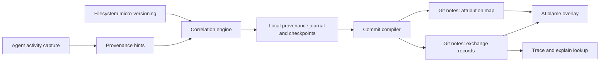
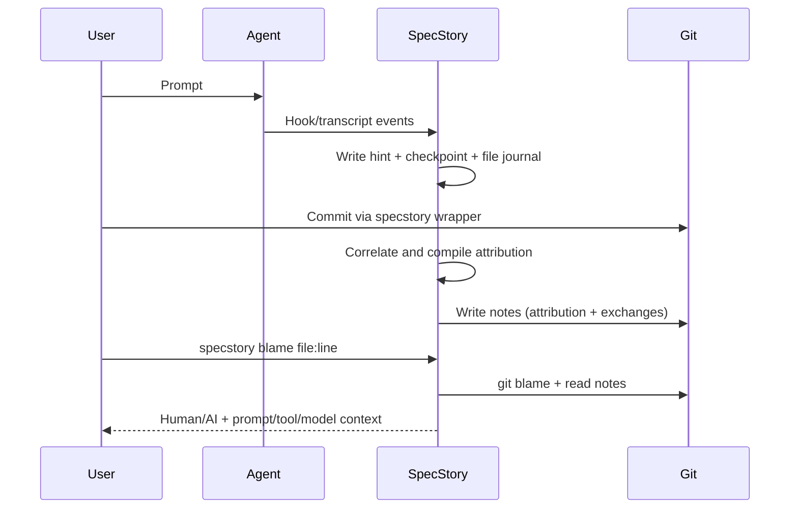
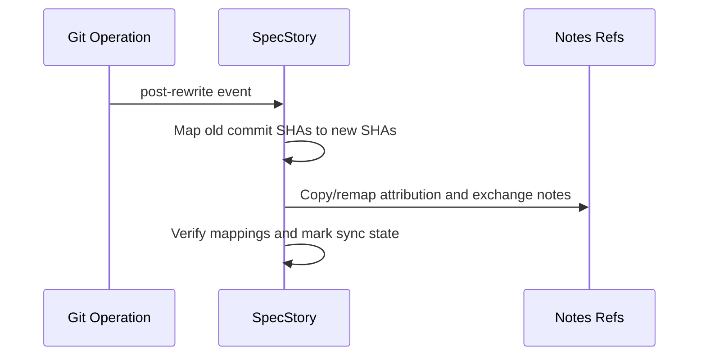
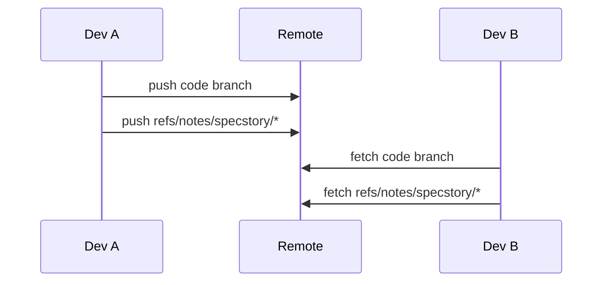

# AI Git Provenance Recommendations

_Last updated: 2026-02-20 (UTC)_

## Executive Recommendation

Build a **line-aware, Git-native provenance system** with a **dual-layer data model**:

1. **Attribution Map (fast blame path):** compact file/line-range to `exchange_id` mappings attached to commits in Git Notes.
2. **Exchange Records (explainability path):** normalized prompt/tool/assistant context keyed by `exchange_id`, also in Git Notes.

Back this with **always-on micro-versioning** (journal + checkpoints) and a **deterministic correlation engine**. Keep trust/signing optional but supported via attestations.

This combines the strongest mechanics observed in Git AI, Agent Blame, whogitit, and Intent Git Mode, while staying compatible with an Agent Trace style representation.

## Design Goals

1. Answer: "Who changed this line, AI or human, and why?"
2. Preserve causality before commit flattening.
3. Survive branch, merge, rebase, squash, and cherry-pick workflows.
4. Keep developer workflows close to standard Git habits.
5. Support privacy controls for prompts and transcripts.

## Recommended Architecture



## Recommendations By Challenge Area

## 1) Capturing Agent Activity

### Recommendation

Use a **hybrid capture stack**:
- Primary: explicit agent hooks where available.
- Secondary: provider watchers/parsers for transcript/session artifacts.
- Normalize all events into one `ExchangeEvent` schema.

### Justification

Hook-first capture gives highest fidelity for tool boundaries and file targets. Watcher/parsing fallback protects coverage when hooks are unavailable or incomplete.

### Trade-offs

- Pros: better precision, multi-agent portability, graceful degradation.
- Cons: per-agent integration maintenance; schema drift handling required.

## 2) Capturing File Change & Micro-versioning

### Recommendation

Record **continuous micro-versions** before commit:
- Append-only file-change journal (timestamped).
- Lightweight checkpoints with content hashes/blobs.
- Provenance marks that survive dirty/uncommitted states.

### Justification

Commit-only capture loses intermediate intent and prompt boundaries. Micro-versioning is required for trustworthy line-level attribution.

### Trade-offs

- Pros: preserves iterative agent loops; enables uncommitted blame.
- Cons: more local state, compaction/cleanup complexity.

## 3) Correlating Agent Change To File Change

### Recommendation

Use a **scored deterministic matcher** over multiple signals:
- explicit path match
- content hash continuity
- time window proximity
- session affinity
- change-type compatibility

Require a confidence threshold; fallback to `manual-change` when below threshold.

### Justification

Pure heuristics are fragile, and pure path matching misses shell/generated edits. A weighted matcher with explicit fallback is robust and auditable.

### Trade-offs

- Pros: predictable behavior, debuggable attribution decisions.
- Cons: tuning burden; ambiguous edits still occur in concurrent sessions.

## 4) Representing Agent Provenance

### Recommendation

Represent provenance as two linked artifacts:

1. **Attribution Map** (commit-local, line-range oriented).
2. **Exchange Records** (session/prompt/tool context, keyed by `exchange_id`).

Model shape should be compatible with Agent Trace concepts (`files`, `ranges`, `contributor`, `vcs.revision`) while preserving practical blame lookup performance.

### Justification

Blame needs compact range lookup. Explainability needs richer context. Splitting them avoids oversized blame payloads and keeps query paths fast.

### Pros And Cons Of This Representation

| Aspect | Pros | Cons |
|---|---|---|
| Query speed | Fast line lookup from compact range map | Requires join to fetch full context |
| Explainability depth | Rich prompt/tool/assistant context available | More objects to manage and sync |
| Privacy control | Can redact/summarize exchange content independently | Policy complexity across teams |
| Interoperability | Maps cleanly to Agent Trace/W3C PROV concepts | Requires schema governance/versioning |
| Storage efficiency | Deduplicates repeated prompt/session metadata | Slightly higher implementation complexity |

### Example: Attribution Map Note

```json
{
  "version": "1.0.0",
  "commit": "9f4a2c3d",
  "files": {
    "pkg/auth/callback.go": [
      { "lines": "24-44", "exchange_id": "ex_0042", "actor": "ai" },
      { "lines": "72-76", "exchange_id": "manual", "actor": "human" }
    ],
    "pkg/auth/callback_test.go": [
      { "lines": "10-58", "exchange_id": "ex_0043", "actor": "ai" }
    ]
  }
}
```

### Example: Exchange Record Note

```json
{
  "version": "1.0.0",
  "exchanges": [
    {
      "exchange_id": "ex_0042",
      "session_id": "sess_7c3a",
      "timestamp": "2026-02-20T16:04:12Z",
      "contributor": {
        "type": "ai",
        "tool": "claude-code",
        "model": "claude-sonnet-4-20250514"
      },
      "user_prompt": "Add strict callback host validation.",
      "assistant_summary": "Added allowlist validation and URL parsing guards.",
      "tools": [
        { "name": "Edit", "file": "pkg/auth/callback.go" },
        { "name": "Edit", "file": "pkg/auth/callback_test.go" }
      ],
      "vcs": { "type": "git", "revision": "9f4a2c3d" }
    }
  ]
}
```

### Optional Trust Envelope Example (in-toto style)

```json
{
  "_type": "https://in-toto.io/Statement/v1",
  "subject": [{ "name": "commit:9f4a2c3d", "digest": { "sha1": "9f4a2c3d..." } }],
  "predicateType": "https://specstory.ai/provenance/v1",
  "predicate": {
    "attribution_ref": "refs/notes/specstory/attribution",
    "exchange_ref": "refs/notes/specstory/exchanges"
  }
}
```

## 5) Storing Agent Provenance In Git

### Recommendation

Store provenance in dedicated Git Notes refs:
- `refs/notes/specstory/attribution`
- `refs/notes/specstory/exchanges`
- optional `refs/notes/specstory/attestations`

Include explicit fetch/push and rewrite remap logic in CLI wrappers/hooks.

### Justification

Git Notes keep commits clean, support rich payloads, and are the most practical Git-native option for blame-grade metadata.

### Trade-offs

- Pros: scalable payloads, independent schema evolution.
- Cons: notes are out-of-band; sync discipline is mandatory.

## 6) AI Blame

### Recommendation

Provide two first-class commands:

1. `specstory blame <file[:line]>`:
- Run `git blame`
- Resolve line to `exchange_id` via Attribution Map
- Join Exchange Record for prompt/tool/model context
- Overlay dirty/uncommitted marks when requested

2. `specstory trace <exchange_id>`:
- Reverse lookup from exchange to current file/line ranges
- Include commit history and current working tree overlays

### Justification

These two paths cover forward and inverse provenance queries and match real developer debugging behavior.

### Trade-offs

- Pros: directly useful in daily workflows.
- Cons: requires indexing/caching for large repos.

## 7) Developer Experience (DX)

### Recommendation

Ship a low-friction operating model:
- one-time `specstory init` for hooks/notes config
- wrapper-aware `specstory git commit` / `specstory git push`
- optional transparent shim mode for advanced teams
- `specstory doctor` to validate hook health, note sync, and schema versions

### Justification

High-fidelity provenance is optional value, so DX must remain close to standard Git habits to sustain adoption.

### Trade-offs

- Pros: higher adoption probability.
- Cons: wrapper/shim environments need careful path/config management.

## End-to-End Recommended Flows

## Flow A: Normal AI Edit To Commit To Blame



## Flow B: Rewrite Survival (Rebase/Squash/Cherry-pick)



## Flow C: Team Sync (Push/Fetch)



## Implementation Guidance

1. **Phase 1 (core):** capture + micro-versioning + attribution/exchange notes + local blame.
2. **Phase 2 (durability):** robust rewrite remap and sync automation.
3. **Phase 3 (interop/trust):** Agent Trace export/import and optional signed attestations.
4. **Phase 4 (ecosystem):** PR UI overlays and analytics views.

## Final Recommendation

Adopt a **Git Notes + micro-versioning + dual-layer representation** architecture, with Agent Trace-compatible semantics and optional attestation envelopes. This is the highest-confidence path to accurate, practical, and scalable AI provenance across all 7 challenge areas.
