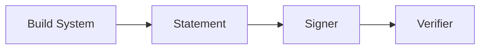

# in-toto Attestation Standard Research

_Last updated: 2026-02-18 (UTC)_

## Executive Summary

**Metaphor:** in-toto Statements are standardized shipping labels for software artifacts.
They record what the artifact is and attach a typed predicate about how it was produced, but they do not prescribe the factory that emitted them.

## Standard At A Glance

| Dimension | What in-toto Defines |
|---|---|
| Scope | Generic statement envelope for attestations |
| Primary artifact | in-toto Statement (`_type`, `subject`, `predicateType`, `predicate`) |
| Intended producers | Build systems, CI pipelines, signing tools |
| Intended consumers | Verifiers, policy engines, provenance viewers |
| Status | Stable spec with reference implementations |
| Reference implementation | `in-toto/attestation` spec repo |

## Purpose & Scope

The in-toto Statement standardizes a minimal envelope for attestations about software artifacts. The statement itself is payload-agnostic: it defines how to identify subjects and how to attach a typed predicate, but it does not define the predicate content.

## Core Representation

| Concept | Description | Why It Matters |
|---|---|---|
| `"_type"` | Fixed statement type URI | Identifies the statement format |
| `subject[]` | Artifact identifiers with digests | Binds claims to immutable content |
| `predicateType` | URI identifying the predicate schema | Enables typed, versioned meaning |
| `predicate` | Arbitrary structured payload | Carries domain-specific provenance |

## Sample Representation

Synthetic example aligned to the published Statement fields.

```json
{
  "_type": "https://in-toto.io/Statement/v1",
  "subject": [
    {
      "name": "app.tar.gz",
      "digest": { "sha256": "b1946ac92492d2347c6235b4d2611184" }
    }
  ],
  "predicateType": "https://example.com/attestation/build/v1",
  "predicate": {
    "builder": "ci.example.com",
    "materials": [
      { "uri": "git+https://github.com/example/repo@refs/heads/main", "digest": { "sha1": "a1b2c3d4" } }
    ],
    "metadata": { "buildStartedOn": "2026-01-23T14:00:00Z" }
  }
}
```

| Field | Role In Provenance / Blame |
|---|---|
| `subject.digest` | Anchors the claim to exact artifact bytes |
| `predicateType` | Tells verifiers how to interpret `predicate` |
| `predicate` | Carries provenance details (build, test, review, etc.) |

## Capture / Emission Model

The spec is silent on capture. Producers emit Statements as part of build or release pipelines, typically after computing artifact digests.



## Verification / Trust Model

Verification is not intrinsic to the Statement itself. Implementations commonly wrap Statements in DSSE envelopes and sign them so verifiers can validate authenticity and integrity.

## Git / SCM Relevance

Git is not required, but a Statement can reference Git commits or source repos inside its predicate. This makes the Statement a portable provenance container that can be linked to Git-based workflows.

## Tooling & Ecosystem

| Tool / Project | Role | Notes |
|---|---|---|
| `in-toto/attestation` | Spec and examples | Defines the Statement envelope |
| SLSA build provenance | Predicate family | SLSA is expressed as an in-toto predicate |
| Supply-chain tooling | Producers | CI systems emit Statements during builds |

## Activity, Support, And Community (as of 2026-02-18 UTC)

| Metric | Value |
|---|---:|
| Stars | 324 |
| Forks | 102 |
| Watchers | 21 |
| Open issues | 64 |
| Last push | 2026-02-17T22:00:20Z |

| Metric | Value |
|---|---:|
| Open PRs | 6 |
| Closed PRs | 369 |
| Top contributors (API snapshot) | `marcelamelara`, `dependabot[bot]`, `TomHennen` |

## Delivery Cadence

| Repo | Version | Published (UTC) | Channel |
|---|---|---|---|
| `in-toto/attestation` | `v1.1.2` | 2025-06-13 20:47:12Z | Tag |
| `in-toto/attestation` | `v1.1.1` | 2025-01-23 15:57:12Z | Tag |
| `in-toto/attestation` | `v1.1.0` | 2024-05-28 22:01:20Z | Tag |
| `in-toto/attestation` | `v1.0.2` | 2024-04-08 18:31:28Z | Tag |
| `in-toto/attestation` | `v1.0.1` | 2023-12-19 21:35:37Z | Tag |
| `in-toto/attestation` | `v1.0` | 2023-03-22 15:02:15Z | Tag |

## Observed vs Inferred

| Type | Notes |
|---|---|
| Observed in spec | Statement fields `_type`, `subject`, `predicateType`, `predicate` |
| Observed in spec | Statement is predicate-agnostic and designed for reuse |
| Inferred | DSSE signing is the dominant verification approach |

## Sources

- https://github.com/in-toto/attestation
- https://raw.githubusercontent.com/in-toto/attestation/main/spec/v1/statement.md
