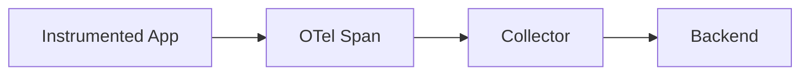

# OpenTelemetry GenAI Semantic Conventions Research

_Last updated: 2026-02-18 (UTC)_

## Executive Summary

**Metaphor:** OpenTelemetry GenAI conventions are a shared telemetry dialect for AI operations.
They do not store provenance themselves; they standardize how to name spans and attributes so telemetry pipelines can capture prompts, responses, and usage consistently.

## Standard At A Glance

| Dimension | What GenAI SemConv Defines |
|---|---|
| Scope | Span, event, and metric conventions for GenAI operations |
| Primary artifact | OpenTelemetry telemetry with `gen_ai.*` attributes |
| Intended producers | Instrumented GenAI clients, SDKs, and services |
| Intended consumers | Observability backends, analytics, audit tooling |
| Status | Development (experimental) |
| Reference implementation | `open-telemetry/semantic-conventions` |

## Purpose & Scope

The GenAI semantic conventions standardize span names, attributes, and event shapes for AI model calls. They cover spans, events, and metrics to make telemetry portable across providers and tooling, but do not define storage, signing, or Git integration.

## Core Representation

| Concept | Description | Why It Matters |
|---|---|---|
| `gen_ai.operation.name` | Operation name (e.g., `chat`) | Normalizes span naming |
| `gen_ai.provider.name` | Provider identifier | Enables cross-provider analysis |
| `gen_ai.request.model` | Model requested | Connects behavior to model identity |
| `gen_ai.response.model` | Model that responded | Tracks server-side model version |
| `gen_ai.usage.*` | Token usage metrics | Supports cost and usage attribution |
| `gen_ai.input.messages` | Opt-in message capture | Enables provenance-like replay in telemetry |

## Sample Representation

Synthetic example aligned to the GenAI span attribute keys.

```json
{
  "resource": { "attributes": { "service.name": "assistant-api" } },
  "spans": [
    {
      "name": "chat gpt-4",
      "kind": "CLIENT",
      "attributes": {
        "gen_ai.operation.name": "chat",
        "gen_ai.provider.name": "openai",
        "gen_ai.request.model": "gpt-4",
        "gen_ai.response.model": "gpt-4-0613",
        "gen_ai.usage.input_tokens": 120,
        "gen_ai.usage.output_tokens": 180,
        "gen_ai.output.type": "text"
      }
    }
  ]
}
```

| Field | Role In Provenance / Blame |
|---|---|
| `gen_ai.request.model` + `gen_ai.response.model` | Tie activity to model identity |
| `gen_ai.usage.*` | Cost and volume attribution |
| `gen_ai.input.messages` | Optional capture of the prompt history |

## Capture / Emission Model

Capture is done via OpenTelemetry instrumentation in client or server code. The spec recommends keeping existing emission defaults unless an opt-in variable (`OTEL_SEMCONV_STABILITY_OPT_IN=gen_ai_latest_experimental`) is set for the latest experimental GenAI conventions.



## Verification / Trust Model

OpenTelemetry does not define signing or attestation for telemetry. Trust depends on the telemetry pipeline and backend controls.

## Git / SCM Relevance

The conventions do not mention Git. They can complement Git-based provenance by capturing prompt and tool-call telemetry, but they are not a storage or blame mechanism.

## Tooling & Ecosystem

| Tool / Project | Role | Notes |
|---|---|---|
| `open-telemetry/semantic-conventions` | Specification | Defines GenAI attribute keys and span names |
| OTel SDKs | Producers | Emit spans with GenAI attributes |
| OTel Collector | Transport | Aggregates and exports telemetry |

## Activity, Support, And Community (as of 2026-02-18 UTC)

| Metric | Value |
|---|---:|
| Stars | 511 |
| Forks | 314 |
| Watchers | 43 |
| Open issues | 743 |
| Last push | 2026-02-18T06:56:21Z |

| Metric | Value |
|---|---:|
| Open PRs | 39 |
| Closed PRs | 1902 |
| Top contributors (API snapshot) | `trask`, `renovate[bot]`, `joaopgrassi` |

## Delivery Cadence

| Repo | Version | Published (UTC) | Channel |
|---|---|---|---|
| `open-telemetry/semantic-conventions` | `v1.39.0` | 2026-01-12 22:07:10Z | Tag |
| `open-telemetry/semantic-conventions` | `v1.38.0` | 2025-10-29 20:17:50Z | Tag |
| `open-telemetry/semantic-conventions` | `v1.37.0` | 2025-08-25 23:15:52Z | Tag |
| `open-telemetry/semantic-conventions` | `v1.36.0` | 2025-07-05 16:48:25Z | Tag |
| `open-telemetry/semantic-conventions` | `v1.35.0` | 2025-06-30 19:58:04Z | Tag |
| `open-telemetry/semantic-conventions` | `v1.34.0` | 2025-05-19 19:44:40Z | Tag |

## Observed vs Inferred

| Type | Notes |
|---|---|
| Observed in spec | GenAI conventions are in Development status |
| Observed in spec | `OTEL_SEMCONV_STABILITY_OPT_IN` controls opt-in to latest experimental conventions |
| Inferred | GenAI semconv can act as a telemetry bridge for AI provenance |

## Sources

- https://github.com/open-telemetry/semantic-conventions
- https://raw.githubusercontent.com/open-telemetry/semantic-conventions/main/docs/gen-ai/README.md
- https://raw.githubusercontent.com/open-telemetry/semantic-conventions/main/docs/gen-ai/gen-ai-spans.md
