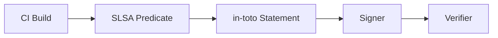

# SLSA Build Provenance Standard Research

_Last updated: 2026-02-18 (UTC)_

## Executive Summary

**Metaphor:** SLSA provenance is a build system passport stamped by the platform that built your artifact.
It is a typed predicate carried inside an in-toto Statement that explains what was built, how, and by which trusted builder.

## Standard At A Glance

| Dimension | What SLSA Defines |
|---|---|
| Scope | Build provenance predicate for software artifacts |
| Primary artifact | in-toto Statement with SLSA predicate (`predicateType` = `https://slsa.dev/provenance/v1`) |
| Intended producers | CI systems and build platforms |
| Intended consumers | Artifact verifiers, policy engines, security tooling |
| Status | Stable spec (v1.x) |
| Reference implementation | `slsa-framework/slsa` spec repo |

## Purpose & Scope

SLSA provenance defines a structured predicate describing how a build ran: the build definition, parameters, resolved dependencies, and run details. It is explicitly designed to be verifiable by consumers to assess build integrity and reproducibility.

## Core Representation

| Concept | Description | Why It Matters |
|---|---|---|
| `predicateType` | Fixed URI `https://slsa.dev/provenance/v1` | Identifies the SLSA predicate version |
| `buildDefinition` | Build template + parameters + dependencies | Describes the intended build process |
| `runDetails` | Builder identity + execution metadata | Binds the run to a trusted platform |
| `builder.id` | URI for trusted build platform | Anchor for trust decisions |
| `resolvedDependencies` | Concrete inputs resolved at build time | Links sources and dependencies to digests |

## Sample Representation

Synthetic example aligned to the v1.2 schema fields and the in-toto envelope.

```json
{
  "_type": "https://in-toto.io/Statement/v1",
  "subject": [
    {
      "name": "dist/app.tar.gz",
      "digest": { "sha256": "b1946ac92492d2347c6235b4d2611184" }
    }
  ],
  "predicateType": "https://slsa.dev/provenance/v1",
  "predicate": {
    "buildDefinition": {
      "buildType": "https://slsa-framework.github.io/github-actions-buildtypes/workflow/v1",
      "externalParameters": {
        "repository": "https://github.com/example/repo",
        "ref": "refs/heads/main"
      },
      "internalParameters": {
        "runner": "ubuntu-22.04"
      },
      "resolvedDependencies": [
        {
          "uri": "git+https://github.com/example/repo@refs/heads/main",
          "digest": { "gitCommit": "7fd1a60b01f91b314f59955a4e4d4e80d8edf11d" }
        }
      ]
    },
    "runDetails": {
      "builder": { "id": "https://github.com/actions/runner" },
      "metadata": {
        "invocationId": "build-2026-01-23-001",
        "startedOn": "2026-01-23T14:00:00Z",
        "finishedOn": "2026-01-23T14:03:12Z"
      }
    }
  }
}
```

| Field | Role In Provenance / Blame |
|---|---|
| `predicate.buildDefinition` | Defines the declared build inputs and process |
| `predicate.runDetails.builder.id` | Establishes the trusted build platform identity |
| `predicate.buildDefinition.resolvedDependencies` | Links Git refs and dependencies to digests |

## Capture / Emission Model

SLSA does not mandate how to capture provenance. Build platforms emit the SLSA predicate after the build completes, typically as part of CI pipelines.



## Verification / Trust Model

SLSA relies on the combination of a trusted builder identity and signed statements. Verifiers check the signature, validate the predicate structure, and compare declared inputs and dependencies against policy.

## Git / SCM Relevance

Git repositories and commits are commonly represented in `externalParameters` and `resolvedDependencies`. This makes SLSA provenance a direct bridge between a build artifact and the Git revision that produced it, even though Git storage is out of scope.

## Tooling & Ecosystem

| Tool / Project | Role | Notes |
|---|---|---|
| `slsa-framework/slsa` | Specification | Defines the predicate and requirements |
| CI build platforms | Producers | Emit SLSA provenance |
| Policy engines | Consumers | Validate fields and signatures |

## Activity, Support, And Community (as of 2026-02-18 UTC)

| Metric | Value |
|---|---:|
| Stars | 1811 |
| Forks | 276 |
| Watchers | 64 |
| Open issues | 255 |
| Last push | 2026-02-16T11:13:03Z |

| Metric | Value |
|---|---:|
| Open PRs | 29 |
| Closed PRs | 936 |
| Top contributors (API snapshot) | `MarkLodato`, `TomHennen`, `lehors` |

## Delivery Cadence

| Repo | Version | Published (UTC) | Channel |
|---|---|---|---|
| `slsa-framework/slsa` | `v1.2` | 2025-11-24 18:10:45Z | Tag |
| `slsa-framework/slsa` | `v1.2-rc1` | 2025-06-19 16:27:14Z | Tag |
| `slsa-framework/slsa` | `v1.1` | 2025-04-21 15:47:27Z | Tag |
| `slsa-framework/slsa` | `v1.1-rc2` | 2025-04-04 17:47:51Z | Tag |
| `slsa-framework/slsa` | `v1.1-rc1` | 2024-08-26 17:03:00Z | Tag |
| `slsa-framework/slsa` | `v1.0.0` | 2023-04-18 20:49:16Z | Tag |

## Observed vs Inferred

| Type | Notes |
|---|---|
| Observed in spec | `predicateType` is fixed to `https://slsa.dev/provenance/v1` |
| Observed in spec | `predicate` fields include `buildDefinition` and `runDetails` |
| Inferred | Most implementations emit SLSA from CI build pipelines |

## Sources

- https://github.com/slsa-framework/slsa
- https://raw.githubusercontent.com/slsa-framework/slsa/main/docs/spec/v1.2/build-provenance.md
- https://raw.githubusercontent.com/in-toto/attestation/main/spec/v1/statement.md
