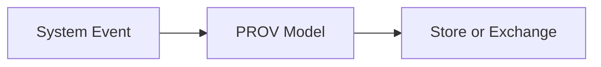

# W3C PROV Standard Research

_Last updated: 2026-02-18 (UTC)_

## Executive Summary

**Metaphor:** PROV is the grammar for telling provenance stories.
It defines the nouns (entities, activities, agents) and the verbs (used, wasGeneratedBy, wasAssociatedWith) but not the tooling that captures or stores those stories.

## Standard At A Glance

| Dimension | What PROV Defines |
|---|---|
| Scope | General-purpose provenance data model |
| Primary artifact | PROV data model expressed as PROV-N, PROV-JSON, PROV-O |
| Intended producers | Any system that emits provenance | 
| Intended consumers | Provenance viewers, analytics, auditors |
| Status | W3C recommendations and notes |
| Reference implementation | W3C specification suite |

## Purpose & Scope

PROV provides a common, interoperable data model to represent the provenance of things. It is not specific to software, Git, or AI, but it can model those domains.

## Core Representation

| Concept | Description | Why It Matters |
|---|---|---|
| Entity | A thing, digital or physical | Represents files, artifacts, or data |
| Activity | An action over time | Represents builds, edits, or transformations |
| Agent | An actor | Represents humans, services, or AI agents |
| Relations | Links between entities, activities, agents | Captures lineage and accountability |

## Sample Representation

Synthetic example in PROV-JSON style.

```json
{
  "entity": {
    "e1": { "prov:label": "src/app.ts" }
  },
  "activity": {
    "a1": {
      "prov:label": "code-edit",
      "prov:startTime": "2026-01-23T14:00:00Z",
      "prov:endTime": "2026-01-23T14:05:00Z"
    }
  },
  "agent": {
    "ag1": { "prov:type": "prov:Person", "prov:label": "Developer" },
    "ag2": { "prov:type": "prov:SoftwareAgent", "prov:label": "AI Agent" }
  },
  "wasGeneratedBy": {
    "g1": { "prov:entity": "e1", "prov:activity": "a1" }
  },
  "wasAssociatedWith": {
    "w1": { "prov:activity": "a1", "prov:agent": "ag2" }
  }
}
```

| Field | Role In Provenance / Blame |
|---|---|
| `entity` | Identifies the artifact under discussion |
| `activity` | Describes the operation that changed it |
| `agent` | Captures who or what acted |
| Relations | Link lineage and responsibility |

## Capture / Emission Model

PROV does not define capture mechanisms. Each domain is responsible for mapping its events into PROV entities, activities, and relations.



## Verification / Trust Model

PROV does not define cryptographic signing or verification. Integrity and trust are delegated to the systems that store or transmit PROV records.

## Git / SCM Relevance

Git commits and files can be modeled as activities and entities, and authors as agents. This enables provenance reasoning, but PROV does not define Git storage or blame semantics.

## Tooling & Ecosystem

| Tool / Project | Role | Notes |
|---|---|---|
| W3C PROV specs | Specification | Defines data model and serializations |
| PROV-JSON / PROV-O | Formats | JSON and RDF-based encodings |
| Provenance tooling | Consumers | Parsers, validators, visualizers |

## Activity, Support, And Community (as of 2026-02-18 UTC)

| Signal | Value |
|---|---|
| Standards body | W3C Provenance Working Group output |
| Latest publication | 2013-04-30 (W3C Note / Recommendation suite) |

## Delivery Cadence

| Repo | Version | Published (UTC) | Channel |
|---|---|---|---|
| W3C PROV Overview | 2013-04-30 | 2013-04-30 | W3C Working Group Note |
| W3C PROV-DM | 2013-04-30 | 2013-04-30 | W3C Recommendation |
| W3C PROV-O | 2013-04-30 | 2013-04-30 | W3C Recommendation |

## Observed vs Inferred

| Type | Notes |
|---|---|
| Observed in spec | PROV defines entities, activities, agents, and relations |
| Observed in spec | Multiple serializations exist, including PROV-JSON and PROV-O |
| Inferred | PROV can model Git provenance with appropriate mapping |

## Sources

- https://www.w3.org/TR/prov-overview/
