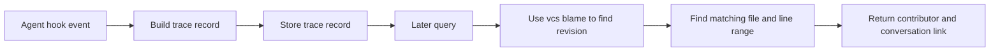

# Agent Trace System Research

_Last updated: 2026-02-18 (UTC)_

## Executive Summary

**Metaphor:** Agent Trace is a **container specification for provenance cargo**, not the shipping network.

It defines a portable data format for AI attribution (`files`, `conversations`, `ranges`, `contributor`, `model_id`) and a blame lookup recipe. It does **not** define end-to-end capture, storage, merge, or blame UX as a complete product.

## System At A Glance

| Dimension                | What Agent Trace Actually Does                   |
|--------------------------|--------------------------------------------------|
| Core model               | Open provenance schema + implementation guidance |
| Primary deliverable      | RFC spec and JSON schema                         |
| Reference implementation | Hook script + JSONL trace store                  |
| Micro-versioning         | Implementation-defined, not standardized         |
| Git storage strategy     | Intentionally unspecified                        |
| AI blame UX              | Algorithm described, no official CLI/UI          |
| Agent integrations       | Reference hooks for Cursor and Claude Code       |

## Architecture



---

## Challenge 1: Capturing Agent Activity

### Supported Agents And Providers

| Agent or Provider                                                                                       | Support Status                        | Confidence           | Evidence                                                      |
|---------------------------------------------------------------------------------------------------------|---------------------------------------|----------------------|---------------------------------------------------------------|
| Cursor hooks (`sessionStart`, `sessionEnd`, `afterFileEdit`, `afterTabFileEdit`, `afterShellExecution`) | Supported in reference implementation | High (code + config) | `reference/trace-hook.ts`, `.cursor/hooks.json`               |
| Claude Code hooks (`SessionStart`, `SessionEnd`, `PostToolUse` with `Write`, `Edit`, `Bash`)            | Supported in reference implementation | High (code + config) | `reference/trace-hook.ts`, `.claude/settings.json`            |
| Any other tool implementing the schema                                                                  | Allowed by spec                       | Medium (spec intent) | README says vendor-neutral and implementation-defined capture |

### How It Works

1. A hook event is delivered to `reference/trace-hook.ts`.
2. Handler maps event to trace creation:
   - file edits produce file-path traces with ranges
   - shell tool events produce `.shell-history` traces
   - session lifecycle events produce `.sessions` traces
3. `createTrace()` enriches with `tool`, optional `vcs.revision`, and contributor metadata.
4. `appendTrace()` writes JSONL records to `.agent-trace/traces.jsonl`.

Important boundary:
- This is only a reference path. The spec itself does not mandate any one ingestion method.

---

## Challenge 2: Capturing File Change And Micro-versioning

### How It Works

1. On each hook event, reference code computes changed ranges (`computeRangePositions`).
2. A trace record is emitted immediately and appended to JSONL.
3. Multiple events across time create a chronological list of trace records.

What is standardized vs not:
- **Standardized:** each record can include line ranges per file.
- **Not standardized:** how to capture every edit, deduplicate noisy events, or represent pre/post micro-versions.

So micro-versioning exists only to the degree an implementation emits granular events.

---

## Challenge 3: Correlating Agent Change To File Change

### How It Works

1. Correlation is primarily hook-payload-driven (`file_path`, edit ranges, tool metadata).
2. For file edit events, ranges are derived from edit metadata or content search fallback.
3. For shell events, reference implementation attributes to `.shell-history` rather than parsing generated file impacts.

Trade-off:
- Strong when agent hook payload is precise.
- Weak for indirect file generation (`bash` scripts, scaffolding tools) unless implementer adds extra diff logic.

---

## Challenge 4: Representing Agent Provenance

### Representation Used

Canonical schema units:
- `TraceRecord`
- `files[]`
- `conversations[]`
- `ranges[]`
- `contributor` with `type` and optional `model_id`

### Sample Representation 1: Spec-style trace record (from spec pattern)

```json
{
  "version": "0.1.0",
  "id": "550e8400-e29b-41d4-a716-446655440000",
  "timestamp": "2026-01-23T14:30:00Z",
  "vcs": { "type": "git", "revision": "a1b2c3d4..." },
  "tool": { "name": "cursor", "version": "2.4.0" },
  "files": [
    {
      "path": "src/utils/parser.ts",
      "conversations": [
        {
          "url": "https://api.cursor.com/v1/conversations/12345",
          "contributor": {
            "type": "ai",
            "model_id": "anthropic/claude-opus-4-5-20251101"
          },
          "ranges": [
            { "start_line": 42, "end_line": 67, "content_hash": "murmur3:9f2e8a1b" }
          ]
        }
      ]
    }
  ]
}
```

### Sample Representation 2: Reference JSONL emission (schema-faithful synthetic)

```json
{
  "version": "1.0",
  "id": "db56837d-3f36-4e4a-99af-b412a4be8c26",
  "timestamp": "2026-02-18T07:14:22Z",
  "vcs": { "type": "git", "revision": "f13d0a..." },
  "tool": { "name": "claude-code" },
  "files": [
    {
      "path": "pkg/service/auth.go",
      "conversations": [
        {
          "url": "file:///Users/dev/.claude/projects/repo/session.jsonl",
          "contributor": {
            "type": "ai",
            "model_id": "anthropic/claude-sonnet-4-20250514"
          },
          "ranges": [
            { "start_line": 15, "end_line": 42 }
          ]
        }
      ]
    }
  ],
  "metadata": {
    "session_id": "sess-abc",
    "tool_name": "Edit",
    "tool_use_id": "toolu_123"
  }
}
```

Field usage for blame:
- `vcs.revision`: ties record to blame-resolved revision
- `files.path` + `ranges`: line-range lookup surface
- `contributor.model_id`: model attribution surface
- `conversation.url` and `related`: drill-down to full context

Notable implementation risk observed:
- README examples are `0.1.0`, while reference `createTrace()` emits `1.0`.
- `schemas.ts` version regex currently expects escaped dots (`\.`), which can reject normal semver strings unless corrected.

---

## Challenge 5: Storing Agent Provenance In Git

### What The Spec Says

Storage is intentionally left open:
- local files
- git notes
- database
- any other mechanism

### What The Reference Does

Reference storage is local JSONL only:
- `.agent-trace/traces.jsonl`

Consequences:
- No default branching/rebase/cherry-pick semantics are defined by the standard.
- Git transport behavior depends on the chosen implementation strategy.

---

## Challenge 6: AI Blame

The spec defines a blame procedure but not a full command surface:

1. Run VCS blame for line `N`.
2. Identify revision that last touched line `N`.
3. Load trace record for that revision and file.
4. Find containing range and surface contributor/conversation.

This is a strong conceptual contract, but users still need tooling built on top of it.

---

## Challenge 7: Developer Experience (DX)

### Current DX Shape

- Good: low-friction schema for interoperability.
- Good: reference hook files make local experimentation quick.
- Cost: implementers must still build core product behaviors (storage sync, merge semantics, robust blame UI).

For teams evaluating immediate deployment, Agent Trace is more a foundation standard than a turnkey system.

---

## Activity, Support, And Community (as of 2026-02-18 UTC)

### GitHub Signals

- Stars: `578`
- Forks: `45`
- Open issues: `8`
- Last push: `2026-02-06T14:23:28Z`

### Collaboration Signals

| Metric                          |                   Value |
|---------------------------------|------------------------:|
| Open PRs                        |                       1 |
| Closed PRs                      |                       7 |
| Top contributors (API snapshot) | `leerob`, `cursoragent` |

Interpretation: active early-stage standardization effort with broad ecosystem interest, but still pre-product in scope.

---

## Overall Assessment For SpecStory Research

Agent Trace is highly relevant to **Challenge 4 standardization**. It is less relevant as a complete system reference for Challenges 2, 5, and 6 unless paired with a concrete implementation architecture.

For SpecStory, it is best treated as:
- schema and interoperability input
- not a full end-to-end provenance storage and blame solution by itself

---

## Sources

- https://agent-trace.dev/
- https://github.com/cursor/agent-trace
- https://github.com/cursor/agent-trace/blob/main/README.md
- https://github.com/cursor/agent-trace/blob/main/schemas.ts
- https://github.com/cursor/agent-trace/blob/main/reference/trace-store.ts
- https://github.com/cursor/agent-trace/blob/main/reference/trace-hook.ts
- https://github.com/cursor/agent-trace/blob/main/.cursor/hooks.json
- https://github.com/cursor/agent-trace/blob/main/.claude/settings.json
- https://api.github.com/repos/cursor/agent-trace
- https://api.github.com/repos/cursor/agent-trace/releases?per_page=20
- https://api.github.com/search/issues?q=repo:cursor/agent-trace+type:pr+state:open
- https://api.github.com/search/issues?q=repo:cursor/agent-trace+type:pr+state:closed
- https://api.github.com/repos/cursor/agent-trace/contributors?per_page=10
