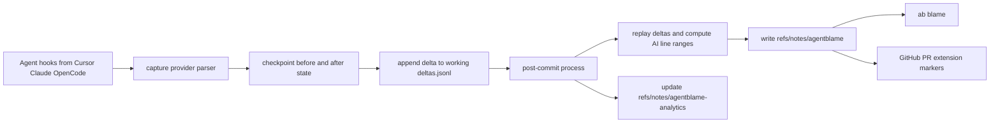

# Agent Blame System Research

_Last updated: 2026-02-18 (UTC)_

## Executive Summary

**Metaphor:** Agent Blame behaves like an **air-traffic recorder for AI edits**:
- Hook events capture before/after file state around AI tool actions.
- A delta ledger tracks AI and human edits between commits.
- Commit processing replays those deltas and writes line-range attribution into git notes.

It is one of the stronger open implementations for practical line-level AI blame across local CLI and GitHub PR UX, with explicit squash/rebase transfer workflows.

## System At A Glance

| Dimension                 | What Agent Blame Does                                                            |
|---------------------------|----------------------------------------------------------------------------------|
| Core model                | Provider hooks + checkpoint capture + delta replay + git-note attribution        |
| Primary provenance store  | `refs/notes/agentblame`                                                          |
| Secondary analytics store | `refs/notes/agentblame-analytics` on root/anchor commit                          |
| In-flight store           | `.git/agentblame/working/<base-sha>/deltas.jsonl` + checkpoint files + git blobs |
| Session metadata store    | Global SQLite `~/.agentblame/agentblame.db`                                      |
| Micro-versioning          | Yes (pre/post edit checkpoints + append-only deltas)                             |
| Line-level attribution    | Yes (`ab blame <file>`)                                                          |
| Rewrite handling          | GitHub Action `post-merge` transfer + `ab sync` local transfer for squash/rebase |
| Agent integrations        | Cursor, Claude Code, OpenCode                                                    |

## Architecture (End-to-End)



---

## Challenge 1: Capturing Agent Activity

### Supported Agents (Current)

| Agent / Provider | Support Status          | Capture Depth                                      | Confidence         | Evidence                                         |
|------------------|-------------------------|----------------------------------------------------|--------------------|--------------------------------------------------|
| Cursor           | Supported               | Prompt boundary + file edit hook capture           | High (docs + code) | README, `lib/hooks.ts`, `capture.ts`             |
| Claude Code      | Supported               | PreToolUse + PostToolUse with transcript parsing   | High (docs + code) | README, `lib/hooks.ts`, `capture.ts`             |
| OpenCode         | Supported               | Plugin hooks for chat prompt and tool before/after | High (docs + code) | README, `lib/hooks.ts`, OpenCode plugin template |
| Other agents     | Not currently supported | N/A                                                | High               | README roadmap lists others as future            |

### Implementation

`ab init` writes repo-local integrations:
- `.cursor/hooks.json`: `beforeSubmitPrompt`, `afterFileEdit`
- `.claude/settings.json`: `PreToolUse` (Edit/Write/MultiEdit), `PostToolUse` (all tools)
- `.opencode/plugin/agentblame.ts`: `chat.message`, `tool.execute.before`, `tool.execute.after`

Captured payloads are normalized by `capture --provider <cursor|claude|opencode>`.

### How It Actually Runs Per Provider

1. Hook payload arrives on stdin.
2. Provider parser resolves repo root, base SHA (`HEAD`), session ID, model, and prompt.
3. Session is upserted into global SQLite with repo namespace.
4. Tool and prompt events are recorded (`tool_calls`, `prompts`).
5. File edit boundaries trigger checkpoint/delta logic.

### Evidence

| Evidence                           | What It Shows                                                  |
|------------------------------------|----------------------------------------------------------------|
| `packages/cli/src/lib/hooks.ts`    | Exact hook installation payloads for Cursor/Claude/OpenCode    |
| `packages/cli/src/capture.ts`      | Provider-specific parsing and session/prompt/tool capture flow |
| `packages/cli/src/lib/database.ts` | Session/prompt/tool schema and persistence                     |

### Strengths / Trade-offs

| Strength                                             | Trade-off                                                    |
|------------------------------------------------------|--------------------------------------------------------------|
| Multi-provider, explicit hook boundaries             | Requires per-repo hook setup and compatible editor hook APIs |
| Session and prompt metadata captured alongside edits | Providers with weaker hook payloads can reduce fidelity      |

---

## Challenge 2: Capturing File Change & Micro-versioning

### Implementation

Agent Blame uses append-only delta tracking keyed by base commit:
- `deltas.jsonl` stores edit hunks with author type (AI session or human), prompt ID, timestamp, and `afterBlob`.
- Checkpoint files store pre-edit baselines per conversation/file.
- Blob content is stored in git object DB via `git hash-object -w`.

### Micro-versioning Mechanics

1. Before AI edit, capture checkpoint baseline (`PreToolUse`/`before` style event).
2. After AI edit, diff before vs after and append AI delta.
3. Between AI edits, detect and append human deltas when content changed.
4. At commit time, detect final human edits since last delta and append them.
5. Replay all deltas for attribution.

### Concrete Micro-version Sample (delta entry)

```json
{
  "ts": "2026-02-18T12:14:50.111Z",
  "file": "src/auth.ts",
  "sessionId": "a91f34c2de7781ab",
  "promptId": 42,
  "hunks": [
    { "oldStart": 18, "oldCount": 0, "newStart": 18, "newCount": 6 }
  ],
  "afterBlob": "7d9c2b5a4c4db1b9a6434e8a3f8f5d8a2b9f1cd3"
}
```

### Evidence

| Evidence                             | What It Shows                                             |
|--------------------------------------|-----------------------------------------------------------|
| `packages/cli/src/lib/delta.ts`      | Delta schema, append-only storage, diff computation       |
| `packages/cli/src/lib/checkpoint.ts` | Before/after checkpoint capture strategy                  |
| `packages/cli/src/capture.ts`        | Human+AI delta capture during hook lifecycle              |
| `packages/cli/src/process.ts`        | Commit-time human edit detection before final attribution |

### Strengths / Trade-offs

| Strength                                | Trade-off                                                  |
|-----------------------------------------|------------------------------------------------------------|
| Preserves intra-commit edit chronology  | More moving pieces (deltas, checkpoints, blobs, DB)        |
| Explicit human-vs-AI overwrite handling | Debugging requires understanding several local data stores |

---

## Challenge 3: Correlating Agent Change to File Change

### Implementation

Correlation is deterministic around file-modifying tool events:
- File path from hook payload (`file_path`, `tool_response.filePath`, plugin args).
- Before/after content diffs compute hunk ranges.
- Session ID = hash(agent + conversation_id).
- Prompt ID = latest prompt in that session when delta is created.

### Correlation Walkthrough

1. Resolve file path for tool event.
2. Load baseline from last delta `afterBlob` (preferred) or checkpoint fallback.
3. Diff baseline vs current file and append delta attributed to AI session or human.
4. During commit processing, parse actual added line numbers from commit diff.
5. Replay file deltas to derive AI ranges and map only added lines to final commit attribution.

### Concurrency Handling

A key design detail is baseline priority:
- last delta `afterBlob` first
- checkpoint content second

This reduces false "human edits" when another AI session has already updated the same file.

### Evidence

| Evidence                                          | What It Shows                                           |
|---------------------------------------------------|---------------------------------------------------------|
| `detectAndRecordHumanEdits` in `capture.ts`       | Baseline precedence logic for cross-session correctness |
| `computeFileAttributions` in `lib/attribution.ts` | Delta replay into session ranges                        |
| `process.ts` + `gitDiff.ts`                       | Commit added-line mapping to computed ranges            |

### Strengths / Trade-offs

| Strength                                          | Trade-off                                                         |
|---------------------------------------------------|-------------------------------------------------------------------|
| Strong file/line mapping relative to hook quality | Shell-generated edits without hook visibility degrade attribution |
| Prompt-level linkage (`promptId`) available       | Complexity is higher than transcript-only systems                 |

---

## Challenge 4: Representing Agent Provenance

### Implementation

Final commit provenance is stored as JSON note v3 with:
- `sessions`: agent/model/prompt metadata
- `files`: per-file AI ranges as compact line strings, grouped by `session` and optional `prompt`

Analytics is stored separately in `refs/notes/agentblame-analytics`.

### Concrete Representation Samples

Primary commit note location:

```text
refs/notes/agentblame @ <commit-sha>
```

Representative commit note payload (schema-faithful):

```json
{
  "version": 3,
  "timestamp": "2026-02-18T12:20:02.119Z",
  "sessions": {
    "a91f34c2de7781ab": {
      "agent": "claude",
      "model": "claude-sonnet-4-5",
      "prompts": [
        {
          "id": 42,
          "timestamp": "2026-02-18T12:13:40.000Z",
          "content": "Add OAuth callback host validation",
          "tools": { "edit": 2, "read": 3 },
          "duration": 33
        }
      ],
      "startedAt": "2026-02-18T12:13:39.100Z"
    }
  },
  "files": {
    "src/auth.ts": [
      { "session": "a91f34c2de7781ab", "prompt": 42, "lines": "18-23,40-44" }
    ]
  }
}
```

Representative analytics note location:

```text
refs/notes/agentblame-analytics @ <analytics-anchor-commit>
```

### Field-to-Usage Mapping

| Field                               | Used For Later                                           |
|-------------------------------------|----------------------------------------------------------|
| `files[].lines`                     | Fast line-range resolution for CLI/extension attribution |
| `session`                           | Joins range to model/tool/prompt metadata                |
| `prompt`                            | Connects line range to specific prompt entry             |
| `sessions[].prompts[].tools`        | Prompt-level tool usage context in blame UI              |
| `analytics` note summary/breakdowns | PR/repo-level AI usage dashboards                        |

### Evidence

| Evidence                               | What It Shows                                              |
|----------------------------------------|------------------------------------------------------------|
| `packages/cli/src/lib/git/gitNotes.ts` | v3 note builder/parser and refs                            |
| `packages/cli/src/lib/types.ts`        | Canonical Attribution, SessionMetadata, PromptEntry schema |
| `packages/cli/src/lib/analytics.ts`    | Analytics note schema and update flow                      |

### Strengths / Trade-offs

| Strength                                         | Trade-off                                                       |
|--------------------------------------------------|-----------------------------------------------------------------|
| Compact machine-usable line-range representation | Requires parser compatibility across CLI and extension versions |
| Prompt-level linkage is first-class              | Metadata size grows with prompt richness                        |

---

## Challenge 5: Storing Agent Provenance In Git

### Implementation

Agent Blame writes and syncs multiple refs:
- `refs/notes/agentblame` for commit attribution
- `refs/notes/agentblame-analytics` for repo analytics

It installs a post-commit hook that:
1. Runs `agentblame process HEAD`
2. Pushes notes to origin
3. Adds notes fetch refspec if missing

It also installs a GitHub Action (`.github/workflows/agentblame.yml`) to transfer attribution across squash/rebase merges after PR closure.

### Rewrite/Branch Lifecycle Handling

- `post-merge` command (GitHub Action): maps PR commit attributions onto merge/squash/rebase result commits using content matching.
- `ab sync`: local recovery/transfer command for missed squash/rebase notes.

### Evidence

| Evidence                            | What It Shows                                   |
|-------------------------------------|-------------------------------------------------|
| `lib/hooks.ts`                      | Post-commit hook script and notes refspec setup |
| `post-merge.ts`                     | Squash/rebase transfer algorithm                |
| `sync.ts`                           | Local transfer mechanism for merge candidates   |
| Workflow template in `lib/hooks.ts` | Automated CI-side transfer + notes push         |

### Strengths / Trade-offs

| Strength                                             | Trade-off                                                           |
|------------------------------------------------------|---------------------------------------------------------------------|
| Explicit non-merge rewrite handling is built in      | Requires workflow committed and functioning in CI                   |
| Automatic notes push/fetch config improves team sync | Git-hook reliance can conflict with strict custom hook environments |

---

## Challenge 6: AI Blame

### Implementation

`ab blame <file>`:
- runs `git blame --porcelain`
- loads notes for referenced commits
- maps blame lines to AI ranges for that file
- shows prompt index, agent, model, and summary percentages

Beyond CLI:
- Browser extension marks AI-generated added lines on GitHub PR Files Changed view.
- Extension also exposes analytics page in Insights sidebar (from analytics note data).

### Blame Query Path

1. Resolve file and repo.
2. Parse blame lines and unique commit SHAs.
3. Read each commit's note.
4. Match line number against note file ranges.
5. Render enriched output (`formatted`, `summary`, or `json`).

### Evidence

| Evidence                                         | What It Shows                           |
|--------------------------------------------------|-----------------------------------------|
| `packages/cli/src/blame.ts`                      | Blame overlay pipeline and output modes |
| `packages/cli/src/lib/git/gitBlame.ts`           | Porcelain blame parsing                 |
| `packages/extension/src/content/content.ts`      | PR line marker injection from note data |
| `packages/extension/src/content/analyticsTab.ts` | Insights analytics integration          |

### Strengths / Trade-offs

| Strength                                            | Trade-off                                                                       |
|-----------------------------------------------------|---------------------------------------------------------------------------------|
| Practical line-level AI blame in terminal and PR UI | PR extension focuses on added lines visible in diff, not full file history view |
| Prompt/tool context visible per attribution cluster | Requires synced notes and valid token for remote PR UX                          |

---

## Challenge 7: Developer Experience (DX)

### Implementation

DX is split into machine setup and repo setup:
- `setup`: creates global DB/logs and `ab` shell alias.
- `init`: installs hooks/workflow/config in repo.

### Operational Burden

1. Install Bun runtime.
2. Run one-time machine setup (`setup`).
3. Run repo init and commit generated hook/workflow files.
4. Restart editors so hooks load.
5. Keep notes refs syncing (mostly automated by installed hook/workflow).

### Evidence

| Evidence                           | What It Shows                                  |
|------------------------------------|------------------------------------------------|
| README quick start                 | Required user flow and expectations            |
| `index.ts` (`runSetup`, `runInit`) | Concrete setup behavior                        |
| `lib/hooks.ts`                     | Repo files and hook scripts that get installed |

### Strengths / Trade-offs

| Strength                                       | Trade-off                                                     |
|------------------------------------------------|---------------------------------------------------------------|
| Strong out-of-box automation after init        | Setup is heavier than minimal note-only tools                 |
| Good PR and analytics UX when fully configured | Multi-part setup can fail partially without clear user checks |

---

## Activity, Support, and Community (as of 2026-02-18 UTC)

### GitHub Signals

As of 2026-02-10T22:10:51Z, the `mesa-dot-dev/agentblame` repository had 78 stars, 4 forks, 7 open issues, and its last push occurred at that timestamp.

### Delivery Cadence (recent releases)

| Repo                      | Version   | Published (UTC)          | Channel |
|---------------------------|-----------|--------------------------|---------|
| `mesa-dot-dev/agentblame` | `v0.2.7`  | 2026-01-22T23:48:38Z     | Stable  |
| `mesa-dot-dev/agentblame` | `v0.1.31` | 2026-01-15T20:16:48Z     | Stable  |
| `npm:@mesadev/agentblame` | `3.1.12`  | 2026-02-09T21:53:51.983Z | Stable  |
| `npm:@mesadev/agentblame` | `3.1.11`  | 2026-02-09T21:50:30.372Z | Stable  |
| `npm:@mesadev/agentblame` | `3.1.10`  | 2026-02-07T01:40:50.085Z | Stable  |
| `npm:@mesadev/agentblame` | `3.1.9`   | 2026-02-07T00:01:55.383Z | Stable  |
| `npm:@mesadev/agentblame` | `3.1.7`   | 2026-02-06T23:08:06.848Z | Stable  |

### Collaboration Signals

| Metric                                 |                                      Value |
|----------------------------------------|-------------------------------------------:|
| Open PRs (`agentblame`)                |                                          2 |
| Closed PRs (`agentblame`)              |                                         50 |
| Top contributors (recent API snapshot) | `muraalee`, `OliverGilan`, `markovejnovic` |

Interpretation: early but actively shipping project with visible release velocity and multi-contributor activity.

---

## Overall Assessment For SpecStory Research

Agent Blame is a strong benchmark for:
- line-level attribution via delta replay
- prompt-linked provenance representation
- practical GitHub PR visualization
- explicit squash/rebase transfer handling

Primary adoption costs are operational complexity and dependency on healthy hook/workflow installation. If SpecStory prioritizes true AI blame over minimal setup, Agent Blame's architecture is highly relevant.

---

## Sources

### Product / Docs
- https://github.com/mesa-dot-dev/agentblame
- https://github.com/mesa-dot-dev/agentblame/blob/main/README.md
- https://www.npmjs.com/package/@mesadev/agentblame

### Code
- https://github.com/mesa-dot-dev/agentblame/blob/main/packages/cli/src/capture.ts
- https://github.com/mesa-dot-dev/agentblame/blob/main/packages/cli/src/process.ts
- https://github.com/mesa-dot-dev/agentblame/blob/main/packages/cli/src/blame.ts
- https://github.com/mesa-dot-dev/agentblame/blob/main/packages/cli/src/sync.ts
- https://github.com/mesa-dot-dev/agentblame/blob/main/packages/cli/src/post-merge.ts
- https://github.com/mesa-dot-dev/agentblame/blob/main/packages/cli/src/lib/hooks.ts
- https://github.com/mesa-dot-dev/agentblame/blob/main/packages/cli/src/lib/git/gitNotes.ts
- https://github.com/mesa-dot-dev/agentblame/blob/main/packages/cli/src/lib/delta.ts
- https://github.com/mesa-dot-dev/agentblame/blob/main/packages/cli/src/lib/attribution.ts
- https://github.com/mesa-dot-dev/agentblame/blob/main/packages/extension/src/content/content.ts

### Activity Metrics
- https://api.github.com/repos/mesa-dot-dev/agentblame
- https://api.github.com/repos/mesa-dot-dev/agentblame/releases?per_page=20
- https://api.github.com/search/issues?q=repo:mesa-dot-dev/agentblame+type:pr+state:open
- https://api.github.com/search/issues?q=repo:mesa-dot-dev/agentblame+type:pr+state:closed
- https://api.github.com/repos/mesa-dot-dev/agentblame/contributors?per_page=10
- https://registry.npmjs.org/@mesadev/agentblame
