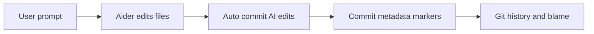

# Aider System Research

_Last updated: 2026-02-18 (UTC)_

## Executive Summary

**Metaphor:** Aider is a **passport stamp at commit time**.
It stamps that AI helped with a commit, but it does not record a per-line travel log.

Aider is a widely adopted coding agent that uses git commits as its primary provenance artifact. It auto-commits AI edits and marks those commits through author/committer name changes or `Co-authored-by` trailers. This yields strong commit-level attribution, but no first-class line-level provenance representation.

## System At A Glance

| Dimension                | What Aider Actually Does                               |
|--------------------------|--------------------------------------------------------|
| Core model               | AI coding agent that auto-commits edits                |
| Primary provenance store | Git commit metadata (author/committer names, trailers) |
| Micro-versioning         | Commit-level only                                      |
| Line-level attribution   | None built-in                                          |
| Git storage strategy     | Native commits                                         |
| AI blame UX              | Manual (use `git blame` + trailer/author patterns)     |
| Integrations             | Aider runtime only (LLM providers are model backends)  |

## Architecture



---

## Challenge 1: Capturing Agent Activity

### Supported Agents And Providers

| Agent or Provider                        | Support Status          | Confidence         | Evidence                                     |
|------------------------------------------|-------------------------|--------------------|----------------------------------------------|
| Aider CLI runtime                        | Supported               | High (code + docs) | `aider/website/docs/git.md`, `aider/repo.py` |
| Multiple LLM providers as model backends | Supported for inference | Medium (docs)      | `aider/website/docs/llms/*.md`               |

### How It Works

1. Aider runs as the primary coding agent.
2. It tracks the edits it makes during the session.
3. It commits those edits directly to git, providing attribution markers in the commit metadata.

Boundary:
- Aider only captures what happens inside its own runtime. It does not ingest other agent logs or IDE hook events.

---

## Challenge 2: Capturing File Change And Micro-versioning

### How It Works

1. Aider edits files in response to prompts.
2. By default, it auto-commits changes after each edit cycle.
3. It can pre-commit “dirty” user changes to keep user edits separated from AI edits.

Result:
- Micro-versioning exists only at the commit boundary. It does not preserve intra-commit snapshots or line-level edit timelines.

---

## Challenge 3: Correlating Agent Change To File Change

### How It Works

1. Aider knows which files it edited during the session.
2. It commits those changes immediately.
3. The commit is treated as the correlation unit between AI activity and file changes.

Trade-off:
- Strong commit-level attribution, weak intra-commit correlation.

---

## Challenge 4: Representing Agent Provenance

### Representation Used

Aider represents AI provenance by modifying commit metadata:
- `Co-authored-by` trailer with model name
- Author and/or committer name suffixed with `(aider)`
- Optional commit message prefix `aider: `

### Sample Representation (Schema-faithful, synthetic)

```text
commit 1a2b3c4d
Author: Jane Dev
Committer: Jane Dev

feat: add retry budget to payment client

Co-authored-by: aider (claude-sonnet-4) <aider@aider.chat>
```

Alternative representation path:

```text
Author: Jane Dev (aider)
Committer: Jane Dev (aider)
```

Field usage for blame:
- Commit metadata is the only signal; blame must parse trailers or author/committer names.

---

## Challenge 5: Storing Agent Provenance In Git

### How It Works

1. Aider writes attribution into the commit object itself.
2. Git branches and merges carry these commit markers naturally.

Trade-off:
- Simple and durable, but limited to commit-level information.

---

## Challenge 6: AI Blame

Aider provides no dedicated AI blame command. Typical approach:
- Run `git blame` and inspect commits for `Co-authored-by` or `(aider)` markers.

---

## Challenge 7: Developer Experience (DX)

### Current DX Shape

- Very low setup friction: Aider uses git directly during normal editing.
- No extra commands needed for provenance once auto-commit is enabled.
- Limited depth: attribution is commit-level only.

---

## Activity, Support, And Community (as of 2026-02-18 UTC)

### GitHub Signals

- Stars: `40,713`
- Forks: `3,897`
- Open issues: `1,385`
- Last push: `2026-02-16T16:26:13Z`

### Collaboration Signals

| Metric                          |                                    Value |
|---------------------------------|-----------------------------------------:|
| Open PRs                        |                                      235 |
| Closed PRs                      |                                      621 |
| Top contributors (API snapshot) | `paul-gauthier`, `ei-grad`, `joshuavial` |

### Delivery Cadence

| Repo             | Version   | Published (UTC)        | Channel |
|------------------|-----------|------------------------|---------|
| `Aider-AI/aider` | `v0.86.2` | `2026-02-12 00:42:24Z` | Git tag |
| `Aider-AI/aider` | `v0.86.1` | `2025-08-13 15:46:00Z` | Git tag |
| `Aider-AI/aider` | `v0.86.0` | `2025-08-09 15:54:51Z` | Git tag |
| `Aider-AI/aider` | `v0.85.5` | `2025-08-07 20:54:54Z` | Git tag |
| `Aider-AI/aider` | `v0.85.4` | `2025-08-07 18:33:43Z` | Git tag |
| `Aider-AI/aider` | `v0.85.3` | `2025-08-07 13:42:12Z` | Git tag |

---

## Observed vs Inferred

**Observed in code/docs:**
- Commit attribution options and defaults in `aider/website/docs/config/options.md`.
- Commit attribution logic in `aider/repo.py`.
- Git integration behavior in `aider/website/docs/git.md`.

**Inferred:**
- Aider is best classified as commit-level AI attribution, not a full line-level provenance system.

---

## Sources

- https://github.com/Aider-AI/aider
- https://github.com/Aider-AI/aider/blob/main/aider/website/docs/git.md
- https://github.com/Aider-AI/aider/blob/main/aider/website/docs/config/options.md
- https://github.com/Aider-AI/aider/blob/main/aider/repo.py
