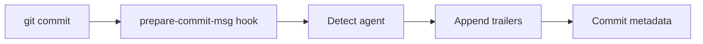

# AIttributor System Research

_Last updated: 2026-02-18 (UTC)_

## Executive Summary

**Metaphor:** AIttributor is a **license plate camera at commit time**.
It detects which AI agent is nearby and stamps commit trailers accordingly.

AIttributor is a lightweight git hook that detects active AI tools and appends attribution trailers to the commit message. It does not capture prompts, tool calls, or line-level provenance, but it is a low-friction commit-level marker that survives standard git workflows.

## System At A Glance

| Dimension                | What AIttributor Actually Does                    |
|--------------------------|---------------------------------------------------|
| Core model               | Prepare-commit-msg hook + agent detection         |
| Primary provenance store | Commit trailers (`Co-authored-by`, `Ai-assisted`) |
| Micro-versioning         | None                                              |
| Line-level attribution   | None                                              |
| Git storage strategy     | Commit metadata                                   |
| AI blame UX              | Manual (blame + trailer inspection)               |
| Integrations             | Multiple agent process/env/breadcrumb detectors   |

## Architecture



---

## Challenge 1: Capturing Agent Activity

### Supported Agents And Providers

| Agent or Provider | Support Status                | Confidence  | Evidence       |
|-------------------|-------------------------------|-------------|----------------|
| Claude Code       | Supported                     | High (code) | `src/agent.rs` |
| Goose             | Supported                     | High (code) | `src/agent.rs` |
| Cursor            | Supported                     | High (code) | `src/agent.rs` |
| Aider             | Supported                     | High (code) | `src/agent.rs` |
| Windsurf          | Supported                     | High (code) | `src/agent.rs` |
| Codex             | Supported                     | High (code) | `src/agent.rs` |
| Copilot Agent     | Supported                     | High (code) | `src/agent.rs` |
| Amazon Q          | Supported                     | High (code) | `src/agent.rs` |
| Amp               | Supported                     | High (code) | `src/agent.rs` |
| Cline             | Supported (env var detection) | High (code) | `src/agent.rs` |
| Gemini CLI        | Supported                     | High (code) | `src/agent.rs` |

### How It Works

1. The hook runs during `prepare-commit-msg`.
2. It detects agents using four signals: agent-specific environment variables, process ancestry, sibling process tree matching the repo cwd, and agent breadcrumb files under known paths.
3. If an agent is detected, it appends commit trailers.

Boundary:
- This is commit-time detection only. It does not capture prompts or tool usage.

---

## Challenge 2: Capturing File Change And Micro-versioning

AIttributor does not capture file change history or micro-versioning. It only emits commit-level attribution markers.

---

## Challenge 3: Correlating Agent Change To File Change

### How It Works

- It correlates by repo working directory and active agent presence at commit time.
- No parsing of file edits or tool calls is performed.

Trade-off:
- Very low friction, but correlation is coarse and can be wrong if multiple agents are active.

---

## Challenge 4: Representing Agent Provenance

### Representation Used

AIttributor uses git trailers:
- `Co-authored-by: <agent email>`
- `Ai-assisted: true`

### Sample Representation (from docs)

```text
feat: refactor connection pooling

Co-authored-by: Claude Code <noreply@anthropic.com>
Ai-assisted: true
```

Field usage for blame:
- Commit-level trailers are the only provenance signal.

---

## Challenge 5: Storing Agent Provenance In Git

AIttributor writes directly into the commit message, so provenance survives merges, rebases, and cherry-picks as normal commit metadata.

---

## Challenge 6: AI Blame

No dedicated AI blame command. Teams can parse trailers after `git blame` identifies the commit.

---

## Challenge 7: Developer Experience (DX)

### Current DX Shape

- Extremely low friction: install hook, then commit normally.
- No extra files or databases.
- Limited depth: only commit-level signals.

---

## Activity, Support, And Community (as of 2026-02-18 UTC)

### GitHub Signals

- Stars: `2`
- Forks: `2`
- Open issues: `1`
- Last push: `2026-02-18T02:30:53Z`

### Collaboration Signals

| Metric                          |                                        Value |
|---------------------------------|---------------------------------------------:|
| Open PRs                        |                                            0 |
| Closed PRs                      |                                            5 |
| Top contributors (API snapshot) | `alecthomas`, `baldawarishi`, `bradleydwyer` |

### Delivery Cadence

| Repo                | Version  | Published (UTC)        | Channel |
|---------------------|----------|------------------------|---------|
| `block/aittributor` | `v0.3.0` | `2026-02-13 01:44:55Z` | Git tag |
| `block/aittributor` | `v0.2.0` | `2026-02-05 06:47:36Z` | Git tag |
| `block/aittributor` | `v0.1.2` | `2026-02-04 19:13:07Z` | Git tag |
| `block/aittributor` | `v0.1.1` | `2026-02-04 18:29:31Z` | Git tag |
| `block/aittributor` | `v0.1.0` | `2026-02-04 11:10:50Z` | Git tag |
| `block/aittributor` | `v0.0.1` | `2026-02-04 09:29:24Z` | Git tag |

---

## Observed vs Inferred

**Observed in code/docs:**
- Detection and known agents in `src/agent.rs`.
- Trailer writing via `git interpret-trailers` in `src/git.rs`.
- Detection strategy ordering in `README.md`.

**Inferred:**
- Best used as a minimal commit-level marker to combine with richer provenance systems.

---

## Sources

- https://github.com/block/aittributor
- https://github.com/block/aittributor/blob/main/README.md
- https://github.com/block/aittributor/blob/main/src/agent.rs
- https://github.com/block/aittributor/blob/main/src/git.rs
