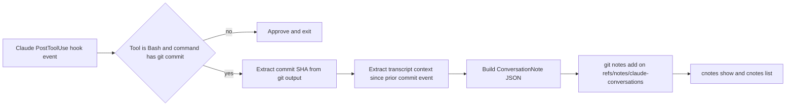

# cnotes System Research

_Last updated: 2026-02-18 (UTC)_

## Executive Summary

**Metaphor:** cnotes is a **commit scrapbook stapled to Git history**:
- It waits for Claude to run `git commit` via Bash.
- It clips recent conversation events from Claude transcripts.
- It attaches that clip as a JSON git note on the commit.

cnotes is intentionally narrow and simple. It is strong for commit-level conversational context, but it does not attempt fine-grained line attribution or robust multi-agent correlation.

## System At A Glance

| Dimension                | What cnotes Does                                                              |
|--------------------------|-------------------------------------------------------------------------------|
| Core model               | Claude PostToolUse hook handler + commit detection + transcript excerpting    |
| Primary provenance store | Git Notes (`refs/notes/claude-conversations` by default)                      |
| In-flight store          | None beyond Claude transcript JSONL + in-memory extraction                    |
| Micro-versioning         | No (commit-triggered capture only)                                            |
| Line-level attribution   | No direct AI blame overlay                                                    |
| Rewrite handling         | Relies on git-notes behavior + manual backup/restore tools                    |
| Agent integrations       | Claude Code only                                                              |
| Privacy controls         | Redaction patterns, excerpt limits, optional disable via `.claude/notes.json` |

## Architecture (End-to-End)



---

## Challenge 1: Capturing Agent Activity

### Supported Agents (Current)

| Agent / Provider                            | Support Status | Confidence         | Evidence                                                              |
|---------------------------------------------|----------------|--------------------|-----------------------------------------------------------------------|
| Claude Code                                 | Supported      | High (docs + code) | README, `internal/config/settings.go`, `internal/commands/root.go`    |
| Cursor / Codex / Gemini / OpenCode / others | Not supported  | High (code scope)  | Hook handler only parses Claude-style payload + PostToolUse Bash gate |

### Implementation

cnotes installs itself as a Claude hook command for `PostToolUse`. At runtime it only processes events where:
- `hook_event_name == PostToolUse`
- `tool_name == Bash`
- Bash command string contains `git commit`

Everything else is explicitly approved and ignored.

### How It Actually Runs

1. Claude hook sends JSON payload to `cnotes` via stdin.
2. cnotes parses hook input (`session_id`, `transcript_path`, tool data).
3. It checks for Bash `git commit` usage.
4. It extracts commit SHA from Bash stdout (commit result line).
5. It loads transcript events and extracts context since prior commit's last processed event timestamp.
6. It writes one ConversationNote git note on that commit SHA.

### Evidence

| Evidence                      | What It Shows                                                                        |
|-------------------------------|--------------------------------------------------------------------------------------|
| `internal/commands/root.go`   | Hook gating logic (`PostToolUse` + `Bash` + commit detection) and note creation flow |
| `internal/config/settings.go` | Install path writes hook under Claude `PostToolUse` only                             |
| README                        | Product positioning as "Git Notes for Claude Conversations"                          |

### Strengths / Trade-offs

| Strength                                          | Trade-off                                |
|---------------------------------------------------|------------------------------------------|
| Very deterministic capture trigger (commit event) | No capture for non-commit agent activity |
| Low integration complexity                        | Single-agent scope (Claude only)         |

---

## Challenge 2: Capturing File Change & Micro-versioning

### Implementation

cnotes does **not** maintain per-edit checkpoints or delta logs. Its capture boundary is commit execution. File changes are inferred only indirectly from transcript/tool excerpts and commit context text.

### How It Actually Behaves

1. Agent performs arbitrary edits during a session.
2. None of those edits are persistently captured by cnotes in real time.
3. On `git commit`, cnotes grabs transcript slice since prior commit event.
4. The note represents commit-level conversation context, not intermediate file states.

### Practical Outcome

- Commit flattening remains largely intact.
- Multiple pre-commit edit cycles are not represented as separate provenance units.

### Evidence

| Evidence                           | What It Shows                                                          |
|------------------------------------|------------------------------------------------------------------------|
| `internal/commands/root.go`        | Capture occurs when commit command is detected, not at edit boundaries |
| `internal/context/conversation.go` | Transcript parsing/excerpting; no file snapshot storage layer          |
| Repo structure                     | No equivalent of per-file delta/checkpoint persistence under `.git/*`  |

### Strengths / Trade-offs

| Strength                                | Trade-off                                    |
|-----------------------------------------|----------------------------------------------|
| Minimal runtime/storage overhead        | No true micro-versioning                     |
| Easy mental model (one note per commit) | Loses granular timing of multi-step AI edits |

---

## Challenge 3: Correlating Agent Change to File Change

### Implementation

Correlation is commit-centric, not line-centric:
- Commit SHA from Bash output anchors where note is attached.
- Transcript context since previous note timestamp provides conversational slice.
- `tools_used` list and excerpt mention files/tools, but there is no deterministic mapping from line ranges to prompts/tool calls.

### Correlation Path

1. Parse commit hash from command output.
2. Find prior commit note (`HEAD~1`) and use `LastEventTime` as lower bound.
3. Extract transcript events after that timestamp.
4. Attach resulting excerpt to new commit.

### What This Means For Concurrency

If multiple sessions or tools are active around the same period, cnotes has no dedicated session-to-file reconciliation beyond transcript filtering. It is best-effort contextual correlation, not strict attribution mapping.

### Evidence

| Evidence                                                            | What It Shows                                               |
|---------------------------------------------------------------------|-------------------------------------------------------------|
| `getLastEventTimeFromPreviousCommit` in `internal/commands/root.go` | Time-window slicing strategy                                |
| `internal/context/conversation.go`                                  | Event extraction and excerpt building from transcript JSONL |
| `ConversationNote` schema                                           | No line-range or file-diff attribution fields               |

### Strengths / Trade-offs

| Strength                                  | Trade-off                                 |
|-------------------------------------------|-------------------------------------------|
| Simple, explainable correlation primitive | Cannot disambiguate line-level authorship |
| Avoids heavy diff/replay algorithms       | Session overlap can reduce precision      |

---

## Challenge 4: Representing Agent Provenance

### Implementation

cnotes stores provenance as one JSON object per commit note (`ConversationNote`).

### Concrete Representation Samples

Git note location:

```text
refs/notes/claude-conversations @ <commit-sha>
```

Representative note payload (schema-faithful):

```json
{
  "session_id": "claude_session_20260218_120109",
  "timestamp": "2026-02-18T12:01:11Z",
  "conversation_excerpt": "User: Add OAuth callback validation\n\nTool (Edit): src/server/auth.ts\n\nAssistant: Added strict callback host checks",
  "tools_used": ["Bash", "Edit", "Read"],
  "commit_context": "Git command: git commit -m \"Add OAuth callback validation\"\nResult: [main a1b2c3d] Add OAuth callback validation",
  "claude_version": "claude-sonnet-4-20250514",
  "last_event_time": "2026-02-18T12:01:10Z"
}
```

### Field-to-Usage Mapping

| Field                  | Used For Later                                       |
|------------------------|------------------------------------------------------|
| `session_id`           | Grouping and human traceability                      |
| `timestamp`            | When note was written                                |
| `conversation_excerpt` | Human-readable "why/how" context                     |
| `tools_used`           | Quick tool summary                                   |
| `commit_context`       | Explicit anchor to commit command/result             |
| `claude_version`       | Model/version provenance hint                        |
| `last_event_time`      | Incremental slicing boundary for next commit capture |

### Evidence

| Evidence                                           | What It Shows                   |
|----------------------------------------------------|---------------------------------|
| `internal/notes/git_notes.go` (`ConversationNote`) | Canonical storage schema        |
| `internal/commands/root.go`                        | Population of schema fields     |
| `internal/notes/git_notes_test.go`                 | Concrete expected payload shape |

### Strengths / Trade-offs

| Strength                                    | Trade-off                              |
|---------------------------------------------|----------------------------------------|
| Human-readable commit context in one object | No line-range attribution model        |
| Lightweight schema                          | Limited machine precision for AI blame |

---

## Challenge 5: Storing Agent Provenance In Git

### Implementation

cnotes writes notes with:

```text
git notes --ref <notes_ref> add -m <json> <commit>
```

Default notes ref is `claude-conversations` and can be changed in `.claude/notes.json`.

### Storage Lifecycle

1. Commit detected.
2. Note JSON assembled.
3. Note added to local git notes ref.
4. Team sharing requires explicit notes push/fetch configuration.

### Rewrite/Branching Reality

Observed implementation does not include dedicated rewrite remapping logic comparable to rebase/cherry-pick reconciliation systems. Operational safety is mainly:
- backup/restore commands (`cnotes backup`, `cnotes restore`)
- normal git-notes behavior when users configure/push notes refs correctly

### Evidence

| Evidence                      | What It Shows                                             |
|-------------------------------|-----------------------------------------------------------|
| `internal/notes/git_notes.go` | Direct note write/read operations                         |
| `internal/notes/backup.go`    | Backup/restore safety mechanism                           |
| README sharing section        | Manual push/fetch and optional `remote.origin.push` setup |

### Strengths / Trade-offs

| Strength                                    | Trade-off                                              |
|---------------------------------------------|--------------------------------------------------------|
| Uses native git notes with configurable ref | Notes remain out-of-band unless sync discipline exists |
| Backup/restore available                    | No first-class rewrite remap engine in code            |

---

## Challenge 6: AI Blame

### Implementation

cnotes does not implement a line-level blame overlay. Instead:
- `cnotes show [commit]` renders commit-attached conversation context.
- `cnotes list` enumerates commits that have notes.
- Chrome extension reads git notes on GitHub commit pages.

### Practical Blame Workflow

1. Use `git blame` externally to find commit SHA for a line.
2. Run `cnotes show <sha>` to see the commit's conversation context.

This is commit-context enrichment, not direct line->prompt attribution.

### Evidence

| Evidence                              | What It Shows                                        |
|---------------------------------------|------------------------------------------------------|
| `internal/commands/notes.go`          | `show`, `list`, `backup`, `restore` command surface  |
| README + `chrome-extension/README.md` | Commit-level viewing model (CLI + browser extension) |

### Strengths / Trade-offs

| Strength                                        | Trade-off                                    |
|-------------------------------------------------|----------------------------------------------|
| Simple and useful for post-hoc commit understanding | No native line-level AI blame command    |

---

## Challenge 7: Developer Experience (DX)

### Implementation

DX is intentionally lightweight:
- `cnotes install` adds Claude hook command to selected scope (`project`, `global`, or `local`).
- Normal Claude + git workflow continues.
- Notes can be viewed with `cnotes show` and managed via backup/restore.

### Operational Burden

1. Install hook once per desired scope.
2. Ensure notes are pushed/fetched for team sharing.
3. Keep privacy config tuned (`enabled`, excerpt length, exclusion patterns).

### Evidence

| Evidence                       | What It Shows                                 |
|--------------------------------|-----------------------------------------------|
| `internal/commands/install.go` | Install/uninstall behavior and scope options  |
| `internal/config/notes.go`     | Privacy-related config defaults and overrides |
| README                         | Sharing and operational guidance              |

### Strengths / Trade-offs

| Strength                                  | Trade-off                                    |
|-------------------------------------------|----------------------------------------------|
| Very low setup complexity                 | Team sync of notes is an extra workflow step |
| Minimal interference with existing habits | Limited attribution depth vs heavier systems |

---

## Activity, Support, and Community (as of 2026-02-18 UTC)

### GitHub Signals

As of 2025-07-22, the `imjasonh/cnotes` repo had 20 stars, 0 forks, 0 open issues, and its last push was on 2025-07-22T02:31:41Z.

### Delivery Cadence (recent releases)

The latest stable release of the `imjasonh/cnotes` repo is version `v0.0.1`, published on 2025-07-21T22:22:42Z.

### Collaboration Signals

| Metric                                 |      Value |
|----------------------------------------|-----------:|
| Open PRs (`cnotes`)                    |          0 |
| Closed PRs (`cnotes`)                  |          0 |
| Top contributors (recent API snapshot) | `imjasonh` |

Interpretation: early, focused single-maintainer project with limited but clear scope.

---

## Overall Assessment For SpecStory Research

cnotes is a good reference for a **minimal commit-attached conversation note** design:
- straightforward hook integration
- simple JSON note schema
- practical privacy knobs

It is not a reference for high-precision AI blame because it does not provide line-level mapping, micro-version replay, or robust rewrite-aware attribution transfer.

---

## Sources

### Product / Docs
- https://github.com/imjasonh/cnotes
- https://github.com/imjasonh/cnotes/blob/main/README.md
- https://github.com/imjasonh/cnotes/tree/main/chrome-extension

### Code
- https://github.com/imjasonh/cnotes/blob/main/internal/commands/root.go
- https://github.com/imjasonh/cnotes/blob/main/internal/config/settings.go
- https://github.com/imjasonh/cnotes/blob/main/internal/context/conversation.go
- https://github.com/imjasonh/cnotes/blob/main/internal/notes/git_notes.go
- https://github.com/imjasonh/cnotes/blob/main/internal/notes/backup.go

### Activity Metrics (GitHub API)
- https://api.github.com/repos/imjasonh/cnotes
- https://api.github.com/repos/imjasonh/cnotes/releases?per_page=10
- https://api.github.com/search/issues?q=repo:imjasonh/cnotes+type:pr+state:open
- https://api.github.com/search/issues?q=repo:imjasonh/cnotes+type:pr+state:closed
- https://api.github.com/repos/imjasonh/cnotes/contributors?per_page=10
