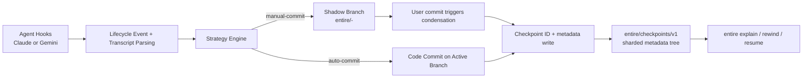

# Entire System Research

_Last updated: 2026-02-18 (UTC)_

## Executive Summary

**Metaphor:** Entire behaves like **double-entry bookkeeping for AI coding**:
- one ledger = your code branch
- second ledger = `entire/checkpoints/v1` metadata branch
- temporary shadow ledger = in-progress session checkpoints before condensation

Entire is strongest at **session/checkpoint-level provenance workflows** (rewind/resume/explain), with weaker support for strict line-level AI blame.

## System At A Glance

| Dimension                | What Entire Does                                                                |
|--------------------------|---------------------------------------------------------------------------------|
| Core model               | Agent hooks + strategy engine (`manual-commit` default, `auto-commit` optional) |
| Primary provenance store | Dedicated Git branch: `entire/checkpoints/v1`                                   |
| In-flight store          | Shadow branches: `entire/<base[:7]>-<worktreeHash[:6]>`                         |
| Session state            | `.git/entire-sessions/<session-id>.json` (git common dir)                       |
| Micro-versioning         | Yes (temporary/final checkpoints; task incremental checkpoints)                 |
| Line-level AI blame      | No direct `blame` overlay equivalent                                            |
| Main explainability UX   | `entire explain`, `entire rewind`, `entire resume`                              |
| Agent integrations       | Claude Code (deep integration), Gemini CLI (preview/integration path)           |

## Architecture (End-to-End)



---

## Challenge 1: Capturing Agent Activity

### Implementation

Entire uses explicit agent hook integrations and normalizes hooks into lifecycle events:
- Claude Code: `SessionStart`, `UserPromptSubmit`, `Stop`, `PreToolUse[Task]`, `PostToolUse[Task]`, `PostToolUse[TodoWrite]`
- Gemini CLI: session/turn hooks plus additional before/after model/tool hooks

Session identity and phase are persisted in `.git/entire-sessions/*.json` so event handling is stateful across hook invocations.

### How It Actually Behaves During A Turn

1. On `SessionStart`, Entire creates/loads session state and binds a stable session ID.
2. On `UserPromptSubmit`, Entire captures pre-prompt repo state (for later diffing) and checks for conflicting active sessions.
3. While the agent runs, task hooks can capture subagent boundaries (`tool_use_id`) and incremental progress.
4. On `Stop` (or Gemini equivalent turn-end event), Entire parses transcript deltas, computes touched files, and calls strategy save logic.
5. Session phase transitions are persisted so crash/restart workflows can continue safely.

### Evidence

| Evidence                                        | What It Shows                                  |
|-------------------------------------------------|------------------------------------------------|
| `docs/architecture/claude-hooks-integration.md` | Detailed Claude hook timing/payload/use cases  |
| `cmd/entire/cli/agent/claudecode/hooks.go`      | Hook installation into Claude settings         |
| `cmd/entire/cli/agent/geminicli/hooks.go`       | Gemini hook installation/mapping               |
| `cmd/entire/cli/agent/*/lifecycle.go`           | Hook→normalized lifecycle event parsing        |
| `cmd/entire/cli/session/state.go`               | Persistent session state schema/phase tracking |

### Strengths / Trade-offs

| Strength                                                          | Trade-off                                            |
|-------------------------------------------------------------------|------------------------------------------------------|
| Rich, explicit event model (especially for Claude subagent flows) | Agent coverage is narrower than Git AI today         |
| State-machine backed lifecycle reduces ambiguity                  | Integration depth differs by agent (Claude > Gemini) |

---

## Challenge 2: Capturing File Change & Micro-versioning

### Implementation

Entire supports two micro-versioning strategies:

1. **Manual-commit (default)**
- frequent temporary checkpoints on shadow branches
- user commits code normally
- post-commit condenses checkpoint metadata to `entire/checkpoints/v1`

2. **Auto-commit**
- each step can produce a code commit on active branch
- each commit gets `Entire-Checkpoint: <id>` trailer
- metadata is written immediately to `entire/checkpoints/v1`

For Claude subagents, TodoWrite can create incremental task checkpoints during execution.

### Manual-commit Strategy Mechanics

1. Save points are written to a shadow branch tied to base commit + worktree.
2. Checkpoint data includes transcript/context metadata and file change sets.
3. User makes normal git commits on their code branch.
4. Post-commit hook condenses eligible shadow data into `entire/checkpoints/v1`.
5. Shadow data is cleaned/migrated based on remaining session state.

### Auto-commit Strategy Mechanics

1. Entire stages detected step changes.
2. Entire creates a code commit on active branch with `Entire-Checkpoint: <id>`.
3. Entire writes checkpoint metadata to `entire/checkpoints/v1` under sharded path derived from `<id>`.
4. Rewind/explain then resolve from commit trailer to metadata path directly.

### Evidence

| Evidence                                                | What It Shows                                  |
|---------------------------------------------------------|------------------------------------------------|
| `docs/architecture/sessions-and-checkpoints.md`         | Temporary vs committed checkpoint model        |
| `cmd/entire/cli/strategy/manual_commit_condensation.go` | Condensation from shadow to committed metadata |
| `cmd/entire/cli/strategy/auto_commit.go`                | Immediate code commit + metadata commit flow   |
| `cmd/entire/cli/checkpoint/committed.go`                | Task/incremental checkpoint file layouts       |

### Micro-versioning Timeline (manual-commit)

```text
Prompt start -> temp checkpoint(s) on shadow branch -> user commit
-> condense shadow state -> committed checkpoint in entire/checkpoints/v1
```

### Strengths / Trade-offs

| Strength                                                            | Trade-off                                                      |
|---------------------------------------------------------------------|----------------------------------------------------------------|
| Captures intra-commit progression, not just final diff              | More moving parts (state files, shadow branches, condensation) |
| Strategy choice lets teams optimize for clean history vs automation | Auto-commit can clutter active branch history                  |

---

## Challenge 3: Correlating Agent Change to File Change

### Implementation

Entire correlates using:
- hook phase boundaries (pre/post turn, pre/post task)
- transcript tool-use extraction (modified paths)
- pre-prompt/pre-task snapshots of untracked files
- git status/diff checks for modified/new/deleted sets
- `tool_use_id` for subagent checkpoint pairing
- session phase + worktree-aware state to handle concurrency

### Correlation Walkthrough (Concrete)

1. Prompt starts: Entire snapshots untracked state and transcript position.
2. Agent edits files and may spawn subagents.
3. Stop/PostTask: Entire parses transcript tool calls for explicit file paths.
4. Entire compares current repo state vs pre-snapshot to identify new/deleted/modified files.
5. Entire maps those file changes to current session/turn (and task via `tool_use_id` when applicable).
6. Strategy writes checkpoint with that resolved file set plus session metadata.

### Evidence

| Evidence                                        | What It Shows                                                   |
|-------------------------------------------------|-----------------------------------------------------------------|
| `docs/architecture/claude-hooks-integration.md` | Pre/post snapshots + task correlation by `tool_use_id`          |
| `cmd/entire/cli/agent/claudecode/transcript.go` | Modified-file extraction + checkpoint UUID linkage              |
| `cmd/entire/cli/agent/geminicli/transcript.go`  | Gemini transcript file extraction logic                         |
| `cmd/entire/cli/session/phase.go`               | Session state machine for transition correctness                |
| `docs/KNOWN_LIMITATIONS.md`                     | Concurrent ACTIVE session edge case (spurious checkpoint noise) |

### Strengths / Trade-offs

| Strength                                                             | Trade-off                                                                    |
|----------------------------------------------------------------------|------------------------------------------------------------------------------|
| Good session/task-level correlation, especially for Claude subagents | Not designed for deterministic per-line mapping                              |
| Worktree/session IDs reduce collision risk                           | Concurrent same-worktree sessions can still produce cosmetic false positives |

---

## Challenge 4: Representing Agent Provenance

### Implementation

Representation is checkpoint-centric:
- checkpoint IDs (12-hex) link code commits ↔ metadata tree
- commit trailers (`Entire-Checkpoint`, plus session/strategy trailers on metadata branch commits)
- metadata objects include transcript, prompts, context, token usage, files touched, and attribution summary fields

Storage layout under `entire/checkpoints/v1` is sharded and can store multiple sessions per checkpoint (`0/`, `1/`, ...).

### Concrete Representation Samples

Sample user branch commit (what links code to provenance):

```text
feat: add OAuth callback handling

Entire-Checkpoint: a3b2c4d5e6f7
```

Sample metadata branch commit message (`entire/checkpoints/v1`):

```text
Checkpoint: a3b2c4d5e6f7

Entire-Session: 2026-02-18-9f93d8d0-3b7d-4b56-90be-8b4f5bbd2e10
Entire-Strategy: manual-commit
Entire-Agent: Claude Code
Ephemeral-branch: entire/2b4c177-a9e31c
```

Sample checkpoint directory shape:

```text
entire/checkpoints/v1
└── a3/b2c4d5e6f7/
    ├── metadata.json
    ├── 0/
    │   ├── metadata.json
    │   ├── full.jsonl
    │   ├── prompt.txt
    │   ├── context.md
    │   └── content_hash.txt
    └── 1/
        └── ...
```

Representative root `metadata.json` (`CheckpointSummary`):

```json
{
  "checkpoint_id": "a3b2c4d5e6f7",
  "strategy": "manual-commit",
  "branch": "feature/oauth",
  "checkpoints_count": 3,
  "files_touched": ["cmd/auth/callback.go", "cmd/auth/session.go"],
  "sessions": [
    {
      "metadata": "/a3/b2c4d5e6f7/0/metadata.json",
      "transcript": "/a3/b2c4d5e6f7/0/full.jsonl",
      "context": "/a3/b2c4d5e6f7/0/context.md",
      "content_hash": "/a3/b2c4d5e6f7/0/content_hash.txt",
      "prompt": "/a3/b2c4d5e6f7/0/prompt.txt"
    }
  ]
}
```

Representative session `0/metadata.json` (`CommittedMetadata`):

```json
{
  "checkpoint_id": "a3b2c4d5e6f7",
  "session_id": "2026-02-18-9f93d8d0-3b7d-4b56-90be-8b4f5bbd2e10",
  "strategy": "manual-commit",
  "created_at": "2026-02-18T12:01:09Z",
  "checkpoints_count": 3,
  "files_touched": ["cmd/auth/callback.go", "cmd/auth/session.go"],
  "agent": "Claude Code",
  "turn_id": "0e51e44c-4476-4f7e-9d76-7459575f9752",
  "checkpoint_transcript_start": 128,
  "initial_attribution": {
    "agent_lines": 114,
    "human_added": 28,
    "human_modified": 12,
    "human_removed": 6,
    "total_committed": 142,
    "agent_percentage": 80.3
  }
}
```

### Commit-To-Representation Resolution Path

1. Read `Entire-Checkpoint` trailer from code commit.
2. Convert checkpoint ID to sharded path (`<id[:2]>/<id[2:]>`).
3. Read root `metadata.json` for aggregate session pointers.
4. Read one or more session subdirectories for transcript and prompt context.

### Evidence

| Evidence                                  | What It Shows                                    |
|-------------------------------------------|--------------------------------------------------|
| `cmd/entire/cli/trailers/trailers.go`     | Trailer keys and checkpoint parsing              |
| `cmd/entire/cli/checkpoint/checkpoint.go` | `CheckpointSummary` / `CommittedMetadata` schema |
| `cmd/entire/cli/checkpoint/committed.go`  | Path sharding + per-session file map             |
| `docs/architecture/attribution.md`        | Attribution model and intent                     |

### Important Note (doc/code drift)

The architecture doc discusses an `Entire-Attribution` trailer, but current code paths center on:
- `Entire-Checkpoint` trailer on code commits
- attribution snapshot persisted in checkpoint metadata (`initial_attribution`)

### Strengths / Trade-offs

| Strength                                                                 | Trade-off                                                  |
|--------------------------------------------------------------------------|------------------------------------------------------------|
| Rich checkpoint/session context is excellent for “what happened and why” | Representation is commit/session-centric, not line-centric |
| Structured metadata branch is easy to query programmatically             | Needs robust conventions to avoid doc/code schema drift    |

---

## Challenge 5: Storing Agent Provenance In Git

### Implementation

Entire uses three Git-scoped layers:
- **Permanent:** `entire/checkpoints/v1` metadata branch
- **Temporary:** shadow branches (`entire/<base>-<worktree>`) during active work
- **State files:** `.git/entire-sessions/` for live session orchestration

Pre-push hooks can push the metadata branch alongside normal pushes, including merge/sync handling when remote metadata diverges.

### Storage Lifecycle Details

1. Session starts on working branch with in-progress data on shadow branch.
2. User commit triggers condensation from shadow state to metadata branch.
3. Metadata branch writes are append/update operations keyed by checkpoint ID path.
4. Pre-push hook can sync and push metadata branch to remote in the same user push flow.
5. On divergence, Entire attempts fetch+merge of metadata branch before retrying push.

### Evidence

| Evidence                                             | What It Shows                                             |
|------------------------------------------------------|-----------------------------------------------------------|
| `docs/architecture/sessions-and-checkpoints.md`      | Branch/state model and sharded storage                    |
| `cmd/entire/cli/strategy/manual_commit.go`           | Ensures metadata branch + git hooks setup                 |
| `cmd/entire/cli/strategy/push_common.go`             | Pre-push synchronization and conflict handling            |
| `cmd/entire/cli/strategy/manual_commit_migration.go` | Shadow branch migration behavior when base commit changes |

### Strengths / Trade-offs

| Strength                                                    | Trade-off                                                                        |
|-------------------------------------------------------------|----------------------------------------------------------------------------------|
| Keeps code history and provenance history cleanly separated | Requires branch management discipline (`entire/checkpoints/v1`, shadow branches) |
| Explicit metadata branch avoids Git Notes tooling mismatch  | More custom semantics than pure note-based approaches                            |

---

## Challenge 6: AI Blame

### Implementation

Entire does **not** currently provide a native line-level `git blame` overlay equivalent.

Instead it provides checkpoint/session explainability:
- `entire explain` (session/commit/checkpoint narratives)
- `entire rewind` (restore prior checkpoint state)
- `entire resume` (restore checkpointed session context)

### Practical AI-Blame Equivalent In Entire

1. Start from a code commit.
2. Extract `Entire-Checkpoint` trailer.
3. Load checkpoint metadata/transcript.
4. Use `entire explain` output to answer intent, prompts, and files touched.

This is commit/session-level explainability, not per-line origin tracing.

### Evidence

| Evidence                   | What It Shows                            |
|----------------------------|------------------------------------------|
| Command list (`README.md`) | Explain/rewind/resume are first-class    |
| Codebase search            | No dedicated line-level AI blame command |

### Strengths / Trade-offs

| Strength                                                            | Trade-off                                                              |
|---------------------------------------------------------------------|------------------------------------------------------------------------|
| Strong “checkpoint archaeology” UX for understanding sessions/tasks | Cannot directly answer “which prompt/session produced this exact line” |
| Practical for recovery and workflow continuity                      | Needs extra reasoning step from commit->checkpoint->transcript         |

---

## Challenge 7: Developer Experience (DX)

### Implementation

DX is strategy-driven and workflow-aware:
- `entire enable` installs git + agent hooks
- default `manual-commit` keeps main branch clean
- optional `auto-commit` for maximal automation
- user tooling: `status`, `rewind`, `resume`, `doctor`, `explain`, `clean`
- supports git worktrees and concurrent sessions with conflict warnings

### Operational Burden (What Devs Must Remember)

1. Run `entire enable` once per repo (and per agent integration as needed).
2. Avoid pushing shadow branches; only push normal code branches + metadata branch sync flow.
3. Use `manual-commit` when preserving clean code history is primary.
4. Use `auto-commit` when automatic code checkpoint commits are primary.
5. For concurrent work, prefer separate git worktrees to reduce same-worktree session interference.

### Evidence

| Evidence                                          | What It Shows                                                                     |
|---------------------------------------------------|-----------------------------------------------------------------------------------|
| `README.md` and docs (`quickstart`, `strategies`) | onboarding and strategy mental model                                              |
| `cmd/entire/cli/strategy/hooks.go`                | managed git hooks (`prepare-commit-msg`, `commit-msg`, `post-commit`, `pre-push`) |
| `docs/KNOWN_LIMITATIONS.md`                       | realistic operational edge cases and mitigations                                  |

### Strengths / Trade-offs

| Strength                                                          | Trade-off                                                                  |
|-------------------------------------------------------------------|----------------------------------------------------------------------------|
| Thoughtful CLI around provenance workflows (not just raw storage) | More concepts to learn (sessions/checkpoints/strategies/shadow branch)     |
| Manual-commit minimizes disruption to common git habits           | Debugging hook/state interactions can be non-trivial in advanced workflows |

---

## Activity, Support, and Community (as of 2026-02-18 UTC)

### GitHub Signals

| Repo                 | Stars | Forks | Open Issues | Last Push (UTC)      |
|----------------------|------:|------:|------------:|----------------------|
| `entireio/cli`       | 2,642 |   173 |          86 | 2026-02-18T09:42:29Z |
| `entireio/test-repo` |     2 |     1 |           0 | 2026-02-13T13:36:33Z |

### Delivery Cadence (recent releases)

| Repo           | Version  | Published (UTC)      | Channel |
|----------------|----------|----------------------|---------|
| `entireio/cli` | `v0.4.5` | 2026-02-17T16:56:54Z | Stable  |
| `entireio/cli` | `v0.4.4` | 2026-02-13T10:22:57Z | Stable  |
| `entireio/cli` | `v0.4.3` | 2026-02-12T13:47:19Z | Stable  |
| `entireio/cli` | `v0.4.2` | 2026-02-10T14:33:22Z | Stable  |

### Collaboration Signals

| Metric                                 |                                    Value |
|----------------------------------------|-----------------------------------------:|
| Open PRs (`entireio/cli`)              |                                       36 |
| Closed PRs (`entireio/cli`)            |                                      284 |
| Top contributors (recent API snapshot) | `khaong`, `Soph`, `gtrrz-victor`, others |

Interpretation: highly active early-stage project with rapid shipping velocity and visible community traction.

---

## Overall Assessment For SpecStory Research

Entire is a strong reference for:
- checkpoint-centric provenance UX
- strategy-based trade-off control (`manual-commit` vs `auto-commit`)
- structured metadata branch design

But for strict AI blame requirements (line-level provenance), Entire currently provides session/commit explainability rather than direct line-mapping. If SpecStory’s highest-priority output is true per-line AI blame, Entire is more of a **workflow provenance** benchmark than a line-precision benchmark.

---

## Sources

### Product / Docs
- https://entire.io/
- https://docs.entire.io/
- https://docs.entire.io/quickstart
- https://docs.entire.io/core-concepts
- https://docs.entire.io/cli/strategies
- https://docs.entire.io/integrations/claude-code
- https://docs.entire.io/integrations/gemini-cli

### Code
- https://github.com/entireio/cli
- https://github.com/entireio/test-repo

### Activity Metrics (GitHub API)
- https://api.github.com/repos/entireio/cli
- https://api.github.com/repos/entireio/test-repo
- https://api.github.com/repos/entireio/cli/releases?per_page=10
- https://api.github.com/search/issues?q=repo:entireio/cli+type:pr+state:open
- https://api.github.com/search/issues?q=repo:entireio/cli+type:pr+state:closed
- https://api.github.com/repos/entireio/cli/contributors?per_page=10

### Local Architecture Docs In Repo
- `docs/architecture/sessions-and-checkpoints.md`
- `docs/architecture/claude-hooks-integration.md`
- `docs/architecture/attribution.md`
- `docs/KNOWN_LIMITATIONS.md`
