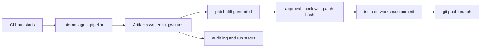

# Git With Intent System Research

_Last updated: 2026-02-18 (UTC)_

## Executive Summary

**Metaphor:** Git With Intent is an **AI release control tower**, not a line-level black box recorder.

It is strong at:
- workflow automation (`issue -> code -> review -> commit/push`)
- approval gating and policy controls
- auditability of run decisions

It is weak for SpecStory's AI-blame target because it does **not** implement line-level provenance persistence in Git (no `refs/notes/*` provenance scheme, no blame overlay command).

## System At A Glance

| Dimension                  | What Git With Intent Actually Does                                                      |
|----------------------------|-----------------------------------------------------------------------------------------|
| Core model                 | Orchestrated internal agents operating on run bundles                                   |
| In-flight provenance       | `.gwi/runs/<runId>/` artifacts + audit logs                                             |
| Approval model             | Patch-hash-bound approvals (`approval.json`) plus signed approvals in `.gwi/approvals/` |
| Micro-versioning           | No per-line/per-edit provenance ledger                                                  |
| Git storage for provenance | No native line provenance in Git notes                                                  |
| AI blame UX                | No built-in line-level AI blame command                                                 |
| Agent scope                | Internal GWI agents (not external coding assistant transcript capture)                  |

## Architecture



---

## Challenge 1: Capturing Agent Activity

### Supported Agents And Providers

| Agent or Provider                    | Support Status                         | Confidence         | Evidence                                                 |
|--------------------------------------|----------------------------------------|--------------------|----------------------------------------------------------|
| `orchestrator`                       | Supported                              | High (code)        | `packages/agents/src/orchestrator/index.ts`              |
| `foreman`                            | Supported                              | High (code)        | `packages/agents/src/foreman/index.ts`                   |
| `triage`                             | Supported                              | High (code)        | `packages/agents/src/triage/index.ts`                    |
| `resolver`                           | Supported                              | High (code)        | `packages/agents/src/resolver/index.ts`                  |
| `reviewer`                           | Supported                              | High (code)        | `packages/agents/src/reviewer/index.ts`                  |
| `coder`                              | Supported                              | High (code)        | `packages/agents/src/coder/index.ts`                     |
| `infra`                              | Supported                              | High (code)        | `packages/agents/src/infra/index.ts`                     |
| `slop-detector`                      | Supported                              | High (code)        | `packages/agents/src/slop/slop-detector-agent.ts`        |
| Cursor or Claude Code hook ingestion | Not implemented for provenance capture | High (code + docs) | README positioning and no provider hook capture pipeline |

### How It Works

1. A run starts from CLI/webhook/API and creates a run context (`run.json`).
2. Internal GWI agents execute tasks and produce artifacts (`triage.json`, `plan.json`, `patch.diff`, `review.json`).
3. Audit events are appended as JSONL to `audit.log`.
4. This captures **GWI agent workflow activity**, not external coding assistant message/tool streams.

Observed vs inferred:
- **Observed:** run-bundle schema and audit append APIs.
- **Inference:** this is sufficient for governance tracing but not equivalent to external coding-session provenance.

---

## Challenge 2: Capturing File Change And Micro-versioning

### How It Works

1. Coder output is produced as file payloads / patch artifacts.
2. Autopilot applies generated changes in an isolated workspace.
3. A normal Git commit is created once changes are staged.
4. Push occurs after approval coverage checks.

What is missing for micro-versioning:
- no append-only per-edit delta ledger keyed to line ranges
- no intermediate edit lineage inside one commit

Result: Git flattening behavior remains; run artifacts explain intent at run/step level, not line-level edit chronology.

---

## Challenge 3: Correlating Agent Change To File Change

### How It Works

1. Correlation anchor is `runId`, not file-line blame metadata.
2. Agent outputs include target files and generated content/patches.
3. Approval records bind run + scopes + patch hash.
4. Isolated workspace commit applies the full patch set.

This is deterministic for “which run produced this commit candidate,” but it does not correlate individual lines back to specific prompt/tool turns the way AI blame needs.

---

## Challenge 4: Representing Agent Provenance

### Representation Used

Git With Intent uses **run-bundle documents** plus approvals.

Primary local representation paths:
- `.gwi/runs/<runId>/run.json`
- `.gwi/runs/<runId>/patch.diff`
- `.gwi/runs/<runId>/approval.json`
- `.gwi/runs/<runId>/audit.log`
- `.gwi/approvals/<approvalId>.json`

### Sample Representation 1: `run.json` (schema-faithful synthetic)

```json
{
  "runId": "5f0cb72f-5fd6-4ad8-8f36-5f2294e830f0",
  "version": 1,
  "createdAt": "2026-02-18T00:22:11Z",
  "updatedAt": "2026-02-18T00:29:43Z",
  "repo": { "owner": "acme", "name": "api", "fullName": "acme/api" },
  "issueUrl": "https://github.com/acme/api/issues/482",
  "initiator": "dev@acme.com",
  "models": {
    "triage": "gemini-2.0-flash-exp",
    "resolver": "claude-sonnet-4-20250514",
    "reviewer": "claude-sonnet-4-20250514",
    "coder": "claude-sonnet-4-20250514"
  },
  "capabilitiesMode": "commit-after-approval",
  "state": "awaiting_approval",
  "previousStates": [
    { "state": "queued", "timestamp": "2026-02-18T00:22:11Z" },
    { "state": "triaged", "timestamp": "2026-02-18T00:22:28Z" }
  ]
}
```

Field use later:
- `runId`: joins all run artifacts and approvals
- `state` and `previousStates`: execution timeline
- `models`: model provenance at phase granularity
- `capabilitiesMode`: what destructive operations are allowed

### Sample Representation 2: Signed approval (schema-faithful synthetic)

```json
{
  "approvalId": "988fd311-2283-4ee0-9fb6-6acb37d15d11",
  "tenantId": "default",
  "approver": { "type": "user", "id": "dev@acme.com", "email": "dev@acme.com" },
  "approverRole": "DEVELOPER",
  "decision": "approved",
  "scopesApproved": ["commit", "push"],
  "targetType": "run",
  "target": { "runId": "5f0cb72f-5fd6-4ad8-8f36-5f2294e830f0", "repo": "acme/api" },
  "intentHash": "8b5a4fa2...",
  "patchHash": "18e90be7...",
  "source": "cli",
  "signature": "J6Aj...",
  "signingKeyId": "key-a19b5e8d72dfc911",
  "createdAt": "2026-02-18T00:29:43Z"
}
```

Field use later:
- `intentHash` and `patchHash`: cryptographic binding of approval to planned/applied change
- `scopesApproved`: policy gate enforcement
- `signature` and `signingKeyId`: integrity verification

---

## Challenge 5: Storing Agent Provenance In Git

### How It Works Today

1. Changes are committed through normal Git operations in isolated workspace.
2. Provenance and approvals are persisted under `.gwi/` directories.
3. Push publishes branch commits; provenance is not published as Git notes line metadata.

Important boundary:
- This system uses Git as code transport and `.gwi` artifacts as provenance/audit transport.
- It does not implement a Git-native provenance ref strategy equivalent to `refs/notes/<provenance>` for blame lookup.

---

## Challenge 6: AI Blame

Git With Intent does not expose a line-level AI blame command.

Practical lookup path is:
1. find commit/run externally
2. inspect run artifacts (`run status`, `audit.log`, `review.json`, `approval records`)

That gives run-level explainability, but not `line -> exchange -> prompt/tool` attribution.

---

## Challenge 7: Developer Experience (DX)

### What Is Good

- Strong guardrails for destructive actions.
- Clear run-status UX for governance-heavy teams.
- Approval workflow is explicit and hash-bound.

### Cost

- More operational ceremony than lightweight tools.
- Provenance is operational/audit-centric, not blame-centric.
- Teams seeking direct AI blame still need another layer.

---

## Activity, Support, And Community (as of 2026-02-18 UTC)

### GitHub Signals

- Stars: `9`
- Forks: `0`
- Open issues: `0`
- Last push: `2026-02-18T05:18:21Z`

### Delivery Cadence (recent releases)

| Repo                                      | Version  | Published (UTC)      | Channel |
|-------------------------------------------|----------|----------------------|---------|
| `intent-solutions-io/iam-git-with-intent` | `v0.9.0` | 2026-02-18T00:40:17Z | Stable  |
| `intent-solutions-io/iam-git-with-intent` | `v0.8.0` | 2026-02-13T00:17:58Z | Stable  |
| `intent-solutions-io/iam-git-with-intent` | `v0.7.1` | 2026-02-04T04:01:17Z | Stable  |
| `intent-solutions-io/iam-git-with-intent` | `v0.7.0` | 2026-02-03T09:10:40Z | Stable  |
| `intent-solutions-io/iam-git-with-intent` | `v0.6.0` | 2026-01-30T05:15:08Z | Stable  |
| `intent-solutions-io/iam-git-with-intent` | `v0.5.1` | 2026-01-29T07:10:49Z | Stable  |
| `intent-solutions-io/iam-git-with-intent` | `v0.5.0` | 2026-01-27T05:22:35Z | Stable  |
| `intent-solutions-io/iam-git-with-intent` | `v0.4.0` | 2026-01-24T02:16:45Z | Stable  |
| `intent-solutions-io/iam-git-with-intent` | `v0.3.0` | 2025-12-27T19:25:45Z | Stable  |
| `intent-solutions-io/iam-git-with-intent` | `v0.2.0` | 2025-12-16T05:49:11Z | Stable  |

### Collaboration Signals

| Metric                         |             Value |
|--------------------------------|------------------:|
| Open PRs                       |                 0 |
| Closed PRs                     |                85 |
| Top contributor (API snapshot) | `jeremylongshore` |

Interpretation: high shipping velocity, currently concentrated maintainer footprint.

---

## Overall Assessment For SpecStory Research

Git With Intent is a strong reference for:
- approval-bound AI workflow automation
- run-level auditability and governance

It is not currently a strong reference for:
- Git-native line provenance persistence
- direct AI blame workflows

For SpecStory's provenance goals, it is best treated as a governance and control-plane design reference, not the provenance data-plane reference.

---

## Sources

- https://github.com/intent-solutions-io/iam-git-with-intent
- https://github.com/intent-solutions-io/iam-git-with-intent/blob/main/README.md
- https://github.com/intent-solutions-io/iam-git-with-intent/blob/main/docs/operator-basics.md
- https://github.com/intent-solutions-io/iam-git-with-intent/blob/main/packages/core/src/run-bundle/types.ts
- https://github.com/intent-solutions-io/iam-git-with-intent/blob/main/packages/core/src/run-bundle/run-context.ts
- https://github.com/intent-solutions-io/iam-git-with-intent/blob/main/packages/core/src/run-bundle/audit-log.ts
- https://github.com/intent-solutions-io/iam-git-with-intent/blob/main/packages/core/src/capabilities/approval-verifier.ts
- https://github.com/intent-solutions-io/iam-git-with-intent/blob/main/packages/core/src/approvals/types.ts
- https://github.com/intent-solutions-io/iam-git-with-intent/blob/main/packages/core/src/approvals/signature.ts
- https://github.com/intent-solutions-io/iam-git-with-intent/blob/main/packages/core/src/workspace-isolation.ts
- https://github.com/intent-solutions-io/iam-git-with-intent/blob/main/packages/engine/src/run/autopilot-executor.ts
- https://github.com/intent-solutions-io/iam-git-with-intent/blob/main/packages/engine/src/run/approval-loader.ts
- https://github.com/intent-solutions-io/iam-git-with-intent/blob/main/apps/cli/src/commands/run.ts
- https://github.com/intent-solutions-io/iam-git-with-intent/blob/main/apps/cli/src/commands/approval.ts
- https://api.github.com/repos/intent-solutions-io/iam-git-with-intent
- https://api.github.com/repos/intent-solutions-io/iam-git-with-intent/releases?per_page=20
- https://api.github.com/search/issues?q=repo:intent-solutions-io/iam-git-with-intent+type:pr+state:open
- https://api.github.com/search/issues?q=repo:intent-solutions-io/iam-git-with-intent+type:pr+state:closed
- https://api.github.com/repos/intent-solutions-io/iam-git-with-intent/contributors?per_page=10
