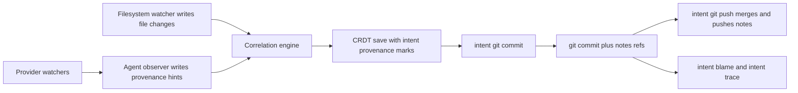

# Intent Git Mode System Research

_Last updated: 2026-02-18 (UTC)_

## Executive Summary

**Metaphor:** Intent Git Mode is a **dual-entry provenance ledger**:
- CRDT marks record fine-grained authorship as edits happen.
- Git notes publish commit-linked provenance so teams can share and query it.

Among the systems studied so far, this is one of the most complete end-to-end implementations for line-aware AI blame plus inverse tracing.

## System At A Glance

| Dimension             | What Intent Git Mode Actually Does                                    |
|-----------------------|-----------------------------------------------------------------------|
| Agent capture         | Multi-provider watcher bridge via SpecStory provider registry         |
| File micro-versioning | Every filesystem change saved into CRDT history with provenance marks |
| Correlation           | Scored matcher engine links file-change events to provenance hints    |
| Git provenance store  | `refs/notes/intent/exchanges` and `refs/notes/intent/metadata`        |
| Sync tracking         | SQLite `git_sync` table links journal event IDs to commit SHA         |
| AI blame              | `intent blame` combines Git blame + notes + CRDT for dirty files      |
| Inverse lookup        | `intent trace <exchangeId>` maps exchange to current lines            |

## Architecture



---

## Challenge 1: Capturing Agent Activity

### Supported Agents And Providers

| Agent or Provider           | Support Status | Confidence  | Evidence                                                   |
|-----------------------------|----------------|-------------|------------------------------------------------------------|
| Claude Code (`claude`)      | Supported      | High (code) | `pkg/spi/factory/registry.go`, `pkg/utils/watch_agents.go` |
| Cursor CLI (`cursor`)       | Supported      | High (code) | `pkg/spi/factory/registry.go`, `pkg/utils/watch_agents.go` |
| Codex CLI (`codex`)         | Supported      | High (code) | `pkg/spi/factory/registry.go`, `pkg/utils/watch_agents.go` |
| Gemini CLI (`gemini`)       | Supported      | High (code) | `pkg/spi/factory/registry.go`, `pkg/utils/watch_agents.go` |
| Factory Droid CLI (`droid`) | Supported      | High (code) | `pkg/spi/factory/registry.go`, `pkg/utils/watch_agents.go` |

### How It Works

1. Service manager starts multi-provider watching with `WatchAgents(...)`.
2. Provider session updates flow into `agentobserver.Observer`.
3. Observer extracts file operations and emits `provenance_hint` journal entries carrying session, exchange, prompt, reply, tool context, and optional message ID.
4. Observer also emits outbox events so `intent.db` can be updated for offline lookup.

Observed distinction:
- This capture path is real-time and provider-driven, not post-hoc transcript scraping only at commit time.

---

## Challenge 2: Capturing File Change And Micro-versioning

### How It Works

1. Filesystem watcher writes `file_change` events to the journal as edits happen.
2. Correlation engine feeds matched events into CRDT `SaveFileChange`.
3. Node Automerge bridge updates `doc.content` and applies `intent:provenance` marks on inserted spans.
4. Each save preserves exchange/session/agent metadata and timestamps.

Key consequence:
- Micro-versioning is continuous and pre-commit. Git commit is export/sync, not the first provenance boundary.

---

## Challenge 3: Correlating Agent Change To File Change

### Correlation Mechanism

1. Engine fetches unmatched filesystem events and candidate agent hints in a ±30 second window.
2. Candidate scoring uses five matchers:
   - path exact match
   - content hash match
   - time proximity
   - change type compatibility
   - session ownership affinity
3. Score threshold (default `70`) gates automatic match.
4. If no good match arrives before fallback window, event becomes `manual-change` attribution.
5. Duplicate filesystem events are suppressed by `(filePath, contentHash, changeType)` grouping.

This is a concrete, deterministic strategy with explicit fallback behavior, including in-flight guards to avoid overlapping write attribution races.

---

## Challenge 4: Representing Agent Provenance

### Representation Layers

Intent uses two aligned representations:
- **CRDT mark representation** for in-flight and uncommitted provenance.
- **Git note representation** for commit-linked shared provenance.

### Sample Representation 1: CRDT mark payload (schema-faithful)

```json
{
  "name": "intent:provenance",
  "start": 512,
  "end": 684,
  "value": {
    "agentType": "claude-code",
    "agentModel": "claude-sonnet-4-20250514",
    "sessionId": "sess-3ad2",
    "exchangeId": "ex_4_sess-3ad2",
    "actorHost": "dev-mac",
    "actorUsername": "sean",
    "changeType": "modify",
    "timestamp": "2026-02-18T06:41:15Z",
    "messageId": "msg_01JK..."
  }
}
```

### Sample Representation 2: Git exchange note (schema-faithful)

```json
{
  "version": "1",
  "exchanges": [
    {
      "id": "ex_4_sess-3ad2",
      "sessionId": "sess-3ad2",
      "timestamp": "2026-02-18T06:41:15Z",
      "agentType": "claude-code",
      "agentModel": "claude-sonnet-4-20250514",
      "actorHost": "dev-mac",
      "actorUsername": "sean",
      "userPrompt": "Add OAuth callback host validation",
      "agentReply": "I added strict callback host checks and tests.",
      "files": [
        {
          "path": "pkg/auth/callback.go",
          "changeType": "modify",
          "contentHash": "sha256:1e9d...",
          "lines": [
            { "start": 24, "end": 44, "messageId": "msg_01JK..." }
          ]
        }
      ],
      "enrichment": {
        "title": "Harden OAuth callback validation",
        "intent": "Prevent untrusted redirect callback abuse",
        "approach": "Allowlist host and strict URL parse",
        "impact": "Reduces OAuth open redirect risk",
        "tags": ["oauth", "security"],
        "phase": "Authentication",
        "complexity": "medium"
      }
    }
  ]
}
```

### Field-To-Usage Mapping

| Field                                    | Used For                                                    |
|------------------------------------------|-------------------------------------------------------------|
| `exchangeId`, `sessionId`                | Join key across journal, CRDT, notes, and `intent.db`       |
| `messageId`                              | Link line ranges to specific agent message boundaries       |
| `lines.start/end`                        | Direct line-range lookup for blame and annotations          |
| `userPrompt`, `agentReply`, `enrichment` | Human-readable “why/how” context in blame and parse outputs |
| `contentHash`                            | Dedupe and integrity context for file snapshots             |

---

## Challenge 5: Storing Agent Provenance In Git

### How `intent git commit` Stores Provenance

1. RPC `git.sync` loads unsynced `file_change` journal events.
2. Events already reflected in clean working tree files are linked to current `HEAD` in `git_sync` without new commit.
3. For dirty/uncommitted entries, commit is created and metadata is built from CRDT + journal.
4. Two git notes are written on commit SHA:
   - `refs/notes/intent/exchanges`
   - `refs/notes/intent/metadata`
5. Synced journal IDs are recorded in `git_sync` table.

### How `intent git push` Shares Provenance

1. Pushes branch to remote.
2. Fetches and merges remote note refs before publishing (avoids silent overwrite).
3. Pushes `refs/notes/intent/*`.

This gives explicit provenance transport semantics and reduces note divergence across collaborators.

---

## Challenge 6: AI Blame

### `intent blame` (line and file blame)

1. Run `git blame` for committed context.
2. Load exchange notes for each implicated commit SHA.
3. Match line against `file.lines` ranges in note payload.
4. If file is dirty or uncommitted, overlay CRDT provenance marks from daemon.
5. Render unified output (text or JSON) including prompt/session metadata.

### `intent trace` (inverse query)

1. Build incremental SQLite trace index from notes (`exchange_file_ranges`).
2. Query all file/range records for exchange ID (exact or prefix).
3. Map historical commit line ranges to current lines via `git blame`.
4. Merge in uncommitted CRDT mark ranges.

This is a strong implementation of both forward and inverse provenance queries.

---

## Challenge 7: Developer Experience (DX)

### Developer Workflow

1. Run Intent service so watcher, agent observer, and correlation are live.
2. Develop normally with supported agents.
3. Use `intent git commit` to create commit plus provenance notes.
4. Use `intent git push` to publish code and note refs together.

### DX Trade-offs

- Strong day-two usability for audits and blame.
- Requires habit change: use Intent Git wrappers (or reproduce their note-sync behavior manually).
- System complexity is higher than commit-note-only tools, but it buys better attribution fidelity.

---

## Activity, Support, And Community (as of 2026-02-18 UTC)

### Activity Signals

- Last commit: `2026-02-17T14:53:25-05:00`
- Commits in last 30 days: `456`
- Version tags matching `v*`: `546`
- Top committers (shortlog): `Greg Ceccarelli`, `Jake Levirne`, `intent-bot`, `Sean Johnson`

### Delivery Cadence

| Repo                 | Version      | Published (UTC)           | Channel   |
|----------------------|--------------|---------------------------|-----------|
| `specstoryai/intent` | `v0.3.3+786` | 2026-02-17 19:56:57 +0000 | Build tag |
| `specstoryai/intent` | `v0.3.3+784` | 2026-02-17 17:19:13 +0000 | Build tag |
| `specstoryai/intent` | `v0.3.3+783` | 2026-02-17 00:58:31 +0000 | Build tag |
| `specstoryai/intent` | `v0.3.3+782` | 2026-02-17 00:39:05 +0000 | Build tag |
| `specstoryai/intent` | `v0.3.3+781` | 2026-02-16 23:50:46 +0000 | Build tag |
| `specstoryai/intent` | `v0.3.3+779` | 2026-02-16 23:20:33 +0000 | Build tag |
| `specstoryai/intent` | `v0.3.3+777` | 2026-02-16 22:53:42 +0000 | Build tag |
| `specstoryai/intent` | `v0.3.3+776` | 2026-02-16 22:29:53 +0000 | Build tag |
| `specstoryai/intent` | `v0.3.3+775` | 2026-02-16 22:04:36 +0000 | Build tag |
| `specstoryai/intent` | `v0.3.3+774` | 2026-02-16 22:01:11 +0000 | Build tag |

### Collaboration Signals

| Metric                                | Value                                                           |
|---------------------------------------|-----------------------------------------------------------------|
| Active contributors (recent shortlog) | `Greg Ceccarelli`, `Jake Levirne`, `intent-bot`, `Sean Johnson` |
| Recent version tag velocity           | `54` `v*` tags in the last 7 days                               |
| Recent commit velocity                | `456` commits in the last 30 days                               |

Interpretation: very high sustained delivery velocity with active multi-contributor development.

---

## Overall Assessment For SpecStory Research

Intent Git Mode currently demonstrates a full provenance stack:
- capture
- micro-versioning
- correlation
- Git persistence
- blame and inverse trace

Compared with other systems covered so far, it is one of the strongest concrete references for line-aware AI provenance mechanics, especially the CRDT-first then Git-notes export model.

---

## Sources

- `/Users/sean/source/SpecStory/intent/intent-cli/cmd/git.go`
- `/Users/sean/source/SpecStory/intent/intent-cli/pkg/git/push.go`
- `/Users/sean/source/SpecStory/intent/intent-cli/pkg/git/notes.go`
- `/Users/sean/source/SpecStory/intent/intent-cli/pkg/git/provenance_reader.go`
- `/Users/sean/source/SpecStory/intent/intent-cli/pkg/service/git_metadata.go`
- `/Users/sean/source/SpecStory/intent/intent-cli/pkg/service/rpc_server.go`
- `/Users/sean/source/SpecStory/intent/intent-cli/cmd/blame.go`
- `/Users/sean/source/SpecStory/intent/intent-cli/cmd/trace.go`
- `/Users/sean/source/SpecStory/intent/intent-cli/pkg/service/trace_index.go`
- `/Users/sean/source/SpecStory/intent/intent-cli/pkg/service/intentdb.go`
- `/Users/sean/source/SpecStory/intent/intent-cli/pkg/journal/sqlite.go`
- `/Users/sean/source/SpecStory/intent/intent-cli/pkg/correlation/engine.go`
- `/Users/sean/source/SpecStory/intent/intent-cli/pkg/correlation/matchers.go`
- `/Users/sean/source/SpecStory/intent/intent-cli/pkg/agentobserver/observer.go`
- `/Users/sean/source/SpecStory/getspecstory/specstory-cli/pkg/utils/watch_agents.go`
- `/Users/sean/source/SpecStory/getspecstory/specstory-cli/pkg/spi/factory/registry.go`
- `/Users/sean/source/SpecStory/intent/intent-cli/pkg/node/automerge-bridge.js`
- `/Users/sean/source/SpecStory/intent/intent-cli/FEATURES.md`
- `/Users/sean/source/SpecStory/intent/intent-cli/COMMANDS.md`
