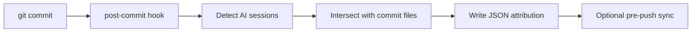

# Tempo CLI System Research

_Last updated: 2026-02-18 (UTC)_

## Executive Summary

**Metaphor:** Tempo CLI is a **forensics gate at commit time**.
It checks which AI tools touched files that ended up in the commit, then emits an attribution report.

Tempo CLI is a commit-time attribution system that parses local AI session artifacts for multiple tools, intersects them with the commit diff, and writes a structured JSON attribution payload to `.tempo/pending/`. It does not store provenance in git by default, but provides a low-friction, file-level attribution record per commit.

## System At A Glance

| Dimension | What Tempo CLI Actually Does |
|---|---|
| Core model | Post-commit detection + file intersection |
| Primary provenance store | Local JSON files under `.tempo/pending/` |
| Micro-versioning | Commit-level only |
| Line-level attribution | None |
| Git storage strategy | Local files; optional cloud sync |
| AI blame UX | None built-in |
| Integrations | Claude Code, Aider, Cursor, Copilot, Codex |

## Architecture



---

## Challenge 1: Capturing Agent Activity

### Supported Agents And Providers

| Agent or Provider | Support Status | Confidence | Evidence |
|---|---|---|---|
| Claude Code | Supported (session files + process + trailers) | High (code + docs) | `internal/detector/claude_code.go`, `README.md` |
| Aider | Supported | High | `internal/detector/aider.go`, `README.md` |
| Cursor | Supported | High | `internal/detector/cursor.go`, `README.md` |
| GitHub Copilot | Supported | High | `internal/detector/copilot.go`, `README.md` |
| Codex | Supported (session files + process) | High | `internal/detector/codex.go`, `README.md` |

### How It Works

1. Post-commit hook runs `_detect`.
2. Detection strategy order is high confidence file matching from session stores, then medium confidence process detection, then medium confidence commit trailer parsing.
3. The output is a list of detections with tool, confidence, method, and metadata.

---

## Challenge 2: Capturing File Change And Micro-versioning

### How It Works

1. Detector gets committed files using `git diff --name-only HEAD~1 HEAD`.
2. It correlates against files found in session stores.

Result:
- No micro-versioning beyond the commit boundary.

---

## Challenge 3: Correlating Agent Change To File Change

### How It Works

1. Extract files written by the AI tool from local sessions.
2. Extract files in the commit.
3. Intersect the sets to identify AI-influenced files.

This yields file-level attribution, not line-level.

---

## Challenge 4: Representing Agent Provenance

### Representation Used

Tempo CLI writes a JSON attribution file per commit:
- `commit_sha`, `commit_author`, `repo`, `timestamp`
- `detections[]` with `tool`, `confidence`, `method`, `files_matched`, `model`, `token_usage`, and session timing

### Sample Representation (from docs)

```json
{
  "commit_sha": "a1b2c3d",
  "commit_author": "jose@tempo.dev",
  "repo": "tempo-metrics/tempo",
  "timestamp": "2026-02-12T17:08:00Z",
  "detections": [
    {
      "tool": "claude-code",
      "confidence": "high",
      "method": "file-match",
      "files_matched": ["src/auth.ts", "src/auth.test.ts"],
      "files_committed": 5,
      "ai_files": 2,
      "model": "claude-opus-4-6",
      "token_usage": 24500,
      "session_duration_sec": 840
    }
  ]
}
```

Field usage for blame:
- There is no line-level mapping. The record only supports file- and commit-level attribution.

---

## Challenge 5: Storing Agent Provenance In Git

Tempo CLI does not store provenance in git by default.

- It writes JSON to `.tempo/pending/` and adds `.tempo/` to `.gitignore`.
- It can optionally sync JSON payloads to a cloud endpoint.

---

## Challenge 6: AI Blame

No built-in blame UX. Users must manually inspect `.tempo/pending/` data or external dashboards.

---

## Challenge 7: Developer Experience (DX)

### Current DX Shape

- Simple setup: `tempo-cli enable` installs hooks.
- Works offline by default.
- Minimal mental overhead, but no git-native provenance storage unless you build it yourself.

---

## Activity, Support, And Community (as of 2026-02-18 UTC)

### GitHub Signals

- Stars: `0`
- Forks: `0`
- Open issues: `0`
- Last push: `2026-02-16T13:40:42Z`

### Collaboration Signals

| Metric | Value |
|---|---:|
| Open PRs | 0 |
| Closed PRs | 0 |
| Top contributors (API snapshot) | `josepnunes` |

### Delivery Cadence

| Repo | Version | Published (UTC) | Channel |
|---|---|---|---|
| `usetempo/tempo-cli` | `v0.1.1` | `2026-02-16 13:36:29Z` | Git tag |
| `usetempo/tempo-cli` | `v0.1.0` | `2026-02-16 10:16:36Z` | Git tag |

---

## Observed vs Inferred

**Observed in code/docs:**
- Detection pipeline and file intersection in `internal/detector/detector.go`.
- Tool-specific parsing in `internal/detector/*.go`.
- Hook install logic in `internal/hooks/hooks.go`.
- JSON payload schema in `internal/detector/types.go`.

**Inferred:**
- Tempo CLI is a strong commit-level attribution source but not a git-native provenance layer.

---

## Sources

- https://github.com/usetempo/tempo-cli
- https://github.com/usetempo/tempo-cli/blob/main/README.md
- https://github.com/usetempo/tempo-cli/blob/main/internal/detector/detector.go
- https://github.com/usetempo/tempo-cli/blob/main/internal/detector/types.go
- https://github.com/usetempo/tempo-cli/blob/main/internal/hooks/hooks.go
