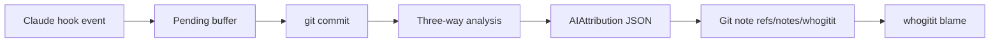

# whogitit System Research

_Last updated: 2026-02-18 (UTC)_

## Executive Summary

**Metaphor:** whogitit is a **flight recorder with a commit-time black box**.
It captures pre/post edit snapshots and prompts during the session, then emits a structured line-level attribution record into git notes at commit time.

whogitit is one of the most complete wild-card solutions for line-level AI blame: it captures edits via Claude Code hooks, runs three-way analysis to classify each line, stores the result in git notes, and provides a dedicated `whogitit blame` command.

## System At A Glance

| Dimension                | What whogitit Actually Does                               |
|--------------------------|-----------------------------------------------------------|
| Core model               | Claude Code hooks + pending buffer + commit-time analysis |
| Primary provenance store | Git notes `refs/notes/whogitit`                           |
| Micro-versioning         | Yes (pre/post snapshots across multiple edits)            |
| Line-level attribution   | Yes (line classification in `AIAttribution`)              |
| Git storage strategy     | Git notes + hooks for push/rewrite/fetch                  |
| AI blame UX              | `whogitit blame` overlays git blame                       |
| Integrations             | Claude Code only today                                    |

## Architecture



---

## Challenge 1: Capturing Agent Activity

### Supported Agents And Providers

| Agent or Provider                                                          | Support Status      | Confidence         | Evidence                                             |
|----------------------------------------------------------------------------|---------------------|--------------------|------------------------------------------------------|
| Claude Code hooks (`PreToolUse`, `PostToolUse` w/ `Edit`, `Write`, `Bash`) | Supported           | High (code + docs) | `src/cli/setup.rs`, `docs/src/reference/hooks.md`    |
| Other agents                                                               | Not supported today | High (code)        | `src/cli/setup.rs` only writes `.claude` integration |

### How It Works

1. `whogitit setup` writes hook config into `~/.claude/settings.json`.
2. Claude Code sends PreToolUse and PostToolUse hook events to the capture script.
3. The capture script passes structured hook input to the CLI.
4. The CLI stores snapshots and prompt context in a pending buffer.

Boundary:
- Capture is Claude-specific; no alternate agent providers are wired today.

---

## Challenge 2: Capturing File Change And Micro-versioning

### How It Works

1. PreToolUse hook captures the “before” content for target files.
2. PostToolUse hook captures the “after” content and extracts prompt context.
3. Each edit appends a snapshot entry in `.whogitit-pending.json`.

This creates a micro-versioned edit history across an AI session.

---

## Challenge 3: Correlating Agent Change To File Change

### How It Works

1. Pending buffer stores file snapshots keyed by file path.
2. Each edit is linked to a prompt index and tool name.
3. Commit-time three-way analysis maps final file lines back to AI snapshots and prompts.

The correlation uses concrete content snapshots rather than heuristics over shell commands.

---

## Challenge 4: Representing Agent Provenance

### Representation Used

The core representation is `AIAttribution` JSON stored as a git note:
- `session` metadata
- `prompts` array with `affected_files`
- `files[].lines[]` per-line classification and prompt linkage

### Sample Representation (from docs)

```json
{
  "schema_version": 2,
  "session": {
    "session_id": "7f3a4b2c-9d1e-8a7b-c3d4-e5f6a7b8c9d0",
    "model": { "id": "claude-opus-4-5-20251101", "provider": "anthropic" },
    "started_at": "2026-01-30T14:23:17Z"
  },
  "prompts": [
    {
      "index": 0,
      "text": "Add user authentication with bcrypt...",
      "affected_files": ["src/auth.rs"]
    }
  ],
  "files": [
    {
      "path": "src/auth.rs",
      "lines": [
        { "line_number": 1, "source": "AI", "prompt_index": 0 },
        { "line_number": 2, "source": "AIModified", "prompt_index": 0 },
        { "line_number": 3, "source": "Human", "prompt_index": null }
      ]
    }
  ]
}
```

Field usage for blame:
- `files.path` and `lines.line_number` are looked up by file and line from git blame commit.
- `source` differentiates AI, AI-modified, human, and original lines.
- `prompt_index` links to `prompts[]` for provenance context.

---

## Challenge 5: Storing Agent Provenance In Git

### How It Works

1. Post-commit hook serializes `AIAttribution` to JSON.
2. It writes the JSON as a git note at `refs/notes/whogitit` for the commit.
3. Pre-push hook pushes notes.
4. Post-rewrite hook copies notes across rebases and amend operations.

This yields good survival across standard git history operations.

---

## Challenge 6: AI Blame

whogitit provides a dedicated `whogitit blame` command that:

1. Runs git blame to find the commit for each line.
2. Loads the note for each commit.
3. Overlays AI attribution onto blame output.

---

## Challenge 7: Developer Experience (DX)

### Current DX Shape

- One-time global setup for Claude Code hooks.
- Per-repo init for git hooks and note configuration.
- Natural integration with standard git workflows.

DX trade-off:
- Requires git notes to be pushed and fetched; users must respect the hooks for full fidelity.

---

## Activity, Support, And Community (as of 2026-02-18 UTC)

### GitHub Signals

- Stars: `2`
- Forks: `0`
- Open issues: `0`
- Last push: `2026-02-02T20:05:49Z`

### Collaboration Signals

| Metric                          |        Value |
|---------------------------------|-------------:|
| Open PRs                        |            0 |
| Closed PRs                      |           27 |
| Top contributors (API snapshot) | `dotsetgreg` |

### Delivery Cadence

| Repo                  | Version  | Published (UTC)        | Channel |
|-----------------------|----------|------------------------|---------|
| `dotsetlabs/whogitit` | `v0.2.0` | `2026-02-02 04:12:10Z` | Git tag |
| `dotsetlabs/whogitit` | `v0.1.0` | `2026-02-01 14:34:10Z` | Git tag |

---

## Observed vs Inferred

**Observed in code/docs:**
- Claude hook config and setup in `src/cli/setup.rs`.
- Hook flows and pending buffer in `docs/src/reference/hooks.md` and `docs/src/reference/architecture.md`.
- Git notes ref `refs/notes/whogitit` in `src/storage/notes.rs`.
- Data format in `docs/src/reference/data-formats.md`.

**Inferred:**
- whogitit is a strong line-level attribution system, but coverage is currently Claude-only.

---

## Sources

- https://github.com/dotsetlabs/whogitit
- https://github.com/dotsetlabs/whogitit/blob/main/docs/src/reference/architecture.md
- https://github.com/dotsetlabs/whogitit/blob/main/docs/src/reference/data-formats.md
- https://github.com/dotsetlabs/whogitit/blob/main/docs/src/reference/hooks.md
- https://github.com/dotsetlabs/whogitit/blob/main/src/cli/setup.rs
- https://github.com/dotsetlabs/whogitit/blob/main/src/storage/notes.rs
